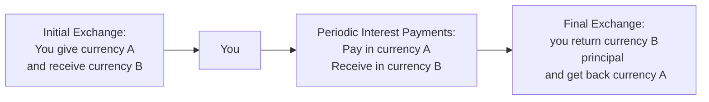

## Overview
Let’s be honest—dealing with currency fluctuations can feel like a roller coaster ride. One day, your overseas investments are up in local currency terms, and then boom, a swift move in the exchange rate wipes out half your gains. It’s enough to make even experienced investors a little uneasy. That’s where currency swaps, forwards, and futures come in. These instruments can help you gain greater control over foreign exchange (FX) risk so that you focus on what really matters: the actual performance of your investments.

In this section, we’ll examine how to manage FX exposure when investing or borrowing across borders. We’ll talk about how currency swaps allow you to exchange principal amounts in different currencies (and lock in interest exposures), how forwards can fix an exchange rate for a future date without tying you to an exchange-traded market, and how currency futures can provide a standardized, cleared environment for your hedges. By the end, you should have a solid grasp of how to use each tool—depending on your strategic objectives and your tolerance for credit, liquidity, and settlement risk.

Feel free to picture yourself at a global conference table with your CFO, risk manager, and maybe me, sipping coffee, discussing strategies for mitigating exchange rate risk. You’re about to dive into real-world scenarios, a few diagrams, and some best practices for each method. Let’s get started.

## Currency Swaps
Currency swaps are a bit like combining a foreign exchange transaction with an interest rate swap. They involve exchanging principal amounts in two different currencies at inception, making periodic interest payments in each currency over the life of the swap, and then re-exchanging the principal amounts at maturity. Typically, if you have a US dollar (USD) liability but would prefer to owe euros (EUR), you could enter into a currency swap. Then you effectively “swap” your USD obligations for EUR obligations.

### Why Use Them?
• Lock in Both Currency and Interest Rate Exposure: A cross-currency swap is often paired with (or embedded in) an interest rate swap so you can manage interest rate exposure and currency movements in one fell swoop.  
• Longer Horizons: Currency swaps can have maturities ranging from one year to 30 years, making them suitable for longer-term financing or investment scenarios.  
• Alter Liability Denomination: If you have cash inflows in EUR but your liabilities are denominated in USD, you may prefer to owe EUR so that your currency inflows naturally match your outflows.

### Structure in a Nutshell
Let me share a quick anecdote. A good friend of mine used to manage treasury operations for a multinational. She had euro-denominated plant operations in Germany but needed US dollars for the corporate headquarters in New York. By entering a cross-currency swap, her company received EUR from the swap counterparty at inception (replacing a portion of their EUR debt) and committed to pay that counterparty USD principal at maturity. Meanwhile, they exchanged periodic interest payments in their respective currencies along the way. No more scrambling to do spot conversions each quarter, and no more sleepless nights watching the EUR/USD ticker.

Below is a simplified diagram of the principal and interest exchange in a currency swap (from your perspective):

(“Currency A” and “Currency B” could be USD and EUR, respectively.)

### Key Advantages and Disadvantages

• Advantages:  
  – Tailor-made: Currency swaps are over-the-counter (OTC) contracts, so you can customize notional amounts and maturity.  
  – Consolidates risk management: Manage interest rate and FX risk simultaneously.

• Disadvantages:  
  – Counterparty Credit Risk: If your swap counterparty can’t make the required payments, you’re in trouble.  
  – Complexity: The documentation and valuation can get complicated, especially for large or bespoke transactions.  

## FX Forwards
Have you ever agreed on a price with a friend for something you plan to buy next month (like buying a big batch of olive oil from your cousin in Italy, for instance)? You’re basically arranging a mini forward contract. An FX forward does the same thing, except it’s for currencies in the global financial markets. Under an FX forward, you set an exchange rate today for buying or selling a specific amount of foreign currency on a future date.

### Why Use an FX Forward?
• Flexibility: You can pick the notional amount and maturity date, making it great for hedging a known cash flow, such as an expected dividend or bond coupon in foreign currency.  
• Lock in the Exchange Rate: You decide the rate now and limit yourself (and your counterparty) from future price movements.  
• Cost-Effective for Short to Medium Horizons: Typically used for timeframes ranging from a few days to a year, though longer maturities exist in the OTC market.

### Example:  
Imagine you’re a US-based firm expecting to receive EUR 10 million in three months. You might worry that if the Euro weakens against the US dollar, your final USD proceeds will be lower. By entering into a forward contract to sell EUR 10 million and receive USD at a fixed rate in three months, you hedge this currency risk. If the euro does indeed drop, you still get the forward rate you locked in. That’s basically the entire point.

### Forward Pricing and Interest Rate Parity
FX forward prices are often tied to interest rate differentials between the two currencies. The formula below shows how the forward rate (F) for USD/EUR might be derived under the assumption of covered interest rate parity:


F_{USD/EUR}(T) = S_{USD/EUR}(0) \times \frac{(1 + i_{USD})^T}{(1 + i_{EUR})^T}


where:  
• \\( S_{USD/EUR}(0) \\) is the current spot exchange rate (USD per EUR).  
• \\( i_{USD} \\) is the US dollar interest rate.  
• \\( i_{EUR} \\) is the euro interest rate.  
• \\( T \\) is the time to maturity in years.

### Trade-Offs
• Advantages:  
  – Exact Hedge: Size and maturity can be aligned exactly with your projected exposures.  
  – Liquidity: FX forward markets for major currencies are typically very deep.  

• Disadvantages:  
  – Counterparty Risk: You are relying on the OTC counterparty to fulfill their side of the deal at maturity.  
  – Roll-Over Risk: If the exposure extends beyond the forward’s maturity, you need to roll the contract over, which might introduce additional costs.

## Currency Futures
Now let’s talk about currency futures, the standardized cousins of forward contracts. Currency futures trade on organized exchanges such as the Chicago Mercantile Exchange (CME). Because they’re exchange-traded, they are subject to daily mark-to-market and margin requirements.

### How They Work
• Standardized Contracts: The exchange sets standardized contract sizes (e.g., 125,000 EUR worth of USD/EUR futures).  
• Daily Settlement: Gains or losses are settled daily via variation margin.  
• Central Clearing: The exchange clearinghouse steps in as the counterparty to both sides, drastically reducing credit risk.

If you’ve ever dipped your toes into equity futures, you’ll find currency futures somewhat similar—just a different underlying asset. But keep in mind that the standard size and maturity dates (often quarterly) may not match perfectly with your exposure.

### Example:
Suppose you’re a US-based investor who purchased Australian stocks. You’re worried that a weakening Australian dollar (AUD) will lower your USD returns. One approach is to short AUD futures. If the AUD declines, your futures position should gain in USD terms, offsetting the loss from currency depreciation on your Australian stocks (at least in theory).

### Pros and Cons
• Advantages:  
  – Reduced Credit Risk: The clearinghouse is your counterparty.  
  – Transparency and Liquidity: Exchange-traded markets typically offer real-time pricing and decent liquidity (especially for major currency pairs).  

• Disadvantages:  
  – Contract Mismatch: Standardized contract sizes mean it might not perfectly hedge your exact position.  
  – Margin Calls: If the market moves against you, the daily mark-to-market might require additional margin, which can disrupt cash flow management.

## Comparison and Selection
When deciding among currency swaps, forwards, or futures to manage exposure, you’ll want to consider several factors: maturity, liquidity, credit risk, and just how customized your hedging needs are. Below is a quick comparison table that might come in handy:

| Feature                    | Currency Swap             | FX Forward                 | Currency Futures                                     |
|----------------------------|---------------------------|----------------------------|------------------------------------------------------|
| Trading Venue             | OTC                       | OTC                        | Exchange-traded                                      |
| Customization             | High (notional, maturity) | High (notional, maturity)  | Limited (standard contract sizes, fixed maturities)  |
| Credit Risk               | Counterparty risk         | Counterparty risk         | Lower (clearinghouse as counterparty)               |
| Maturity Range            | Medium/long               | Short/medium (longer possible) | Typically short to medium                            |
| Use Case                  | Swapping debt currency;    | Hedging specific cash flows; | Speculate/hedge on short-term currency movements;    |
|                           | combined with interest     | short-term risk hedges     | standardized offset to exposures                     |
| Settlement Mechanism      | Exchange principal        | Physical or net cash settlement | Daily mark-to-market, final net settlement         |  

## Implementation Example
Let’s combine this knowledge with a real-life scenario. Say you’re a US-based portfolio manager investing in European equities—similar to what some real pension funds do. You’ve allocated EUR 50 million to buy a diversified mix of European stocks. Your primary worry: that the euro might depreciate relative to the USD, biting into your returns. Here are some ways you might handle it:

• Currency Swap: A full or partial currency swap could convert your USD-based liabilities and interest flows into EUR, aligning them with your asset denominated in EUR. This might be seen more often in a corporate finance setting but can be applicable to a long-term portfolio manager as well—especially if you’re looking for multi-year coverage.  

• FX Forward: You’d likely enter into a series of rolling forward contracts to sell EUR and buy USD. If your investment horizon is one year, you initiate a 12-month forward. If it’s longer, you might roll over the contract every 12 months (or at intervals that match your strategy).  

• Currency Futures: If the euro is widely traded on the CME, you could short EUR/USD futures in the notional amount you want to hedge. You might hedge 80% of your exposure to allow for some operational slippage or to take a slight view on the market. Then you’d monitor your margin position daily.

## Key Considerations
Before you go all-in, here are a few points to keep in mind:

• Cross-Currency Basis: Sometimes interest rates don’t fully explain currency forward or swap prices. The cross-currency basis can shift due to supply and demand for certain currency pairs, transaction costs, or regulatory capital requirements.  

• Credit (Counterparty) Risk: Particularly relevant for OTC swaps and forwards. You can mitigate it via collateral requirements or by choosing counterparties with strong credit ratings.  

• Transaction Costs and Spreads: Swaps and forwards might have higher fees for illiquid or exotic currency pairs. Futures, while they may have narrower spreads for liquid currencies, come with margin costs.  

• Capital Requirements and Margin Calls: Futures (and some forward arrangements) require you to post initial and variation margin. If currency markets move dramatically, you might need additional funding.  

• Rolling Risk: If your investment horizon is longer than your derivative contract’s maturity, you must roll it forward repeatedly, incurring potential transaction costs and exposure to forward rate shifts each time.  

• Settlement Risk (Herstatt Risk): This risk arises if one party transfers funds while the other side’s payment is still pending across global time zones. Netting arrangements and efficient payment-versus-payment (PvP) systems help mitigate this.  

## Best Practices
• Align Hedge Horizons: Choose instruments with maturities that match as closely as possible to your underlying exposure.  
• Monitor Hedge Ratios: Evaluate frequently if the currency exposure matches your risk tolerance. Adjust and rebalance the hedge ratio accordingly.  
• Diversify Hedging Instruments: For large portfolios with multiple exposures, combining forwards and futures might reduce transaction costs and optimize liquidity.  
• Engage in Active Oversight: If you prefer a dynamic hedge, be prepared to adjust or unwind positions when the macroeconomic environment changes (discussed further in 3.3 on Active Currency Trading Strategies).  

## Potential Pitfalls
• Over-Hedging: Completely eliminating currency risk can lead to missed opportunities if an exchange rate move would have been in your favor.  
• Liquidity Mismatch: If you choose a product that you can’t easily unwind or if you’re forced to post margins at inopportune times, you might run into liquidity strains.  
• Underestimating Costs: Rolling forward hedges continually can add up. Also, watch out for bid-ask spreads.  
• Complexity: Cross-currency swaps can be complex to set up, especially if you’re layering interest rate exposures.  

## Exam Tips
From a CFA Level III perspective, exam questions may ask you to:  
• Calculate the payoff of a hedge using currency forwards or futures,  
• Demonstrate how a currency swap can reduce the effective interest rate or currency risk on cross-border debt,  
• Evaluate the impact of changes in interest rate differentials on forward prices, or  
• Compare the pros and cons of these derivatives in a scenario-based question.  

Keep track of formulas and know how to apply them. Practice scenario questions where you are given an investment with a certain horizon, a desired hedge ratio, and you must propose the best derivative instrument. And watch out—questions might involve partial hedges or rolling hedges.

## References, Suggested Readings, and Links
• Levich, R. “International Financial Markets: Prices and Policies.”  
• CFA Institute Level III Curriculum (Derivatives and Risk Management).  
• Shapiro, A. “Multinational Financial Management.”  

Feel free to also explore global clearinghouse websites (e.g., CME, ICE) for their contract specifications, margin requirements, and educational resources.

---

## Test Your Knowledge: Managing FX Exposure with Swaps, Forwards, and Futures



### Which of the following is a key reason to use a currency swap instead of multiple forward contracts?

- [x] Currency swaps can lock in both currency and interest rate exposures in one contract.  
- [ ] Currency swaps always have lower counterparty risk than forwards.  
- [ ] Currency swaps require no exchange of principal at maturity.  
- [ ] Currency swaps do not involve any credit risk.  

> **Explanation:** A currency swap combines the exchange of principal and periodic interest payments, effectively locking in both the currency and interest rate exposures simultaneously.  

### A US-based investor holds a European bond paying euro coupons. Which instrument is most commonly used to hedge an upcoming coupon payment?

- [x] An FX forward contract at the exact expected coupon amount and date.  
- [ ] A currency swap covering the next five years.  
- [ ] A short equity futures position.  
- [ ] A gold futures position.  

> **Explanation:** If the investor knows the exact coupon amount in euros and the date it will be received, an FX forward aligning that timing and notional amount is the most straightforward hedge.  

### In the formula for forward pricing under covered interest rate parity, which variable primarily affects the difference between forward and spot rates?

- [ ] The volatility of the underlying currency.  
- [x] The interest rate differential between the two currencies.  
- [ ] The inflation differential between the two currencies.  
- [ ] The credit quality of the forward contract’s counterparties.  

> **Explanation:** Under covered interest rate parity, the difference between the forward and spot rate primarily reflects the interest rate differential between the two currencies.  

### What is the main advantage of using currency futures instead of forwards to hedge FX risk?

- [x] Lower counterparty risk due to central clearing.  
- [ ] Complete elimination of margin requirements.  
- [ ] Perfect customization of contract notional amount and maturity.  
- [ ] Guaranteed higher returns on hedged positions.  

> **Explanation:** Currency futures are exchange-traded and centrally cleared, which significantly reduces counterparty credit risk compared to OTC forward contracts.  

### A US company has EUR revenue expected in six months. Which of the following is a disadvantage if they use currency futures rather than an FX forward?

- [x] The contract size might not perfectly match the expected revenue.  
- [ ] There is no daily mark-to-market settlement.  
- [x] They avoid margin calls on futures positions.  
- [ ] Currency futures provide inferior price transparency.  

> **Explanation:** While currency futures offer transparency and reduced credit risk, their standardized contract sizes might not match the exact amount of EUR revenue. Also, daily mark-to-market can trigger margin calls, which can be an additional operational consideration.  

### Which statement is true concerning cross-currency swaps?

- [x] They involve exchanging principal in two different currencies at inception and re-exchanging at maturity.  
- [ ] They cannot include interest rate payments.  
- [ ] They only hedge short-term exposures.  
- [ ] They avoid all rolling or extension risks.  

> **Explanation:** Cross-currency swaps involve an exchange of principal in two different currencies at the start and reversing that exchange at maturity, alongside periodic interest payments.  

### A portfolio manager chooses to hedge half (50%) of EU equity currency exposure with forwards. Which of the following reasons best justifies a partial hedge strategy?

- [x] The manager wants some upside potential if the Euro appreciates against the USD.  
- [ ] The manager believes the Euro will definitely depreciate.  
- [x] The manager is trying to exploit an arbitrage in the forward market.  
- [ ] The manager aims to fix the portfolio’s value in USD completely.  

> **Explanation:** By hedging only part of the exposure, the manager reduces currency risk while still retaining partial upside if the currency moves favorable.  

### When rolling an FX forward contract, which of the following is a concern?

- [x] The new forward rate may differ considerably from the old one, impacting hedge costs.  
- [ ] The investor cures all counterparty risks just by rolling.  
- [ ] The hedge ratio is guaranteed to remain identical.  
- [ ] No new transaction costs will be incurred.  

> **Explanation:** Rolling forward hedges can result in new forward rates that may be higher or lower than the old ones, and transaction costs apply each time.  

### What is an advantage of using OTC FX forwards rather than exchange-traded futures for an emerging market currency exposure?

- [x] Forward contracts can be negotiated for the exact notional and maturity.  
- [ ] All OTC forward exposures are collateralized and cleared.  
- [ ] Emerging market currencies have the highest liquidity in futures markets.  
- [ ] Futures have longer maturities than forwards.  

> **Explanation:** OTC forwards can be customized for emerging market currencies, whereas it might be challenging to find exchange-traded futures for less liquid or exotic currencies.  

### A partial or dynamic currency hedge may be employed because:

- [x] True  
- [ ] False  

> **Explanation:** True. Many managers choose to hedge only a portion of currency exposure, adjusting it periodically based on market conditions in pursuit of better overall performance or risk control.  


