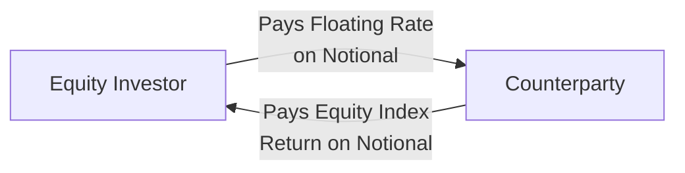

## Introduction
Well, sometimes in portfolio management, you just don’t want the hassle of physically owning all those stocks, right? Maybe it’s tricky to access a certain market, or you need to move fast with minimal cash outlay. Or, you have a big chunk of cash and you’re trying not to miss out on market returns—like that one time I had an endowment client who wanted immediate global equity exposure but had a short window to deploy millions in actual equity purchases. In moments like these, equity swaps, forwards, and futures can be absolute lifesavers. They allow you to lock in or hedge equity exposure without directly buying (or selling) the underlying stocks. That means you can gain or manage risk more smoothly and more precisely.

You’ll notice these derivatives show up frequently in advanced portfolio overlays, custom strategies, and interesting situations (for instance, dealing with emerging markets that have investment restrictions). Here, we’ll explore how these instruments—equity swaps, forwards, and futures—help you target and refine your equity exposures for hedging, speculation, cash equitization, or even opportunistic tactical plays.

## Key Instruments: Equity Swaps, Forwards, and Futures

### Equity Swaps
Equity swaps are over-the-counter (OTC) contracts between two parties. One party agrees to “pay” the total return on an equity index or a basket of equities in exchange for receiving some other return stream (often a floating interest rate like LIBOR, SOFR, or a similar benchmark plus or minus a spread). Let’s make it sound real for a moment: Suppose you want exposure to the S&P 500, but you aren’t thrilled about physically buying all 500 stocks. You could enter into an equity swap with a counterparty—like a large bank or dealer—who promises to pay you the return of the index. Meanwhile, you pay them a floating interest rate on a so-called notional principal. You’re basically “renting” the index return, if you will.

If that feels abstract, check out this simplified flow of payments in an equity swap scenario:

• The notional amount is the “size” of the contract, i.e., the capital you want exposed to the equity market.  
• You don’t pay the notional to the counterparty at inception; it simply serves as the basis for calculating the payments.  
• At periodic intervals (for example, quarterly), the two parties settle up—if the index went up, the investor receives the positive return. If the index plummeted, the investor might owe the negative return. Meanwhile, interest is paid by the investor to the counterparty.  

Equity swaps offer:  
• Synthetic equity exposure when direct security ownership isn’t feasible, or is restricted (as can be the case with certain emerging markets).  
• Potentially lower transaction costs if you just need the broad index exposure for a period.  
• Customized contract terms (maturity, payment frequency, underlying index).  

Of course, you’re stepping into an OTC contract, so you do inherit counterparty risk. If the party on the other side can’t make good on the swap obligations, you could be left in a poor situation.

### Equity Forwards
Equity forwards aren’t that different in concept from equity swaps, only they typically involve a single exchange at maturity rather than ongoing periodic swap payments. Let me give you a scenario: If you’re planning to buy a certain stock index or a particular stock at a future date, you can lock in the price today with a forward contract. At maturity, you’ll settle by paying the forward price you agreed to, and in exchange, you receive the actual stock (or the net cash difference).

Compared to swaps, forwards focus on a single final settlement (plus or minus any interim partial payments that might be structured in the contract, though that’s less common). Both trades remain OTC, so you’ll typically see tailored, specific terms for large institutional watchful eyes:  
• “I want to buy 50,000 shares of an emerging market stock in six months at the current forward price.”  
• “I want a forward on a broad sector index for my pension plan because it lines up with future liabilities due in nine months.”

Again, be mindful: since forwards are bilateral trades, you face counterparty risk just like in a swap. On the plus side, it can be an effective way to lock in a purchase or sale price, especially if you’re concerned about big price fluctuations in the near term.

### Equity Futures
Equity futures, on the other hand, are standardized exchange-traded contracts—like S&P 500 futures that you can easily trade on the CME. Because they’re exchange-traded:  
• There’s standardization in the contract size, settlement dates, etc.  
• A clearinghouse steps between you and the counterparty, mitigating a lot (not all) of that dreaded counterparty default risk.  
• You have daily mark-to-market and margin requirements.  

One of my colleagues absolutely loves how easy it is to gain broad equity exposure with futures. Let’s say you’re worried about missing out on the next big rally. Instead of waiting to argue with your investment committee or set up each individual purchase, you can buy a few S&P 500 futures contracts. This quickly builds notional equity exposure. Then, as you’re ready to buy or manage the underlying stocks, you can unwind the futures. Of course, if the market dips, you’ll have to post variation margin, so it involves real daily cash flow management. But hey, that’s the cost of doing business in a leveraged, standardized world.

## Motivations and Strategies
These instruments serve multiple strategic needs: hedging, speculation, and efficient portfolio implementation.

### Hedging
You might hold a basket of stocks that you love for the long run, but short-term macro events have you spooked. Instead of selling them outright (and maybe realizing capital gains or messing up your sector weightings), you can short equity index futures or enter an equity swap paying away the index return. If your portfolio correlates closely to that index, your net equity exposure shrinks or even goes neutral. Once the fear passes, you can unwind the derivative and remain with your original stock positions intact.

### Speculation/Leverage
In certain strategies—like a 130/30 hedge fund or a portable alpha approach—you want leveraged exposure to equities. Buying futures is a neat way to “gear up” exposure with less upfront capital than physically buying the shares. Be careful though: leverage can magnify returns, but it can just as quickly magnify losses. I remember how a friend got a bit carried away with e-mini S&P 500 futures—one day she was flying high, the next she was scrambling to meet a margin call.

### Cash Equitization
This is one of my favorites: you’ve got a big chunk of cash in the portfolio, but you’re worried about missing out on equity returns while you wait to invest it (maybe because you’re still deciding how to allocate it across specific managers or individual stocks). If you do nothing, that cash just sits there like a lazy couch potato. But if you buy equity index futures or enter an equity swap, you effectively “equitize” that cash—meaning you get equity market exposure right away. When you’re ready to deploy that cash for your final investment strategy, you can exit the futures or swap positions. This approach helps you avoid a big drag on returns from uninvested cash.

## Implementation and Risk Management

### Margin and Collateral
Futures require initial margin (a performance bond) and variation margin to account for daily mark-to-market gains or losses. Swaps and forwards often require collateral posting under Credit Support Annexes (CSAs), especially post-financial crisis, to manage counterparty credit risk. The net effect is:  
• You need to monitor daily margin calls or collateral calls.  
• Sharp market moves can create unexpected margin demands.  
• Proper liquidity management is crucial.

### Tracking Error and Basis Risk
If the derivative’s underlying index or reference asset doesn’t precisely match your actual portfolio holdings, you can have a mismatch. For example, if your portfolio is heavy on small-cap growth stocks but you hedge with an S&P 500 index future, you might not be perfectly hedged. That’s known as “basis risk.” The difference between the performance of your actual portfolio and the derivative’s reference index can lead to residual gains or losses.

### Counterparty Risk
For swaps and forwards, you’re reliant on the other party’s creditworthiness:  
• If the counterparty defaults, you might lose your expected gains on the contract.  
• Mitigating strategies include netting agreements, collateral posting, or trading with well-capitalized counterparties.  
• Exchange-traded futures cut down on much of this risk, thanks to the clearinghouse.

### Regulatory and Tax Considerations
Derivatives can create different tax treatments or regulatory constraints. Some jurisdictions consider derivative gains differently than capital gains on stocks. There may also be limitations on using derivatives within certain types of funds, like pension plans or mutual funds, depending on local regulations. The CFA Institute Code and Standards encourage thorough disclosure and compliance with all relevant regulations—so always read the fine print.

## Real-World Examples and Case Studies

1) Synthetic Emerging Market Exposure:  
   Imagine you’re a global equity manager who really wants exposure to a fast-growing emerging market, but direct access to those local shares is restricted. You might ask a large bank with on-the-ground presence to structure an equity swap referencing that market’s index. You pay a floating rate; they pay you the index return. Suddenly, you’re participating in that emerging market’s potential upside without physically owning the local shares. This can be a quick fix, though you must trust the bank and keep an eye on that counterparty risk.

2) Large Cash Inflow to a Pension Fund:  
   Suppose a pension fund sponsor just contributed $100 million to your equity portfolio. You don’t want to be sitting 100% in cash for a few weeks while you do manager selection or finalize your investment plan. So maybe you keep the $100 million in short-term money markets but simultaneously buy index futures for a similar notional amount. The net effect is that your portfolio still “feels” like it’s invested in equities, even though you haven’t physically bought or sold any shares yet.

3) Hedging a Concentrated Stock Holding:  
   If you or your client holds a large position in one specific stock, you can hedge part of that exposure with a forward or swap referencing either that individual stock or a relevant sector index. The custom forward will let you lock in a price if you expect that stock to decline or remain range-bound. This hedging lets you avoid immediate sale and the potential tax or timing consequences.

## Best Practices, Pitfalls, and Reminders
• Always confirm your notional size, margin calculations, and total net exposure. Overestimating or underestimating notional can cause big headaches.  
• Watch your correlate. If your portfolio differs significantly from the index or stock used in the derivative, you could end up with unexpected residual exposure. That mismatch (basis risk) can be significant in volatile markets.  
• Understand that daily settlement can cause liquidity needs. If you can’t handle margin calls or variation margin, you risk forcibly closing your positions at the worst possible time.  
• Thoroughly vet your counterparties in swaps or forwards. Look at their credit rating, how they handle collateral, netting arrangements, and so on.

## Conclusion and Final Exam Tips
From a CFA Level III perspective, you’ll want to demonstrate that you understand not only how these instruments function but also how to apply them in real-world portfolio management contexts. Be ready to:  
• Calculate the notional exposure required to hedge or to create a desired equity exposure.  
• Evaluate the trade-offs between using swaps, forwards, or futures, given liquidity, customization needs, counterparty risk, collateral considerations, and transaction costs.  
• Integrate these derivatives into an overall portfolio, possibly for reasons discussed in other chapters (e.g., 2.1 on interest rate derivatives or 2.2 on currency).  

In exam item-set questions, you might see a scenario involving partial hedging of a portfolio or adjusting the portfolio’s beta using equity futures. In constructed-response “essay” style, you could be asked to propose the best derivative solution, compare the outcomes, and detail your thought process for selecting or rejecting specific instruments. Stay on your toes about the synergy: the test frequently includes cross-topic questions (like combining currency hedging with equity futures or using these instruments to implement a tactical asset allocation shift).

Above all, practice with typical calculation questions (like how many futures contracts are needed) and conceptual questions (like why you would choose a swap over a forward or what basis risk truly means in your scenario). Manage time carefully in the exam, and whenever you see a question referencing derivatives, remember to structure your approach with the advantages, disadvantages, and potential pitfalls at the ready.

## References and Further Reading
• CFA Institute Level III Curriculum (Derivatives and Risk Management sections)  
• Hull, J. “Options, Futures, and Other Derivatives.”  
• Benninga, S. “Financial Modeling.”  

• (Optional) Additional relevant resource: BIS (Bank for International Settlements) reports on OTC derivative market statistics for updated trends in usage and counterparty exposures.

## Test Your Understanding: Equity Swaps, Forwards, and Futures



### A manager wants to maintain equity market exposure on a short-term cash position. Which derivative is most commonly used for quick, standardized, exchange-listed exposure?

- [ ] Equity swap
- [x] Equity futures
- [ ] Equity forward
- [ ] Interest rate swap

> **Explanation:** Exchange-traded equity futures are the go-to instruments when immediate, standardized equity exposure is desired. They are liquid and have daily mark-to-market through a clearinghouse.

### An investor agrees to pay the return of a listed equity index in a swap while receiving a floating interest rate. From the investor’s perspective, this is:

- [x] A total return swap where the investor is long the index.
- [ ] A forward contract with daily mark-to-market.
- [ ] An interest rate swap to hedge equity risk.
- [ ] A short position in the underlying equity index.

> **Explanation:** By paying away floating interest and receiving the equity index return, the investor is effectively “long” the equity index via the swap payoff structure.

### Which of the following is a key difference between equity swaps and equity forwards?

- [x] Swaps often involve periodic payments over time, while forwards generally have a single exchange at maturity.
- [ ] Forwards are standardized, while equity swaps trade on an exchange.
- [ ] Swaps never involve a notional principal, but forwards do.
- [ ] Forwards are typically used for interest rate hedging, while swaps are used for currency hedging.

> **Explanation:** An equity forward generally has a single settlement at maturity, whereas many equity swaps have periodic cash flows. Both instruments are typically OTC and can be tailored to specific needs.

### A manager who wants to hedge a large existing position in a particular stock for six months without triggering a taxable event would most likely use:

- [ ] A listed equity options collar strategy.
- [x] An equity forward contract on the same stock.
- [ ] Treasury futures.
- [ ] A total return swap on an interest rate index.

> **Explanation:** By entering into a forward contract on the same stock, the manager can lock in a future price and avoid an immediate sale of the shares. This defers any recognition event until maturity (depending on local tax regulations).

### A manager invests in an equity swap tracking an emerging market index to avoid directly owning the underlying stocks, partly because:

- [x] Emerging market restrictions might limit direct foreign ownership.
- [ ] The manager wants daily margin adjustments on an exchange.
- [x] The manager wants to reduce operational complexities.
- [ ] The manager wants to physically deliver a share basket.

> **Explanation:** Equity swaps can help circumvent foreign ownership or market-access restrictions and reduce operational burdens (like custody, brokerage, and settlement). However, swaps are not exchange-traded in most cases, so daily margin adjustments via an exchange are not typically part of the arrangement.

### When equitizing cash using equity index futures, which of the following is a primary risk the manager should watch?

- [ ] Convexity risk in bond yields
- [x] Basis risk between the index used and the actual desired portfolio
- [ ] Regulatory risk exclusive to structured notes
- [ ] Commodity price risk

> **Explanation:** Basis risk arises if the futures index does not perfectly track the portfolio or the manager’s benchmark. This mismatch leads to potential tracking error.

### On a daily basis, an equity futures position’s gains or losses are:

- [x] Settled (credited or debited) to the trader’s margin account.
- [ ] Locked in until maturity of the futures contract.
- [x] Not recognized until all margin is returned at contract expiration.
- [ ] Irrelevant to the manager’s liquidity needs.

> **Explanation:** Futures are marked-to-market daily, with gains and losses settled into the trader’s margin account at the end of each trading day. This creates immediate cash flow implications.

### An equity swap that allows one to receive a floating interest rate and pay an equity return is generally used by a manager who wants:

- [x] To reduce or eliminate equity market exposure in their portfolio.
- [ ] To amplify the equity market exposure in their portfolio.
- [ ] To hedge against floating rates.
- [ ] To gain interest rate arbitrage opportunities.

> **Explanation:** If a manager pays away equity returns and receives floating, they are effectively short the equity market, reducing overall equity exposure.

### Which statement is true regarding counterparty risk in equity derivatives?

- [x] Counterparty risk is generally higher in OTC swaps and forwards than in centrally cleared futures.
- [ ] Futures pose no counterparty risk because the underlying exchange cannot default.
- [ ] Equity forwards rarely involve negotiation or documentation.
- [ ] Credit Support Annexes (CSAs) are never used in swap agreements.

> **Explanation:** OTC products, like swaps and forwards, expose investors to direct counterparty credit risk, which can be mitigated by collateral arrangements (CSAs) or netting agreements. Exchange clearinghouses lower but do not entirely eliminate default risk.

### The daily settlement procedure for equity index futures primarily impacts:

- [x] Liquidity management for both buyers and sellers of the futures.
- [ ] The notional principal, which resets to zero every day.
- [ ] Whether the contract is an OTC or listed product.
- [ ] The structural correlation between the equity futures and bonds.

> **Explanation:** Because gains and losses are recognized every trading day, the trader must manage liquidity to meet or receive margin flows.  


