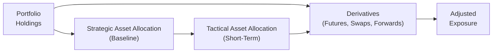

## Introduction and Overview

Let’s be honest—sometimes we just want a more nimble way to move in and out of market exposures without pushing all those “buy” or “sell” buttons on the underlying assets. That’s where derivatives can play a major role. They can help portfolio managers make short-term adjustments (Tactical Asset Allocation, or TAA) and rebalance portfolios with less fuss and, hopefully, fewer costs. If you’ve ever been stuck with an overweight or underweight position but cringed at the idea of unloading a significant chunk of securities (imagine the market impact, the taxes, the transaction fees...), you might recall that equity index futures or interest rate swaps could have saved you time and money.

Tactical uses of derivatives enable managers to pivot quickly in response to changes in their market outlook. At the same time, they also provide an extremely effective rebalancing tool. Whether it’s adjusting equity positions through S&P 500 futures or shifting the duration of a bond portfolio by receiving fixed on an interest rate swap, derivatives allow for streamlined trading with minimal disruption to the underlying holdings. And, well, if you’ve ever seen the frustration on a CFO’s face when large trades cause noticeable slippage, you’ll appreciate how derivatives-based rebalancing can help.

## Tactical Asset Allocation with Derivatives

Tactical Asset Allocation (TAA) typically involves short- to medium-term shifts away from a portfolio’s strategic asset allocation (SAA). The SAA defines your baseline—like a “default setting” reflecting your long-term risk tolerance and return objectives. But you might want to tilt toward equities if you believe in a temporary bull market or pare back on bonds if interest rates seem likely to rise quickly. One big challenge with TAA is the potential cost of transacting in the underlying assets. Buying or selling large equity or bond positions can be pricey and slow; so how can we do it more efficiently?

Using Equity Index Futures or Forwards:

• Equity index futures, say on the S&P 500, let you gain or reduce equity exposure quickly.  
• If equities are overweight (due to, for instance, market outperformance), you could short an equity index future to offset the extra exposure—handy if you believe that portion of the portfolio might be at risk of a near-term correction.  
• If you need more equity exposure, going long an equity index future can synthetically increase your allocation without tying up additional capital in the underlying shares.

Using Interest Rate Futures and Swaps:

• For TAA in fixed income, derivatives like interest rate futures (e.g., Treasury futures) and swaps (see “2.1 Modifying Portfolio Risk and Return with Interest Rate Swaps, Forwards, and Futures”) help you adjust duration or yield-curve positioning.  
• A “receive fixed” position in an interest rate swap can replicate a bond position, letting you benefit if rates go down (bond prices go up), without forcing you to buy physical bonds.  

Currency Forwards and TAA:

• Many international portfolios rely on currency forwards to manage (or speculate on) FX exposures. Suppose the Japanese yen is expected to strengthen; you could reduce that currency risk or even benefit from it, depending on your view.  
• By using a forward, you can scale your position up or down quickly, which is a big advantage over physically selling foreign assets or layering complicated cross-currency transactions.

## Rebalancing with Derivatives

If you’ve ever tried rebalancing on a Friday afternoon when the market’s super hectic, you know it can be a headache. Rebalancing is about restoring the portfolio to target weights after (sometimes dramatic) market movements. Instead of large “cash market” trades, you can use derivatives to do it faster and—hopefully—more cheaply.

Why Bother with Rebalancing?

• Over time, risky assets like equities often drift up in value more than safer assets, causing your portfolio to become “riskier” than originally intended.  
• If you are mandated, say, to keep 60% in equities and 40% in bonds, consistent rebalancing helps maintain that balance.  

Derivative-Based Rebalancing:

• You can short equity index futures if the equity portion soared beyond the target allocation. That neutralizes some of the excess exposure without your physically selling the underlying stocks and realizing potential capital gains or paying transaction costs.  
• Alternatively, if you’re underweight, just go long futures to restore your target allocation.  
• In bond portfolios, you might use treasury futures or swaps to adjust duration if, for instance, your allocation to corporate bonds has drifted and you need more or less interest rate exposure.  

Cost and Efficiency Gains:

• Minimizes trading expenses: Because derivatives often have lower transaction costs than the underlying securities, you reduce bid-ask spreads and commissions.  
• Avoids market impact: Large trades in individual stocks or bonds can scare the market, pushing prices in an unfavorable direction. Futures trades on deep, liquid markets are usually less likely to move the market.  

## Implementation Examples

Sometimes examples bring everything to life. Let’s walk through a scenario.

Case Study 1: Overweight in Equities

• Background: You manage a balanced portfolio with 60% equities and 40% fixed income as your SAA. A strong equity rally bumps your equity portion to 67%.  
• Concern: You want to lock in some gains, but you’re reluctant to sell your long-term favorites.  
• Derivative Move: Sell an appropriate number of equity index futures contracts to bring your net effective equity exposure back down toward 60%.  
• Mechanics: Each equity index future has a multiplier and a notional value associated with it. Suppose you hold a U.S. large-cap portfolio correlated to the S&P 500, and the S&P 500 E-mini futures contract is your tool of choice. You figure out how many contracts to short based on the difference between your new equity weighting (67%) and your target weighting (60%).  
• Result: You avoid big capital gains taxes and transaction costs, and the portfolio remains closely aligned with the targeted risk level.

Case Study 2: Underweight Exposure in Fixed Income

• Background: A bond portfolio manager sees that her portfolio has drifted under its minimum duration target because rates spiked recently and bond prices fell.  
• Concern: She still believes that yields might come down in the medium term, so she wants to keep a normal or slightly longer duration.  
• Derivative Move: Enter a receive-fixed interest rate swap or long a Treasury futures position that effectively increases the portfolio’s interest rate exposure.  
• Mechanics: By receiving fixed in a plain vanilla interest rate swap, she benefits if rates decline. Alternatively, going long Treasury futures is a simpler approach that also adds to duration.  
• Result: The portfolio’s duration is back on target without a broad reshuffle of bond holdings.

Here’s a small diagram illustrating the basic flow of using derivatives as overlays:

In this diagram, the baseline portfolio holdings remain intact while derivatives are used as overlays to either enhance or reduce exposure, moving from the strategic mix to a tactical position.

## Risks and Considerations

While derivatives make TAA and rebalancing easier, they’re not a free lunch. Here are some considerations:

Basis Risk

• Derivatives and the underlying holdings are never perfectly correlated. If your portfolio is heavy in small-cap stocks but you’re hedging with S&P 500 futures, there’s a mismatch.  
• Over a short horizon, this might be acceptable, but large divergences in performance can undermine your hedges.

Contract Expirations and Rolls

• Futures and some forward contracts have specific maturity dates, so if your view extends beyond that contract’s expiration, you’ll need to “roll” the contract into a new one.  
• Rolling can cause costs (like spread differences or a potentially unfavorable “roll yield”).

Leverage and Liquidity

• Derivatives can embed leverage—a small initial margin can provide large market exposure, which means gains or losses can be magnified.  
• If the derivative position is losing money daily, you might have to post variation margin. Make sure your portfolio has enough liquidity to meet any margin calls.

Counterparty Risk

• Over-the-counter (OTC) swaps, forwards, or options introduce counterparty exposure, even though central clearing has reduced this risk.  
• Always ensure your broker or counterparty is creditworthy (or that the positions are cleared on a reputable clearinghouse).

Regulatory and Compliance Constraints

• Some institutional investors have constraints on the use of derivatives (disclosure requirements, leverage limits, etc.).  
• You’ll need to ensure that your use of TAA or rebalancing with derivatives is permissible under your portfolio’s guidelines and relevant regulations.

## Best Practices and Pitfalls to Avoid

• Choose Derivatives That Match Your Portfolio: Don’t hedge a small-cap portfolio with a large-cap index future unless you have no better choice or the correlation is strong enough.  
• Maintain Sufficient Liquidity for Margins: Make sure you can post margin (or collateral) without liquidating your core holdings under pressure.  
• Know Your Roll Schedule: If you’re going to hold your tactical position for several months and your futures contract expires in one month, plan your rollover strategy carefully.  
• Monitor Net Exposure Routinely: It’s surprisingly easy to lose track of your net exposures once you have multiple derivative positions. Have a system in place to aggregate them daily (or at least weekly).

## Conclusion

Tactical uses of derivatives for asset allocation and rebalancing can be a powerful arrow in your quiver. By using futures, forwards, or swaps, you can rapidly adjust positions—whether to capture short-term opportunities through TAA or to realign exposures without racking up big transaction costs in the underlying market. As with any strategy, it’s important to stay mindful of basis risk, margin requirements, and counterparty reliability. But if done right, derivatives can help you dance between changing market conditions with far more agility than if you only traded the underlying assets.

I remember once, my colleague had a sudden shift in macro outlook: The central bank was about to cut rates earlier than expected. Instead of scrambling for a total bond portfolio overhaul, he simply received fixed in a swap. Less stress, fewer trades, and a quick pivot. That’s the beauty of a derivative overlay.

Keep in mind that everything you’ve learned here dovetails with considerations about risk management, forward and swap mechanics, and the intricacies of derivatives pricing. Feel free to revisit “2.1 Modifying Portfolio Risk and Return with Interest Rate Swaps, Forwards, and Futures” for a deeper dive into these instruments, and “3.4 Managing Hedge Ratios Using Forward Contracts and FX Swaps” if you’re big on currency plays. Then, when you’re ready, keep practicing with some hands-on examples and scenario analysis.

## References and Further Reading

• Ilmanen, A. “Expected Returns: An Investor’s Guide to Harvesting Market Rewards.”  
• CFA Institute Level III Curriculum (Derivatives and Risk Management).  
• Perold, A. “The Implementation Shortfall: Paper vs. Reality.” Journal of Portfolio Management.  
• For more on derivative overlays, look up “Overlay Strategy” in Chapter 3.5 of this volume.  
• CBOE (Chicago Board Options Exchange) website for detailed contract specifications and margin rules.  

---

## Test Your Knowledge: Tactical Uses of Derivatives in Asset Allocation and Rebalancing



### Which of the following is a primary benefit of using equity futures for tactical asset allocation?

- [x] Quick and cost-effective exposure adjustments without large cash market trades.
- [ ] Higher correlation with small-cap stocks compared to the underlying holdings.
- [ ] Elimination of all basis risk when hedging equity portfolios.
- [ ] Guaranteed greater returns compared to buying the underlying stocks directly.

> **Explanation:** Equity futures offer a fast and cost-efficient way to adjust exposures, but do not guarantee higher returns nor eliminate basis risk.

### When using derivatives to rebalance, which of the following best describes a key advantage over transacting in the cash market?

- [ ] They are always cheaper than underlying securities.
- [x] They often reduce transaction costs and help avoid large market impacts.
- [ ] They eliminate capital gains taxes and fees.
- [ ] They eliminate the need for collateral or margin.

> **Explanation:** Derivative-based rebalancing can often reduce direct transaction costs and market impact, but taxes and margin requirements still apply.

### A manager wants to reduce equity exposure in a portfolio that has become overweight after a market rally. Which derivative strategy is typically used?

- [ ] Buying equity call options.
- [ ] Receiving fixed in an interest rate swap.
- [ ] Buying currency forwards.
- [x] Shorting equity index futures.

> **Explanation:** Shorting equity index futures is a common method to reduce effective equity exposure without selling the underlying equities.

### What is basis risk in the context of derivative-based rebalancing or TAA?

- [ ] The risk that futures contracts will expire worthless.
- [ ] The risk of losing principal due to credit default of the counterparty.
- [x] The risk that the derivative’s underlying index differs from the actual portfolio holdings.
- [ ] The risk that interest rates rise faster than expected.

> **Explanation:** Basis risk arises when the derivative’s index or reference does not perfectly align with the attributes of the portfolio being hedged or adjusted.

### Which is an example of increasing fixed-income exposure using derivatives?

- [ ] Selling interest rate futures to bet on higher rates.
- [x] Receiving fixed in an interest rate swap.
- [ ] Buying equity index futures.
- [x] Going long Treasury futures.

> **Explanation:** Both receiving fixed in a swap and going long Treasury futures effectively increase duration and hence fixed-income exposure.

### Why might rolling a futures contract be necessary for a tactical view?

- [x] Because futures contracts have fixed expiration dates that may be shorter than the investment horizon.
- [ ] Because futures never expire unless they are sold.
- [ ] Because rolling slows the portfolio’s rebalancing process.
- [ ] Because rolling is an advanced strategy used only by day traders.

> **Explanation:** Futures have specific expiration dates and must be rolled forward to maintain a position beyond the expiry date.

### Which best describes the importance of liquidity for a derivatives overlay?

- [ ] Liquidity is irrelevant due to the lower capital needed to trade derivatives.
- [ ] It only matters for short positions in options, not futures.
- [x] Managers need sufficient liquidity to meet margin calls and variation margin requirements.
- [ ] Liquidity is only a concern when dealing with illiquid underlying cash markets.

> **Explanation:** Even though derivatives require relatively small initial margins, adverse price moves can trigger large margin calls, so having sufficient liquidity is critical.

### When is TAA most likely to be implemented using derivatives?

- [ ] Only when the market is extremely bullish.
- [ ] After a big drop in bond prices but never for equities.
- [x] When a manager wants short-term deviations from the strategic allocation cost-effectively.
- [ ] Only during periods of high volatility and illiquid markets.

> **Explanation:** TAA uses derivatives to capture short-term opportunities or risks, regardless of market conditions.

### In an overlay strategy for a global equity portfolio, which derivative might be used to hedge currency risk?

- [ ] Interest rate swaps.
- [x] Currency forwards.
- [ ] Equity index futures.
- [ ] Credit default swaps (CDS).

> **Explanation:** Currency forwards are commonly used to manage or hedge currency exposure in portfolios with foreign currency risks.

### Using derivatives to rebalance a portfolio primarily helps to:

- [x] Maintain target asset weights efficiently.
- [ ] Avoid all market and liquidity risks.
- [ ] Increase the portfolio’s leverage indefinitely.
- [ ] Eliminate the need for strategic asset allocation.

> **Explanation:** Derivatives-based rebalancing can help realign the portfolio’s asset weights efficiently, but it does not eliminate all types of risk nor replace the need for a strategic framework.


