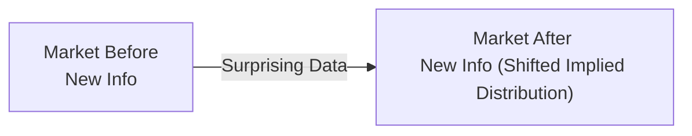
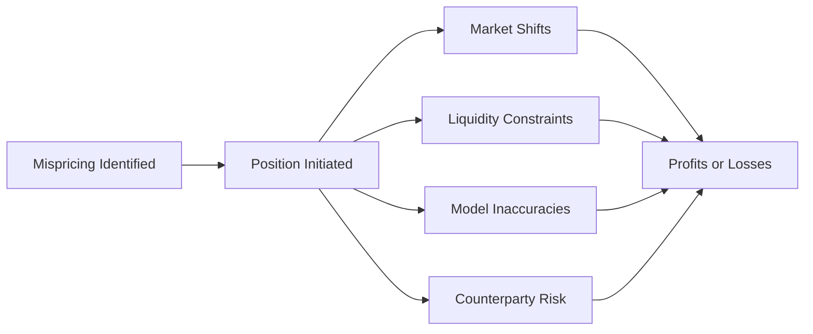

## Introduction

I remember the first time I tried to “read the tea leaves” in the derivatives market—boy, it was both intimidating and thrilling. You’ve got futures curves, implied volatilities, swap spreads, forwards, and all sorts of data swirling around. If you learn how to properly interpret this information, you can glean insights into what the market is expecting in terms of interest rates, equity returns, currency movements, and more. And if you spot a genuine disconnect between your own analysis and what’s priced in, that’s where the real magic can happen.

This section explores how to infer market expectations from the pricing of derivatives and how to exploit perceived mispricings using futures, forwards, swaps, and options. We’ll look at the major analytical tools, real-world considerations, a few basic formulas, and some helpful examples along the way. So, let’s dive in.

## Inferring Market Expectations from Derivatives

One of the main reasons investors turn to derivatives is that they’re powerful barometers of collective market sentiment. Futures markets, for instance, aggregate thousands of trades that reflect participants’ views on future prices. Similarly, option premiums capture probabilities (in a risk-neutral sense) of different future price scenarios. Understanding these signals can help portfolio managers shape and refine their strategies.

### Futures and Forward Curves

For many participants, the futures or forward curve is the go-to tool for assessing where the market thinks prices or interest rates are headed. For example, if you see an upward-sloping crude oil futures curve, it could reflect expectations for increasing demand, risk premiums for storage, or some combination of fundamental supply/demand factors. Meanwhile, a downward-sloping yield curve (meaning forward rates are lower in the future) often signals that the market is pricing in a drop in policy rates, possibly in response to an anticipated economic slowdown.

In mathematical terms, a forward price F₀(T) for maturity T might be approximated via the cost of carry model:

$$
F_{0}(T) = S_{0} e^{(r - q)T}
$$

where  
• S₀ is the current spot price.  
• r is the risk-free rate (continuously compounded).  
• q could be a convenience yield, dividend yield, or other cost-of-carry adjustments.  

Interpreting the slope and shape of the curve allows you to see at what levels and timeframes the market is willing to transact in the future. If there’s a huge spread between short-term and longer-term futures, that’s usually the market telling us something—like expectations for repeated central bank rate cuts or expansions in the case of interest rates, or possible supply concerns in the case of commodities.

### Swap Spreads

A swap spread is the difference between the fixed rate on an interest rate swap and the yield on a government bond with a similar maturity. Many practitioners see swap spreads as indications of credit risk perceptions (i.e., a wider spread could mean the market is worried about riskier corporate or financial conditions) and liquidity conditions. If swap spreads suddenly widen, it might suggest that market participants have grown uneasy about credit quality, just as a narrower spread might imply improved liquidity or decreased concern over default probabilities.

### Implied Volatility from Options

If you’re dealing heavily in equity or currency markets, implied volatility can be your best friend in analyzing the consensus on potential price swings. Implied volatility is extracted from option prices using standard option-pricing models (e.g., Black–Scholes). A higher implied volatility typically suggests the market is bracing for larger moves in the underlying asset. By looking at the term structure (short-dated vs. longer-dated options) or the volatility skew/smile (the shape of implied volatility for different strike prices), you can glean insights into how the market perceives downside vs. upside risks. If you see a big spike in out-of-the-money put implied vols, that’s often a sign the market is worried about a tail-risk event.

### Implied Probability Distributions

Building on the concept of implied volatility, we can derive an implied probability distribution of future prices or rates from a full chain of option strikes. The distribution is not the “real-world” belief, but rather the “risk-neutral” view embedded in option prices. Still, analyzing these distributions offers valuable clues about how the market assesses risk scenarios, fat tails, or large potential jumps in price. Practitioners often track these distributions daily to monitor shifts in sentiment following economic data releases or geopolitical events.

To illustrate, the following Mermaid diagram shows how implied distributions might shift in response to a new piece of information—like a surprising inflation print:

The shape of the implied distribution can shift, sometimes re-centering around a new mean or developing a fatter left tail if fear intensifies around a downside scenario.

## Exploiting Market Views with Derivatives

Let’s say all your painstaking research leads you to believe the consensus is just plain wrong. The forward curve might be overly hawkish, ensuring that forward rates are set too high; or maybe implied volatility on stock index options is too low relative to your view of macro risks. One of the beauties of derivatives is that you can take a position aligned with your view—long or short—while precisely targeting the aspect of the market you think is mispriced. Here are some typical ways to exploit your outlook:

### Receiving Fixed in an Interest Rate Swap

Imagine you expect rates to plummet in the coming year, but the forward curve is only pricing mild reductions. Entering into a receive-fixed, pay-floating interest rate swap is a direct way to profit if rates fall more than the market currently anticipates. Your fixed receive leg becomes relatively more valuable in a lower-rate environment, netting you gains.

### Buying Out-of-the-Money Options

If your analysis shows that implied volatility is severely underpricing the possibility of a market correction, buying out-of-the-money puts on an equity index can be an inexpensive way to stand ready for a sell-off. Should the correction come, the delta and gamma effects on your put options can deliver substantial returns. The trade-off is time decay—nothing in life is free—and if the market never corrects, your option premium can evaporate. Nevertheless, when you believe volatility is priced too cheaply, that premium may be well worth paying.

### Using Futures for Directional Bets

Futures contracts are often chosen for their liquidity, transparency, and relatively low transaction costs. If you judge that the forward curve slope for WTI crude oil is misaligned with fundamental supply-demand data, you can go long or short in the relevant futures maturities to express your view. Just keep in mind that large net speculative positions can move futures prices quite a bit and that the curve shape might incorporate risk premiums that are not always obvious or intuitive.

### Currency Forwards in FX Markets

Currency forward markets adjust quickly to fundamentals like interest rate differentials and geopolitical risks. If your analysis shows that a currency pair is undervalued (or overvalued) relative to its forward-implied price, you can enter a forward contract to lock in the exchange rate. In the event the spot price evolves as you predict (e.g., strengthening or weakening more than the market implied), you realize gains on the forward position.

## Key Analytical Tools

Gathering the insights to infer and exploit market expectations typically involves several well-honed analytical techniques. It’s not just about reading a single data point; it’s about synthesizing a variety of signals into a coherent market narrative.

### Forward Curve Analysis

Investors often graph forward prices or rates and examine how they change over time. The shape of these curves—whether upward or downward sloping—offers clues about near-term vs. long-term market sentiment. A “steep” interest rate forward curve might rely on the assumption of strong growth or rising inflation, while a flat or inverted curve often implies recessionary fears or an overly cautious outlook by investors.

### Option-Implied Probability Distributions

Software packages can invert option prices to produce the risk-neutral probability distribution for an underlying asset. By comparing the implied distribution with your proprietary forecasts (or with distributions implied by different markets, e.g., equity vs. currency markets), you might spot dislocations. For instance, if the market’s implied distribution shows a low probability of a sharp interest rate hike, but your macro model signals a high risk of sudden inflation, that discrepancy may be exploitable via call options on short-term interest rate futures.

### Swap Spread Analysis

Monitoring the fluctuations in swap spreads provides insights into credit risk perceptions, liquidity conditions, and potential market stress points. Large divergences between swap rates and government yields might open the door to arbitrage-like strategies or might at least warn you of liquidity constraints that could hamper your directional trades.

### Regression and Econometric Tools

More quantitative-minded managers often run regressions to decompose the drivers of implied volatility or swap spreads. They might regress swap spreads on measures of credit risk (like corporate bond spreads) or assess whether implied vol in equity markets can be predicted by leading macro indicators. If the observed market prices deviate from the expected regression estimates by a statistically significant margin, that’s often a signal for a potential trade.

## Risks and Practical Considerations

Every strategy has its risks, and trading based on market expectations is no different. You’re effectively betting against a crowd that incorporates all sorts of private and public information, so humility is critical.

• Rapid Shifts in Expectations: The market might change its mind in a flash if new data (e.g., an unexpected rate hike by a central bank) appears. The once-favorable mispricing can quickly vanish—or worse, move against you.  
• Liquidity and Execution Risk: Even if you identify a solid mispricing, lack of market liquidity might prevent you from building (or closing) a large-enough position without incurring unwanted slippage in price.  
• Model and Data Reliability: Extracting implied probabilities or reading too much into a swap spread can be misleading if you rely on oversimplified models or stale data. You might interpret “signals” that are noise or anomalies.  
• Counterparty Risk: When you enter swaps or over-the-counter forwards, you assume that your counterparty will pay you if the trade is profitable. If your counterparty has solvency issues, your gains might not be realized.  

To visualize how these risks might accumulate, here’s a simple diagram:

Even the best trades have multiple ways to go sideways. Being alert to these pathways helps you structure trades to limit downside if your thesis proves incorrect.

## Real-World Case Study

A few years back, a fund manager I knew was convinced that the Fed would not hike as aggressively as the forward curve implied. Most economists were calling for multiple rate hikes, but the manager’s proprietary model pointed to subdued wage inflation. She decided to receive fixed in an interest rate swap, effectively wagering that the floating rate (tied to a short-term benchmark) would track a lower-than-expected path.

Over the next six months, wage data indeed came in weaker, the Fed signaled caution, and the market’s expected path for rates shifted down. As a result, the fixed leg she was receiving became quite valuable, and she locked in a tidy return on that portion of the portfolio. It’s a neat illustration of how you can pocket genuine gains if you spot a divergence between your outlook and the consensus.

## Conclusion and Best Practices

Using derivatives to infer and exploit market expectations can give your portfolio a powerful edge—if done thoughtfully. Here’s some guidance to keep in mind:

• Stay Informed: Constantly reevaluate. News, data releases, or new corporate earnings can flip the market’s perspective.  
• Integrate Multiple Signals: Don’t rely on just a single derivative metric like implied volatility. Combine data from motion in swap spreads, forward curves, and the entire volatility surface.  
• Manage Risk: Always use position sizing, stop-loss, or option structures (like spreads) to limit damage if you’re wrong.  
• Continually Validate Models: Check how well your models predicted outcomes in the past. Are there persistent biases or errors?  
• Plan Your Exit: Know under what conditions you’ll close the position, either to take profits or limit losses.

On the CFA Level III exam, expect scenario-based questions where you’re shown forward curves, implied volatilities, or swap rates—and then asked how you’d exploit apparent mispricings using derivatives. You may also need to calculate potential payoffs under different scenarios or show how changes in the implied probability distribution would affect your positions. Practice carefully evaluating trade-offs between cost, liquidity, and potential upside/downside.

## Glossary

• Swap Spread: The difference between the fixed rate on a swap and the yield on a government bond with the same maturity. Often a gauge of perceived credit risk or liquidity conditions in the market.  
• Forward Curve: A sequence of forward prices or rates over various maturities, reflecting market expectations for where prices/rates will be at those future dates.  
• Risk-Neutral Pricing: A valuation approach where expected payoffs are discounted at the risk-free rate, implying that derivatives prices reflect risk-neutral probabilities rather than real-world probabilities.  
• Implied Probability Distribution: A probability distribution for future asset prices or rates derived from option premiums, reflecting the market’s view in a risk-neutral framework.

## References, Suggested Readings, and Links

• CFA Institute Level III Curriculum (Derivatives and Risk Management)  
• Hull, J. “Options, Futures, and Other Derivatives”  
• Gatheral, J. “The Volatility Surface”  
• Jarrow, R. & Chatterjea, A. “An Introduction to Derivative Securities, Financial Markets, and Risk Management”  

## Test Your Knowledge: Derivatives for Inferring and Exploiting Market Expectations



### Which of the following best describes the significance of the forward curve in market analysis?

- [ ] It shows historical spot prices and trading volumes.
- [ ] It represents only the average cost of carry for all commodities in a portfolio.
- [x] It illustrates the market’s expectations for future prices or interest rates for specific maturities.
- [ ] It provides a benchmark for real-world probability distributions of macroeconomic data.

> **Explanation:** The forward curve details expectations of future prices or rates at specified maturities and is central to understanding how investors collectively anticipate market gaps or movements.

### What is one possible reason for a rapid shift in a forward curve?

- [ ] Seasonality in commodity demand that was publicly known and priced in months ago.
- [ ] A stable geopolitical environment with no new developments.
- [ ] A decline in trading volumes without any new market data.
- [x] Release of major economic news that changes perceived future supply or demand conditions.

> **Explanation:** Significant new information, such as a surprise inflation report or central bank policy announcement, can cause the forward curve to shift if it alters market expectations for future rates, prices, or economic conditions.

### If a manager thinks implied volatility on an equity index is too low, which of the following is most aligned with capitalizing on that belief?

- [ ] Selling at-the-money calls.
- [x] Buying out-of-the-money puts.
- [ ] Hedging with a receive-fixed interest rate swap.
- [ ] Selling volatility via a short straddle.

> **Explanation:** When implied volatility is perceived to be cheap relative to likely market swings, buying options (particularly out-of-the-money puts if you anticipate downside risk) is a straightforward way to benefit from a jump in volatility.

### Which statement most accurately characterizes a swap spread?

- [ ] It’s the difference between the floating rate and the credit default swap spread of the same counterparty.
- [x] It’s the difference between a swap’s fixed rate and the yield on a government bond of comparable maturity.
- [ ] It’s the gap between the highest and lowest forward price on a futures curve.
- [ ] It’s the difference between swap rates of different maturities within the same swap contract.

> **Explanation:** A swap spread is specifically the difference between the fixed rate on an interest rate swap and a government bond yield of similar maturity. It’s often used to gauge credit risk and liquidity conditions in the market.

### Which of the following tools is best described as showing the market’s risk-neutral probabilities for different future asset prices?

- [ ] The term structure of interest rates.
- [x] Option-implied probability distributions.
- [ ] Commodity spot prices.
- [ ] Historical volatility indices.

> **Explanation:** Analyzing option prices across maturities and strikes lets us back out the risk-neutral probabilities the market assigns to various price scenarios.  

### A steep yield curve typically suggests:

- [x] The market expects significantly higher interest rates in the future.
- [ ] Credit risk is very low across the board.
- [ ] A high supply of short-term government bonds is depressing short rates.
- [ ] A guaranteed mispricing in the forward market.

> **Explanation:** A steep yield curve often implies that investors believe rates will rise steadily, possibly reflecting expectations of economic growth or inflation.

### In swap spread analysis, a widening swap spread may indicate:

- [x] Growing concerns about credit or liquidity in the interest rate markets.
- [ ] A clear, one-sided bet on falling interest rates only.
- [x] Potential supply and demand imbalances for high-quality government bonds.
- [ ] Automatic mispricing in equity index derivatives.

> **Explanation:** Swap spreads can widen if market participants demand more credit protection or if liquidity conditions deteriorate, meaning it’s not purely about interest rates but about credit and liquidity sentiments too.

### Receiving fixed in an interest rate swap when you expect declining rates is advantageous because:

- [x] The fixed rate you receive becomes more valuable as floating rates decrease.
- [ ] You pay a lower fixed rate when floating rates rise.
- [ ] It automatically locks in currency conversion rates.
- [ ] It eliminates any potential credit risk exposure.

> **Explanation:** If future floating rates fall below the fixed rate you locked in, the swap’s fixed receive leg wins out compared to the floating leg, generating a net positive for the receiver.

### Which of the following illustrates a key risk in deriving market expectations from derivatives?

- [x] The models used might oversimplify real-world conditions and lead to incorrect signals.
- [ ] Every derivative price always perfectly reflects real-world probabilities.
- [ ] Derivatives have no correlation with macroeconomic indicators.
- [ ] Spot prices are never correlated with forward prices.

> **Explanation:** Model risk is a major factor. If you rely on assumptions that fail to hold, you can misread signals embedded in derivative prices.

### A “risk-neutral” valuation framework implies:

- [x] Investors are indifferent to risk, and payoffs are discounted at the risk-free rate.
- [ ] Real-world probabilities are used in all derivative pricing.
- [ ] Traders do not care about portfolio beta or volatility.
- [ ] All derivative strategies have zero cost.

> **Explanation:** Risk-neutral valuation involves discounting expected payoffs at the risk-free rate, implying that investors are indifferent to risk in the context of pricing derivatives—but it does not reflect actual, “real-world” probability distributions.


