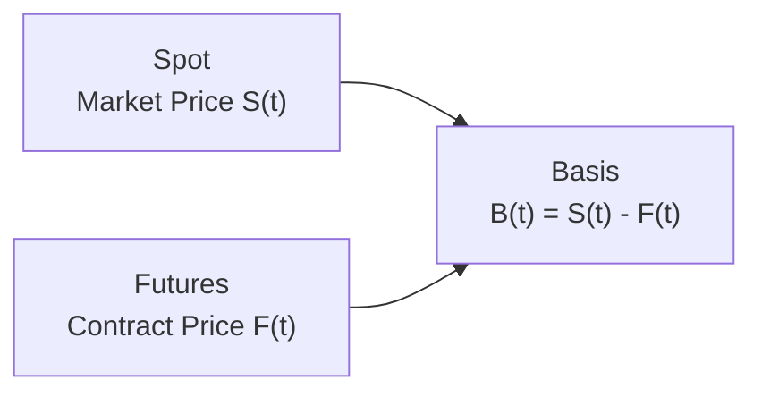

## Introduction

I remember chatting with a colleague a while back—she was frustrated because her interest rate hedge wasn’t performing the way she expected. She was using a Treasury futures contract to hedge a corporate bond portfolio, but her results were, well, kind of off. It turned out the culprit was basis risk: the credit spread on her corporate bonds moved differently than Treasury yields. In other words, the underlying bond and her hedging vehicle weren’t perfectly correlated, so the hedge left some risk on the table.

That little anecdote captures the essence of basis risk. Sometimes, the futures or forward contract you pick isn’t a carbon copy of the thing you’re trying to hedge—you know, differences in credit quality, index composition, forward settlement terms, or even timing. So let’s walk through how to understand and manage that pesky basis risk with futures, and then we’ll talk about how you can use spread strategies to profit from, or at least mitigate, those differences. 

## Understanding Basis Risk

Basis risk is the possibility of imperfect offsetting gains and losses because the underlying asset (the one you’re actually exposed to) is not identical to the asset underlying your hedge. The “basis” is generally defined as:

$$
\text{Basis}(t) = S(t) - F(t)
$$

where:
• \\( S(t) \\) = the spot (cash) price of the asset you own or are exposed to  
• \\( F(t) \\) = the corresponding futures or forward price  

In a perfect world, if your underlying risk exactly matched the risk of the futures contract you’re using, basis would remain constant (or be zero) and your hedge would be perfect. In the real world, though, basis can fluctuate for many reasons—credit spreads can change, the term structure of interest rates might shift, or correlations among equity indices can drift. 

### Sources of Basis Risk

• Differences in Credit Quality or Spread: For example, using Treasury futures to hedge corporate bonds. If credit spreads between corporates and Treasuries widen or narrow, the futures might not move in lockstep with the underlying bond’s price.  
• Differences in Index Composition: You might try to hedge a custom equity portfolio with an S&P 500 futures contract. If your portfolio’s sector weights or stock picks differ substantially from the index, your hedge will be imprecise.  
• Delivery Options or Contract Specifications: Futures contracts can have delivery timing differences, grade/quality specifications (especially in commodities), or location differences (e.g., West Texas Intermediate vs. Brent crude for oil).  
• Seasonal or Structural Differences: This is big in commodities. An agricultural commodity might be influenced by planting or harvest seasons, so one month’s contract may not be a perfect hedge for a different month’s physical delivery period.

### Personal Observations

I once tried to hedge a small basket of emerging market sovereign bonds with a more liquid U.S. Treasury futures contract. Initially, the correlation looked strong enough to be passable, so I ventured ahead. But, surprise: local economic developments in the emerging market region caused spreads to blow out, while long-dated U.S. Treasuries barely budged. It was an eye-opening introduction to the real meaning of basis risk—hedges can be “okay-ish” on paper but still come back to haunt you if conditions change.

## Visualizing the Concept of Basis

Below is a simple Mermaid diagram to illustrate how basis arises as the difference between a spot price and the futures price:

If \\( S(t) \\) and \\( F(t) \\) do not move in perfect harmony—as is often the case—\\( B(t) \\) will fluctuate. This fluctuation is precisely what we call basis risk.

## Spread Strategies

Spread strategies are all about exploiting (or hedging) differences among related assets or among various contracts on the same underlying. The broad idea behind a spread is: go long one asset (or contract) and short another. If their prices converge or diverge in the way you anticipate, you profit—or at least reduce your net risk. 

Below, we focus on the two major types of spread strategies often used to mitigate basis risk: intra-market spreads (within the same market) and inter-market spreads (across related markets). We’ll also touch on commodity spreads, which often revolve around differences in contract months for the same commodity.

### Intra-Market Spread

An intra-market spread involves taking positions in the same underlying asset but in different contract months. For instance, you could buy a March S&P 500 futures contract and sell a June S&P 500 futures contract. This is also known as a calendar spread.

• Calendar (Time) Spread: You buy and sell futures on the same underlying but with different expirations. The payoff relies on changes in the term structure of futures prices. Maybe you expect the front-month futures to get stronger relative to the later-month ones.  

Why might you do this? Often, it’s to hedge a partial exposure to short-term volatility while profiting from anticipated movements in the futures curve. It can reduce the dimension of risk if you believe the two maturities will move somewhat together, limiting your exposure compared to taking a purely directional position. 

### Inter-Market Spread

Inter-market spreads are formed by going long in one futures contract (say, the Euro Stoxx 50) and short in another (e.g., the FTSE 100). But you can only do this if the two underlyings are correlated or have a relationship you’re trying to exploit. 

For example, if you expect Euro-area equities to perform better than U.K. equities, you might go long Euro Stoxx 50 futures and short FTSE 100 futures. If you’re correct, any outperformance of the Euro Stoxx relative to the FTSE 100 yields a potential positive spread return—even if the overall market for equities declines (both might go down, but the question is by how much). This is one way of neutralizing broad market exposure and focusing on a spread or relative value idea.

### Commodity Spreads

Commodity markets are infamous for supply-and-demand imbalances across different contract months or between closely related commodities. For instance, in crude oil, you might place a spread between West Texas Intermediate (WTI) and Brent futures if you anticipate a shift in the relative demand for the two benchmarks. Alternatively, a trader might do a “crack spread,” going long on crude oil futures and short on refined product futures (like gasoline or heating oil) to profit from changes in refining margins.

## Minimizing Basis Risk

If you’re serious about controlling basis risk (and, quite honestly, who isn’t?), there are a few steps that typically help:

• Select High-Correlation Contracts: The single best way to minimize basis risk is to pick a futures or forward contract that tracks your underlying exposure as closely as possible. Do you hold an S&P 500–like portfolio? Then it probably makes more sense to hedge with S&P 500 futures than, say, NASDAQ-100 futures.  
• Monitor and Adjust Hedge Ratios Dynamically: Basis can drift over time, so the hedge ratio that works today might be suboptimal in three weeks if the spread environment changes. Reviewing correlations and adjusting positions is essential.  
• Be Aware of Seasonal or Structural Anomalies: Commodities and certain equity indexes can have strong seasonal patterns. For instance, agricultural commodities have harvest cycles, and certain equity indexes might have monthly or quarterly reconstitution effects that can cause short-lived distortions in price relationships.  
• Use Spread Strategies to Hedge Out the “Wrong Risk”: If your main concern is credit spread movement, you might combine a long position in a Treasury futures contract (to hedge out the interest rate risk) with a short position in corporate bond spreads through a credit default swap index (CDX). That way, you’re specifically canceling out the “wrong” parts of risk.  

### Formula for an Optimal Hedge Ratio with Basis Risk

While the simplest hedge ratio is typically computed by notional equivalence or duration equivalence (for bonds), the presence of basis risk often calls for a correlation-based approach:

$$
\text{Hedge Ratio} = \rho \; \frac{\sigma_S}{\sigma_F},
$$

where \\( \rho \\) is the correlation between your underlying asset \\( S \\) and the futures \\( F \\), and \\( \sigma_S \\) and \\( \sigma_F \\) are their respective standard deviations (volatilities). If the correlation is less than 1, you won’t perfectly hedge the position, but you’ll at least size your futures position in a way that recognizes the difference in price behavior.

## Implementation Example

Let’s consider a portfolio manager who invests in a broad array of investment-grade corporate bonds. The manager is worried about rising interest rates but doesn’t want to liquidate her corporate bond portfolio. Instead, she decides to use Treasury bond futures to hedge interest rate risk.

• Step 1: Estimate the correlation between the corporate bond portfolio’s returns and the returns on the chosen Treasury futures contract over the last few months (or years).  
• Step 2: Calculate the duration of the corporate bond portfolio and the duration (or DV01) of the Treasury futures.  
• Step 3: Compute the hedge ratio based on correlation, durations, and notional exposures.  
• Step 4: Initiate the short position in Treasury futures.  

Everything seems peachy at first. But then, a wave of credit fear hits the market, and corporate spreads widen. Because the hedge is in Treasury futures, the manager successfully hedges out some interest rate exposure, but the corporate bonds drop in price more than the Treasuries (thanks to the widening credit spread). This shortfall is precisely the basis risk leftover in the trade. 

The manager can reassess the hedge ratio as the correlation changes; any new calculations might lead to scaling up or down the futures short or even layering in a credit spread hedge via a credit default swap index. That’s the dynamic process required to keep basis risk somewhat in check.

## Best Practices for Basis Risk Management

• Carefully Research Correlations: Don’t rely on a single historical correlation value. Examine correlation stability, seasonal patterns, and regime shifts (e.g., crisis vs. stable markets).  
• Combine Different Derivatives: Sometimes a single future isn’t enough to cover all the risk factors. You might use a combination of interest rate futures, equity index futures, and credit default swaps to isolate and hedge the risk elements that matter.  
• Stress Test Your Spreads: Perform scenario analyses to see how your hedge performs if, say, credit spreads blow out by 50 bps or if equity sector spreads change significantly.  
• Keep an Eye on Roll Costs: If your hedge is long-term, you’ll have to roll your futures forward multiple times. Each roll can introduce new basis risk if the term structure changes or if liquidity conditions shift.

## Common Pitfalls

• Overconfidence in Steady Correlations: Correlations among markets are notoriously unstable, especially in times of crisis or stress. A hedge that worked in calm markets may fail dramatically in volatile conditions.  
• Inadequate Monitoring: Basis risk changes over time, so a set-it-and-forget-it approach is dangerous.  
• Overhedging or Underhedging: Getting the hedge ratio wrong—and letting it stay that way—gradually deteriorates performance.  
• Ignoring Delivery Month Mismatches: If your underlying exposure has a different time horizon than the futures contract you’ve selected, you might wander into mismatched settlement timelines.

## Practical Real-World Scenarios

• Equity Macro-Hedge: You hold a diversified equity portfolio but want partial downside protection. You short an equity index future that correlates around 0.9 with your stocks. As the market falls, the future’s change partially offsets your losses, but if your portfolio has overweight exposures to small-cap or value stocks, that difference in factor exposures can leave some unhedged risk.  
• Commodity Calendar Spread: You suspect that near-term demand for crude oil will spike, but longer-term demand looks weaker. You buy the front-month crude futures and short the longer-dated, creating a calendar spread. If near-term prices rally more than the far month, the spread benefits. However, if unanticipated supply disruptions hit both months equally, your spread might not pan out as expected.  
• Currency Hedge in a Cross Rate: Suppose your base currency is the euro, but you have exposure to Swiss franc assets. You decide to hedge using euro/Swiss franc forwards. That’s straightforward. But if you mistakenly tried to use a euro/dollar forward to hedge your Swiss franc exposure, you’d have basis risk from the cross-currency mismatch (EUR/CHF isn’t perfectly correlated with EUR/USD, especially during times of financial stress).

## Further Integration and Cross References

For an in-depth discussion of how basis risk can creep into currency management, check out Chapter 3 on Currency Management—An Introduction. Also, if you want to see more on designing hedge ratios dynamically, Section 1.12 on Dynamic Hedging Techniques Using Options might be of interest. The interplay of basis risk is pervasive across derivative instruments, so the discussions in Swaps, Forwards, and Futures are just one piece of the puzzle.

## Exam Tips and Final Thoughts

In the CFA Level III exam, you might face constructed-response questions about how to hedge an equity or bond portfolio using futures, or item-set questions that highlight potential changes in credit spreads. Be ready to compute the hedge ratio taking into account correlation, or to discuss what basis risk remains if you’re using an imperfect hedge. 

Time management matters: many of these scenarios require quick calculations, so you’ll want to be prepared to do the notional conversions and correlation-based adjustments rapidly. And if the exam scenario states that the correlation or spread has changed mid-hedge, you should note the need to rebalance or revise your position—don’t just assume you’re fully hedged for the entire horizon.

Above all, keep a critical eye on the mismatch between what your underlying risk actually is and what your hedge instrument covers. The difference—i.e., basis risk—should be recognized, measured, and managed on an ongoing basis. 

## References

• Kolb, R. “Futures, Options, and Swaps.”  
• CFA Institute Level III Curriculum—Derivatives and Risk Management.  
• Hull, J. “Options, Futures, and Other Derivatives.”  

## Test Your Knowledge: Managing Basis Risk and Spread Strategies



### Which of the following best describes basis risk?
- [ ] The probability that a default event will occur on the reference asset.
- [ ] The risk that the futures contract may become illiquid.
- [x] The risk that the offset in a hedge is not perfect because the underlying asset differs from the hedging instrument.
- [ ] The risk that the margin requirements on a futures position will increase.

> **Explanation:** Basis risk arises when there is a mismatch between the asset being hedged and the derivatives contract used for hedging, causing imperfect offsetting of gains and losses.

### An investor is hedging a portfolio of corporate bonds using Treasury futures. Credit spreads widen significantly while interest rates remain stable. The outcome is most likely:
- [ ] A perfectly hedged position because interest rate risk has been fully removed.
- [ ] No impact on the hedge because the credit spread is unrelated to interest rates.
- [x] A partial loss on the corporate bonds that is not fully offset by gains on the Treasury futures.
- [ ] An increase in the correlation between corporate bonds and Treasury futures.

> **Explanation:** Widening credit spreads cause corporate bonds to fall more in price than Treasuries, creating a residual loss not offset by the Treasury futures hedge.

### One way to minimize basis risk when hedging an equity portfolio is to:
- [ ] Use only commodity futures to hedge the portfolio.
- [x] Select an index future that closely matches the underlying portfolio’s composition.
- [ ] Use short-term government bond futures instead of equity futures.
- [ ] Rebalance the portfolio more frequently than once a day.

> **Explanation:** The key is aligning the hedge instrument closely with the portfolio’s exposure. Using futures that track a similar index helps reduce mismatch, thereby mitigating basis risk.

### What is the primary objective of an intra-market spread (calendar spread)?
- [x] Profiting from changes in the term structure of futures on the same underlying.
- [ ] Gaining pure directional exposure to spot prices.
- [ ] Arbitraging differences between unrelated commodities.
- [ ] Eliminating the possibility of any risk in the futures market.

> **Explanation:** An intra-market or calendar spread involves buying and selling futures on the same underlying but with different contract expirations. The approach aims to capitalize on or hedge changes in the structure of prices over time.

### In an inter-market spread strategy, a common approach is:
- [x] Buying futures on one index while shorting futures on a different but related index.
- [ ] Buying and shorting the exact same futures contract to create a riskless position.
- [ ] Only trading spreads in commodity markets to reduce basis risk.
- [ ] Matching all spread positions to the next day’s close.

> **Explanation:** An inter-market spread involves two different but correlated markets (e.g., Euro Stoxx 50 vs. FTSE 100). The manager profits from the relative performance of one market versus the other.

### When hedging a corporate bond portfolio with interest rate futures, which scenario is most likely to lead to basis risk?
- [ ] The correlation between the portfolio return and the futures return is 1.0.
- [ ] The correlation is measured against equity returns.
- [ ] Interest rates and credit spreads move together perfectly.
- [x] Credit spreads change independently from Treasury yields.

> **Explanation:** Basis risk becomes evident when credit spreads diverge from Treasury yields, leading to imperfect hedging since the Treasury futures hedge only the interest rate component of bond risk.

### A manager expects the front-month crude oil futures to rise faster than the third-month futures. Which strategy might she employ?
- [ ] An inter-market spread shorting crude oil and partially long in natural gas.
- [x] A calendar spread by buying near-month contracts and selling longer-dated contracts.
- [ ] A credit spread by shorting corporate bond futures versus Treasuries.
- [ ] A carry trade that involves borrowing crude oil at a spot rate.

> **Explanation:** A calendar spread involving the purchase of the front month and sale of the third month exploits potential changes in the futures term structure for crude oil.

### The hedge ratio commonly adjusted for correlation can be expressed as:
- [ ] Duration of asset ÷ Duration of futures.
- [x] ρ × (σS ÷ σF).
- [ ] Beta of the portfolio × Beta of the futures contract.
- [ ] 1 ÷ ρ.

> **Explanation:** The optimal hedge ratio in the presence of basis risk often involves multiplying the ratio of volatilities (spot to futures) by the correlation between the two.

### A major pitfall in using a derivatives-based hedge includes:
- [ ] Lower margin requirements than direct short sales.
- [ ] Unlimited upside potential on the long side of the underlying.
- [ ] A guaranteed lock on the underlying spot price.
- [x] Overconfidence in historical correlations that may shift under stress conditions.

> **Explanation:** Market correlations can change, especially during periods of stress, creating basis risk and undermining a hedge that was calibrated using historical data.

### True or False: Basis risk is eliminated when δ-hedging with perfectly correlated futures.
- [x] True
- [ ] False

> **Explanation:** If the correlation is truly perfect (ρ = 1) and the hedge ratio is properly calculated, basis risk theoretically disappears. In practice, perfect correlation is extremely rare, meaning some basis risk is almost always present.




