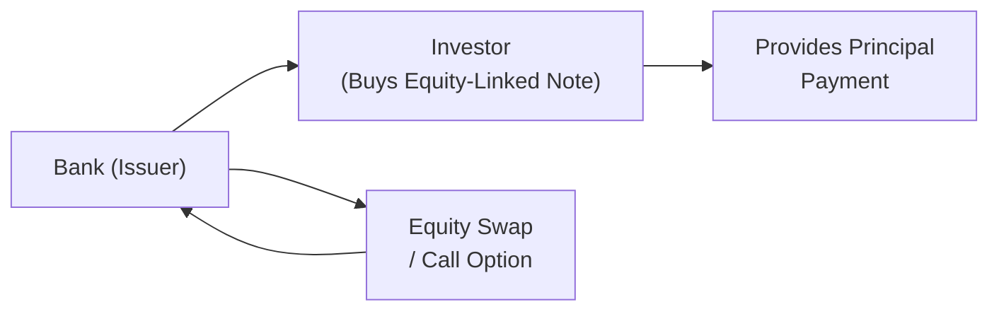

Introduction  
I still remember the first time I heard about structured products. I was fresh out of college, visiting a friend at an investment bank. He was super excited about a new equity-linked note that combined a treasury bond and a call option on a technology index. I was wide-eyed and slightly confused—like, “Why not just buy a tech stock and keep the leftover money in a bank account?” But as I learned more, I realized there’s a deep world of customization and design that caters to specific investor needs, often in a single product. That’s exactly what we’ll explore here: structured products that involve swaps and forwards.

Understanding Structured Products  
Structured products are customized financial instruments that bundle traditional assets (like bonds or deposits) with derivative components (like options, swaps, or forwards) to achieve certain risk-return objectives. They sometimes look like complicated combos of building blocks—bonds, calls, puts, or swaps—that ordinary investors might not put together on their own. You’ll see them referred to as principal-protected notes, equity-linked notes, and credit-linked notes, among others.

In an ideal world, structured notes can be seen as “all-in-one” solutions that provide exposure to a target market, help manage downside risk, or even enhance returns in sideways or bullish markets. However, they come with complexities—including possible hidden fees, valuation challenges, and the creditworthiness of the issuer. So let’s walk through the main building blocks (swaps and forwards) and see how they fit into structured products.

Swaps as a Foundation  
Swaps are derivative contracts in which two parties exchange (or “swap”) cash flows or returns based on different reference rates or assets. In many structured products, a swap is embedded to alter the payoff pattern in some shape or form. For example:

• Equity swap in an equity-linked note: Instead of receiving a fixed interest rate, the investor might receive the returns of a chosen equity index. The note typically includes an embedded swap between the issuer and the investor’s funds.  
• Credit swap in a credit-linked note: The security’s payoff is tied to whether a reference entity (e.g., a corporation or a sovereign) defaults on its debt obligations. Essentially, the investor is selling protection (by investing in the note) and, in return, collects a premium through the note’s yield.

Let’s briefly compare these popular swap-based structured products:

– Equity-Linked Notes (ELNs). These notes pair a base bond or deposit with an equity call option or an equity swap. In many cases, the investor’s principal is either protected or partially protected, while a portion of the upside is passed on to the investor if the equity index or stock performs well.  
– Credit-Linked Notes (CLNs). A CLN has a payoff tied to the credit performance of a third-party entity (or a basket of such entities). If there’s a credit event (default, restructuring, etc.), the note’s redemption value is reduced. These notes allow issuers to transfer credit risk to the investors buying the CLN.

Forwards as a Foundation  
Forward contracts lock in the price to buy or sell an underlying asset (commodities, equities, currencies, etc.) at a future date. When embedded in a structured product, forwards can help tailor the instrument’s payoff. For instance:

• A commodity-linked note might embed a forward on oil or gold. This structure could lock in a known future purchase price for the commodity, wrapped with a bond that provides a steady coupon.  
• A currency-linked note might incorporate a forward exchange rate on a pair of currencies, providing a specific payoff profile if exchange rates move in a certain manner.  
• Equity or index forwards can replicate exposure to a market for a fraction of the cost (depending on how the product is structured), often combined with a zero-coupon bond to ensure principal protection at maturity.

Motivations for Structured Products  
Why bother piecing these derivatives into one single note? There are many reasons:

• Tailored payoffs. Some investors want capital protection plus some equity upside. Others might want credit exposure for a yield boost (but also accept the risk of a credit event).  
• Access to specialized markets. Structured products can provide “one-stop shop” exposure to less accessible markets or instruments.  
• Potential tax advantages. In some jurisdictions, the note format may offer favorable tax treatment relative to directly holding the underlying.  
• Yield enhancement. A note can embed leverage or exotic features to generate higher yield. For instance, a credit-linked note typically yields more because the investor is taking on the risk of a default event.  

Risks and Challenges  
We can’t ignore that structured products can be complicated. Some come with elaborate payoff formulas that might stump even seasoned professionals. Meanwhile, the transparency of fees and embedded costs can be limited. Here are some main risks:

• Complexity. The presence of embedded swaps, forwards, and options means you have multiple moving parts. Valuation might require advanced models to account for volatility, correlation, credit spreads, and so forth.  
• Issuer Credit Risk. A principal-protected note isn’t necessarily risk-free if the issuing bank defaults. Even if the underlying bond portion is AAA-rated, if the issuer itself falters, the investor could be left with no recourse.  
• Liquidity. Secondary markets for structured notes can be thin. Investors may face large bid-ask spreads if they want to exit early.  
• Embedded Derivative Risks. The embedded derivative might carry path-dependent features, knockout barriers, or other complexities. Breaking these down requires expertise.  

Anatomy of a Typical Equity-Linked Note (ELN)  
Let’s visualize how the components might come together:

1. The investor purchases the equity-linked note from the bank (the issuer).  
2. The investor’s principal finances a zero-coupon bond or deposit that matures at par value (ensuring principal protection).  
3. A portion of the investor’s funds is used to purchase a call option (or to enter an equity swap).  
4. The bank separately hedges its exposure to the equity or index movement.  
5. At maturity, the investor typically receives the par value (repayment of principal) plus a payoff depending on the performance of the underlying equity or index.  

Implementation Example: Bank-Issued Equity-Linked Note  
Let’s say you’re an investment bank that wants to offer an equity-linked note on the S&P 500. You might structure it like this:

• You take the investor’s $1 million principal and invest most in a zero-coupon bond that costs, say, $900,000 today, and which returns $1 million at maturity in five years.  
• You use the remaining $100,000 to buy call options (or enter a total return equity swap) on the S&P 500.  
• If the S&P 500 goes up significantly, the call options generate a payoff that passes through to the investor (subject to some participation rate, e.g., 80% of the index upside).  
• If the S&P 500 declines, the options expire worthless, but the zero-coupon bond still matures at $1 million, returning the investor’s principal.  
• Meanwhile, the bank may hedge its position in the S&P 500 futures or swap market so that it remains delta-neutral over the life of the product.  

The investor is effectively paying for an upside participation while guaranteeing principal at maturity (subject to issuer credit risk). Some versions might only protect 90% of principal, in exchange for a higher participation rate in the underlying equity.

Credit-Linked Notes (CLN)  
A CLN uses a credit default swap to shift credit risk onto the note holder. Maybe the bank wants to limit its exposure to a corporate bond portfolio. It issues a CLN referencing those corporate bonds. Investors get an attractive yield but are on the hook if there’s a credit event. The bank’s principal redemption might be reduced if a specified default occurs.  
When I worked with a client a decade ago, they loved CLNs for the yield boost: “Why hold a boring corporate bond at a 3% yield if you can get 5.5% with the CLN?” the client asked. Of course, if a credit event triggered, the note’s payoff could be slashed. It’s all about that risk-reward trade-off.

Forward-Based Structures  
Forwards are also common in structured notes, especially for currency or commodity-linked notes. If you have a client who’s bullish on gold but doesn’t want to physically store it, you might create a structured note that references a forward contract on gold. The note’s redemption might be pegged to the forward price at maturity or to some fixed ratio of gold’s price movements.  
One reason for using forwards in a structured product is to “lock in” a certain payoff formula. For example, if the investor believes oil prices will be range-bound, you might embed a forward and an option strategy that benefits from stable prices. The note might also pay a coupon as long as oil remains within a certain price range, losing value only if oil breaks out significantly.

Use Cases and Benefits  
• Diversification. Structured notes can add a unique return profile that differs from vanilla stocks and bonds.  
• Hedge embedded in the product. Investors who want partial exposure (like 50% equity, 50% protection) can get that in a single instrument without having to do manual rebalancing.  
• Access. Changing margin or capital requirements might prevent smaller investors from directly trading complex derivatives. Structured notes wrap it neatly for them.

Potential Pitfalls  
• Mispricing or Overly Costly. Sometimes the embedded option or swap is priced at a disadvantage to the investor. It can be tough for non-professional investors to detect hidden costs.  
• Concentration Risk. Investors might inadvertently buy multiple notes from the same issuer, or referencing the same underlying, leading to overexposure.  
• Rollover Risk. If you want ongoing exposure, you might face risk in renewing or rolling over structured notes. Liquidity or market conditions might change, so you can’t reliably replicate the product’s original payoff.  

Best Practices for Using Structured Products  
• Thorough Due Diligence. Before investing, ensure you fully understand the embedded derivatives, issuer’s financial health, and worst-case scenarios.  
• Scenario Analysis. Model out the payoff under multiple market conditions: bullish, neutral, and bearish, as well as a stress scenario.  
• Monitor Secondary Market Pricing. If you plan to exit early, keep an eye on the bid-ask spreads and the underlying’s volatility.  
• Know Your “Greeks.” Similar to options, structured products might have exposure to delta, gamma, vega, and correlation. Chapter 1.11 covers “Option Greeks and Their Role in Risk Management,” which can offer insight into how changes in market factors might affect embedded options.  

Exam Relevance  
You’ll likely see short-answer or item set questions about structured notes using swaps, forwards, or both. Common question types:

• Constructing payoff diagrams.  
• Explaining how a credit-linked note transfers default risk.  
• Calculating fair value or break-even for an equity-linked note.  
• Identifying mispricing or yield enhancements.  

The exam often tests whether candidates recognize the embedded derivative and can articulate the product’s payoff in various market scenarios. You might be asked to compare structured solutions with simpler alternatives, or to analyze a product’s risk factors.

As you recall from earlier sections (for instance, Section 2.7 about basis risk in futures), the concept of “matching content” is critical. In structured products, you want to match your desired exposures carefully, as you’re effectively locking in certain payoffs via derivatives that might have their own basis or tracking errors.  

Final Tips  
• Don’t be intimidated by the complexity of these notes. Break them into building blocks: the bond (or deposit) plus whichever derivative(s) are embedded.  
• Understand that principal protection is never absolute if the issuer has default risk.  
• Check if the potential upside or yield is worth the cost of embedded derivatives.  
• Consider whether simpler strategies might offer the same exposures at a lower cost.  

References and Further Reading  
• Das, S. “Structured Products Volume 1: Exotic Options; Interest Rates, Equity, and Currency.”  
• CFA Institute Level III Curriculum (Derivatives and Risk Management).  
• Jobst, N. “The Role of Structured Finance in Weather and Catastrophe Risk Management.”  

--------------------------------------------------------------------------------

## Test Your Knowledge: Structured Product Strategies Quiz



### Which of the following best describes an equity-linked note (ELN)?

- [ ] A debt instrument that pays a fixed coupon without any equity exposure.  
- [x] A structured note combining a fixed-income instrument with an equity option or swap.  
- [ ] A note where credit protection is purchased on a reference entity.  
- [ ] A note primarily used for hedging currency exposure.  

> **Explanation:** An equity-linked note is created by combining a standard fixed-income element (often a zero-coupon bond) with an equity derivative (option or swap) to provide equity-based upside.

### In a credit-linked note (CLN), which party effectively sells credit protection?

- [x] The investor who buys the CLN.  
- [ ] The issuing bank.  
- [ ] A central clearinghouse.  
- [ ] The reference entity.  

> **Explanation:** By purchasing the credit-linked note, the investor accepts the credit risk of the reference entity. In other words, they effectively sell protection to the issuer, who is transferring the credit risk to the CLN holder.

### One motivation for using structured products is:

- [x] To achieve a tailored payoff, such as principal protection plus upside potential.  
- [ ] To avoid any exposure to derivative instruments entirely.  
- [ ] To eliminate all credit risk.  
- [ ] To guarantee a higher yield under all market conditions.  

> **Explanation:** Structured products often aim to provide custom risk-return profiles—e.g., combining principal protection with participation in equity upside.

### In an equity-linked note with principal protection, the principal at maturity is guaranteed unless:

- [ ] The yield on Treasury notes declines significantly.  
- [ ] The underlying equity fails to meet a performance threshold.  
- [x] The issuer experiences a credit event or default.  
- [ ] The investor elects early redemption.  

> **Explanation:** Principal protection in structured products is subject to the solvency of the issuer; if the issuer defaults, investors can lose their principal despite any formal protection.

### Which of the following is a potential pitfall when investing in structured products?

- [x] Lack of liquidity and wide bid-ask spreads.  
- [ ] Lower returns on currencies due to government regulation.  
- [ ] 100% guaranteed principal even if the issuer fails.  
- [x] High complexity and possible hidden fees.  

> **Explanation:** Structured products sometimes have limited secondary markets, and their complexity can mask hidden costs. They also expose investors to issuer credit risks, negating any principal “guarantee” if the issuer defaults.

### Forwards embedded in a structured note are often used to:

- [x] Lock in purchase or sale prices on the underlying asset at a future date.  
- [ ] Eliminate the risk of changes in interest rates and credit spreads.  
- [ ] Convert the note into a closed-end fund.  
- [ ] Avoid any exposure to underlying assets altogether.  

> **Explanation:** Forward contracts fix the purchase or sale price of an underlying asset in the future, making them useful tools for structuring payoff profiles in notes.

### An investor in a credit-linked note is most exposed to:

- [x] The reference entity’s default risk, plus the issuer’s credit risk.  
- [ ] Only the equity market’s volatility.  
- [x] Embedded derivative mispricing risk.  
- [ ] Positive correlation risk among multiple equities.  

> **Explanation:** A CLN investor is exposed to both the creditworthiness of the issuer (similar to any bond) and that of the reference entity. Additionally, like many structured products, there's potential for mispricing of embedded derivatives.

### A typical equity-linked note structure uses:

- [x] A zero-coupon bond combined with an equity call or swap.  
- [ ] A high-coupon bond plus an interest rate cap.  
- [ ] A forward rate agreement with guaranteed fixed coupons.  
- [ ] A convertible bond with a partial put option.  

> **Explanation:** Many ELNs use a zero-coupon bond for principal protection plus an equity option or swap for upside participation.

### Early termination of a structured note:

- [x] May incur significant losses or fees if market conditions have changed.  
- [ ] Always results in a premium payoff to the investor.  
- [ ] Guarantees an early redemption at par value.  
- [ ] Eliminates issuer credit risk.  

> **Explanation:** Exiting a structured note before maturity can be costly, often resulting in a sale at a discount if the embedded derivatives have lost value or if liquidity is poor.

### True or False: Principal protection in structured products is fully safeguarded against issuer default.

- [ ] True  
- [x] False  

> **Explanation:** Principal protection is contingent on the financial health of the issuing institution. If the issuer defaults, the investor risks losing capital.


