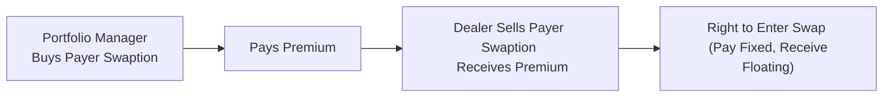

## Introduction to Swaptions

Swaptions are a flexible and powerful tool for managing interest rate risk. In a nutshell, a swaption grants you the right (but not the obligation) to enter into an interest rate swap at some specified future date. The underlying swap can be structured in many ways, but most commonly involves exchanging a fixed rate for a floating rate (or vice versa). You might be thinking, “Why not just wait and see what happens to rates?” Well, if you have a strong forecast that rates might move against you, or if you want to lock in rate protection for corporate refinancing or future borrowing, a swaption can be your best friend.

Anyway, I recall a situation (a few years back) with a client who was quite anxious about the prospect of rising rates. She was worried that financing her company’s upcoming expansion might become too expensive if interest rates spiked. Buying a payer swaption helped her ensure she wouldn’t get stuck paying too high a fixed rate later on. It eased her anxiety, gave her a known worst-case scenario, and even allowed her to sleep at night knowing she had optionality in her back pocket.

Below, we’ll explore the nuts and bolts of swaptions, from the basics of payer versus receiver structures, all the way to real-world examples and examinations of how they fit within an overall risk management program.

## Swaption Basics

A swaption is, at its core, an option on a swap. Within the landscape of derivatives, we usually talk about two principal types:

• Payer Swaption: Grants the right to become the fixed-rate payer (and floating-rate receiver) in an interest rate swap.  
• Receiver Swaption: Grants the right to become the fixed-rate receiver (and floating-rate payer) in an interest rate swap.

Think of a payer swaption as a hedge against rising interest rates—if you buy a payer swaption, you can exercise it when rates rise to lock in paying the lower fixed rate specified in the swap. Conversely, a receiver swaption is used when you’re worried about rates dropping; it allows you to lock in a higher fixed rate that you’ll receive if interest rates move against your expectations.

### Key Terms to Keep Straight

• Swaption Premium: The one-time, upfront payment (like an insurance premium) to buy the option.  
• Notional: The principal amount on which interest payments are calculated.  
• Expiry: The date on which the right to exercise the swaption either expires or transforms into a swap if exercised.  
• Underlying Swap: The contract terms—swap maturity, fixed rate, reference floating index (e.g., LIBOR or SOFR), payment frequency, etc.

But note that the most important lesson is that swaptions aren’t free; you pay a premium for this right to enter into a swap. The premium can be material if market volatility is high or if the expiry is long-dated.

## Why Use Swaptions in Portfolio Management?

Swaptions can be incredibly versatile for portfolio managers who face interest rate uncertainties. Let’s bundle the rationale into three broad categories: hedging, strategic rates exposure, and speculation.

### Hedging Future Borrowing Costs

Swaptions can be particularly effective when you want to limit your exposure to rising interest rates on a future borrowing. For instance, a firm planning a bond issuance next year might fear that rates could spike in that time. A payer swaption would allow them to lock in the right to pay a specified fixed rate (i.e., they pay fixed, receive floating) if interest rates become uncomfortably high. If rates instead hold steady or move lower, they can simply let the swaption expire and borrow at the then-current lower rates.

### Hedging Potential Liability Restructuring

Much like the story of my client earlier, many companies want the flexibility to restructure existing liabilities—perhaps they plan to retire old debt or refinance. A receiver swaption, for example, might help if a company thinks rates are about to decline: they could exercise their right to receive a higher fixed rate in the swap, effectively benefiting from a drop in interest rates while reworking their liabilities.

### Tactical or Speculative Positions

Swaptions can be used to speculate on the direction of interest rates or even on the level of implied volatility. If a portfolio manager believes interest rate volatility is going to surge, they might buy a swaption (payer or receiver) to benefit from an expected rate swing. Alternatively, if the manager thinks the market is overstating future rate fluctuations, they could sell a swaption and earn premium income—though that exposes them to the risk that actual volatility might be higher than expected (and thus a potential loss on the short swaption position).

## Valuation Drivers

For a payer (or receiver) swaption, major factors influence the premium:

1. Time to Expiry: The more time until the swaption expires, the higher the value—think of it like paying for more “insurance coverage” over a longer period.  
2. Implied Volatility: The more the market expects interest rates to move in either direction, the pricier the swaption. High implied volatility means there’s a higher chance that the swaption will end up in-the-money.  
3. Forward Rates: Where do the forward yield curves suggest interest rates will be at swap inception? If forward rates are high, a payer swaption might have higher intrinsic or time value (depending on the strike).  
4. Strike Rate (i.e., the fixed rate in the underlying swap): Generally, the further the strike is from the forward swap rate, the cheaper the premium if out-of-the-money, and the more expensive if in-the-money.  
5. Underlying Swap Characteristics: The notional amount, floating index (SOFR vs. LIBOR vs. EURIBOR, etc.), and swap maturity can all influence swaption pricing. Liquidity, availability of quotes, and market demand for the specific structure also matter.

### A Glimpse at the Black Model for Swaptions

You might recall that the standard pricing framework for swaptions is similar to that used for caps and floors, typically employing the Black model (sometimes known as Black’s formula). From a conceptual standpoint:

(1) The value of a payer swaption is akin to a call option on the underlying forward swap rate.  
(2) The value of a receiver swaption is akin to a put option on the underlying forward swap rate.

Without diving into all the math, the model references the forward swap rate (F) as the underlying asset’s “price,” the strike rate (K) as the “strike price,” and the volatility is the implied vol on the underlying swap rate. If you’re up for a deeper dive, you might check out John Hull’s “Options, Futures, and Other Derivatives” for the full formula and derivation.

## Risk Management Considerations

### Premium Expense

A key difference between entering a swap vs. a swaption is the premium. When you execute a plain vanilla interest rate swap, there is typically no upfront cost, just the potential value changes over time. A swaption, on the other hand, charges you an upfront premium—often significant when implied volatility is high or the expiry date is far away. This cost can be a major deterrent if you’re only somewhat concerned about potential rate moves.

### Liquidity Constraints

Swaptions—especially longer-dated or more customized ones—can suffer from a lack of market liquidity. Wide bid-ask spreads make them more expensive to unwind if you change your mind or if the environment shifts drastically. Also, American-style swaptions (where you can exercise any time up to expiry) are less common and can be even less liquid.

### Counterparty Credit Risk

When you buy a swaption, you typically pay the premium upfront, limiting your immediate credit risk. However, if the swaption is subsequently in-the-money, you’ll want to be certain the counterparty can honor the contract. In practice, counterparties often mitigate this risk through credit support annexes (CSAs) or central clearing frameworks.

### No Early Exercise Feature (Mostly)

European-style swaptions (the most common in practice) do not permit early exercise. You either exercise exactly at expiry or let it expire worthless. This might limit your flexibility if rates move sharply mid-term and you’d like to lock in your gains early. American-style swaptions do allow for early exercise—but as mentioned, they are less common and more expensive.

## Practical Example: Hedging a Future Bond Issuance

Suppose you’re a portfolio manager at a large corporation with an upcoming bond issuance scheduled in 6 months. You want to minimize the risk that interest rates will shoot up between now and then, making your bond issuance more expensive.

• You suspect rates might rise, but you’re not 100% sure.  
• You decide to buy a 6-month payer swaption on a notional of $50 million, with a strike equal to the current 5-year swap rate of 4.5%.  
• You pay a premium of, say, 1% of the notional (i.e., $500,000).

If interest rates at the time of your issuance remain below 4.5%, then you can borrow more cheaply in the open market, and your swaption might expire worthless. Sure, you lose the premium, but you enjoy lower funding costs. If rates spike above 4.5%—perhaps to 5.25%—your payer swaption is in-the-money, and you can exercise it to effectively lock in paying 4.5% fixed through the swap. This can save significant financing costs over the life of the debt issuance.

Below is a simple mermaid diagram showing a simplified “flow” of a payer swaption hedge:

In the diagram, you see that the portfolio manager pays the premium upfront, obtains the right to pay fixed in a future swap, and the dealer receives the premium, granting that right.

## Comparing Payer vs. Receiver Swaptions

The choice between a payer swaption and a receiver swaption hinges on your outlook for rates and your exposure:

• Payer Swaption:  
  – You are worried about rising rates.  
  – You want to fix the maximum rate you’d pay in the future.  
  – If you already hold a large floating-rate liability, a payer swaption can be a safety net.

• Receiver Swaption:  
  – You are worried about falling rates.  
  – You want to ensure a minimum level of interest income if you already hold floating-rate assets.  
  – Alternatively, you might want to lock in high fixed returns if you expect interest rates to plunge.

Both instruments give you optionality and require an upfront premium, so the decision also depends on your comfort with paying that cost.

## Strategy Integration with Other Derivatives

Real-world portfolios rarely use swaptions in isolation. You might combine them with interest rate futures, bond forwards, or currency swaps (as explored in Section 2.2 and Section 2.10). For example, a global fixed-income portfolio could hedge currency risk with currency forwards or cross-currency basis swaps, while layering on a swaption to control for interest rate volatility in one specific market. Or you might incorporate a swaption into a structured product strategy (Section 2.8). The idea is to craft a comprehensive approach that overlays both interest rate and currency risk management, in line with your broader portfolio objectives.

## Best Practices and Common Pitfalls

### Best Practices

1. Precisely Define Hedging Objectives: Why are you buying the swaption? Is it to lock in future borrowing rates, manage liability restructuring, or purely speculate? Clarity helps you pick the right type (payer or receiver), notional, tenor, and strike.  
2. Perform Stress Testing: Evaluate how the swaption behaves under different rate scenarios—small rate hikes, major spikes, or an unexpected rate drop. This helps you appreciate potential upside, downside, and cost.  
3. Monitor Market Liquidity: If you plan to exit the swaption early or need to adjust it, ensure the chosen maturity is liquid enough.  
4. Revisit and Adjust: Swaption positions might become less relevant as market conditions or corporate plans change. Periodically review if the hedge (or spec) is still aligned with your objectives.

### Common Pitfalls

1. Overpaying for Premium: Sometimes, fear of interest rate volatility leads to paying a steep premium. This can be especially painful if the swaption expires worthless (though that can be considered a fair price for “insurance”).  
2. Wrong Tenor or Notional: If the maturity or notional amount doesn’t match the underlying exposure, basis risk arises. You might be partially unhedged or overhedged.  
3. Ignoring Opportunity Cost: For every swaption you buy, there’s a premium you could have allocated elsewhere. Ensure the cost is justified by the risk you’re mitigating.  
4. Overlooking Model Risk & Assumptions: The pricing of swaptions often hinges on implied volatility assumptions. A mismatch in actual vs. implied volatility can drastically affect the final outcome.

## Exam Tips and Application

You can expect the CFA Level III exam to integrate swaptions in scenario-based questions, especially focusing on:

• Identifying if a payer or receiver swaption is appropriate for a given risk scenario.  
• Understanding how a swaption structure can offset or hedge interest rate risk in a portfolio.  
• Calculating potential gains or losses from a swaption in different rate environments.  
• Evaluating the trade-offs between paying a premium for optionality vs. using a no-cost derivative like a standard interest rate swap.  
• Incorporating swaptions into broader portfolio rebalancing or asset allocation strategies (maybe coupled with equity or currency derivatives, as discussed in other chapters).

Stay calm, read the vignette thoroughly, and identify the core motivation for adding a swaption to the portfolio. The exam might also push you to articulate the pros and cons of different derivative structures (including forward swaps, swaptions, and interest rate caps or floors). Be prepared to do some quick calculations—like computing the intrinsic value of a swaption if given a new interest rate scenario.

One potential exam pitfall: forgetting that the swaption is an option on a swap, so its payoff structure depends on the difference between the strike swap rate and the forward swap rate at expiry. If you mix it up with a standard call/put on a bond’s price, you might get the payoff formula wrong.

## References for Further Study

• Hull, J. (2022) “Options, Futures, and Other Derivatives.”  
• Fabozzi, F., ed. (2021) “The Handbook of Fixed Income Securities.”  
• CFA Institute Level III Curriculum (Derivatives and Risk Management).  
• BIS and Federal Reserve Papers on OTC Derivatives Market Liquidity (periodic reports).

Remember that swaptions are best understood by seeing them in action—so it’s often helpful to practice constructing small hypothetical scenarios to illustrate how the payoff works, how you’d value them, and what the net impact on your portfolio could be.

## Test Your Knowledge: Swaption Strategies for Managing Interest Rate Volatility



### Which of the following is the most common reason a portfolio manager would choose a payer swaption?

- [ ] To profit from declining interest rates.
- [x] To protect against rising interest rates on future borrowing.
- [ ] To lock in a guaranteed premium payment.
- [ ] To reduce volatility in equity portfolios.

> **Explanation:** Payer swaptions are purchased primarily to hedge against the risk of rising interest rates, thereby allowing the holder to pay a predetermined fixed rate.

### When buying a payer swaption, which of the following best characterizes your position?

- [ ] You have a right to receive fixed in a future interest rate swap.
- [x] You have the right to pay fixed in a future interest rate swap.
- [ ] You have the obligation to pay a floating rate in the future.
- [ ] You have a guaranteed payoff at expiry.

> **Explanation:** A payer swaption entitles you to pay fixed and receive floating if you choose to exercise.

### What factor primarily drives a higher swaption premium?

- [x] Higher implied volatility of interest rates.
- [ ] Lower time to maturity for the swaption.
- [ ] Low notional amount on the underlying swap.
- [ ] Negative credit risk.

> **Explanation:** Implied volatility is a major determinant of option prices in general, including swaptions. A higher implied vol suggests a greater chance the option ends up in-the-money.

### Imagine you purchased a 6-month payer swaption. Rates drop drastically during that period. What is your most likely outcome?

- [ ] You will exercise the swaption and benefit from high fixed payments.
- [ ] You will automatically sell the swaption for a profit.
- [ ] You will become obligated to pay floating and receive fixed.
- [x] The swaption will likely expire worthless, and your loss is the premium paid.

> **Explanation:** When rates fall, the payer swaption is out-of-the-money (since paying a fixed rate above market rates is unfavorable). You typically let it expire.

### A portfolio manager wants to benefit if interest rates plunge. Which of the following swaption structures aligns best with this objective?

- [ ] Short a payer swaption.
- [ ] Buy a payer swaption.
- [x] Buy a receiver swaption.
- [ ] Long a floating-rate note.

> **Explanation:** Receiver swaptions gain value if rates fall, since receiving fixed at a higher rate becomes more attractive relative to lower market rates.

### Which statement about early exercise of European-style swaptions is correct?

- [x] They cannot be exercised before the expiry date.
- [ ] They can be exercised any time and still maintain full optionality.
- [ ] They must be exercised at inception.
- [ ] They revert automatically to a forward swap at issuance.

> **Explanation:** European-style swaptions are only exercisable at maturity, unlike American-style swaptions that can be exercised anytime.

### When using a payer swaption to hedge a future bond issuance, what primary risk are you mitigating?

- [x] The risk that interest rates will rise before you issue the bond.
- [ ] The risk that interest rates will fall and you miss out on cheaper funding.
- [x] The risk that the bond issuance might not occur.
- [ ] The risk that the swap market is illiquid.

> **Explanation:** The central objective is to cap the borrowing cost in case rates climb. (Note: If the bond issuance doesn’t happen, the manager might not use the swaption, but that’s a separate planning consideration. This choice is a trick to see if you recognize the main interest rate risk is rising rates.)

### If you exercise a payer swaption, what is your resulting swap position?

- [x] Paying a fixed rate, receiving a floating rate.
- [ ] Receiving a fixed rate, paying a floating rate.
- [ ] Paying a floating rate, receiving a floating rate.
- [ ] You have no position unless you also buy a second swap.

> **Explanation:** By definition, a payer swaption leads to a swap in which you pay fixed and receive floating.

### Which is a common pitfall when incorporating swaptions into a corporate hedging strategy?

- [x] Overpaying the premium relative to the risk being hedged.
- [ ] Incorporating them into complicated scenario analyses.
- [ ] Matching the notional amounts exactly to exposures.
- [ ] Maintaining a balanced perspective of implied and realized volatility.

> **Explanation:** Overpaying for optionality is a frequent criticism if the hedge is not aligned with the exposure or if the corporate treasury fears overshadow the probability of rate increases.

### True or False: A swaption is basically a forward swap with zero premium.

- [x] True
- [ ] False

> **Explanation:** Actually, this is somewhat tricky. A true “forward swap” locks in the swap terms but doesn’t involve an upfront premium. A swaption, by contrast, involves a premium and the right to enter or not. So strictly speaking, the statement is false. If you see “basically” as an oversimplification, you might be tempted to say it’s true, but the correct stance is that a swaption is different from a forward swap precisely because it’s an option, requiring premium with optional, not mandatory, participation. Thus the statement as phrased is false.


