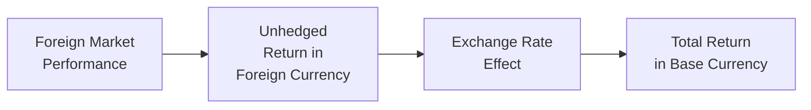

Understanding how currency movements affect a global portfolio’s risk and return can be fascinating—and, honestly, sometimes a bit nerve-racking. Picture this: You invest in an overseas equity market that yields fantastic returns in local terms, but when you convert those gains back into your home currency, you wind up with far less than you expected because your domestic currency appreciated. This scenario happens all the time. Knowing how and why it happens, and what to do about it, is essential for long-term success in international investing.

This section delves into the various ways that changes in currency exchange rates influence returns, diversifications, and hedging decisions for global portfolios. We’ll take a look at nominal vs. real exchange rates, examine correlations, see how emerging markets add complexity, and explore some practical approaches to managing currency risk without getting lost in the weeds.

## Impact on Unhedged Portfolio Returns

When you buy foreign assets without using any hedging strategies (that is, “unhedged”), changes in exchange rates can boost or reduce your returns. Mathematically, if you invest in a foreign security that produces a local return R(l), and the foreign currency itself changes by R(fx) versus your base currency, the total domestic return R(d) can be approximated by:


R_{d} = (1 + R_{l}) \times (1 + R_{\text{fx}}) - 1 


A small numeric example:  
• Suppose you invest in a Canadian equity that earns 10% (R(l) = 0.10) over the year.  
• Simultaneously, the Canadian dollar depreciates by 3% (R(fx) = -0.03) relative to your domestic currency.  

Your approximate return in domestic terms is:


(1 + 0.10) \times (1 - 0.03) - 1 
= 1.10 \times 0.97 - 1 
\approx 6.7\%.


So your originally impressive 10% local return lands closer to 6.7% when translated back into your base currency.

### Visualizing the Flow from Local to Base Currency

Below is a simple diagram illustrating how a foreign market return transforms into your final home-currency return:

## Nominal vs. Real Exchange Rates

It’s also handy to distinguish between nominal and real exchange rates:

• Nominal Exchange Rate: The straightforward, widely quoted exchange rate that tells you how many units of one currency can be exchanged for one unit of another. For example, 1 USD = 1.35 CAD.  
• Real Exchange Rate: Adjusts the nominal rate for inflation differentials between countries. It gives you a sense of how competitive one country’s goods and services are relative to another. Real exchange rates often matter when forecasting longer-term currency trends.  

Real exchange rates connect to the idea of Purchasing Power Parity (PPP). PPP suggests that exchange rates should adjust so that a basket of goods costs the same across countries. While PPP is a cornerstone in economic theory, real-world frictions (trade barriers, transaction costs, shifting interest rates) ensure that currencies can deviate from PPP for quite a while.

## How Currency Movements Can Alter Portfolio Risk

People often focus on returns, but currency movements can also affect risk—sometimes dramatically:

• Volatility Enhancement: If you hold multiple international positions in your portfolio, the ups and downs of currencies can add another layer of uncertainty (and potential return) on top of the local asset price movements.  
• Offsetting Effects: In other cases, currency fluctuations may offset local market volatility, especially if exchange rates are negatively correlated with the underlying asset returns. In that sense, the overall volatility of the portfolio could be lower than expected.  

For instance, if a foreign equity market tends to go up when its currency falls (perhaps due to stronger exports in the local economy), then from a domestic investor’s perspective, part of that exchange rate loss might be offset by gains in the stock price. The net result might be less overall volatility. On the other hand, if the correlation between currency fluctuations and foreign market returns is positive (they both rise or fall together), then unhedged currency exposures can amplify total volatility.

## Strong vs. Weak Domestic Currency

We’ve all watched the news at times where you see your home currency either “strengthening” or “weakening.” In practical terms:

• A stronger domestic currency will typically convert foreign currency profits into fewer units of home currency.  
• A weaker domestic currency does the opposite: it inflates gains on your foreign investments.  

Sounds simple enough. But the real question is whether your domestic currency will strengthen, weaken, or stay roughly the same during your international holding period. That’s the million-dollar question, and it’s very tricky to predict. Nevertheless, the potential for a big move in either direction underscores why many investors pay close attention to currency dynamics.

## Currency as a Distinct Return Source

Some managers view currency as a standalone investment opportunity. They might adopt strategies specifically designed to generate alpha from currency trades (e.g., carry trades or momentum strategies in FX). In a more traditional approach, currency exposure is seen as a secondary effect—maybe you’re simply holding international stocks or bonds, and the currency exposure is a natural byproduct of that. Both perspectives are valid, and which one you choose can depend on your organization’s capabilities, investment style, and risk tolerance.

## Performance Attribution

Performance attribution frameworks often decompose total returns on international assets into:

• Local Market Return: The return the asset generates in its home currency (not impacted by exchange rates).  
• Currency Return: The effect of changing exchange rates when you translate local returns back to your base currency.  

Attribution analysis helps you figure out if your returns mainly came from astute security selection (picking the right stocks or bonds in foreign markets) or from a fortuitous currency movement (your home currency weakened and boosted your returns). This breakdown can also guide hedging decisions, letting you focus on which portion of your return you want to be unpredictable and which parts you want to manage more tightly.

## Emerging Market Currencies

Now, let’s not forget that emerging market currencies often pack a bigger punch in a portfolio’s overall risk profile. They can be notoriously volatile and are more susceptible to political, macroeconomic, and liquidity risks. That said, they can also offer attractive returns at times (for instance, think about commodity booms that strengthen certain emerging market currencies). When you invest in emerging markets, pay especially close attention to the interplay of local returns, currency fluctuation, and the broader risk environment. Transaction costs for hedging can also be higher or more complex compared to developed market currencies, making the decision to hedge or partially hedge more nuanced.

## Weighing Costs and Benefits of Currency Hedging

Let me share a quick anecdote. A friend of mine once held a sizable position in European equities. He worried about the euro tumbling, so he entered into a forward contract to lock in the exchange rate. Well, guess what? The euro actually soared, and my friend missed out on that currency gain. He walked away with less total return than if he’d just remained unhedged. Moral of the story: Hedging your currency exposure can reduce downside risk, but it can also reduce potential upside from favorable movements.

Beyond opportunity costs, currency hedging adds explicit costs (e.g., forward contract bid-ask spreads, transaction fees, swaps). Over short horizons, or when the currency is expected to be relatively stable, these costs can eat away at returns. Over longer horizons, the decision can revolve around overarching policy goals: do you want a stable, predictable stream of returns (hedged) or are you comfortable with currency volatility if it might eventually boost returns?

## Best Practices

• Align Hedging Strategy with Investment Horizon: Longer-term investors might accept more short-term currency volatility, while short-term investors often prefer to hedge more aggressively.  
• Watch Correlations: Evaluate the correlation between the currency’s moves and the local asset’s returns. If correlation helps reduce portfolio volatility, you might take on some currency exposure deliberately.  
• Consider Trading Liquidity: Ensure that the FX market for the currency you want to hedge is liquid enough; for example, major currencies like the USD, EUR, and JPY are much cheaper to hedge than certain emerging market currencies.  
• Rebalance Your Hedge: Currency exposures can drift over time. Periodic rebalancing helps keep your hedge ratio aligned with your targets.

## Common Pitfalls and Challenges

• Overconfidence in Currency Forecasting: Let’s face it, currency movements are tricky to predict, even if you have top-notch research.  
• Ignoring Transaction Costs: Frequent adjustments to hedge ratios can rack up trading expenses fast.  
• Neglecting Real Exchange Rate Shifts: Even if nominal rates remain stable, large differences in inflation between countries can have a real impact on your long-run returns.  
• Underestimating Event Risk: Currencies can gap drastically on political changes, natural disasters, or global crises, complicating your hedging strategy.

## Key Terms (Glossary)

• Unhedged Return: The total return on a foreign investment, translated into the investor’s base currency, without any offsetting currency positions.  
• Currency Beta: The sensitivity of portfolio returns to changes in exchange rates. A higher currency beta means more pronounced effects from exchange rate fluctuations.  
• Local Market Return: The return an asset achieves in its local currency, independent of exchange rate movements.  
• Translation Risk: The possibility of changes in the value of foreign assets or liabilities due to currency volatility.  
• Nominal Exchange Rate: The quoted market exchange rate between two currencies, without adjusting for relative price levels.  
• Real Exchange Rate: The nominal exchange rate adjusted for relative inflation or price indices between the two countries, reflecting relative competitiveness.  
• Purchasing Power Parity (PPP): The theory suggesting exchange rates should converge so that identical goods cost the same across countries.  
• Exchange Rate Correlation: The statistical relationship between exchange rate movements and the returns of assets or indices in foreign markets.

## Exam Tips

• In scenario-based questions, remember to separate local returns from currency returns. The exam often tests your ability to calculate total returns just like we did with R(d) = (1 + R(l)) × (1 + R(fx)) – 1.  
• Don’t ignore correlation. Many exam problems require analyzing how currency can offset or exacerbate volatility in a global portfolio.  
• Hedge ratio questions: Know how to interpret and recalculate partial vs. full hedges. They might test your knowledge of forward contract sizes, notional amounts, and how to measure effectiveness.  
• Keep track of transaction costs. The exam might present cost details that significantly influence the net benefit of hedging.  

## References

• Solnik, B. and McLeavey, D. “International Investments.”  
• Madura, J. “International Financial Management.”  
• Dumas, B. and Ruiz, P. “Modeling Exchange Rate Volatility.” Journal of Finance.  
• BlackRock Investment Institute. “Currency Hedging: When, Why, and How.”  

--------------------------------------------------------------------------------

## Sharpen Your Knowledge of Currency Movements in Portfolios



### Which of the following best describes the term "unhedged return" on a foreign investment?

- [ ] The return that excludes local market fluctuations.  
- [ ] The local currency return adjusted for interest rate differentials.  
- [x] The total return on a foreign investment in base currency terms without currency risk mitigation.  
- [ ] The nominal exchange rate times the local return.  

> **Explanation:** An unhedged return includes both the local market return and the impact of currency conversion but does not include any hedging measures.

### Suppose you invested in an overseas fund that generated a 10% local return (R(l) = 0.10). If the foreign currency declined by 4% (R(fx) = -0.04) against your base currency, what’s your approximate total return in domestic terms?

- [ ] 10.00%  
- [ ] 6.00%  
- [x] 5.60%  
- [ ] 14.00%  

> **Explanation:** Using the formula R(d) = (1 + 0.10) × (1 - 0.04) - 1 = 1.10 × 0.96 - 1 ≈ 5.6%.

### Which statement about correlations between currency returns and local asset returns is most accurate?

- [x] A negative correlation can reduce overall portfolio volatility.  
- [ ] A positive correlation always reduces overall portfolio volatility.  
- [ ] Zero correlation guarantees increased volatility.  
- [ ] High correlation means currency movements are insignificant.  

> **Explanation:** If currency returns tend to move in the opposite direction of local market returns, they can offset each other, leading to lower total volatility.

### Which best characterizes “real exchange rate”?

- [ ] The interest rate differential between two currencies.  
- [x] Nominal exchange rate adjusted for inflation differentials.  
- [ ] Exchange rate used exclusively in forward markets.  
- [ ] The leftover exchange rate after currency hedging.  

> **Explanation:** The real exchange rate is the nominal rate adjusted for differing inflation levels (or price indices) across countries.

### When a domestic currency is strengthening, how does it generally impact unhedged foreign investment returns?

- [ ] It increases the foreign investment’s local return.  
- [ ] It reduces the local volatility.  
- [x] It translates foreign profits into fewer units of the home currency.  
- [ ] It eliminates liquidity issues when converting.  

> **Explanation:** A stronger domestic currency yields fewer units of the domestic currency per unit of foreign currency, effectively reducing the translated return for the unhedged investor.

### An investor who sees currency as "a distinct return source" is most likely to do what?

- [ ] Always fully hedge all foreign investments.  
- [x] Engage in active FX trading strategies to generate alpha.  
- [ ] Completely ignore exchange rate movements.  
- [ ] Convert all foreign holdings into the base currency daily.  

> **Explanation:** Viewing currency as a separate alpha-generating opportunity typically involves strategies like currency carry trades, momentum, or discretionary trading in FX markets.

### Why are emerging market currencies often considered riskier compared to major developed market currencies?

- [ ] They are usually pegged to the US dollar.  
- [ ] They almost never fluctuate.  
- [ ] They follow PPP precisely.  
- [x] They can exhibit higher volatility and are susceptible to political, macroeconomic, and liquidity risks.  

> **Explanation:** Emerging market currencies tend to see bigger swings due to less stable economic and political conditions, among other factors.

### What is one potential drawback of hedging currency risk for a longer-term investor?

- [x] Missing out on favorable currency movements that would have boosted returns.  
- [ ] Instantly eliminating local market return.  
- [ ] Achieving zero transaction costs on the hedges.  
- [ ] Replicating the exact payoff of a foreign currency.  

> **Explanation:** By hedging, you lock in an exchange rate and effectively remove upside potential if your base currency weakens against the foreign currency.

### Which of the following is a potential benefit of partial hedging (rather than fully hedging) currency exposure?

- [x] Allowing some upside currency potential while limiting downside risk.  
- [ ] Guaranteeing no transaction costs.  
- [ ] Eliminating all foreign exposure.  
- [ ] Ensuring the domestic currency cannot depreciate.  

> **Explanation:** Partial hedging can strike a balance: maintain some exposure to favorable currency fluctuations while also mitigating a portion of the downside.

### A currency's "purchasing power parity" value attempts to reflect:

- [x] The exchange rate at which identical goods in two countries would cost the same when measured in a common currency.  
- [ ] A currency’s forward contract price, minus forward points.  
- [ ] Interest rate differentials based on inflation.  
- [ ] The real or effective exchange rate.  

> **Explanation:** PPP focuses on balancing the prices of identical goods across different countries, implying an equilibrium exchange rate over time.


