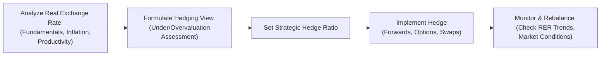

## Introduction and Overview

Real exchange rates (RERs) sometimes feel like the unsung heroes of currency management. We often hear players in the market quoting the nominal exchange rate (NER), concerned about whether the dollar is up or down against the euro on any given day. But in my opinion, ignoring real exchange rates is like driving a car while only looking in the side mirror—useful, perhaps, but you miss a whole lot of important detail. The real exchange rate tells you the relative competitiveness of one currency to another once you adjust for differences in inflation or price levels, and it can significantly affect long-term portfolio returns and hedging strategies.

When we talk about currency hedging, we usually think about short-term volatility or day-to-day market sentiment. Yet the real exchange rate is the measure that captures the fundamental purchasing power of a currency and how it evolves with inflation, productivity, and other real economic variables. Sometimes, the real exchange rate can be misaligned—overvalued or undervalued—relative to some fair-value benchmark. And these misalignments can last a long time, so it’s crucial not to underestimate them.

Below, we’ll explore why real exchange rates can shape your currency-hedging decisions, how they’re measured and forecasted, and what best practices you can adopt to integrate real exchange rate analysis into your overall investment strategy. We’ll also do a little time traveling through the foreign exchange (FX) world—looking at how currency misalignments can persist, why “sticky wages” matter, and how cyclical factors can set the stage for shifting real exchange rate regimes.

## Real Exchange Rate Versus Nominal Exchange Rate

Understanding the difference between the nominal exchange rate (NER) and the real exchange rate (RER) is a huge step toward better hedging:

• Nominal Exchange Rate (NER). This is the “headline” rate—like seeing EUR/USD at 1.10. It’s the actual quoted rate in the currency markets on any given day.  
• Real Exchange Rate (RER). This is, loosely speaking, the nominal rate adjusted for inflation differentials. Formally, you often see something like:


\text{RER} = \text{NER} \times \frac{P_{d}}{P_{f}}


Here, \\(P_d\\) is the domestic price index and \\(P_f\\) is the foreign price index. If inflation in the domestic country is higher than in the foreign country, your domestic currency’s real exchange rate typically appreciates faster than the nominal rate alone would suggest, because goods produced domestically become more expensive relative to foreign goods, all else equal.

Over the long haul, the real exchange rate matters for competitiveness: an appreciated real exchange rate might mean your exports are more expensive, making it tougher for domestic producers to compete internationally. Conversely, a depreciated real exchange rate might boost export competitiveness (although your import costs could rise).

## Fundamentals That Influence Real Exchange Rates

One of the key points you’ll often hear is that real exchange rates, on average, tend to revert to certain “fair” values driven by fundamentals. But those fundamentals themselves can shift. Some of the big ones:

• Productivity Differentials. If your country’s productivity is growing faster than that of your trading partners, it can lead to real appreciation of your currency. Why? Because higher productivity can drive better profit margins, higher wages, and higher demand for your currency.  
• Labor Costs and Wage Stickiness. If domestic wage levels rise considerably faster than productivity, your exports become relatively more expensive. Sticky wages can prolong misalignments and keep exchange rates “unfair” for a while.  
• Terms of Trade. Commodity-exporting countries, for instance, can experience swings in their real exchange rates when global commodity prices change significantly.  
• Macro Policies. Central bank interventions, trade barriers, or capital controls can all contribute to longer-lasting divergences of the real exchange rate from what you might call “equilibrium.”  
• Inflation Differences. A key determinant in the real exchange rate is the relative inflation rate. All else being equal, if you’re consistently running higher inflation than your neighbor, your currency’s real exchange rate will typically appreciate over time.

## Why Real Exchange Rates Matter for Hedging Decisions

At this point, you might be thinking, “So, what does all of this have to do with deciding whether to hedge my currency exposures?” Plenty, actually!

• Long-Term Fair Value. If a currency is significantly undervalued in real terms, some investors might choose not to hedge their currency exposure—or even to add an unhedged position—on the assumption that reversion toward fair value will benefit them. The same logic applies in reverse: an overvalued real exchange rate might prompt you to increase your hedge.  
• Inflation-Sensitive Assets. If your portfolio holds, say, real assets such as real estate or commodity-linked securities, changes in the real exchange rate can affect your overall return in a more material way than pure nominal moves.  
• Exposure to Competitive Adjustments. If you’re investing in multinational firms that depend heavily on exports, real exchange rate fluctuations matter for their global competitiveness and profitability. By the way, I remember once meeting a client who kept wondering why her large exposure to a European industrial conglomerate seemed to be underperforming compared to domestic peers. It turned out that the euro’s real exchange rate had risen sharply against major trading partners, making that multinational’s exports more expensive. This definitely impacted how we structured her hedge.  
• Multi-Period Rebalancing. Over a longer horizon, if you believe real exchange rates will eventually revert to equilibrium, you might be more tactical or dynamic in how you hedge, trying to capture the partial correction in real values as you rebalance.

## Measuring and Forecasting Real Exchange Rates

Measuring real exchange rates might sound straightforward, right? Just take the nominal rate and adjust for the price index. However, the real world can be a bit messy:

• Price Indices. You need consistent and reliable price data from both domestic and foreign economies. Consumer Price Index (CPI) is the most common approach, but Producer Price Index (PPI) or GDP deflator can also be used.  
• Data Lags. Official inflation data can be delayed by weeks or months, and you might need to revise your calculations retroactively as new information emerges.  
• Multiple Trading Partners. Instead of measuring real exchange rates against just one currency, investors often use a trade-weighted real exchange rate index that accounts for multiple currencies, weighted by each partner’s share in trade.  
• Forecasting Challenges. Predicting future real exchange rates is notoriously difficult. You can look at macro models, purchasing power parity (PPP) signals, cyclical indicators, or flow-of-funds data, but results might still be uncertain in the short term.

It’s possible, and even likely, that you’ll see a currency remain overvalued or undervalued for a surprisingly long time. It’s all well and good to say, “I think sterling is 10% overvalued in real terms,” but if the factors driving that misalignment remain entrenched—like persistent monetary stimulus or strong global demand for your currency’s risk exposures—then it could linger.

## Incorporating Real Exchange Rate Analysis Into Hedging Strategy

So here’s where the rubber meets the road: you have an asset portfolio, and you’re deciding how to hedge currency risk. Let’s connect that to the realities of real exchange rates:

• Strategic Hedge Ratio. If you believe, based on fundamental macro analysis, that a currency is undervalued by 20% in real terms, you might implement a lower hedge ratio to benefit from potential corrective appreciation. On the flip side, if the currency is 20% overvalued, you might run a significantly higher hedge ratio.  
• Operational vs. Financial Hedges. For multinational corporations, operational hedges (like setting up production in foreign countries) might reduce exposure to real exchange rate movements. But for a portfolio manager relying on derivatives, you must translate your real exchange rate outlook into forward or option positions.  
• Integrating Cyclical Indicators. Sometimes a currency’s real exchange rate can be buoyed or depressed by short-term cyclical factors—like a global demand surge for a commodity your country exports. Combining cyclical indicators (e.g., interest rate trends, business cycle phases) with your real exchange rate analysis can produce more accurate hedging decisions.  
• Timing Is Key. It’s possible that if you jump in to fade a real exchange rate misalignment too early, you could be underwater for quite a while. Manning that “misalignment trade” requires both conviction and staying power.

## Practical Example: Emerging Market Currency Misalignment

Picture a scenario: You’re managing a global equity mandate and have exposure to an emerging market currency (let’s call it the XYZ). You suspect the XYZ is undervalued by roughly 15% based on your real exchange rate analysis. That means you expect the near-term real appreciation to come from either higher nominal FX levels (i.e., strengthening XYZ) or from relative inflation differences. Let’s say wages in the emerging market are rising more slowly than productivity, so the country is becoming more competitive globally.

• Hedging Decision. You decide to partially hedge your XYZ exposure rather than fully hedge, hoping to benefit from an eventual currency rebound.  
• Risk Management. However, you also realize that short-term market sentiment is shaky—maybe the region’s facing uncertainty due to an upcoming election—so you put in place collar strategies on the currency if it’s available in the derivatives market. You pay a little premium, but you keep upside exposure while limiting downside.  
• Monitoring. Real exchange rates don’t revert overnight. They might do so over 12 to 24 months. In the meantime, you watch both inflation trends in the emerging market and global commodity prices. If you see inflation start to spike in the emerging market, your view might change.

## Diagram: Incorporating Real Exchange Rate in a Hedge Strategy

Below is a basic diagram illustrating how real exchange rate considerations fit into a currency risk management workflow:

In practice, you’ll want to incorporate your research, your forward-looking models, and your tolerance for misalignment risk at each step.

## Sticky Wages and Real Exchange Rate Misalignments

A big reason real exchange rate misalignments can persist is the concept of sticky wages. If nominal wage levels are slow to adjust, a country might remain uncompetitive or overly competitive for an extended period. This scenario can catch short-term speculators off-guard. Perhaps you bet on real exchange rate reversion, but the mismatch in wages, or the government’s subsidy policies, or a pegged currency regime keeps that gap wide open for longer than you (or your boss!) expected.

Policy interventions also matter. Countries may adopt capital controls to prevent large flows of funds that would otherwise correct the real exchange rate misalignment. They might strategically intervene in FX markets to stabilize the currency. All these factors can create either opportunities or risks.

## Tying It Back to the CFA Curriculum

You’ve previously seen in Section 3.3 how fundamental and technical analysis can drive active currency strategies, and in Section 3.4 we explored how forward contracts and FX swaps help manage hedge ratios dynamically. Combining those tactics with real exchange rate analysis here unlocks a deeper strategic viewpoint. Section 3.7 introduced some of the challenges of emerging market currency exposures, many of which revolve around inflation risk and data lags—key components of real exchange rate analysis.

Note also that these considerations have direct synergy with the concept of basis risk (discussed in Chapter 2.7 on managing basis risk with futures), where the difference between real returns in your target currency and actual realized returns can hamper your perfect hedge. A misalignment in the real exchange rate can show up as basis risk if your instruments aren’t perfectly matched to the underlying real currency dynamics.

## Best Practices and Common Pitfalls

Below are some of the “dos and don’ts” in applying real exchange rate insights to your currency hedging program:

Best Practices:  
• Use a reliable and updated measure of inflation or price indices to capture true purchasing power differentials.  
• Combine real exchange rate analysis with cyclical and flow-based indicators for a more comprehensive view.  
• Consider partial hedging strategies if you see a currency as significantly misaligned but are concerned about short-term volatility or persistent sticky wages.  
• Pay attention to official statements and policies. Central banks often hint about concerns over exchange rate levels, which can guide your stance.

Common Pitfalls:  
• Overconfidence in short-term mean reversion. Real exchange rates can remain in disequilibrium for longer than you expect.  
• Using the wrong price index or incomplete data sets that don’t capture sector-specific inflation trends.  
• Underestimating policy or political risks that might keep a currency artificially high or low.  
• Failing to adjust hedge ratios dynamically. You might need to tweak your strategy as economic realities shift.

## Real Exchange Rate Analysis and Corporate Competitiveness

Multinational corporations (MNCs) are heavily affected by real exchange rate movements, not just nominal swings. An MNC might choose to hedge its currency risk from imported inputs or the revenues it earns abroad to stabilize operating margins. In many cases, the internal “operational hedge” can reduce the need for pure financial derivatives. Still, monitoring real exchange rates is critical in strategic planning—for instance, deciding where to locate new manufacturing facilities or distribution centers.

For a portfolio manager with significant holdings in MNCs, you want to evaluate how changes in the real exchange rate might influence those companies’ bottom lines. If a firm’s home currency is wildly overvalued in real terms, it could hurt export competitiveness. On the other hand, if that firm sources most of its raw materials abroad, a high real exchange rate could reduce input costs. This interplay is subtle but can be captured by robust macroeconomic analysis and integrated into your hedging approach.

## Combining Real Exchange Rate Analysis with Cyclical Indicators

It’s often beneficial to supplement your RER analysis with cyclical indicators:

• Business Cycle Position. If you’re near the peak of the cycle, interest rates might prime your currency for short-term strength, overshadowing fundamental real exchange rate considerations.  
• Commodity Price Cycles. Countries tied to key commodities may see their currency follow the commodity price cycle more closely. It’s useful to overlay real exchange rate metrics with global demand forecasts in order to fine-tune your hedge.  
• Monetary Policy Outlook. Central bank interest rate moves can cause short-term capital inflows or outflows, pushing the nominal exchange rate away from (or closer to) its real equilibrium.

## A Quick Personal Anecdote

A while back, I was reviewing an equity portfolio heavily tilted toward Asia-Pacific. I noticed the client had put in place a 100% hedge on a particular currency that quantitative models suggested was undervalued by about 10% in real terms. The client’s rationale at the time was to avoid any currency risk altogether. But in my humble view, that approach left a potential 10% real appreciation on the table—plus or minus, of course, because we never know for sure! After some discussion, the client agreed to reduce the hedge ratio to 50%. Over the following year, the currency indeed moved closer to its fair value, and that partial unhedged portion contributed extra returns. This experience taught me that sometimes, ignoring a fundamental real exchange rate view can mean missing out on a significant piece of alpha.

## Conclusion and Exam Tips

Real exchange rates are fundamental for anyone who’s serious about currency hedging in a multi-asset or global investing context. It’s not just about day-to-day fluctuations in nominal FX quotes. It’s about understanding how inflation, productivity, labor costs, and policies shape the deeper “equilibrium” value of a currency—and deciding whether you think the current market rate is under or overshooting that equilibrium.

On the CFA® Level III exam, questions around real exchange rates might involve scenario analysis—e.g., you’re given data about inflation rates, productivity growth, or trade balances, and asked whether the nominal exchange rate is likely to converge to a certain level. Or you might see an item set describing an investment manager’s assumptions about real exchange rate misalignments and how those assumptions translate into a particular hedge ratio. Be ready to demonstrate both the conceptual understanding (knowing the difference between nominal and real rates) and practical application (modifying hedge ratios if you believe in reversion to fair value).

Key tips for exam success:

• Link real exchange rate analysis to fundamental macro concepts you’ve studied (PPP, interest rate parity, productivity growth).  
• Understand the difference between short-term drivers (interest rate changes, capital flows) and the slower-moving real variables (inflation, wage stickiness, trade policies).  
• Practice scenario-based questions that incorporate partial hedging, especially in the presence of real exchange rate misalignments.  
• Keep an eye on data reliability. The question might highlight how official inflation data from an emerging market can be incomplete, and that’s a big red flag for real exchange rate accuracy.

Finally—maybe surprisingly—keep an open mind. Sometimes the best hedge is informed by a healthy dose of fundamental orientation to real exchange rates, while also recognizing that markets can stay misaligned longer than you think.  

References and Additional Reading:  
• Obstfeld, M. and Rogoff, K. “Foundations of International Macroeconomics.”  
• Balassa, B. “The Purchasing-Power Parity Doctrine: A Reappraisal.” Journal of Political Economy.  
• Rogoff, K. “The Purchasing Power Parity Puzzle.” Journal of Economic Literature.  
• BIS Working Papers on real exchange rate dynamics and global competitiveness.  

## Test Your Knowledge: Real Exchange Rate Hedging Strategies



### Which definition best describes the real exchange rate (RER)?

- [ ] The raw or quoted exchange rate between two currencies at any point in time.  
- [x] The nominal exchange rate adjusted for differences in inflation between two economies.  
- [ ] The exchange rate used exclusively in emerging markets.  
- [ ] The official rate set by a government to control capital flows.  

> **Explanation:** The real exchange rate adjusts the nominal rate for inflation differentials, providing a more accurate gauge of a currency’s purchasing power.

### What is a potential advantage of under-hedging a currency that appears undervalued in real terms?

- [x] It allows the investor to potentially gain from an eventual appreciation toward fair value.  
- [ ] It eliminates all currency risk from the portfolio.  
- [ ] It prevents the currency from becoming further undervalued.  
- [ ] It guarantees outperformance relative to a fully hedged strategy.  

> **Explanation:** If a currency is undervalued in real terms, partial or lower hedging may capture any upward correction, though there is no guarantee it will appreciate as anticipated.

### Which factor is generally NOT considered a major driver of long-term real exchange rate movements?

- [ ] Productivity differentials.  
- [x] Short-term investor sentiment.  
- [ ] Differences in labor costs.  
- [ ] Terms of trade changes.  

> **Explanation:** Short-term sentiment can move the nominal rate, but real exchange rate levels over longer horizons typically hinge on fundamentals such as productivity, labor costs, and trade flows.

### If you suspect a currency is overvalued by 15% in real terms, what might a prudent hedging strategy involve?

- [ ] Fully eliminating the hedge so as to reap the currency gains.  
- [ ] Completely avoiding any investment in that currency.  
- [x] Increasing the hedge ratio to protect against possible depreciation.  
- [ ] Establishing a currency carry trade position.  

> **Explanation:** If the currency is overvalued, a higher hedge ratio can reduce the risk of capital losses should the currency revert toward its lower fair value.

### Which of the following can extend periods of real exchange rate misalignment?

- [x] Sticky wages and policy interventions.  
- [ ] Perfect wage flexibility and market transparency.  
- [x] Limited capital flows and trade barriers.  
- [ ] Low productivity growth but instantaneous wage reductions.  

> **Explanation:** Sticky wages, policy interventions, trade barriers, and limited capital flows can all delay adjustments in the real exchange rate toward long-run equilibrium.

### When a multinational corporation chooses to build production facilities in foreign countries to reduce currency risk, this method is often referred to as:

- [x] An operational hedge.  
- [ ] A speculative hedge.  
- [ ] A partial forward hedge.  
- [ ] A real appreciation strategy.  

> **Explanation:** Incorporating production or sourcing in foreign locations is an operational hedge, reducing the firm’s exposure to adverse real exchange rate movements.

### Hedging decisions that rely on real exchange rates are most closely associated with which type of analysis?

- [ ] Pure technical chart analysis.  
- [x] Fundamental macroeconomic analysis.  
- [x] Productivity and labor cost modeling.  
- [ ] Intraday high-frequency trading.  

> **Explanation:** Real exchange rate considerations stem from fundamental macroeconomic analysis, including productivity and labor cost modeling. Short-term, intraday trading strategies focus mainly on nominal changes and technical factors.

### Assuming you are implementing a hedging strategy based on real exchange rate misalignment, which data challenge is a common pitfall?

- [x] Inconsistent or delayed inflation data that skews real exchange rate calculations.  
- [ ] Immediate and perfect data transparency.  
- [ ] Zero volatility in currency markets.  
- [ ] Unlimited forward contracts without any cost considerations.  

> **Explanation:** Inflation data can be delayed or unreliable, especially in certain markets, which undermines the accuracy of real exchange rate measurement and complicates hedging decisions.

### Integrating cyclical indicators with real exchange rate analysis is helpful because:

- [x] Cyclical factors like interest rates and business cycles can amplify or diminish real exchange rate misalignment in the short term.  
- [ ] The real exchange rate is entirely determined by cyclical variables alone.  
- [ ] It guarantees that all misalignments will be eliminated.  
- [ ] It eliminates the need for fundamental analysis.  

> **Explanation:** Including cyclical indicators, such as interest rate trends or business cycle phases, can refine your hedging approach when real exchange rates are temporarily influenced by short-term factors.

### Real exchange rate analysis is most relevant when:

- [x] A significant portion of the portfolio is exposed to inflation-sensitive assets or operational currency risks.  
- [ ] Only short-term speculations are being made.  
- [ ] Investors always fully hedge every currency exposure.  
- [ ] There is zero difference between domestic and foreign inflation.  

> **Explanation:** Real exchange rate analysis matters most for investors facing inflation or real-economy-related currency exposures over the long term—such as those holding real assets or multinational corporate stocks where competitiveness is a key factor.


