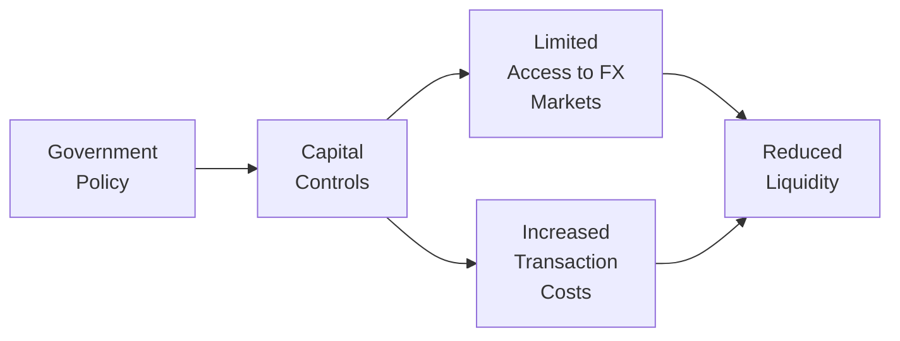

Introduction  
Currency management is a fiercely complex realm, shaped not only by market forces but also by the influence of government policies, Central Bank interventions, capital controls, and general regulatory frameworks. It can feel daunting—especially when you’re head-deep in advanced derivatives or foreign exchange (FX) exposures—because these policies sometimes shift without much notice. I remember chatting with a colleague at a large asset management firm about the overnight imposition of certain currency controls in an emerging market. Their careful hedging program was suddenly in limbo, and it took weeks to rework strategies to comply with the new rules. There was a lot of frustration but also a few silver linings that emerged from learning how to adapt to regulatory hurdles.

Below, we delve into the main policy and regulatory constraints commonly encountered in currency management. We’ll look at how capital controls can crimp your hedging style, how disclosure requirements expand your operational workload, and how taxes (whenever you mention taxes, I often hear a sigh) can shape the net benefit of certain derivatives strategies. Let’s break down the key elements, one chunk at a time.

Government Policies and Capital Controls  
Capital controls often sit at the heart of currency management constraints. Capital controls are government-imposed restrictions that regulate currency exchanges or cross-border capital flows. In many emerging markets, the government enforces these controls to help stabilize exchange rates or protect the domestic economy from large speculative inflows and outflows. For currency managers, this can mean that certain FX transactions (especially large forward contracts or currency swaps) must be executed through onshore channels, with limits on notional size, or with approvals that could introduce delays.

Why does this matter for your hedging strategies? Well, if you’ve got a global, well-diversified portfolio, you might rely on sophisticated or large-scale currency derivatives—such as currency forwards, options, or cross-currency swaps—to hedge your positions. But if the local government requires you to use only onshore forward markets, you might find:

• Reduced liquidity.  
• Higher bid-offer spreads compared to offshore markets.  
• Strict settlement procedures that differ from standard international protocols.

Even something as simple as repatriating your proceeds from a forward contract can be subject to a labyrinth of bureaucratic steps. That can drive up costs and hamper the effectiveness of your hedge. Things get really interesting (read: complicated) when certain countries let you operate in an offshore version of their currency markets. Offshore markets typically face fewer direct controls, but they might be more volatile and carry considerable counterparty risk.

Here’s a quick visual that highlights how government policy can trickle down to affect your acts of hedging:

Central Bank Interventions and Impact on Hedging  
Central bank intervention can be a real curveball for currency managers. Picture this: you’ve set up a carefully calibrated hedge in anticipation of gradual exchange rate movements. Then—bam—the central bank steps in, buying or selling massive amounts of currency. This sudden jolt can impact your realized gains or losses, making your forecasting models inaccurate or your hedging strategies less precise. Large-scale currency purchases or sales by a central authority might be triggered by factors like inflation control, geopolitical tensions, or attempts to reduce currency volatility.

If the central bank sets a “trading band” or a peg, your hedging instruments might run into regulatory limits on how far out-of-the-money they can be, or you could face intense volatility just outside the band when the market tests the peg. While interventions can create opportune moments for speculators, they also create risk for consistent, long-term hedgers who just want stable performance. In many jurisdictions, central banks also set rules about which types of derivative instruments are permissible for certain investor classes, further limiting your hedging toolkit.

Regulatory Limits for Institutional Investors  
Different investor types face unique regulatory constraints. Pension funds, for instance, typically have strict mandates tied to preserving capital for retirees. Insurance companies must ensure liquidity and solvency to meet near-term and long-term claims. Accordingly, regulators may impose maximum permissible FX exposure or leverage levels, collectively known as regulatory limits. You might see this in the form of:

• Caps on the percentage of the portfolio that can be allocated to FX derivatives.  
• Requirements to use only exchange-traded derivatives for transparency and clearing assurances.  
• Mandates to maintain sufficient collateral or risk buffers to handle adverse currency movements.

These constraints exist to reduce systemic risk and protect end beneficiaries—but from a currency manager’s perspective, they reduce flexibility. You might be forced to use specific instruments (like standardized futures or exchange-traded options) when an over-the-counter (OTC) forward or swap would have been a better fit.

Tax Treatment of Currency Derivatives  
Sometimes, the tax implications can overshadow the actual movement in exchange rates. Different jurisdictions treat currency derivatives differently, often distinguishing between positions used for legitimate hedging versus purely speculative trades. Gains or losses might be categorized as ordinary income, capital gains, or even offsettable business losses. And the rules get even more intricate when transactions cross multiple tax jurisdictions.

It’s possible that a region will offer favorable tax treatment if you’re specifically hedging an existing exposure (for instance, a cross-border bond investment) but levy punitive rates on purely speculative FX trades. So, if you’re an international investor, it’s prudent to keep detailed documentation of hedging intent to prove that these derivatives hedge actual business exposures. Failing to do so can trigger unexpected tax bills that wipe out any profit from your carefully executed hedges.

I know an investor who once discovered that they’d inadvertently triggered withholding taxes in a particular market simply by rolling a forward contract. It was meant to be a straightforward hedge roll, but local regulators viewed it differently. The moral of the story? Learn local tax codes or align with a tax professional who genuinely understands cross-border derivatives.

Social and Political Objectives of Large Market Players  
Don’t underestimate the role of large global players—like sovereign wealth funds (SWFs). These institutions aren’t just about capturing optimal risk-return profiles; they often have strategic, social, or political responsibilities. So, they may intervene or influence currency policy for objectives that go beyond typical investor logic: supporting local employment, stabilizing a crisis-stricken neighbor’s currency, or aligning to trade agreements.  
When you’re trying to manage currency risk in an environment where a sovereign wealth fund might be using the currency to support broader policy objectives, you could find that the typical guidelines for “fundamentals-based” or “carry-based” strategies wind up looking a bit out of sync with reality. That’s why it’s always wise to keep your ear to the ground in such jurisdictions. The big players can move quickly, and your best bet is to remain flexible in your approach.

Disclosure Requirements and Operational Overheads  
Currency-related disclosure requirements can create a compliance headache. Many regulators or internal boards insist on detailed reporting of hedge positions, notional amounts outstanding, counterparties, and even scenario analyses that illustrate potential exposures under stress. This can be especially true if you manage a large, multi-jurisdictional portfolio that uses complex derivatives strategies, like exotic options or cross-currency basis swaps.

The operational overhead of compliance (staff for reporting, software systems to track positions, risk management committees to review borderline compliance) might seem high, but it’s typically cheaper than the penalties for failing to disclose. Some managers develop integrated fin-tech solutions that feed front-office trades seamlessly into a compliance database. Others rely on service providers. Either way, the complexity grows with each added regulatory layer.

Onshore vs. Offshore Markets  
We often talk about local (onshore) and offshore FX markets. Onshore markets operate within a currency’s home country under domestic regulations, while offshore markets often have less regulation—or at least different regulation. That can mean fewer capital controls, more liquidity, or an entirely different investor profile. Offshore markets, such as the Non-Deliverable Forward (NDF) markets that exist for certain restricted currencies, might be easier to access if your local counterparties are limited. But they entail additional credit and settlement risk if things go south (for instance, a sudden political or economic crisis).

Selecting Hedging Instruments Under Policy Constraints  
When you factor in all these constraints—capital controls, regulatory limits, central bank rules, and tax treatments—it becomes crucial to select hedging instruments and counterparties that align with your permissible trading venues and your operational capacity. For example:

• If you face tight local regulations, an exchange-traded futures contract might be simpler than an OTC swap.  
• If your notional is very large and onshore liquidity is shallow, you may be forced to split your hedge into multiple smaller chunks or use a partial hedge.  
• If your tax jurisdiction disincentivizes frequent forward rolls, you might prefer a longer-dated forward or an option-based strategy to limit the frequency of realized gains or losses.  

It’s always about balancing your actual risk management goals with the constraints of the local environment. Believe me, no one likes being told they can’t implement the “perfect” hedge. But you do what you can under the circumstances.  

Common Pitfalls and Best Practices  
• Complacency with capital controls: Don’t ignore the possibility of sudden regulatory changes in emerging markets. Always maintain an agile approach and keep talking to local market participants.  
• Overlooking tax implications: Even if a strategy looks good from a purely economic standpoint, it can be upended by unexpected tax brackets, withholding taxes, or double-taxation rules in cross-border contexts.  
• Undervaluing compliance overhead: Detailed disclosure might require specialized staff or software. Budgeting for these doesn’t exactly feel glamorous, but it might save you from painful compliance slip-ups.  
• Failing to read the fine print on onshore/offshore issues: Watch for settlement risks and margin requirements. The differences between domestic clearing systems and major international clearinghouses are often more than meets the eye.

Exam Tips  
• When you see a currency scenario with capital controls, focus on identifying feasible hedging strategies (like NDFs for restricted currencies) or partial hedges that comply with local limits.  
• For central bank intervention questions, highlight the possibility of currency-pegged regimes and how that might alter forward points or widen spreads.  
• For exam tasks involving institutional hedging constraints, be prepared to show how you’d adapt a standard hedging approach to respect exposure caps or derivative usage restrictions.  
• Keep tax treatment in mind. The exam could ask you to compare after-tax returns of hedging instruments or identify how a transaction might be labeled as “speculative vs. hedged” for tax purposes.  

References and Further Reading  
• IMF Annual Report on Exchange Arrangements and Exchange Restrictions.  
• BIS “Foreign Exchange and OTC Derivatives Market Surveys.”  
• Regulation guides from the European Securities and Markets Authority (ESMA) and the U.S. Commodity Futures Trading Commission (CFTC).  
• Scholarly articles on the impacts of capital controls and regulation on currency trading efficiency.  

## Test Your Knowledge: Policy and Regulatory Constraints in Currency Management Quiz



### A central bank intervenes heavily to maintain a fixed exchange rate. Which of the following best describes a potential impact on a currency hedging strategy?

- [ ] The hedge becomes easier to execute due to narrower spreads.
- [x] The hedge may become more expensive if the central bank’s targeted rate diverges from market equilibrium.
- [ ] FX instruments face lower margin requirements.
- [ ] Regulatory risk is minimized due to the high liquidity.

> **Explanation:** Central bank intervention can push local currency rates away from what the market might consider fair value, often increasing hedging costs or implying artificially narrow trading windows.  

### Which of the following is a key characteristic of capital controls in emerging markets?

- [ ] They always ensure that onshore forwards have greater liquidity than offshore.
- [ ] They reduce the reporting burden for multinational corporations.
- [x] They can limit the flow of capital, making certain derivatives more expensive or unavailable.
- [ ] They eliminate exchange rate volatility entirely.

> **Explanation:** Capital controls are designed to restrict cross-border flows, which can reduce the availability of certain FX hedging tools or increase costs for international investors.  

### An insurance company subject to regulatory limits on FX holdings wants to hedge a foreign bond. Which approach is most likely to be compliant with strict regulatory oversight?

- [x] Using standardized exchange-traded futures for partial hedging.
- [ ] Using a highly leveraged, long-dated OTC forward contract.
- [ ] Engaging in speculative currency positions to offset bond exposure.
- [ ] Purchasing unregulated cryptocurrencies in the local market.

> **Explanation:** Exchange-traded futures often meet regulatory transparency and margin requirements, making them safer for entities like insurance companies operating under strict oversight.  

### How might disclosure requirements influence an investor’s currency hedging strategy?

- [ ] They generally eliminate the need for swaps and derivatives.
- [ ] They reduce operational costs because fewer internal approvals are required.
- [x] They raise operational overhead, possibly leading an investor to choose simpler, standardized instruments.
- [ ] They enable immediate netting of all FX exposures without accounting considerations.

> **Explanation:** Detailed reporting of hedge positions necessitates robust systems and processes, which can increase administrative costs and encourage simpler, more transparent hedging strategies.  

### In a jurisdiction where hedges are taxed differently than speculative trades, what is a common requirement to qualify trades for hedging status?

- [ ] Full capital controls at the central bank level.
- [x] Documenting the specific underlying investment exposure being hedged.
- [ ] Using only exchange-traded contracts.
- [ ] Execution of all transactions via daily rolling forwards.

> **Explanation:** Most tax authorities require proof of a direct hedging relationship. Documentation helps confirm that the derivatives address a legitimate business or investment exposure rather than a speculative position.  

### Which of the following is a likely outcome of central bank intervention on short-term currency volatility?

- [ ] It always reduces short-term volatility to zero.
- [ ] It bypasses capital controls entirely.
- [x] It can amplify or reduce volatility depending on the scale and timing of intervention.
- [ ] It guarantees a profitable result for hedgers.

> **Explanation:** Central bank intervention is a double-edged sword—sometimes it smooths market fluctuations; other times, it introduces uncertainty if market participants question the sustainability of the intervention.  

### In an environment where offshore markets operate with fewer regulations than onshore markets, an investor might face:

- [x] Higher counterparty risks but potentially greater liquidity or easier access.
- [ ] Uniform tax treatments for all derivatives.
- [x] Potentially lower capital controls on certain instruments.
- [ ] Automatic hedging profit if executed offshore.

> **Explanation:** Offshore FX markets often have fewer barriers to entry, providing more liquidity or specialized derivatives but also presenting higher counterparty risks and regulatory differences—including potential overlaps or ambiguities.  

### A pension fund invests globally and faces strict regulations prohibiting more than 20% of assets in FX derivatives. What’s a practical hedging adaptation?

- [x] Implement a partial hedge on a portion of currency exposures to stay within the limit.
- [ ] Completely remove cross-border investments to avoid currency risk.
- [ ] Leverage derivatives beyond 100% of the portfolio to maximize returns.
- [ ] Lobby for immediate removal of all regulatory restrictions.

> **Explanation:** Partial hedging is often the pragmatic solution when full hedging is impossible due to regulatory caps on derivative usage.  

### A local government imposes a new set of exchange control regulations. What immediate effect might an international portfolio manager experience?

- [x] Restrictions on repatriation of investment returns, complicating hedging rollovers.
- [ ] A global standardization of margin requirements.
- [ ] Increased free availability of exotic currency derivatives.
- [ ] Guaranteed improvement in hedge effectiveness.

> **Explanation:** Imposing new exchange controls can severely hamper the free movement of capital, limiting an international manager’s ability to roll forwards or repatriate returns easily.  

### Investors often face different tax treatments for forwards vs. options, with variable rates for short-term gains. True or False?

- [x] True
- [ ] False

> **Explanation:** Different types of derivatives can fall under distinct tax categories, so a forward contract may be taxed differently (for instance, as ordinary income) compared to an option (potentially capital gains), and short-term gains can be subject to specific tax rates.  


