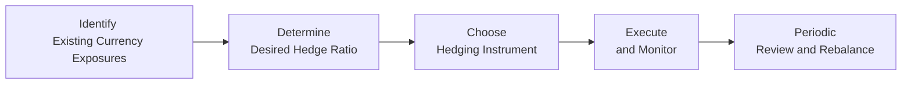

## Introduction and Overview

Strategic currency management isn’t just a fancy phrase—though it does sound impressive at cocktail parties. It’s really about making deliberate, long-term decisions regarding your foreign currency exposures. You know, the ones that can sneak up on us when we invest outside our home base. Some folks think of currency risk as a small footnote in portfolio management, but in reality, it can cause serious fluctuations in your returns, while also presenting interesting opportunities if you know how to handle it.

Imagine you’re the CFO of a multinational sports equipment company (where I once consulted), busily dealing with multiple overseas sales in euros, yen, and pounds. Taking a laissez-faire approach to currency risk might create big swings in your bottom line—definitely not what shareholders or your board wants to see. This is where establishing a clear strategic currency policy helps reduce unwelcome surprises, align with the firm’s liabilities, and maybe even exploit currency market mispricing if you’re feeling bold.

In this section, we’ll break down the key decisions involved in shaping a strategic currency management policy. We’ll explore factors that drive these decisions—from your basic tolerance for risk to your liquidity constraints. We’ll also look at different hedge ratios, highlight the role of market conditions, and examine approaches such as passive overlays, partial hedges, and fully hedged strategies. By the end, you should have a good sense of how to create (and periodically review) a robust, long-term blueprint for handling currency exposures.

## The Rationale Behind Strategic Currency Management

Before diving into the mechanics, let’s be crystal clear about the “why” behind strategic currency management. The first question many folks ask is, “Why not just hedge everything and call it a day?” That’s definitely an option—what we call a fully hedged strategy—but it might not always be optimal. Here are a few reasons:

• Reducing Portfolio Volatility: Exchange rate swings can significantly impact returns. A properly designed strategic hedge helps dampen that volatility, making future cash flows or valuations more predictable.  
• Protecting Downside Risk: If you’re especially wary of a certain currency’s descent, implementing a hedge can limit potentially large losses.  
• Exploiting Opportunities: Some investors view currency fluctuations as a source of alpha. By selectively hedging (or not), they may capture gains when they foresee meaningful moves in certain currency pairs.  
• Matching Liabilities: Pension funds and insurance companies often hold liabilities denominated in various currencies. Hedging can ensure asset values move in sync with foreign-currency liabilities.  
• Aligning with Mandates or Philosophies: Some institutional mandates favor “staying local,” while others encourage limited exposure abroad. A strategic currency policy formalizes those preferences.

## Core Factors Influencing Strategy

When you set out to create a strategic currency policy, consider the following factors:

• Investor Base Currency: Strategic decisions differ if your home currency is stable (say, the USD or EUR) versus more volatile (emerging market currencies). The relative strength and stability of that home currency shapes how much you think you need to hedge others.  
• Risk Tolerance: A highly risk-averse investor might prefer a fully hedged or near fully hedged position. Meanwhile, a long-term institutional investor could accept more currency exposure if potential gains outweigh the cost of hedging.  
• Time Horizon: If you’re investing for the next 20 years, short-term fluctuations might concern you less, making selective or partial hedges more attractive. But if you need to pay near-term obligations in your home currency, consistent hedging is typically essential.  
• Liquidity Constraints: Hedging costs money, whether in the form of forward points or losses from closing out positions. If you have limited liquidity, you might choose a passive or partial approach.  
• Market Correlations: Some currencies mirror certain economic factors relevant to your portfolio. For instance, commodity-exporting countries’ currencies may move in line with commodity prices, which may or may not align with your broader portfolio exposures.  

## Determining Hedge Ratios

The hedge ratio—what portion of foreign currency exposure is hedged—is central to any strategic policy. You might see commonly used hedge ratios such as 0%, 50%, 75%, or even 100%. Let’s break these down:

• 0% Hedge (No Hedging): The portfolio is fully exposed to currency risk. This can be suitable for an investor seeking to capture potential currency upside or who believes that currency risk has minimal correlation with overall portfolio risk.  
• Partial Hedging (e.g., 50% or 75%): Only a fraction of the exposure is hedged, balancing cost and potential upside. Investors may also use a “dynamic” partial strategy, adjusting the ratio slightly based on market indicators.  
• 100% Hedge (Fully Hedged): Essentially removes currency risk by converting all foreign returns back to the home currency using a derivative instrument. It minimizes volatility from currency movements but also eliminates potential foreign currency gains.

### A Simple Illustration of Hedge Ratios

Suppose you have a portfolio of ¥100 million (Japanese yen) investments, valued at $1 million in USD terms (assuming a spot exchange rate of ¥100 per dollar). If you fully hedge, you enter into forward or futures contracts to effectively lock in the exchange rate for the entire ¥100 million. Any subsequent changes in the USD/JPY spot rate have no direct impact on your realized returns in dollars (barring costs and minor execution slippage). If you partially hedge (say 50%), you’d hedge ¥50 million, leaving the other ¥50 million exposed to exchange rate fluctuations.

## Policy Approaches: Passive, Discretionary, or Rules-Based

One way to categorize strategic currency management styles is by how actively the strategy is executed:

• Passive Currency Overlay: A rules-based approach designed to maintain a target hedge ratio (e.g., 75% hedged). When currency values shift the ratio away from targets, the overlay program mechanically rebalances back to that ratio.  
• Discretionary (Active) Overlay: Actively manages hedge ratios to seek alpha from short-term currency movements. For example, if you believe EUR will appreciate vs. your home currency, you might reduce your hedge ratio.  
• Rules-Based Dynamic Strategy: Sort of a hybrid. Certain macro signals (like interest rate differentials or momentum factors) may systematically trigger changes in hedges, but the day-to-day decisions remain anchored to a predefined set of rules rather than a manager’s discretion.

## Instruments for Implementation

### Forwards

A forward contract is a private agreement where you lock in an exchange rate now for settlement on a specified future date. Because it’s customized, you can tailor the amount and maturity date to precisely match your hedging needs—like covering a foreign-currency liability coming due in six months.

### Futures

A futures contract is an exchange-traded contract that standardizes the amount of currency, delivery date, and other features. It can be more cost-effective and transparent, but you’re limited by standard contract sizes and settlement dates.

### Currency Swaps

You might hear about cross-currency swaps in more complex hedging scenarios. These involve exchanging principal and interest payments in one currency for principal and interest payments in another. They’re handy when you have recurrent, longer-term exposures, such as regular coupon payments on a foreign-currency bond.

### Currency Overlay Programs

Overlay strategies allow you to manage currency exposures separately from the underlying portfolio. A currency overlay manager often uses forwards or futures (and sometimes options) to hedge or partially hedge foreign holdings.

## Correlations, Inflation, and Macroeconomic Considerations

No strategic policy is formed in a vacuum. Currencies move in response to interest rates, trade balances, inflation, and a host of economic factors. For instance:

• Inflation: Inflation differentials often influence forward points (the difference between spot and forward exchange rates). If your home inflation rate is lower than that of the foreign country, over time you might expect the foreign currency to depreciate, ceteris paribus, which could inform how aggressively you hedge.  
• Trade Balance Correlations: If your portfolio heavily depends on export-related stocks in your home country, a rising local currency might reduce the competitiveness of those exports. Oddly enough, this could actually create a somewhat natural hedge for your local equity exposure.  
• Interest Rate Differentials: Because forward exchange rates incorporate interest rate differentials, a country with higher short-term rates often trades at a forward discount. Some investors see this as a cost to hedge; others see it as an opportunity to capture positive carry.

Anyway, the bottom line is: strategic decisions around currency hedging should reflect a close look at how currency movements align—or misalign—with your real economic factors.

## Practical Mermaid Diagram of Implementing a Currency Management Strategy

Below is a simple visual representation of how institutional investors or asset managers might approach implementing a strategic currency hedge:

1. Identify Exposures: Start by measuring foreign currency exposures across your portfolio.  
2. Determine Hedge Ratio: Decide how much of that exposure to hedge—could be 0%, partial, or 100%.  
3. Choose the Instrument: Forwards, futures, swaps, or an overlay program.  
4. Execute and Monitor: Put the hedge in place and keep track of currency movements.  
5. Review and Rebalance: Adjust your hedge ratio periodically or if major changes occur in market conditions or portfolio composition.

## Common Pitfalls and Challenges

• Over-Hedging or Under-Hedging: Some investors are tempted to keep adjusting their hedges for every market twist, often incurring disproportionate costs. Others “set it and forget it,” potentially letting exposures balloon.  
• Ignoring Costs: Forwards and futures have associated costs. Over the long run, repeated hedging can add up. If you’re not evaluating the cumulative cost, you might undermine potential portfolio gains.  
• Regulatory Constraints: In some jurisdictions, the use of derivatives is limited or heavily regulated. Make sure your desired approach is feasible.  
• Operational Complexity: Implementing currency hedges can get tangled with settlement dates, margin requirements, or mismatch in contract sizes.  
• Behavioral Biases: Some see currency as “easy to predict” (which it’s often not). Overconfidence can lead to excessive active bets.  

## Periodic Reviews: Adapt or Repeat?

Like any strategy, your strategic currency policy shouldn’t be stuck in stone forever. As market conditions evolve—maybe your home interest rates diverge from global rates, or your time horizon changes due to pending obligations—it’s vital to revisit your policy. You might adjust hedge ratios, switch instruments, or modify rules-based triggers. My own experience with a university endowment was that every few years, we realized subtle shifts in forward costs or correlation assumptions made a difference, prompting us to dial risk exposure up or down just a notch.

## Example: A US-Based Pension with Euro-Denominated Liabilities

Picture this scenario: ABC Pension Fund is based in the US but has euro-denominated liabilities for employees who spent part of their careers in the EU. Here’s a simplified overview:

1. Base Currency & Risk Tolerance: USD is the plan’s base currency, but the trustees recognize significant future liabilities in euros.  
2. Hedge Ratio Decision: They choose to maintain an 80% hedge on their European equity holdings (as well as on certain euro bond investments).  
3. Implementation: The plan’s currency overlay manager uses forward contracts to systematically hedge. The manager reevaluates the ratio each quarter.  
4. Monitoring & Adjustments: When the euro becomes sharply overvalued relative to the dollar, the overlay manager might reduce the hedge ratio slightly to capture potential USD gains, aligning with the plan’s well-defined risk budget.  
5. Outcome: Over time, the pension has found that partial hedging reduces volatility in funding status, helping match asset behavior more closely with liabilities.

## Exam Tips and Best Practices

• Clarify Hedge Objectives: In exam scenarios, be explicit about whether the goal is to reduce volatility, protect downside, or enhance returns.  
• Evaluate Hedge Ratios: Don’t just say “hedge” or “don’t hedge.” Indicate how partial or dynamic hedging might work.  
• Show Cost Awareness: Demonstrate understanding of forward points, bid/ask spreads, or margin requirements—examiners love to see cost analysis.  
• Heed Behavioral Elements: If the question references investor psychology, mention how biases can affect currency decisions.  
• Keep Up with Market Conditions: Reference interest rate differentials and inflation changes—this is crucial for strategic calls.

## References

• Glen, J. and Jorion, P. “Currency Hedging for International Portfolios.” Journal of Finance.  
• Black, F. “Universal Hedging: Optimizing Currency Risk and Reward in International Equity Portfolios.” Financial Analysts Journal.  
• Scholtes, C. “Currency Overlay Explained.” Journal of Portfolio Management.  
• CFA Institute Research Foundation Monographs on Currency Management.

--------------------------------------------------------------------------------

## Test Your Knowledge: Strategic Currency Management Quiz



### Which of the following is a key objective of strategic currency management?

- [ ] Minimizing management fees only
- [x] Reducing volatility and protecting downside risks
- [ ] Maximizing transaction volume
- [ ] Eliminating all equity market exposure

> **Explanation:** Strategic currency management focuses on mitigating risk (volatility and downside) and capturing possible benefits of currency movements, not solely on cost minimization or volume maximization.

### Which of the following best describes a Partial Hedging strategy?

- [ ] Hedging 100% of foreign currency exposure
- [x] Hedging only a fraction of the total foreign currency exposure
- [ ] Adjusting exposure daily based on technical indicators
- [ ] No hedging at all

> **Explanation:** Partial hedging is when you hedge a portion (but not all) of your exposure, allowing some upside potential and minimizing some downside risk.

### In a Passive Currency Overlay program, the primary objective is to:

- [ ] Use full discretion in deciding hedge ratios from day to day
- [ ] Speculate on short-term currency fluctuations
- [x] Maintain a target hedge ratio and rebalance as needed
- [ ] Switch from fully hedged to unhedged once a month

> **Explanation:** A passive currency overlay program rebalances to a predetermined hedge ratio rather than making tactical decisions or speculating on short-term movements.

### A fully hedged currency position in international equity holdings implies that:

- [x] Currency risk from exchange rate fluctuations is eliminated, subject to transaction costs and slippage
- [ ] The investor is constantly adjusting the hedge to capture currency alpha
- [ ] The investor expects the foreign currency to depreciate
- [ ] The investor never reviews or changes the hedge decision

> **Explanation:** A fully hedged position locks in an exchange rate, removing most currency-related gains or losses, although costs and operational factors remain.

### Which factor most strongly influences the cost of a forward contract?

- [x] The interest rate differential between the two currencies
- [ ] The volatility of global equity markets
- [ ] The correlation between stock and bond returns
- [ ] The investor’s home bias

> **Explanation:** Forward prices typically reflect interest rate differentials between the two currencies. This can create either a forward premium or discount.

### Which statement is TRUE regarding currency exposure for a long-term institutional investor?

- [x] They may accept higher currency risk if they believe currency fluctuations even out over time
- [ ] They seek to hedge short-term liabilities at all costs
- [ ] They never hedge currency exposures due to cost
- [ ] They use only futures contracts for currency hedging

> **Explanation:** Long-term investors can be more tolerant of short-term currency fluctuations, as they can diversify risk over time.

### Why might an investor revise their strategic currency management policy?

- [x] Changes in market conditions, interest rate differentials, or shifts in liability structure
- [ ] A desire to change to a new custodian bank
- [x] Only if they didn’t achieve any alpha last quarter
- [ ] Because the policy is updated daily

> **Explanation:** A strategic policy is generally long-term but subject to revision if conditions or the investor’s own situation changes significantly.

### A currency overlay program that selectively increases or decreases hedge ratios based on perceived mispricing is known as:

- [ ] Passive currency overlay
- [x] Active (Discretionary) currency overlay
- [ ] Fully hedged strategy
- [ ] No-hedge strategy

> **Explanation:** An active or discretionary program aims to capture potential alpha by adjusting hedge ratios in response to currency forecasts or market signals.

### In determining a strategic currency hedge ratio for a portfolio, which consideration is least relevant?

- [ ] Investor’s risk tolerance
- [ ] Interest rate differentials
- [ ] Foreign-currency denominated liabilities
- [x] The color of the local currency banknotes

> **Explanation:** While risk tolerance, interest rates, and liability exposure all heavily influence hedge ratio decisions, the color of the banknotes has no bearing on currency strategy.

### True or False: A strategic currency management policy can benefit from periodic review as market conditions evolve.

- [x] True
- [ ] False

> **Explanation:** Long-term policies are not static. They benefit from periodic reviews in response to changes in interest rates, portfolio composition, and macroeconomic conditions.


