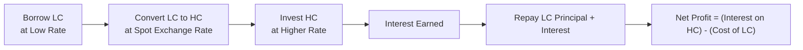

Active currency trading strategies are pursued by investors seeking to generate additional returns—often referred to as alpha—beyond what a passive or benchmark currency exposure might deliver. These strategies hinge on your ability to spot inefficiencies, respond to macroeconomic shifts, and adapt to market psychology. In other words, if you’re hoping to grab extra gains from currency fluctuations (rather than merely minimize foreign exchange risk), active currency trading just might be your thing. That said, it can be risky, always requiring vigilant risk management and a robust process to weather the inevitable surprises in foreign exchange (FX) markets.

Below, we explore four major frameworks for active currency trading: fundamental analysis, technical analysis, carry trades, and strategies involving volatility. Along the way, we also consider key risk management practices, the unique characteristics of various FX instruments, and some personal anecdotes I’ve encountered over the years. I hope this discussion helps you weigh the pros and cons, and design an approach that fits your goals and risk tolerance.

## Fundamental Analysis in Currency Trading

Fundamental analysis in the FX world uses macroeconomic data, central bank communication, and political landscape assessments to determine a currency’s fair or intrinsic value. If you’re fundamentally bullish on a certain country’s currency, you likely believe that its economic strength, favorable monetary policy stance, and stable political environment will cause it to appreciate in value over time compared to another currency.

• Macro Indicators: Fundamental currency traders track indicators like GDP growth, inflation rates, employment data, and trade balances. For instance, higher growth expectations in Country A versus Country B may encourage investment inflows to Country A—pushing up demand for that currency.

• Central Bank Policy and Monetary Stance: Central banks control short-term interest rates and influence broader lending conditions. If a central bank in one country signals that interest rates may rise faster than previously thought, the currency often strengthens, as higher rates attract foreign capital.

• Political Risk: Shifts in government policy, unexpected election results, or instability can directly impact capital flows and currency values. Sometimes, just a vague political rumor can spark huge intraday swings in currency markets—something I learned the hard way when a small rumor about trade tariffs wiped out what seemed like a perfectly solid position I was holding.

• Balance of Payments: Persistent current account deficits or surpluses can create structural pressures. A country with a massive deficit, for instance, might see its currency drop in value unless offset by capital inflows.

While fundamental models can be quite rigorous, they don’t always predict near-term volatility. Economic events emerge unexpectedly, and market participants might prioritize certain indicators over others unpredictably. A classic example is when a central bank intervention or big policy change blindsides the market, making your well-crafted longer-term fundamental viewpoint temporarily irrelevant.  

As a practical step, fundamental currency traders typically combine top-down macroeconomics with bottom-up analysis of political risk (like reading policy documents from central banks or analyzing election cycles) to anticipate currency movements. They’ll also compare actual movements to “fair value” estimates derived from interest rate differentials or purchasing power parity relationships. When significant gaps exist between the market rate and the model’s fair value, these traders might see an opportunity.

## Technical Analysis in Currency Trading

While fundamental analysis looks at “why” a currency may move, technical analysis focuses on “how” the currency is moving, relying on historical price and volume data, chart patterns, and a boatload of quantitative indicators. The overarching principle is that all relevant information is reflected in the currency’s price, so analyzing price (and occasionally volume) behavior helps identify patterns likely to repeat.

• Trend Identification: Technical traders seek to detect upward or downward trends. They may watch moving averages to smooth out short-term noise, or rely on trend lines and channels to confirm a currency’s directional momentum.

• Momentum Indicators: Tools like the Relative Strength Index (RSI), Moving Average Convergence/Divergence (MACD), and Stochastics gauge the speed and magnitude of price changes. “Overbought” or “oversold” readings can trigger trades anticipating short-term reversals.

• Chart Patterns: Some traders interpret “head-and-shoulders,” “double tops,” or “flag patterns” as signs of an impending reversal or continuation. A classic example is the “breakout” strategy, where you go long (buy) the currency if it breaks above a key resistance level with strong momentum.

• Algorithms and High-Frequency Strategies: Today, many large-scale traders utilize complex algorithmic models that incorporate technical factors, from simple trend following to advanced machine learning approaches. But you can still find smaller-scale discretionary traders who rely on chart reading and pattern recognition gleaned from years of experience.

Technical analysis appeals to those who feel more comfortable trusting observable price action rather than analyzing intangible fundamentals. However, it’s not a panacea—false signals happen, and markets can quickly switch from trending to range-bound. Combining technical and fundamental approaches is common, with each method providing clues to confirm or question potential trades.

## Carry Trades: Borrow Low, Invest High

Carry trading is an especially popular strategy in FX. The idea is straightforward: Borrow (or short) a currency that offers a low interest rate, invest (or go long) in a currency that offers a higher interest rate, and profit from the interest rate differential. Sounds simple, doesn’t it? Well, in calm markets, it often is—layers of yield differentials can accumulate into attractive returns. But you know the old saying: no free lunch in finance.

• Mechanics of a Carry Trade: If Japan’s interest rates are close to zero, you borrow Japanese yen and exchange them for Australian dollars (where interest rates are higher). You invest those Australian dollars at the higher rate. If the AUD/JPY exchange rate stays relatively stable or if the Aussie dollar even appreciates, you enjoy net interest plus potential currency gains.

• Risks and “Carry Unwinds”: Currency markets can quickly change direction. If risk appetite sours—e.g., in a global financial crisis—investors tend to exit riskier positions. That exodus can mean heavy selling of high-yield currencies and sudden appreciation of low-yield “safe-haven” currencies. These “carry unwinds” can be abrupt, leaving traders scrambling to manage huge losses. Trust me, I’ve seen more than a few panicked phone calls from folks who got hammered on a massive carry breakdown.

• Factors Influencing Carry Success: Stable economic growth, supportive monetary policy, and risk-on sentiment typically bolster carry trades. If you see a divergence in growth cycles, that could reinforce or undermine a carry position. Also, forward exchange rates often embed the interest rate differential, so effectively capturing “pure” carry might require additional hedging or skilled forward contract usage to reduce unwanted currency movement risk.

Often, macro hedge funds or institutional investors scale up carry trades through leverage, amplifying potential gains (and, of course, potential losses). Monitoring interest rate trends, central bank signals, and risk aversion in global markets is crucial for success.

## Volatility Trades and Options Strategies

Some traders focus on currency volatility—how wildly an exchange rate might swing over a certain period—to generate profit. Volatility-based strategies can be appealing if, for instance, you believe the market’s implied volatility (the volatility implied by option prices) is too high or too low compared to what you expect the actual volatility (realized volatility) will be.

• Buying Volatility: When you think a currency pair is set for big moves—maybe an impending major policy decision or a critical election outcome—a long straddle or long strangle option strategy could benefit if the currency pair experiences large swings. Even if you’re unsure of the direction, a sufficiently large price move in any direction might generate a net payoff.

• Selling Volatility: If you’re convinced the currency pair will remain range-bound, you might sell options to collect premium, betting realized volatility will be lower than what’s priced in. Be cautious though—selling volatility can yield steady premium income most of the time, but if the currency has a sudden, explosive move, losses can be substantial.

• Variance or Volatility Swaps: These derivatives allow traders to take direct positions on realized volatility itself, rather than on the underlying exchange rate. If you buy a variance swap expecting higher realized volatility, your payout increases if the actual volatility of the currency pair surpasses the swap’s strike. Conversely, if you sell the swap believing the market is overpricing volatility, you profit if actual volatility remains lower.

An advantage of volatility strategies is that they can be somewhat market-direction agnostic. You might make money simply because the currency moves more (or less) than everyone else expects. That said, option premiums can spike dramatically around “event risks” like central bank announcements. Accurately estimating the final realized volatility is no easy feat.

## Executing Active Currency Trades

You can implement these strategies (fundamental, technical, carry, or volatility-oriented) via different currency instruments, each with unique features:

• Spot FX: Straightforward purchase or sale of a currency pair at the current market rate, typically settled in two business days. Used often for immediate hedging or speculation.

• Forward and Futures Contracts: Allow you to lock in an exchange rate for future settlement. For active strategies, these are popular due to minimal upfront costs and standardized settlement terms. They’re also used in combination, as described elsewhere in our Currency Management chapters.

• Currency Options: Provide the right (but not the obligation) to buy or sell a currency at a predetermined strike price. They’re crucial for volatility-based approaches and for limiting downside risk.

• Swaps (e.g., FX swaps): Facilitate rolling positions or adjusting exposures without multiple transactions. For advanced strategies, cross-currency basis swaps can help manage currency basis risk—though that’s more specialized.

It’s essential to understand how each instrument’s pricing works, especially if you’re employing interest rate differentials (as in carry trades) or if you’re hedging optionality (like in a volatility trade). Margin requirements, liquidity, and overnight financing costs all factor into the net profitability.

## Risk Management Essentials

Active currency strategies can be exciting, but let’s keep it real: big drawdowns happen fast if you’re unprepared. Here are some risk management techniques:

• Stop-Loss Orders: Automatically trigger a close on your position if the exchange rate hits a specified level. Using them helps limit downside if a trade proves incorrect, though they don’t always protect perfectly in a fast-moving market if slippage occurs.

• Position Sizing: Determining how big your trade should be in relation to your portfolio capital. Over-leveraging is a common downfall. In one of my early trades, I got excited about a carry opportunity and doubled my usual position size—only to have a minor news event push the currency strongly against me. Ouch.

• Scenario Analysis and Stress Testing: Evaluate how your positions might perform during extreme market conditions, such as sudden central bank interventions or geopolitical shocks.

• Correlation Management: Remember that some currency pairs may move together or inversely due to shared macro factors (like risk sentiment). Diversifying across uncorrelated trades or carefully accounting for correlation can reduce portfolio volatility.

• Monitoring Transaction Costs: Spreads, rollover charges, prime brokerage fees—these expenses can quietly erode your alpha. Always factor them in when setting up your strategy.

## Performance Evaluation

Measuring an active currency strategy’s success involves benchmarking its returns against a relevant baseline (e.g., a currency-hedged benchmark or an unhedged index). You want to isolate the incremental value you add through skillful currency positioning. Key considerations:

• Net Gains Over Benchmark: If your strategy attempts to beat a passive hedge, you’ll compare realized gains (and losses) to what you would have earned with that passive approach.

• Alpha vs. Beta: The component of returns attributed to systematic market exposure (beta) versus active decisions (alpha). Aim to measure whether your results truly reflect skill.

• Adjusted for Costs and Fees: Active strategies can have higher transaction costs. Ensure your final performance metrics deduct all relevant expenses.

• Risk-Adjusted Performance: Metrics like the Sharpe ratio or the information ratio can help show whether the strategy’s excess return is worth the incurred risk.

Active currency trading is no guarantee of success; it can add layers of complexity and risk to your overall portfolio. Still, well-structured strategies with robust risk controls might deliver valuable diversification or alpha benefits in both stable and volatile market environments.  

## Illustration of a Simple Currency Carry Trade

Below is a simplified process flow diagram of a carry trade using a low-yield currency (LC) and a high-yield currency (HC). We assume an institutional investor obtains credit lines to borrow the low-yield currency:

## Putting It All Together

Active currency strategies can inject substantial alpha potential into a portfolio, but they also demand more time, expertise, and risk management than a passive currency hedge. Whether you’re using fundamental insights, data-driven technical signals, carry differentials, or volatility plays, always start with a clear game plan. And never underestimate how swiftly markets can punish complacency.

It might help to start small—evaluate how each approach fits your philosophical outlook, liquidity constraints, and performance goals. Over time, as you refine your trading style, you can experiment with layering strategies or combining fundamental and technical approaches. And if you make the inevitable misstep (we all do), treat it as a learning moment. After all, the currency market is the largest in the world, full of lessons just waiting to be learned.

Remember: success hinges on disciplined execution, not guesswork. Track your trades with a proper log, note how the outcome relates to your initial rationale, adjust your models or techniques accordingly, and keep going. And yep, keep an eye on those random geopolitical tweets—they have a nasty habit of popping up right when you least expect it!

## Final Exam Tips

• Link Each Strategy to Real-World Events: Be prepared to connect fundamental or technical signals with actual macro themes (e.g., interest rate announcements, indicators of political stability).  

• Focus on Calculation Steps: In exam scenarios, they might ask about computing implied forward rates or the net interest from a carry trade. Write down each step.  

• Use Multi-Strategy Approaches: The exam might test your ability to blend fundamental and technical reasoning or to hedge carry exposures with options.  

• Practice Time Management: Essay questions in the CFA® Program can be time-consuming; quickly identify what the question asks, structure your response, and provide succinct, direct answers backed by relevant calculations.  

• Recall Risk Management Tools: Emphasize how you’d handle unexpected volatility—especially with an unstable currency pair.  

• Integrate Ethics: Demonstrate awareness of the CFA Institute Code of Ethics and Standards of Professional Conduct (especially if short-term strategies seem to invite front-running, insider information, or market manipulation).  

## References

• Brunnermeier, M.K., Nagel, S., and Pedersen, L.H. “Carry Trades and Currency Crashes.” NBER Working Paper.  
• Taylor, M.P. and Allen, H. “The Use of Technical Analysis in the Foreign Exchange Market.” Journal of International Money and Finance.  
• Evans, M., and Lyons, R. “Order Flow and Exchange Rate Dynamics.” Journal of Political Economy.  
• Graham, A. Guide to Currency Trading & Investing.  

-----------------------------------------------------------------------------------

## Test Your Knowledge on Active Currency Trading Strategies



### Which fundamental factor is most directly controlled by a central bank and likely to influence a currency's value?

- [x] Interest rates
- [ ] Current account balances
- [ ] Terms of trade
- [ ] Consumer confidence

> **Explanation:** Central banks adjust short-term interest rates as part of their monetary policy. Changes in interest rates can trigger capital inflows or outflows, thus affecting currency exchange rates.

### In technical analysis, which of the following indicators is commonly used to identify overbought or oversold conditions?

- [ ] Purchasing power parity
- [x] Relative Strength Index (RSI)
- [ ] Carry differential
- [ ] Regression analysis

> **Explanation:** The RSI is a popular momentum oscillator that oscillates between 0 and 100, with readings above 70 often considered overbought and below 30 considered oversold.

### In a classic carry trade, the profit primarily derives from:

- [ ] A favorable forward premium on the target currency
- [x] The interest rate differential between the funding currency and the target currency
- [ ] Hedging operations in the spot market
- [ ] Political stability in the target currency’s country

> **Explanation:** A carry trade seeks to earn the net difference between a low-interest-rate funding currency and a high-interest-rate target currency. Any gains or losses from exchange rate movements come on top of (or reduce) this interest differential.

### Which of the following circumstances can cause a “carry trade unwind”?

- [ ] A significant increase in global risk appetite
- [x] A sudden shift to risk-off sentiment
- [ ] A reduction in margin requirements
- [ ] A predictable central bank rate hike

> **Explanation:** An abrupt move to risk-off sentiment often causes investors to flee higher-yielding, riskier currencies in favor of safe-haven currencies. This causes rapid appreciation of the funding currency and losses on the carry trade.

### What is the main advantage of buying a currency straddle (at-the-money options) if you expect a major policy announcement but are uncertain about the direction of the currency move?

- [ ] You gain linear exposure to the market’s direction
- [ ] You only need a small premium to buy calls
- [x] You profit if the currency makes a large move in either direction
- [ ] Your downside risk is unlimited

> **Explanation:** A long straddle strategy involves purchasing a call and a put at the same strike price. If the currency moves substantially in either direction, one of the options can become highly profitable, exceeding the combined cost of both.

### What technique best helps limit the downside risk of an open currency position?

- [x] A stop-loss order
- [ ] A buy-and-hold strategy
- [ ] A negative correlation hedge
- [ ] A currency strangle

> **Explanation:** Stop-loss orders automatically close out a position once the exchange rate crosses a certain threshold, limiting further losses. It’s a common, straightforward risk management practice in currency trading.

### Which statement is true about implied vs. realized volatility in currency markets?

- [x] Implied volatility is based on market expectations embedded in option prices, while realized volatility is based on actual price fluctuations observed over a period.
- [ ] Implied volatility is always greater than realized volatility.
- [x] Realized volatility represents the forward-looking assessment of future price swings.
- [ ] Implied volatility cannot be traded or hedged.

> **Explanation:** Implied volatility is derived from the prices of options, reflecting the market’s estimate of how volatile the underlying might be. Realized volatility is calculated from the historical movements in the underlying currency pair over a set period.

### Which of the following instruments would best facilitate earning the interest rate differential without immediate capital outlay?

- [ ] A spot FX transaction
- [ ] A currency option
- [x] A forward contract
- [ ] A volatility swap

> **Explanation:** A forward contract allows an investor to lock in an exchange rate for future settlement without an initial capital outlay (besides posting margin where required). This is often used for carry trades where the interest rate differential is effectively embedded in the forward price.

### If a trader short-sells a high-yield currency and buys a low-yield currency, which outcome would be favorable?

- [x] The high-yield currency depreciates against the low-yield currency
- [ ] The high-yield currency appreciates, increasing gains
- [ ] The low-yield currency remains unchanged
- [ ] The high-yield currency experiences a cyclical rally

> **Explanation:** Short-selling a currency and seeing it depreciate produces a profit, because the currency the trader is shorting becomes cheaper to repurchase later.

### A fundamental analyst expecting a currency to appreciate would most likely look for:

- [x] Strong GDP growth, rising interest rates, positive investor sentiment
- [ ] Weak GDP growth, rising unemployment, overbought signals
- [ ] High historical volatility, chart pattern breakouts
- [ ] A stable correlation with precious metals

> **Explanation:** A fundamental analyst focuses on macro factors like strong GDP growth, a likely rise in interest rates (which attract foreign capital), and overall optimism about the economy—each of which can strengthen a currency.


