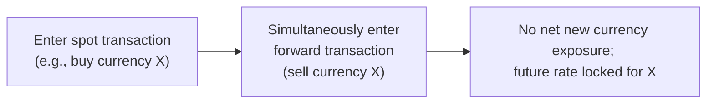

## Introduction

Managing currency risk can feel a bit like trying to shelter yourself from a sudden storm—sometimes you just don’t know when those big drops will hit. Hedge ratios are your umbrella: they represent how much of your currency exposure you decide to “cover.” In other words, if you have an international investment worth USD 10 million in Europe, and you hedge 50% of the currency risk, your hedge ratio is 0.5 (or 50%). Sounds straightforward, right? Well, the story gets interesting when we dig into the tools—particularly forward contracts and FX swaps—that allow you to set, roll, and adjust your hedge ratio over time. 

When we talk about hedge ratios, we’re not just fiddling with numbers in spreadsheets. We’re dealing with real-world cost considerations: do we want a fully hedged position, or do we want to leave some currency exposure unhedged to profit from anticipated movements? What if interest rates change, or the currency moves in unexpected ways? These are the real questions that drive dynamic currency risk management.

Below, we’ll explore the mechanics of managing hedge ratios, the role of forward contracts, how FX swaps work, rolling forward hedges, controlling margin and collateral requirements, and monitoring notional and economic exposures. If you’ve ever wondered how to keep your hedges aligned without stumbling into unexpected costs or operational complexities, read on.

## Hedge Ratios in a Nutshell

A hedge ratio refers to the percentage of your total currency exposure that gets hedged. If you choose a 100% hedge ratio, you aim to eliminate virtually all exchange rate fluctuations from your returns. A 0% hedge ratio, in contrast, means you’re fully exposed to currency volatility—so, you’d better enjoy the ride!

In practice, many managers choose something in between. You might go with 70–80% if you believe currency markets will remain fairly stable but still want to reduce some volatility. Or you might vary your ratio over time as your outlook changes. This dynamic approach—adjusting the hedge ratio as conditions evolve—often involves forward contracts and FX swaps. Let’s explore why.

## Using Forward Contracts to Manage Hedge Ratios

Forward contracts let you lock in an exchange rate for a future settlement date. You effectively say: “I agree to exchange X units of currency A for currency B at a set rate on date T.” This tool is powerful. It allows you to plan your cash flows and hedge your currency exposure long before your investment period ends or your local currency needs arise.

### Mechanics of a Forward Contract

If you’re a USD-based investor holding EUR-denominated assets, you can enter a forward contract to sell euros and receive dollars at some future date. The forward rate itself typically reflects interest rate differentials between the two currencies. For instance, if EUR interest rates are higher than USD rates, then the EUR might trade at a forward discount to the USD.

A standard formula for the forward price (assuming simple annualized rates) can be expressed as:


F_{t,T} \;=\; S_t \times \frac{\left(1 + i_d\right)^{\frac{(T - t)}{360}}}{\left(1 + i_f\right)^{\frac{(T - t)}{360}}}


• \\( S_t \\) is the spot rate at time \\( t \\).  
• \\( i_d \\) is the domestic risk-free interest rate.  
• \\( i_f \\) is the foreign risk-free interest rate.  
• \\( (T - t)/360 \\) is the fraction of the year between now (t) and the contract’s maturity (T).

### Setting or Adjusting Your Hedge Ratio with Forwards

The beauty of forward contracts is that you can structure them to cover exactly the portion of your currency exposure you want hedged. If your total exposure is EUR 1 million, and you want to hedge just half of it, you’d sell EUR 500k forward. At maturity, you’ll deliver that half in euros and receive the corresponding amount in dollars.

But markets change. If your risk appetite changes or if interest rates or forward points move significantly, you might want to change the hedge ratio. And that’s where you might roll the forward or set up a new forward contract.

### Rolling Forward Your Hedge

It’s common to set a hedge for, say, three months at a time. When that period is up, guess what: your exposure might still be there, so you need to “roll” the forward. Rolling is essentially a new transaction: closing out the existing forward and entering a new forward contract. You can keep re-establishing your hedge ratio as the market conditions evolve.

Some folks worry about the cost of rolling forwards. Indeed, the new forward rate might be less favorable, or you might incur transaction costs each time. But that’s part of the game. Over the long run, the cost or gain from rolling forward reflects the interest rate differential between the two currencies, plus some spread for the transaction.

## Managing Exposures with FX Swaps

An FX swap is a simultaneous purchase and sale of identical amounts of one currency for another with two different value dates—meaning you do a spot transaction and an offsetting forward transaction, or vice versa. Many professional traders and asset managers use FX swaps to quickly adjust or maintain a hedge without messing up any new net currency exposures.

Let’s say you have a forward contract that’s about to expire, but you’re not ready to convert your currency. Rather than closing out everything and opening a totally new position, you could do an FX swap to “roll forward” your contract. 

### Mechanics of an FX Swap

Picture it this way: 
1. You sell currency X and buy currency Y on the spot market today. 
2. Simultaneously, you buy back currency X and sell currency Y at a future date.  
The net effect is no immediate net cash flow in currency terms—because you’re doing an offsetting transaction—but you’ve locked in a future exchange rate again.

Below is a simple mermaid diagram that illustrates a typical FX swap flow:

FX swaps can help you maintain a continuous hedge, especially for short-term periods, without incurring the overhead of negotiating a brand-new contract from scratch. They’re like a quick tune-up on your currency hedge engine.

## Optimal Hedge Ratios: Balancing Risk and Return

Choosing the “optimal” hedge ratio can be tricky. There’s often a tension between minimizing risk from currency movements and giving up potential gains if the currency moves in your favor. Let’s highlight some considerations:

• **Interest Rate Differentials**: If you’re frequently rolling a forward or swapping, the interest rate differential (embedded in the forward points) directly affects your cost or gain.  
• **Transaction Costs**: Each time you roll or reset the hedge, you pay a bid–ask spread and sometimes other fees.  
• **Expected Currency Movements**: If you have a forecast that a currency might appreciate, it could be worth underhedging so you benefit from that appreciation. However, if the currency unexpectedly depreciates, you can get burned.  
• **Risk Appetite**: A more risk-averse manager will typically hedge a larger portion (maybe 80–100%), especially if currency volatility is high. A risk-tolerant manager might hedge less—or even none—if the currency is expected to move in a favorable direction.

Some managers use quantitative models or strategic frameworks that update desired hedge ratios based on momentum signals, economic fundamentals, or carry considerations. For instance, if short-term interest rates look more attractive abroad, you might lighten your hedge to earn that carry. But watch out: if the currency then weakens, the potential gains from the interest differential could be wiped out by exchange rate losses.

## Collateral, Margin, and Liquidity Considerations

Forward contracts and FX swaps are typically over-the-counter (OTC) instruments. Depending on the terms and the credit relationship with your counterparty (often a bank), you might be required to post collateral or maintain margins. This is especially relevant when you’re dealing in large notional amounts.

• **Collateral**: Cash or highly liquid securities you post to a bank or clearinghouse to protect against your potential default.  
• **Margin Calls**: If the market moves against you significantly, you might need to provide additional collateral. This could strain your liquidity if you haven’t planned for it.  
• **Opportunity Cost**: Any cash or securities tied up in collateral isn’t available for other investments. So, a large hedging strategy can come with hidden costs.

## Monitoring Notional and Economic Exposures

Say you’re fully hedged in notional terms: your forward contract notional amount precisely equals your currency exposure. Sounds perfect, right? But ironically, your economic exposure might have changed. For example, your underlying investment could have grown in value, or you might have reinvested dividends or coupons in foreign currency. If you don’t adjust the hedge, you could end up inadvertently underhedged.

Similarly, sometimes you overhedge. For instance, if the foreign currency portion of your portfolio declines in value while your forward contract remains the same size, you’ll have an overhedge. That means your derivatives exposure could exceed your actual economic exposure.

Monitoring and rebalancing frequently keep your notional hedge ratio aligned with the true underlying exposures. But each rebalance has a cost, so there’s a trade-off between perfect alignment and minimal transaction costs.

## Frequency of Rebalancing

The question, “How often should we rebalance our currency hedges?” can spark heated debates in risk committees. Here are key points:

• **High-Frequency Rebalancing**: Minimizes basis risk or misalignments but increases transaction costs.  
• **Low-Frequency Rebalancing**: Reduces transaction costs, but you might be less responsive to sudden changes in currency exposure or rates.  
• **Dynamic Policy**: Many managers choose to do monthly or quarterly rebalancing, or they set triggers (e.g., hedge ratio drifts by more than ±5% from the target).

There’s no universal “best” answer. It depends on factors like portfolio size, liquidity, cost structure, and how critical currency risk management is to your investment objectives.

## Practical Example: A USD Investor in EUR Assets

Let’s walk through a quick scenario of how a USD-based investor might utilize forwards and FX swaps:

1. The investor holds EUR 10 million of European equities, with a target hedge ratio of 70%.  
2. They initiate a forward contract to sell EUR 7 million and buy USD, maturing in 6 months.  
3. After three months, the equities have appreciated, making the position worth EUR 12 million. With no change, the notional hedge ratio has dropped to roughly 58% (7m/12m).  
4. To restore the 70% ratio, the investor enters an FX swap: first buying EUR from the spot market and simultaneously selling forward, adjusting net exposures from EUR 7 million to about EUR 8.4 million.  
5. At the 6-month mark, they roll or close out the forward. Market conditions, interest rates, and currency forecasts may cause them to choose a new hedge ratio—maybe 65% or 75%.  

All these transactions involve paying or receiving forward points, dealing with some transaction costs, and ensuring enough collateral is posted. 

I still recall a colleague who tried to keep a simple 100% hedge forever and was shocked by the repeated hits from forward roll costs when the foreign currency had a consistently higher interest rate. Over time, they switched to a dynamic policy, balancing the interest rate differentials against the risk of currency appreciation.

## Best Practices and Common Pitfalls

• **Know Your Costs**: Forward points, bid–ask spreads, and other charges can substantially erode your returns. Don’t assume that hedging is free.  
• **Track True Exposures**: Always monitor how your foreign holdings, dividends, or coupon reinvestments change your exposure.  
• **Watch Out for Overhedging**: Over time, an overhedge can be just as risky as being unhedged.  
• **Align Hedge Ratios with Investment Objectives**: If you’re purely risk-averse, a higher hedge ratio might make sense, while active managers might find value in partial hedging or even strategic underhedging.  
• **Have a Plan for Rollovers**: Schedules and triggers for rolling or swapping should be clear. Don’t get caught in a last-minute scramble because your forward’s about to expire.  
• **Liquidity Management**: Margin calls can really sting if you haven’t planned for them.  

## Regulatory and Standards Integration

From a professional standards perspective (e.g., CFA Institute Code and Standards), you want to fully disclose how you manage currency risk, the costs involved, and any potential conflicts of interest with counterparties. Also, ensure that your strategy aligns with the fiduciary responsibilities for your clients or stakeholders—particularly if you’re making dynamic adjustments that can affect returns and costs in ways that might not be intuitive to a layperson.

## Exam Relevance and Final Thoughts

On the CFA Level III exam, expect scenario-based questions that require you to calculate hedge ratios, apply forward points, or decide whether to increase or decrease a hedge in light of interest rate differentials. You might be asked to demonstrate how rolling a forward contract affects your cost or how an FX swap rebalances your currency exposure. In constructed-response questions, clarity in explaining your rationale—why you chose a particular hedge ratio or method—can make a big difference.

At the end of the day, currency management is a balancing act: sacrificing some potential upside to smooth out risk. Understanding how forward contracts and FX swaps provide flexibility and precision in that dance is crucial. Know your terms (like forward points, dynamic hedging policy, roll forward, and overhedge/underhedge) and keep them in context. That’s a surefire way to prepare for both the exam and real-world portfolio management challenges.

## References and Further Reading

• Giddy, I.H. “Global Financial Markets: Understanding FX Swaps.”  
• Hull, J. “Options, Futures, and Other Derivatives.”  
• Sarno, L. and Taylor, M.P. “The Economics of Exchange Rates.”  
• Practitioner guides by major banks on FX swaps and forward markets (e.g., JPMorgan, Citi).

## Test Your Knowledge: Managing Hedge Ratios Using Forward Contracts and FX Swaps



### Which of the following best describes a hedge ratio in currency management?

- [x] The percentage of a currency exposure that is hedged with derivatives.
- [ ] The amount of collateral required to secure a forward contract.
- [ ] The difference between the spot rate and forward rate for a given currency pair.
- [ ] The margin requirement set by a central clearinghouse.

> **Explanation:** A hedge ratio indicates the proportion of the total currency exposure that is protected from exchange rate movements, typically through forward or swap contracts.

### A U.S. investor holds EUR 1,000,000 in a European equity fund and wants to hedge 60% of the currency risk. How many euros should be sold forward?

- [ ] EUR 400,000
- [x] EUR 600,000
- [ ] EUR 1,000,000
- [ ] EUR 1,600,000

> **Explanation:** 60% of EUR 1,000,000 is EUR 600,000.

### In an FX swap, what two transactions occur simultaneously?

- [x] A spot and a forward transaction involving the same currencies.
- [ ] Two spot trades at different dealers to get the best price.
- [ ] A forward contract and an option on a different currency pair.
- [ ] A currency futures contract and a swaption.

> **Explanation:** An FX swap typically involves offsetting trades (one spot and one forward) to adjust or roll over currency exposure without net new inflows or outflows in that currency.

### If the forward rate for a currency pair is trading at a forward discount compared to the spot rate, this suggests:

- [ ] The foreign interest rate is the same as the domestic interest rate.
- [ ] The domestic interest rate is lower than the foreign interest rate.
- [x] The domestic interest rate is higher than the foreign interest rate.
- [ ] Neither interest rate is relevant to the forward discount.

> **Explanation:** If a currency trades at a forward discount, it often reflects that the currency’s domestic interest rates are higher than the foreign interest rate, resulting in a lower forward price relative to the current spot.

### Which of the following is a primary reason for rolling a forward contract?

- [x] To extend the currency hedge when the current forward contract is about to expire.
- [ ] To increase the collateral requirements on a derivative position.
- [ ] To reduce basis risk in an equity futures contract.
- [x] To periodically change the notional amount of the hedge ratio.

> **Explanation:** Rolling a forward extends the hedging position beyond the original contract’s expiry date and can also allow an investor to alter the hedged notional.

### When monitoring a currency hedge, “basis risk” refers to:

- [x] The potential mismatch between the hedge instrument’s price changes and the underlying exposure’s price changes.
- [ ] The difference between exchange-traded futures and OTC forward contract specifications.
- [ ] Collateral posted against a forward position.
- [ ] Exotic currency risk arising from emerging markets.

> **Explanation:** Basis risk arises when the derivative used to hedge doesn’t perfectly track the underlying exposure’s price movement, creating potential gains or losses.

### Which of the following statements about collateral requirements for forward contracts is correct?

- [x] Investors may need to post additional margin if the marked-to-market value becomes unfavorable.
- [ ] Collateral requirements never change before the contract’s settlement date.
- [ ] Margins are optional in all forward contracts.
- [x] Collateral is posted only when the contract is profitable.

> **Explanation:** When a forward moves against you, your counterparty may request additional margin or collateral to mitigate credit risk.

### A dynamic hedging policy differs from a static one primarily in that:

- [x] The hedge ratio is periodically adjusted based on market signals or risk assessments.
- [ ] The currency exposure is never fully hedged under a dynamic policy.
- [ ] The static hedge ratio is always 50%.
- [ ] Dynamic hedging uses only options, not forwards.

> **Explanation:** Dynamic hedging policies adapt the hedge ratio as market or portfolio circumstances evolve. Static hedges do not.

### Which factor most directly affects the cost or gain when rolling a forward currency hedge?

- [x] The interest rate differential between the two currencies.
- [ ] The equity risk premium in the foreign market.
- [ ] Fluctuations in inflation indices.
- [ ] Commodity price volatility.

> **Explanation:** The forward points (or swap points) embedded in a currency hedge are determined by interest rate differentials, driving the cost or gain on rolling forward.

### True or False: Overhedging occurs when the notional amount of the hedge is less than the actual currency exposure.

- [ ] True
- [x] False

> **Explanation:** Overhedging happens when the notional of the hedge exceeds the underlying exposure. Underhedging is when the hedge is less than the exposure.


