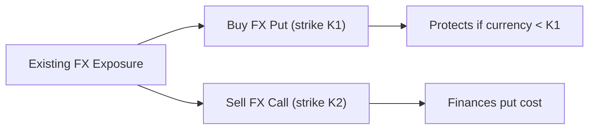
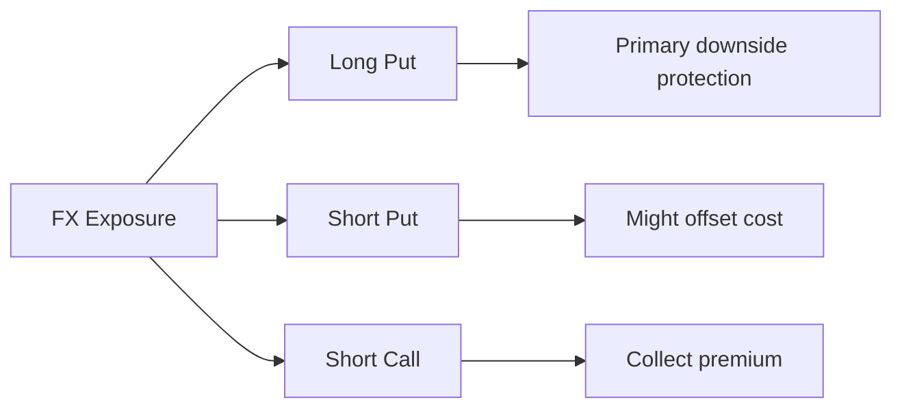

## Introduction and Overview

Currency hedging can be pretty expensive, especially if interest rate differentials or option premiums are high. To some folks, it might feel like you’re constantly budgeting for a financial “insurance policy” that only pays off if currency exchange rates move the wrong way. Yet it’s precisely that looming accuracy problem—where you don’t know which direction foreign exchange (FX) rates will move—that encourages many global investors to hedge their currency exposure in the first place.

We’ll explore some techniques to reduce the cost of hedging and modify a portfolio’s overall risk–return profile. Think of it like searching for a cheaper insurance plan that still provides a decent amount of coverage: you might end up with a higher deductible or slightly narrower coverage, but your ongoing premiums are more manageable. In currency terms, that often translates to “fine-tuning” the hedging approach to balance saving on costs with achieving the right level of protection.

Along the way, we’ll talk about forward rate agreements (FRAs) for shorter-term hedges, “zero-cost” collars, seagull strategies, partial hedging, dynamic hedging, and cross-currency swaps. Each approach has unique pros and cons. Choosing the right one depends on your expectations for currency movements, your risk tolerance, and of course, your budget for hedging.

## Key Hedging Cost Considerations

Before getting into the details, let’s remember that the cost of hedging is affected by:

• The interest rate differential between two currencies.  
• The volatility of these currencies (which influences option premiums).  
• The instrument or structure chosen for the hedge (e.g., forward contracts, options, swaps).  
• The time horizon and hedge ratio.  

A higher interest rate differential typically means a more expensive forward hedge if you’re hedging from a lower-interest-rate currency into a higher-interest-rate one. Option-based strategies, on the other hand, depend heavily on implied volatility and the distance of strike prices from the spot rate.

## Using Forward Rate Agreements (FRAs) and Shorter-Tenor Instruments

One way to reduce hedging costs—especially when forward premiums are high—is to shorten the hedge horizon. Forward Rate Agreements (FRAs) or other short-tenor instruments can help you maintain more control over the rolling cost of hedging:

• With a shorter tenor, you only lock in the hedge for a few months at a time. It can feel a bit like renewing your lease every few months instead of signing a two-year contract.  
• The advantage is that you might capture favorable interest rate movements or more timely market insights.  
• The drawback? You do need to roll the hedge more frequently, creating rollover risk (e.g., if currency markets move adversely right before you renew).

### Example: Monthly Rolling Hedge

Suppose you run a euro-denominated portfolio invested in U.S. assets. The one-year forward rate for EUR/USD might be more expensive due to interest rate differentials. Instead of entering a 12-month forward all at once, you might hedge monthly or quarterly. Each time you progressively roll the hedge, the cost could vary based on current short-term interest rates. This approach could, in theory, lead to lower overall hedging costs if rates move in your favor (though it’s by no means guaranteed).

## Option-Based Approaches to Lower Hedging Costs

Forward contracts lock in an exchange rate, but they can sometimes be expensive or reduce your ability to benefit from favorable currency moves. That’s why many investors turn to options—like puts or calls. The premium for these options, however, can be pricey when volatility is high.

### Zero-Cost Collars

A zero-cost collar is a strategy in which you buy one option (say, an out-of-the-money put) and simultaneously sell another option (say, an out-of-the-money call) such that the net premium is (approximately) zero. It effectively caps your downside risk while limiting your upside potential.

• You purchase a put option: This is your “insurance” in case the underlying currency depreciates against your base currency.  
• You sell a call option: You collect premium income, offsetting the cost of the put.

Here’s a conceptual diagram using Mermaid.js to illustrate:

In a perfect scenario, your purchased put costs exactly the same amount as the premium you receive from selling the call. Hence “zero net cost.” But in practice, these costs might not line up perfectly. Sometimes it’s called a “costless collar” or “fence” as well.

#### Example: USD/EUR Zero-Cost Collar  
• Spot rate: 1.1000 USD/EUR  
• You want to protect against a fall below 1.0800 but are willing to forgo gains above 1.1300.  
• You buy a put with a strike at 1.0800 (cost might be, say, $0.01 per euro) and sell a call with a strike at 1.1300 (which might have a premium of $0.01 per euro).  
• Net premium: $0.00 (roughly).

You’re shielded if EUR/USD plummets below 1.0800, but you also miss upside gains if it climbs above 1.1300. This arrangement lowers your out-of-pocket expense and still provides a degree of risk management.

### Seagull Strategies

A seagull strategy is slightly more involved. Typically, you buy a put (for downside protection), sell a second put (at a lower strike), and also sell a call. This combination can further reduce or even eliminate net premium costs. But there’s a hitch: if the currency plummets below the lower strike put you sold, you start to face losses you might not have had with a simple put purchase.

Here’s a diagram to show how a seagull might be constructed:

With a well-chosen combination of strikes, you can sometimes arrange a near-zero or low-premium structure that protects against moderate losses but also limits upside gains, and potentially exposes you if the market breaks below your short put strike.

### Selling Optionality

A different approach to reduce hedging cost is simply to sell options (particularly out-of-the-money calls) on currency pairs you believe won’t move severely. However, this approach can backfire if the spot rate moves through the strike, forcing you to deliver currency at an unfavorable rate (or to settle in cash). In other words, you collect premium now but risk potential large losses if the currency rallies unexpectedly.

Selling optionality to lower or offset hedging costs is often seen in structures like:

• Writing an out-of-the-money call option while holding a forward or put to hedge.  
• Combining short calls and puts in a strangle to reduce net premium cost.  

The advantage is immediate premium collection, but the downside is potential large losses if the market moves strongly.

## Cross-Currency Swaps

Cross-currency swaps (sometimes known as currency swaps) can also achieve hedging objectives while reducing cost, particularly when swapping both principal and interest payments in different currencies is more efficient than doing separate forward/futures trades. This might happen when:

• There’s a large interest rate differential, and you prefer to “lock in” a cheaper interest rate in the other currency.  
• You have a long-term liability in one currency and an asset in another, so you effectively exchange your obligations (and interest payments) with a counterparty.  
• The market for cross-currency swaps in certain currency pairs is more liquid or more competitively priced than forward markets.

Because you’re exchanging principal amounts at the outset (and re-exchanging at maturity), cross-currency swaps can be a more integrated solution for managing multi-year exposures. The complexity, of course, is higher.

## Partial and Dynamic Hedging

Not everyone wants a 100% currency hedge. Sometimes, you only hedge a portion of your exposure— maybe 50% or 70%—to keep costs down while still offering some cushion. Or you adopt a “dynamic” approach, ramping up the hedge when volatility is high or the currency is especially vulnerable, and reducing it when volatility is low or the currency outlook looks benign.

### Partial Hedge Example

• A U.S. investor has 100 million euros in European equities.  
• Instead of hedging the entire EUR exposure, the investor only hedges 60 million euros worth.  
• If EUR/USD falls, the 60 million euro hedge compensates for only part of the currency loss, but it also costs less overall.  

The idea: The investor is comfortable accepting some currency risk in return for lower hedging costs. In periods when the euro is stable or strengthening, this strategy might actually outperform a fully hedged portfolio because not all gains are forfeited.

### Dynamic Hedging Process

1. **Establish volatility or rate triggers:** For instance, you might say, “If implied volatility on the currency hits X%, I’ll hedge 80%. If it’s below X%, I’ll only hedge 40%.”  
2. **Adjust hedge ratio over time:** As conditions change, you revise the hedge ratio.  
3. **Manage transaction costs:** Additional trades incur costs, so you want to ensure that the “dynamic” approach is worth the execution expense.

Admittedly, dynamic hedging is more labor-intensive and requires ongoing monitoring. But for certain institutional portfolios, it can strike a sweet spot between cost-effectiveness and risk management.

## Evaluating the Trade-offs

Now the tough part: cheaper hedges often come with less protection. For instance, that zero-cost collar might save you premium expenses, but your upside is capped if your currency exposure would have produced a gain. Similarly, selling optionality to earn extra income can reduce net cost but increase tail risk if the currency swings hard.

It’s essential to weigh:

• **Cost ramifications**: Are you saving enough on premiums or forward costs to justify the trade-off?  
• **Portfolio objectives**: Is your primary goal to protect from catastrophic losses, or just to reduce day-to-day volatility?  
• **Market outlook**: If you strongly suspect a stable or strengthening foreign currency, maybe you’d be comfortable with partial coverage. If you expect big swings, you might lean on more robust coverage.  
• **Regulatory or accounting constraints**: Under certain hedge accounting frameworks (IFRS or US GAAP), partial or exotic structures might complicate the accounting treatment.  

I recall a friend of mine who managed a pension fund’s currency exposures saying she preferred partial hedges. “We had a lot of risk to manage,” she said, “but man, paying full price for a 100% hedge just killed our returns.” And it’s true: sometimes going for the most comprehensive coverage can affect your total return more than you’d like, especially when currency movements end up being minimal.

## Practical Use Cases

• **Global Equity Portfolios**: Where you own stocks from multiple countries and want to limit currency risk while maintaining some upside potential. Zero-cost collars or partial hedges can offset the cost of standard forward hedges.  
• **Multi-Currency Fixed Income**: If the foreign currency in your bond holdings has a lower interest rate, your forward hedging cost might be “positive carry” (i.e., you earn more by hedging). But if you’re on the losing side of the interest rate differential, you might seek cost-saving measures like dynamic hedging.  
• **Real Estate Investments Abroad**: If you are financing a foreign property, a cross-currency swap might be cheaper than rolling forward contracts every quarter.  
• **Corporate Treasury Management**: Firms with ongoing payables/receivables in various currencies often rely on short-tenor instruments to match their operational cash flow cycles, minimizing cost by frequent updates to the hedge.

## Potential Pitfalls and Best Practices

1. **Over-Complication**: Exotic structures may save cost but can create hidden exposures. It’s easy to get lulled by a “cheap” hedge, only to discover big losses if breakeven points are exceeded.  
2. **Credit and Counterparty Risk**: FRAs, swaps, and OTC options all depend on the counterparty being able to make good on payments. Using exchange-traded instruments or central clearing can reduce, but not eliminate, certain risks.  
3. **Liquidity Concerns**: For dynamic hedging, you need adequate market liquidity. In stressed environments, the cost to adjust your hedge ratio might spike.  
4. **Hedge Ineffectiveness**: Under IFRS or US GAAP, certain structures can be tricky to qualify for hedge accounting, leading to more income statement volatility.  
5. **Monitoring**: A partial or dynamic hedge demands constant vigilance. If you’re not regularly reviewing the portfolio’s currency exposure, you could face unexpected gaps in protection.

## Example Calculation: Forward Hedge vs. Zero-Cost Collar

Let’s walk through a simplified numeric illustration to see how costs and payoffs might differ. Assume:

• Spot EUR/USD = 1.10  
• Domestic interest rate (USD) = 4% annualized  
• Foreign interest rate (EUR) = 2% annualized  
• Time horizon = 1 year  

### Forward Hedge Cost

Under covered interest parity, the 1-year forward rate is approximately:
  

\text{Forward} = \text{Spot} \times \frac{1 + i_{\text{USD}}}{1 + i_{\text{EUR}}} 


Plugging in:


1.10 \times \frac{1 + 0.04}{1 + 0.02} = 1.10 \times \frac{1.04}{1.02} \approx 1.10 \times 1.0196 = 1.12


So the one-year forward rate might be around 1.12 EUR/USD. If you lock this in, you effectively pay 1.12 dollars for each euro in a year. There's no direct premium payment here (beyond any bid-ask spreads), but you do lose out on any potential benefit if spot finishes below 1.12.

### Zero-Cost Collar Premium Illustration

• Buy a put with strike = 1.08 (pay premium = 2% of notional).  
• Sell a call with strike = 1.14 (receive premium = 2% of notional).  

If these premiums offset, the net premium is zero. At maturity:  
• If spot < 1.08, your put compensates you for the drop in EUR, providing a floor.  
• If spot > 1.14, you lose potential gains since you must deliver EUR at 1.14 (or settle the difference).

Here, there's no “forward rate lock,” but your cost is effectively zero at the outset. The trade-off is upside capping at 1.14.

Comparing these two approaches helps highlight the concept of “cost vs. risk–return modifications.” The forward gives you full downside protection but at a fixed rate of 1.12. The collar gives you partial downside protection (only below 1.08) but allows gains up to 1.14, often without immediate cash outlay.

## Final Perspectives and Exam Tips

As you refine your currency management strategies, keep in mind that no free lunch exists in hedging. Cutting costs typically means accepting some trade-off in coverage. Zero-cost collars, seagulls, partial hedges, and cross-currency swaps can all be valuable for controlling your risk–return exposure. But be sure to measure potential outcomes in both normal and stressed currency scenarios.

For the CFA Level III exam, you might find yourself in item set or essay questions discussing these hedging structures. Examiners might ask you to evaluate the net payoff profile of a hedge, or to choose between a partial hedge and a collar given certain interest rates or volatility assumptions. The most common pitfalls candidates face include:

• Forgetting to mention the possible forgone gains in a collar strategy.  
• Ignoring rebalancing or rollover implications of shorter-tenor instruments.  
• Overlooking the counterparty credit risk dimension of OTC derivatives.  
• Failing to illustrate specific numeric payoffs or cost impacts in calculations.

Your best bet: practice hands-on examples, compare different hedging solutions, and understand that cheaper hedges often come with real limitations!

## References and Further Reading

• Marshall, J.F. and Banaitis, K. “FX Derivatives: Cost-Effective Hedging Solutions.”  
• Brealey, R.A. and Myers, S.C. “Principles of Corporate Finance.”  
• Practitioner white papers on zero-cost collars and currency hedging from Goldman Sachs Asset Management.  
• Academic papers on currency option pricing and hedging structures (e.g., SSRN working papers).

## Test Your Knowledge: Cost-Effective Currency Hedging Strategies



### Which approach involves buying an out-of-the-money option and simultaneously writing another option so that the net premium is near zero?

- [ ] Seagull strategy
- [x] Zero-cost collar
- [ ] Dynamic hedge
- [ ] Cross-currency swap

> **Explanation:** A zero-cost collar is constructed by buying a put (or call) and selling a call (or put) such that the net premium is approximately zero, offering a capped range of outcomes.

### How might investing in shorter-tenor forward instruments, such as FRAs, help reduce hedging costs?

- [x] It allows for more frequent hedge rollovers, potentially lowering overall forward premiums.
- [ ] It removes any rollover risks and ensures no additional transactions.
- [ ] It guarantees cheaper premiums than long-term forwards in all circumstances.
- [ ] It offers unlimited upside potential on currency movements.

> **Explanation:** Rolling over shorter-tenor instruments more frequently can help capture changing interest rates and volatility conditions, sometimes lowering aggregate costs. However, it also introduces rollover risk.

### Which of the following is a three-option currency hedge structure that includes a protective put, a sold call, and a sold put?

- [ ] Zero-cost collar
- [x] Seagull strategy
- [ ] Partial hedge
- [ ] Simple forward contract

> **Explanation:** The seagull strategy typically involves buying one put, selling a put at a lower strike, and selling a call, creating a “three-leg” position designed to reduce net premium costs but with limited potential coverage.

### What is a primary risk if you decide to sell optionality (e.g., writing out-of-the-money calls) to reduce hedging expenses?

- [ ] Increased portfolio diversification
- [ ] Lower liquidity risk
- [x] Potential for large losses if the currency moves beyond the strike
- [ ] Elimination of all currency exposure

> **Explanation:** Writing an option for premium income can backfire if the spot rate moves through the strike, making the writer liable for substantial losses.

### Under what condition might a cross-currency swap be more cost-effective than standard forward contracts?

- [x] When exchanging principal plus interest payments in two currencies directly is more efficient
- [ ] When interest rates in both countries are zero
- [ ] When the spot market is illiquid
- [ ] When the portfolio is fully domestic

> **Explanation:** Cross-currency swaps can be advantageous if you have long-term exposures in different currencies and can effectively swap principal and interest obligations, potentially obtaining more favorable terms than rolling forward contracts.

### Which statement best describes a partial hedge strategy?

- [x] Hedging only a fraction of the total currency exposure
- [ ] Buying both a put and a call at the same strike
- [ ] Executing a cross-currency swap for the entire principal
- [ ] Hedging every exposure above a certain volatility threshold

> **Explanation:** A partial hedge covers some (but not all) of the currency exposure, reducing total costs and retaining some upside or downside currency movement.

### Which factor is likely to increase the cost of an option-based hedge?

- [x] High implied volatility
- [ ] Low interest rate differentials
- [ ] Short hedge horizons
- [ ] A stable currency environment

> **Explanation:** When implied volatility is high, option premiums generally increase because larger currency swings are anticipated, thus making the hedge more expensive.

### What is the main appeal of dynamic hedging?

- [ ] It locks in a specific forward rate for the entire year.
- [x] It allows adjusting the hedge ratio based on market conditions or volatility triggers.
- [ ] It guarantees no hedge-related transaction costs.
- [ ] It aligns automatically with IFRS hedge accounting rules.

> **Explanation:** Dynamic hedging involves changing the hedge ratio in response to evolving market conditions or volatility measures, potentially seeking a more adaptive risk—and cost—management approach.

### A zero-cost collar can be described as:

- [ ] A strategy with no downside floor and unlimited upside.
- [x] A structure providing limited downside protection and capping upside potential for minimal or zero upfront cost.
- [ ] A long call and long put at the same strike, expecting volatility.
- [ ] A cross-currency swap that exchanges floating interest payments.

> **Explanation:** A zero-cost collar typically includes purchasing one option and selling another, with strike prices chosen so that the net premium is near zero, reducing immediate out-of-pocket expenses but constraining upside gains.

### True or False: Currency hedging always eliminates all foreign exchange risk.

- [ ] True
- [x] False

> **Explanation:** Hedging can mitigate or reduce currency risk, but it often involves trade-offs or incomplete coverage. Full elimination of FX risk might be cost-prohibitive or practically unachievable.


