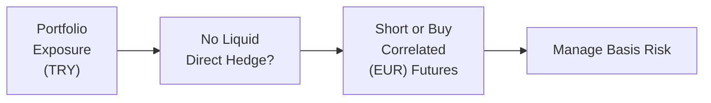

## Introduction

Let’s say you’re overseeing a global equity portfolio with investments spanning half a dozen currencies. You want to manage your currency exposures efficiently, but you know that hedging each currency individually might become prohibitively complex or expensive. Or perhaps you discover that one of the currencies you hold doesn’t really have a liquid forward market. What do you do? This is the kind of situation where cross-hedges, macro-hedges, and minimum-variance-hedge ratios can help streamline your currency risk management.

Below, we’ll explore how cross-hedging might help when direct hedges are not readily available, why macro-hedging can be a strategic choice for broader portfolio protection, and how you can use minimum-variance-hedge ratios to statistically optimize your hedge levels. We’ll also talk a bit about the complexities—like basis risk and correlation breakdowns—that can arise along the way.

## Cross-Hedges

Cross-hedging means using a related currency or instrument—often one that is more liquid or more accessible—to hedge exposures in another currency. Picture this scenario: you have a substantial exposure to a currency with thin liquidity (maybe, oh, I don’t know, the Argentine peso). You can’t find a convenient futures or forward contract for the Argentine peso, so you might instead short a similar or correlated currency (for instance, the Brazilian real) to hedge that exposure.

• Rationale: Cross-hedging is usually about pragmatism. If the direct hedge isn’t cost-effective or even possible, a correlated currency can (in principle) provide a partial hedge.  
• Correlation: The success of a cross-hedge depends heavily on the relationship between the “target” currency that you hold and the “proxy” currency you’ve chosen to offset it. If these two currencies move in similar directions most of the time, you’ll be in better shape.  
• Basis Risk: However, no correlation is perfect in the real world, and that’s where things can get tricky. If the correlation breaks down, your cross-hedge might not hedge as much as you hoped. This mismatch between the original exposure and the hedging instrument is sometimes referred to as basis risk.

You may remember times when currencies that “supposedly” move together suddenly diverge. For example, a crisis in one country could cause the local currency’s value to plummet, while a historically correlated neighbor only goes down a fraction of that. This leads to a partial hedge rather than the full protection you might have expected. But hey, sometimes partial is better than nothing, right?

### Elementary Cross-Hedge Example

Imagine you have a portfolio with exposure to the Turkish lira (TRY). For liquidity or pricing reasons, you can’t hedge the lira directly. You notice that the lira historically shows a relatively stable correlation with the euro (EUR). You might choose to short EUR forward contracts or futures to hedge part of your Turkish lira exposure. This cross-hedge works as long as TRY and EUR maintain their historical correlation. If they diverge, you’ll have some residual unrealized hedging gain or loss you didn’t plan for.

Here’s a quick look at the decision flow in cross-hedging:

In that diagram, once you realize you can’t directly hedge the TRY, you might shift over to hedging in the EUR. The final step is about monitoring and continuously tweaking that position because the correlation can slip.

## Macro-Hedges

A macro-hedge is basically your big-picture defense. Instead of meticulously matching hedges to every single currency or security, you might position a broader hedge to offset a common macroeconomic or market risk. For example, if you manage a global equity portfolio that’s 40% denominated in euros, 30% in Japanese yen, and 30% in Canadian dollars, you might simply short an aggregated currency index or use certain macro-level instruments that react to the broader environment.

• Rationale: Macro-hedging is often chosen when dealing with large, multi-pronged exposures. Rather than micro-managing each currency pair, you “cover the biggest lumps of risk.”  
• Over- or Under-Hedging: A big trade-off is that you might not be perfectly hedged on a currency-by-currency basis. The overall portfolio volatility could come down, but certain holdings might remain more exposed to currency swings than you anticipated.  
• Cost Reduction: Macro-hedges may cost less in transaction and monitoring fees than many separate micro-hedges. That said, if you’re extremely precise about each exposure, a macro-hedge can feel a bit blunt.  
• Example: Hedging “Global Recession Risk.” Suppose your entire multinational portfolio does well when global growth is strong. You expect a potential downturn, so you might use futures on a broad equity or multi-currency index that historically declines when recession risk rises, effectively macro-hedging your portfolio’s biggest risk driver.

Macro-hedges usually require rebalancing over time, especially if your portfolio composition changes or if certain economies decouple from the global cycle. You may have started with a big short on a basket of G10 currencies to hedge your exposure to a group of correlated emerging market currencies. But when the macro environment changes, you might have to reevaluate how tightly that G10 basket still matches your risk.

## Basis Risk and Correlation Breakdown

Both cross-hedges and macro-hedges can introduce the dreaded basis risk, which is the difference between the exposure you have and the performance of the hedge instrument. If you imagine that your real exposures are hugging one line on the price chart while your hedge track is hugging another line, well, the difference between the two lines is your basis risk. 

Why does basis risk matter so much? Because if the correlation that you’re banking on changes significantly, you can end up with a hedge that’s far less effective—or even negative. As a result, it’s crucial to track correlation patterns, reevaluate them periodically, and stand ready to adjust or “roll” your hedges.

## Minimum-Variance-Hedge Ratio

Sometimes, foreign exchange exposures are uncertain but not entirely random. If you can measure the historical relationship between your base currency returns (or portfolio returns) and some hedging instrument, you can estimate the hedge ratio that reduces your overall return volatility. This is the so-called minimum-variance-hedge ratio (MVHR). 

Conceptually, you can think of the MVHR like this:


h^* = \frac{\text{Cov}(R_{p},\,R_{f})}{\text{Var}(R_{f})}


• \\( R_{p} \\) is the return of the underlying exposure (e.g., the currency or asset you want to hedge).  
• \\( R_{f} \\) is the return of the hedging instrument (e.g., a currency futures contract).  
• \\( \text{Cov}(R_{p}, R_{f}) \\) is the estimated covariance between your exposure’s returns and the hedging instrument’s returns.  
• \\( \text{Var}(R_{f}) \\) is the variance of the hedging instrument’s returns.

Once you figure out \\( h^* \\), you’ll have the fraction or multiple of the exposure you should hedge to minimize volatility. You might discover you need to hedge 80% or 120% of your underlying position. That might feel counterintuitive—hedging more than 100%—but in certain market regimes, an “over-hedge” can actually reduce net variance if the correlation structure calls for it.

### Real-World Example of MVHR

Let’s consider a U.S. investor with a portfolio denominated in British pounds (GBP). The investor can hedge with GBP futures traded on the CME. Using three years of weekly historical data, they run a regression of (a) the weekly returns on the portfolio in USD terms vs. (b) weekly returns on the GBP futures in USD terms. The regression says the slope coefficient is 0.85. That slope is your approximate MVHR. So, they decide to hedge about 85% of that portfolio’s notional GBP exposure with GBP futures. 

In good times, this approach drastically reduces the volatility of the portfolio, saving you a bunch of sleepless nights if the pound free-falls. However, you’ll also want to watch out for cost. Rolling the futures and adjusting the position as the portfolio changes can rack up transaction expenses.

## Monitoring & Implementation

Sticking to cross-hedges, macro-hedges, or minimum-variance hedges isn’t a one-off deal. In practice, you’ll want to:

• Revisit Correlations: Currencies and macroeconomic linkages evolve. For instance, some emerging markets might delink from the U.S. dollar during times of severe capital flight. Or correlations might go from +0.8 to +0.2.  
• Evaluate Market Liquidity: If the liquidity changes (e.g., the forward market for your target currency gets deeper or cheaper), you might move away from a cross-hedge to a direct hedge.  
• Adjust the Hedge Ratio: If you rely on a minimum-variance approach, recalculate your ratio periodically to capture updated market data.  
• Watch for Macro Events: A central bank announcement can rapidly alter currency dynamics. A macro-hedge that worked last quarter can be outdated the next day if, for instance, the central bank decides on an unexpected interest rate change.

## Practical Considerations

• Transaction Costs & Slippage: Sometimes you pick a cross-hedge only because it’s cheaper to trade that instrument. Yet, if the correlation is too low, you might end up “throwing money away” if the hedge fails.  
• Complexity vs. Benefit: Macro-hedges look simpler but can overlook currency-specific nuances. You might hedge your entire currency basket exposure, but perhaps one or two big exposures remain dangerously under-hedged.  
• Regulatory & Tax Constraints: In some jurisdictions, derivatives usage is restricted or taxed differently, influencing your hedge choice.  

## Personal Anecdote

Some years back, I worked with a small firm that sold consumer products in multiple European countries. We had big exposures to the euro (EUR), Swiss franc (CHF), and British pound (GBP)—but not enough volume in any single market to do direct hedges for each currency without incurring large fees. We ended up implementing a macro-hedge using a basket of European currency futures, weighting each to approximate 70% of our combined currency exposure. Did it work perfectly? Well, no. We definitely got caught off guard when the Swiss National Bank famously dropped its currency peg, and the CHF soared. Our macro-hedge cut total volatility, but we still felt that painful move on the unhedged portion of our Swiss revenue. You can bet we watched correlations a lot more closely after that.

## Exam Tips

• Show how you would design and implement a cross-hedge in a step-by-step format—this can appear in constructed-response (essay) format.  
• Make sure to mention basis risk in item-set or essay questions. The CFA exam often tests your understanding of correlation risks.  
• For minimum-variance-hedge ratio problems, be prepared to calculate the hedge ratio if given covariance and variance data. Sometimes, the exam might also test your interpretation of the slope from a linear regression.  
• Practice scenario-based questions. For instance, the exam might describe a situation where direct hedging is too costly, and you must decide on an alternative. Knowing the trade-offs is crucial.  
• Time management: When a question asks you to analyze the appropriateness of a macro-hedge, focus on efficiency gains, cost savings, and potential mismatch to score points.  

## References and Further Reading

• Adler, M. and Dumas, B. “International Portfolio Choice and Corporation Finance: A Synthesis.” Journal of Finance.  
• Chow, E.H., Lee, W.Y., and Solt, M.E. “The Economic Exposure of U.S. Multinational Firms.” Journal of Finance.  
• Silvapulle, P. and Moosa, I. “The Cost of Imperfect Hedging.” Journal of International Financial Markets.  
• Additional industry white papers from leading currency overlay managers that discuss dynamic hedge ratio models.

## Test Your Knowledge: Cross‑Hedges, Macro‑Hedges, and Minimum‑Variance‑Hedge Ratios Quiz



### Which of the following best describes a cross-hedge?

- [ ] Hedging multiple currencies with a single instrument indexed to the broad market
- [x] Hedging exposure to one currency using a correlated but different currency
- [ ] Hedging partial currency exposure by taking small positions in multiple correlated currencies
- [ ] Hedging currency exposure by switching from forward contracts to futures

> **Explanation:** A cross-hedge uses a related or correlated currency (or instrument) to hedge exposure in a currency for which direct hedging might be costly or unavailable.

### Which outcome is the most significant disadvantage of cross-hedging?

- [ ] Increased liquidity
- [ ] Lower costs
- [x] Basis risk from imperfect correlations
- [ ] No need for rebalancing

> **Explanation:** With a cross-hedge, correlations among currencies can change, resulting in basis risk. This leads to an imperfect hedge.

### Why might an investor choose a macro-hedge rather than a currency-specific hedge?

- [x] To manage overall portfolio risk through a single aggregated position
- [ ] To eliminate basis risk
- [ ] To modify each currency exposure individually
- [ ] To avoid rebalancing frequency altogether

> **Explanation:** Macro-hedges aim to reduce overall portfolio volatility by covering multiple exposures in a single or small set of trades. This can be cheaper and more straightforward, though less precise.

### In the minimum-variance-hedge ratio framework, which statistical measure is typically used to determine the hedge ratio?

- [x] The slope coefficient from a regression of portfolio returns on hedging instrument returns
- [ ] The intercept from a time-series regression of total returns
- [ ] The standard deviation of hedged returns
- [ ] The beta from the Capital Asset Pricing Model

> **Explanation:** The MVHR is usually captured by the slope coefficient in a regression of the portfolio’s returns versus the hedging instrument’s returns, which approximates Cov/Var.

### A portfolio has exposure to a currency with no liquid forward market. Which approach would typically be used to hedge?

- [ ] A short forward on the same currency
- [ ] A currency swap on the same currency
- [x] A cross-hedge with a correlated currency’s forward contract
- [ ] No hedge at all

> **Explanation:** When the direct forward market is illiquid, a cross-hedge may be the best approach, using a currency or instrument that shows correlation with the currency in question.

### One advantage of a macro-hedge over multiple individual hedges is:

- [x] Lower transaction and oversight costs
- [ ] Precise currency-specific coverage
- [ ] Zero correlation risk
- [ ] Less frequent variance in exposures

> **Explanation:** By consolidating the hedging process, macro-hedges can reduce transaction costs and management complexity.

### Which of the following might cause a breakdown in a cross-hedge?

- [x] A sudden, uncorrelated event that impacts the proxy currency but not the target currency
- [ ] Improvements in liquidity for the target currency
- [x] Divergent central bank policies in correlated countries
- [ ] Perfect foresight of currency movements

> **Explanation:** A cross-hedge depends on stable correlations. If an event dramatically affects the proxy currency’s value but not the original currency, the hedge can fail unexpectedly.

### What does basis risk refer to in the context of currency hedging?

- [ ] Risk from using exactly the same currency for hedging
- [ ] Risk that the forward or futures contract will expire worthless
- [ ] Absence of correlation risk
- [x] Residual risk arising from imperfect correlation between the hedge instrument and exposure

> **Explanation:** Basis risk is the difference between the position being hedged and the performance of the hedge instrument.

### A portfolio manager using a macro-hedge might inadvertently over- or under-hedge because:

- [x] Specific currency exposures within the portfolio may deviate from the average behavior the macro-hedge assumes
- [ ] The portfolio is too large to hedge effectively
- [ ] There are no differences between macro-hedges and cross-hedges
- [ ] Correlation risk does not exist in macro-hedges

> **Explanation:** Macro-hedging provides a broad coverage and may neglect exact offsets for specific currency exposures, leading to potential over- or under-hedging.

### In a regression-based approach, if the slope coefficient (MVHR) for a given currency hedge is 1.2, this suggests:

- [x] The manager may hedge 120% of the exposure for minimum variance
- [ ] The manager should hedge exactly 20% of the exposure
- [ ] The manager does not hedge at all
- [ ] The manager must invert the slope to get 0.83

> **Explanation:** A slope of 1.2 implies that a hedge ratio of 120% (relative to the exposure) may minimize variance.


