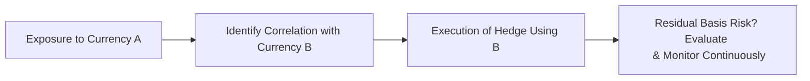

## Introduction and Context

Managing currency exposures in emerging markets (EM) can feel like a bit of a roller coaster ride—sometimes it’s exhilarating, but it can also leave you feeling a little queasy. And if you’ve ever tried to hedge a volatile currency (like I did years back with the Argentinian peso), you’ll know exactly how fast the ground can shift beneath your feet. In this section, we’ll explore the major challenges facing global investors when dealing with EM currencies. We’ll talk about the underlying sources of volatility, how political and economic conditions can escalate risk, and why liquidity constraints make it tough to execute standard hedging strategies. We’ll emphasize practical solutions, note best practices, and discuss pitfalls you want to avoid—particularly when you’re tested on this in the CFA Level III exam context.

## Key Drivers of Volatility and Liquidity Constraints

Compared to developed market currencies, EM currencies often exhibit significantly higher volatility and lower liquidity. This is partly because markets for EM currencies can be dominated by a smaller set of market makers, producing wide bid-ask spreads. Slippage—essentially the difference between your target trade price and the actual executed price—becomes more evident in such a thin market.

High volatility also arises from less predictable macroeconomic factors. Inflation rates, for example, are frequently more volatile in emerging economies. Monetary policy changes, central bank directives, and fiscal policy shifts can catch the market off guard, driving sudden exchange rate movements. This environment demands larger “price buffers” in the form of wider spreads and can inflate transaction costs. Investors find themselves constantly juggling liquidity risk, trying to ensure they can enter and exit positions at reasonable prices.

### Why This Matters

• Transaction Costs: With limited liquidity, you can face multiple ticks of slippage, eroding potential returns and increasing hedging costs.  
• Risk of Forced Liquidation: In a stressed scenario, liquidity might vanish overnight, forcing you to liquidate at suboptimal prices.  
• Hedging Execution Delays: When it gets busy, or a major shock hits, forward or swap dealers may pause quoting altogether in some EM currency segments.

## Political Instability and Low Transparency

Emerging markets often have unique political regimes: from sudden regime shifts and nationalizations to frequent sudden changes in central bank leadership. If you’re an investor hedging an EM currency, you have to be on high alert for events like elections, policy changes, and capital controls that could pop up with little notice. The regulatory framework might also be opaque, featuring spotty enforcement or contradictory rules.

Sometimes, authorities might impose capital controls—government restrictions on the movement of currency across borders—that can disrupt the flow of funds for non-residents. You might recall that convertibility risk (the risk that a currency cannot be converted into another due to local laws or capital controls) lurks behind many EM markets. And when these controls get activated, foreign investors who thought they had an easy time repatriating profits or rebalancing hedges could find themselves stuck.

### Example: Sudden Capital Controls

Imagine you’re managing a portfolio exposed to a high-growth EM currency and rely on standard forward contracts to hedge. Then the local government imposes fresh capital controls overnight that restrict your ability to convert that currency back to USD (or EUR, JPY, etc.). Now your forward contracts are practically useless. You can’t deliver the currency as required and end up in breach of your hedge obligations. Maintaining fallback arrangements such as cash balances in more liquid currencies or using cross-hedges in a correlated currency can mitigate (though not eliminate) this scenario.  

## Central Bank Interventions

It’s no secret that certain EM central banks step in heavily to manage (or manipulate) their exchange rates. Such interventions can take the form of direct market operations (buying or selling foreign currency reserves), tweaking interest rates in abrupt fashion, or restricting FX dealers’ operations. These policy interventions may ail foreign investors who rely on stable or at least transparent currency regimes. One day, a free float might exist; the next, a fragmented managed float with explicit daily reference rates might be imposed. 

### Navigating EM Currency Intervention

• Keep an eye on central bank announcements: Monitor changes in reserve requirements, transaction taxes, or special duties on FX trading.  
• Check official vs. unofficial (or parallel) currency rates: If the official rate is pegged or artificially supported, a black market rate may reflect “true” demand-and-supply conditions.  

## Inflation and Interest Rate Differentials

In emerging economies, inflation can spike rapidly. When inflation runs hot, central banks often raise interest rates. Such moves might prop up the currency—at least in the short run—but also introduce higher costs for hedging. Forward markets quote forward points based on local and foreign interest rate differentials, which can be unpredictable in EM contexts.

### Illustrative Formula: Uncovered Interest Rate Parity

Under uncovered interest rate parity, the expected future spot rate can be estimated by:


S_{t+1} = S_t \times \frac{1 + i_{\mathrm{domestic}}}{1 + i_{\mathrm{foreign}}}


In many EM countries, \\( i_{\mathrm{domestic}} \\) can be quite large relative to a developed market foreign rate. The spot rate might reflect a risk premium for exchange rate uncertainty, making forward quotes expensive. Moreover, if the local central bank adjusts rates unpredictably, forward quotes can lurch suddenly, complicating your hedging program.

## Hedging Instruments and Market Structure

When hedging, you can use forward contracts, currency swaps, or currency options (puts or calls). But in practice, EM markets often lack the same depth or standardization as G10 currency markets. Some EM currency forward curves may be reliable for only a few weeks or months rather than multiple years. Options, if available, can have large bid-ask spreads, making them expensive to execute. Liquidity might also be highly concentrated in short-term maturities, leaving longer-term exposures effectively unhedged or more difficult to hedge at palatable costs.

### Options in EM Currencies

• Wide Bid-Ask Spreads: If a local currency is prone to sudden swings, options dealers price that risk into large spreads.  
• Limited Tenors: You might only find 1-month or 3-month tenors at workable liquidity, forcing constant rollover.  
• Higher Implied Volatility: The implied volatility for EM currency options can be significantly higher than for developed currencies, since dealers anticipate more abrupt moves.

## Proxy and Cross-Hedge Approaches

Because direct hedges are expensive or unavailable, investors often rely on proxy hedges—hedging a less liquid currency with a more liquid but correlated one. For instance, if you can’t easily hedge a small frontier market currency, you might hedge with a better-traded EM currency that tends to move in tandem. But that correlation can break down precisely when you need it most, which is known as basis risk. Another alternative is cross-hedging via major currencies (like the USD or EUR) if they show a historical correlation with the illiquid EM currency.

### Diagram: Illustrative Cross-Hedge Approach

Below is a simple Mermaid diagram showing how an investor with an exposure to Currency A (illiquid) uses Currency B (more liquid, correlated) to hedge:

Notice how we move from identifying the correlation to executing the hedge, all the while understanding there will likely be some mismatch (basis risk) and a need for ongoing monitoring.

## Data Reliability and Risk Modeling

Accurate analysis of historical volatilities or correlations demands a sufficiently robust dataset. In emerging markets, the challenge is that data may be incomplete, particularly for more volatile periods (data gaps might arise precisely when major stress events happened). On top of that, regulatory frameworks and currency regimes can change so frequently that past data might not capture the new environment. Even if you do get hold of data, you’ll want to watch out for questionable reliability.  

### Tips for Modeling EM Currency Risk

• Combine Quantitative with Qualitative Insights: Supplement historical data with real-time local news, central bank statements, and rating agency updates.  
• Continual Model Tuning: Because of regime changes and structural shifts, consider dynamic or rolling-window approaches.  
• Scenario Analysis and Stress Testing: Rely on forward-looking scenario analyses rather than purely historical VaR or volatility metrics.

## Cultural, Legal, and Regulatory Complexities

It might sound obvious, but a deep understanding of the local market environment is crucial. Some countries place strict rules on which institutions can trade FX derivatives. Others limit currency dealings entirely to onshore banks. And local fingerprinting—like certain registration requirements with the central bank—can introduce operational friction or slow transaction speed.

Regulatory compliance missteps could result in fines, invalid contracts, or even a forced unwinding of positions. In some countries, local authorities or regulators might require pre-approval before you can hedge large notional amounts. Make sure you coordinate with local counsel or compliance teams to keep your bases covered.

## Practical Example: A Southeast Asian Currency Hedge

Say you manage a global equities portfolio that includes substantial exposure to a Southeast Asian equity market. You suspect the local currency could depreciate significantly over the next quarter, so you plan to lock in a forward contract. Everything goes well until fresh political tensions spark protests. Soon the central bank imposes daily exchange-rate limits. Your counterparty contacts you, saying they can’t source local currency anymore at your agreed-upon forward rate. Suddenly, you’re forced to renegotiate. The cost to remain hedged doubles. Meanwhile, your onshore broker warns that if the currency’s daily fluctuation hits the new limit, it might trigger a trading halt.  

It’s a real puzzle—keep the hedge and pay significantly more, or drop it and ride out the volatility. The lesson: EM hedging strategies must remain dynamic, and you should be prepared for situations where your ideal hedge no longer matches the real market environment.

## Best Practices

• Diversify Currency Exposures: Don’t let a single EM currency exposure dominate your portfolio. Spreading risk across multiple currencies can reduce overall volatility.  
• Pre-Arrange Credit Lines and Margin: Make sure your main derivative counterparties understand your EM exposures and have sufficient credit or margin lines to support large movements.  
• Continuous Monitoring: Stay up-to-date on local politics, leadership changes at the central bank, inflation data releases, and other announcements.  
• Layered Hedging Approach: Instead of one large hedge, consider scaling into or out of positions in stages. This helps manage market impact and slippage.  
• Local Experts: Engage with local banks, brokers, and experts who have an on-the-ground perspective.  
• Stress Testing: Develop “worst-case” scenarios for sudden extreme currency depreciation or appreciation.  

## Common Pitfalls

• Over-Reliance on Historical Correlations: A break in correlation between your EM currency and its proxy hedge can be financially painful.  
• Ignoring Convertibility Risk: Even if you set up a perfect hedge, local capital controls can render it moot.  
• Timing Gaps: Relying on short-term instruments can lock you into constant rollovers, which come with uncertain costs.  
• Underestimating Operational Hurdles: Slower compliance checks, unique onshore settlement requirements, and language barriers can all hamper well-intended strategies.  

## Exam Relevance and Tips

In the CFA Level III context, exam questions often challenge you to propose hedging strategies under uncertain political or economic conditions. You might see scenario-based prompts asking:  
1. Should you hedge an EM currency that has wide bid-ask spreads and uncertain capital controls?  
2. What is the best approach if standard forwards are expensive or practically unavailable?  
3. How do you manage basis risk when using a proxy hedge?  

In constructed-response questions, you’ll be expected to:  
• Demonstrate an understanding of how quickly EM currency regimes can shift.  
• Show you can weigh the trade-offs among forwards, swaps, and options.  
• Integrate risk budgeting: deciding how much of the portfolio to hedge and for how long.  
• Spot operational or regulatory constraints.  

Time management is crucial. For multi-part items, answering thoroughly but concisely is key—especially under exam pressure. Outline your reasoning, reference relevant theoretical frameworks, and provide a well-structured conclusion. Don’t forget to mention the potential for capital controls or regulatory changes if the scenario hints at political instability. That small detail can be a differentiator in earning maximum partial credit.

## References and Further Reading

Reinhart, C. and Rogoff, K. “This Time Is Different: Eight Centuries of Financial Folly.”  
Devereux, M.B. and Sutherland, A. “Country Portfolios in Open Economy Models.” Journal of the European Economic Association.  
BIS (Bank for International Settlements) papers on emerging market currency liquidity and structure.  
IMF publications on capital controls and currency regime classifications.

---

## Test Your Knowledge: Managing Emerging Market Currency Exposures



### Which factor most commonly contributes to the higher transaction costs in EM currency markets?

- [ ] Strict collateral requirements
- [ ] Widespread use of algorithmic trading
- [x] Wider bid-ask spreads due to lower market liquidity
- [ ] Absence of capital controls

> **Explanation:** In EM currency markets, liquidity is often low, causing market makers to quote wider bid-ask spreads. This elevates transaction costs, especially when volatility is high.

### Which best describes the risk that governments can abruptly restrict conversions between local and foreign currencies?

- [x] Convertibility risk
- [ ] Liquidity risk
- [ ] Settlement risk
- [ ] Inflation risk

> **Explanation:** Convertibility risk arises when authorities impose restrictions on currency conversions. While liquidity risk relates to the ability to trade at a stable price, convertibility risk is about outright prohibition or limitation on cross-border flows.

### If you cannot directly hedge a small frontier market currency due to excessive costs, which approach might be most effective?

- [ ] Buy a currency put option on the frontier currency
- [x] Use a proxy hedge using another EM currency that exhibits a high positive correlation
- [ ] Ignore hedging altogether
- [ ] Rely exclusively on cross-currency basis swaps

> **Explanation:** A proxy hedge aims to mitigate currency risk when direct hedging is either too costly or unavailable. While it introduces basis risk if correlations shift, it may still be the most viable option for illiquid currencies.

### How do inflation differentials typically affect the cost of hedging EM currencies with forward contracts?

- [x] They increase forward premiums or discounts, making hedging more expensive
- [ ] They render forward contracts illegal
- [ ] They reduce the motivation to hedge
- [ ] They eliminate cross-hedge feasibility altogether

> **Explanation:** When an EM currency’s local interest rates are higher (often due to elevated inflation), forward contracts reflect that differential. Investors typically pay higher costs to hedge.

### Which of the following is a key downside of relying on historical correlations for EM currency hedging?

- [x] Correlations may break down in periods of market stress
- [ ] The correlation measure is too simple to compute
- [x] It introduces basis risk if market conditions change
- [ ] It guarantees future performance because past data is always reliable

> **Explanation:** While historical correlations can inform decisions, they aren’t guaranteed to hold during extreme market conditions. This breakdown introduces basis risk, and that can leave an investor under-hedged or over-hedged when volatility spikes.

### A sudden regulatory shift imposes daily exchange-rate movement limits. Which EM currency risk factor does this exemplify?

- [x] Central bank intervention
- [ ] Perfect correlation risk
- [ ] Political stability risk
- [ ] Convertibility risk only

> **Explanation:** Daily limits on exchange-rate movements constitute a form of policy intervention, effectively restricting how far the currency can move in a single day. This disrupts normal market functioning.

### Why might options on EM currencies have especially wide bid-ask spreads?

- [ ] They are typically traded on well-regulated exchanges
- [ ] They tend to have zero implied volatility
- [ ] EM currencies always appreciate, reducing option demand
- [x] Liquidity is lower than in major currency markets, and dealers incorporate higher volatility risk

> **Explanation:** The relative illiquidity in EM currency options markets and higher perceived risk lead dealers to quote wide bid-ask spreads, passing on the uncertainty cost to investors.

### Which strategy might mitigate the risk that a forward hedge becomes invalid when capital controls are suddenly imposed?

- [ ] Using forward contracts with longer maturities
- [ ] Negotiating a lower notional amount
- [ ] Ignoring local market announcements
- [x] Supplementing with a cross-hedge or holding partial cash reserves in liquid currencies

> **Explanation:** If capital controls make direct conversion impossible, you may be unable to deliver on your forward contract obligations. A cross-hedge with a more liquid currency or maintaining on-hand reserves in a convertibility-friendly currency can provide flexibility.

### When an emerging market central bank pegs its currency to the US dollar, which of the following statements is correct?

- [x] The official exchange rate may detach from market fundamentals, encouraging a parallel or black market
- [ ] Investors always enjoy zero hedging cost
- [ ] There is no risk of volatility
- [ ] The currency can’t depreciate

> **Explanation:** An artificial peg can distort normal market forces, and a parallel market rate might develop if the official peg becomes untenable or is maintained through capital controls.

### True or False: Proxy hedging for EM currencies completely eliminates basis risk.

- [ ] True
- [x] False

> **Explanation:** Proxy hedging exposes the investor to basis risk—the risk that the proxy currency might not move exactly in tandem with the target currency. While it can reduce overall EM exposure, it never fully eliminates mismatch risk.


