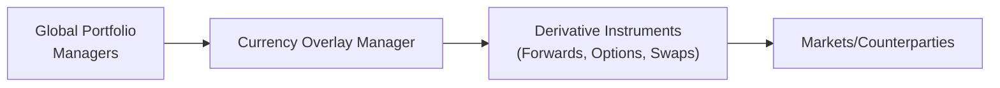

## Overview and Rationale

Currency overlay is a specialized approach where currency exposures are managed independently from the underlying portfolio assets. Imagine you’re running a multi-manager global equity and fixed-income strategy, each external manager actively picking stocks or bonds worldwide. Before you know it, your portfolio is crisscrossed with a patchwork of uncoordinated currency positions. That’s when the idea of a single currency overlay manager swoops in, promising to tackle all the currency risk in a unified manner.

The overarching benefit of an overlay is straightforward: By consolidating currency exposure under one manager or program, you (the investor) get a consistent hedge ratio across your entire portfolio without constantly worrying about each individual external manager’s currency trades. The overlay manager can do something as simple as maintaining a passive hedge at a fixed ratio (like 100% or 50% hedged in certain currency exposures) or get fancy and actively deviate from that ratio to seek additional alpha. 

Sometimes it feels like orchestrating a large music ensemble. Each musician (manager) is incredibly skilled in playing their piece, but the conductor (overlay manager) ensures everyone is in tune when it comes to currency exposure—so your portfolio’s “music” stays in harmony.

## Passive vs. Active Overlay Management

Broadly speaking, overlay management strategies fall under either passive or active approaches. The difference may sound simple, but in practice, it totally changes how the manager operates:

• Passive Overlay:  
  - Aims to establish and maintain a set hedge ratio with minimal discretion.  
  - The manager typically rolls forward currency contracts or uses similar instruments to keep the portfolio’s hedges at target levels.  
  - The primary objective is risk reduction, not alpha generation.  

• Active Overlay:  
  - Designed to add value through tactical adjustments—sometimes even short-term trades intended to exploit perceived mispricing in currency markets.  
  - The manager may deviate from the neutral hedge ratio if they believe certain currency pairs could yield profitable moves.  
  - Typically, this arrangement might include performance fees if the manager outperforms a benchmark or a custom baseline.

The fundamental mechanics for each approach can be quite similar (they both often rely on forward contracts or options). The main distinction lies in the level of discretion granted to the manager to adjust hedge ratios.

## The Case for Centralized Currency Risk Management

You might wonder: Why not just hedge currency exposure inside each manager’s mandate? Well, for large institutional investors with multiple external managers, each one might have a different perspective on hedging—some might hedge partially, others not at all, and a few might hedge everything. Inconsistent currency strategies can lead to:

• Overlapping or offsetting hedges that unnecessarily rack up transaction costs.  
• Unclear accountability: Did the equity manager’s good results come from currency movements, or from their stock picking?  
• Difficulty tracking currency positions across various managers and custodians.

Enter the overlay manager, who consolidates all those currency exposures, decides on the broad hedging policy, and removes duplication. This not only yields clarity in performance attribution—since currency alpha is distinctly measured from the underlying portfolio alpha—but also can lower your overall costs by netting exposures.

Below is a simple diagram illustrating how a currency overlay manager sits atop multiple underlying managers:

## Approaches to Implementing an Overlay

Overlay structures typically rely on a derivatives-based approach (i.e., “notional” hedging), where only the currency risk is hedged or shaped—no physical exchange of capital is needed unless the forward contracts are settled. Let’s walk through a few steps generally involved:

• Identify and Aggregate Exposures: The overlay manager receives regular updates on all foreign currency exposures from the underlying portfolio managers.  
• Determine the Target or Neutral Hedge Ratio: This can be, for example, 50% of JPY exposure, 75% of EUR exposure, etc. Some investors choose 100% for certain currencies.  
• Execute Derivative Trades: Typically, forward or swap contracts are used to offset (or sometimes add to) currency exposures.  
• Monitor and Adjust: The overlay manager monitors currency markets and the portfolio’s changing exposures, rolling and adjusting positions as necessary (often monthly or quarterly).  
• Performance Measurement: The currency alpha is tracked separately, allowing the investor to see how successful the overlay program is.

### Example: Calculating a Hedge Ratio  
A simplified hedge ratio can be expressed as:


\text{Hedge Ratio} = \frac{\text{Value of Exposure Hedged}}{\text{Total Currency Exposure}}


For instance, let’s say your portfolio is large and has a $100 million exposure to EUR. If your policy is to hedge 50% of that exposure passively, the overlay manager might set up forward contracts (sell EUR, buy USD) for $50 million notional. Over time, the manager adjusts if the EUR exposure or policy guidelines change.

## Benefits of Currency Overlays

• Transparency: You keep your underlying managers’ strategies intact, while currency risk is addressed in a separate program—a neat clean line that helps performance attribution.  
• Scalability: The approach can be scaled up quickly as the portfolio grows or changes.  
• Cost Efficiency: Centralizing currency trades in one overlay avoids duplication and might reduce spreads and transaction costs.  
• Expertise: Overlay managers are often specialists in currency markets, with advanced systems for tracking exposures and sophisticated approaches for rolling forward positions.  

From a personal perspective, the first time I worked with a currency overlay manager, I remember being amazed (and maybe a bit relieved) at how it all came together. We had multiple global equity managers each doing their thing—North American, European, and Asian strategies. The overlay manager stood above them all, ensuring that our euro and yen exposures were properly hedged to the tune we wanted, all neatly reported in one sheet. It almost felt like a magic trick: the portfolio risk was streamlined, and we had a clearer view of how the managers were truly performing in their respective stock selection.  

## Performance Fees and Contractual Arrangements

When overlay managers offer active overlays, they might charge a performance fee if they generate returns above a certain benchmark or hurdle rate. This—like other performance-based structures—can lead to alignment of interests, but also has potential pitfalls:

• Fee Structures: Performance fees can be structured with high-water marks or other features (just like in hedge funds).  
• Monitoring: The investor must ensure that the manager is not taking on undue risk in pursuit of performance fees.  
• Benchmark Choice: The question arises: What is the “neutral” baseline for currency? A fully hedged benchmark? A partially hedged index? Or do you measure alpha relative to no hedge at all?

In practice, the performance fee can be quite appealing if markets move in ways that reward the manager’s currency calls. Just be aware of the need for robust oversight to ensure prudent risk-taking.

## Performance Measurement and Currency Alpha

One of the coolest aspects (okay, maybe “cool” is an exaggeration, but it’s still neat) of an overlay approach is how it isolates the contribution of currency management. If your equity and fixed-income managers are all brilliant at picking assets, their “alpha” might get diluted or amplified by random currency movements. By contrast, when those currency exposures are managed through a separate overlay:

• Currency Alpha is measured specifically from currency strategies, separate from underlying asset returns.  
• Enhanced Attribution: The investor can see if overall outperformance (or underperformance) is coming from securities selection or from currency management.  
• Clarity in Manager Evaluation: Gains or losses from currency no longer mask the fundamental performance of the primary managers.

Investors often track the overlay performance relative to a benchmark hedge strategy—say, a consistently applied 50% hedge on each currency. The difference in returns can highlight how effective the active overlay is.

## Risk Management for Overlays

Handling an overlay program comes with its own brand of risk. Just because it’s “only currency” doesn’t mean the potential pitfalls are minimal. Key risk areas include:

• Drawdown Limits: If the overlay manager gets aggressive and a currency position goes against them, you could see a negative impact that might overshadow your main portfolio’s performance. Setting specific drawdown limits helps keep losses in check.  
• Counterparty Credit Risk: When using forwards or swaps, the manager relies on a bank or dealer. Overlay programs must ensure these counterparties are creditworthy and that any necessary collateral or margin requirements are well-managed.  
• Liquidity Needs: If the market moves sharply, margin calls on derivatives might require you to post collateral. Having a plan in place for short-term liquidity is crucial.  
• Rebalancing Frequency: Risk can accumulate if exposures are not monitored frequently, especially in rapidly moving currency markets.

Overlay managers typically share risk reports indicating the net currency exposures (both underlying and overlaid positions), VaR (value at risk) measurements, and scenario analyses that reveal how the combined exposures respond to various market shocks. 

## Practical Example: Multi-Manager Portfolio

Let’s say you have an endowment fund that invests with three external managers:

• Manager A focuses on European equities.  
• Manager B invests in Japanese bonds.  
• Manager C invests in a global equity strategy that includes multiple currencies.  

Each manager may or may not manage currency exposures differently (some might hedge partially, some not at all). A currency overlay manager can step in, collect data on net exposures in EUR, JPY, GBP, etc., and then unify the hedge. The endowment can be certain that overall currency exposure is aligned with their risk tolerance—maybe they want 75% of their EUR exposure hedged but only 50% of their JPY. They also might want to completely hedge smaller currency exposures like SEK or CHF.

By letting a single overlay manager handle all these currency decisions, the endowment gains a comprehensive “bird’s-eye view” of its true currency risk while leaving Managers A, B, and C free to do what they do best with asset selection. This overlay arrangement is even more beneficial if the overlay manager uses active views, attempting to generate a bit of extra alpha.  

## Common Pitfalls and Challenges

• Misalignment of Interests: If performance fees are vague or poorly structured, an overlay manager might take excessive risk.  
• Communication Gaps: If portfolio exposures aren’t communicated on time or accurately, the overlay can be based on outdated data, causing suboptimal or even contradictory positions.  
• Over-Complexity: If the overlay manager tries to run too many positions in exotic currencies or advanced option strategies, it might be hard for the investor to understand or monitor.  
• Cost Overruns: Derivatives can become expensive, especially in times of market stress when spreads widen.  

One subtle pitfall is hedging illiquid or less-traded emerging market currencies. If an overlay manager tries to actively manage these exposures, the cost and complexity could balloon quickly. In those cases, partial or simplified hedging might be more prudent.

## Exam Tips and Best Practices

Before we wrap up, let’s connect these concepts to what you might expect on the CFA Level III exam or real-world application:

• Know the Difference Between Passive and Active: Expect questions asking you to compare and contrast these two main overlay types, including cost implications, risk considerations, and performance measurement approaches.  
• Understand Hedge Ratios: The exam might present a scenario requiring a simple hedge ratio calculation—always be ready to do quick arithmetic on notional amounts.  
• Attribution: Watch for exam items where you are asked to separate currency alpha from the rest of the portfolio’s alpha. You might have to show how you’d measure currency performance relative to a benchmark.  
• Risk Management Scenarios: The exam loves bogeyman risk scenarios. You might see a question about a major currency move or a credit event at a derivative counterparty that upsets the overlay. Understanding how margin works and where the overlay manager stands is crucial.  
• Real-World Complexity: Remember, currency overlay decisions can be complicated when multiple managers or mandates are involved. The exam may need a thorough explanation of how consolidation helps reduce duplication.

## Glossary of Key Terms

• Currency Overlay Manager: A specialized manager responsible for hedging or actively managing currency risk within a broader investment portfolio.  
• Passive Overlay: Uses a pre-defined hedge ratio or systematic rules to maintain a stable hedge.  
• Active Overlay: Allows the overlay manager discretion to alter hedge ratios based on market views, aiming to generate alpha.  
• Notional Overlay: Derivatives-based hedging (forwards, options, swaps) that references a “notional” exposure amount—no actual principal is exchanged, except upon settlement.  
• Segregated Mandate: A distinct management agreement with specific parameters. In currency overlay, it’s used to define responsibilities, constraints, and objectives for the currency manager.  
• Currency Alpha: The extra return generated purely from currency trading and hedging decisions, separate from the underlying asset’s returns.  
• Hedge Consolidation: Combining all currency exposures under one overlay manager to reduce duplication and unify strategy.  
• Overlay Performance Fee: The fee an overlay manager may receive for generating currency alpha above a designated benchmark.

## Additional References and Further Reading

• Russell Investments. “Currency Overlay Services: A Guide to Implementation.”  
• Risk.net coverage on currency overlay performance metrics and implementation case studies.  
• Campbell, J.Y. and Viceira, L.M., “Strategic Asset Allocation: Portfolio Choice for Long-Term Investors.”  
• Industry whitepapers discussing overlay performance analytics and real-time monitoring systems.

---------------------------------------------------------------------------------

## Test Your Knowledge: Overlay Approaches in Currency Risk Management Quiz



### Which of the following best describes a currency overlay manager's primary function?

- [ ] Selecting high-alpha currency positions for speculative profit only
- [x] Managing currency exposures in a portfolio separately from underlying asset exposures
- [ ] Providing stock-picking services for international equities
- [ ] Consolidating asset allocations among multiple managers

> **Explanation:** A currency overlay manager’s primary responsibility is to handle currency exposures independently of the underlying portfolio assets, ensuring consistent and efficient currency risk management.

### In a passive overlay strategy, the overlay manager typically:

- [ ] Engages in frequent speculative trades based on market signals
- [ ] Avoids using notional hedging
- [ ] Prefers to use equity index futures rather than currency derivatives
- [x] Maintains a fixed or systematic hedge ratio with limited discretion

> **Explanation:** A passive overlay approach uses a steady, pre-defined hedge ratio without broad discretion to deviate based on market views.

### Why might an investor choose to centralize currency risk management with an overlay program rather than allow each external manager to self-hedge?

- [x] To avoid overlapping or contradictory hedges and reduce transaction costs
- [ ] To ensure each external manager holds identical underlying assets
- [ ] To eliminate the need for performance measurement of currency exposure
- [ ] To incur higher fees for more complex strategies

> **Explanation:** Centralizing currency risk with one overlay manager avoids redundancy, reduces costs, and provides better clarity in portfolio-level currency risk management compared to each external manager hedging independently.

### A fully hedged benchmark for currency overlay is best described as:

- [ ] One that takes a 0% currency hedge position at all times
- [ ] An index that never rebalances currency exposure
- [x] A reference where 100% of the foreign currency exposure is hedged back to the investor's base currency
- [ ] A scenario in which managers are free to make currency bets without constraints

> **Explanation:** A “fully hedged” benchmark for currency overlay typically assumes that all currency exposures are hedged, enabling measurement of active overlay performance relative to a 100% hedge.

### If an investor wants to limit their EUR exposure to exactly 50% of the total EUR amount, and the portfolio has EUR 20 million in exposure, how much should be hedged?

- [ ] EUR 10,000
- [ ] EUR 100,000
- [x] EUR 10 million
- [ ] EUR 20 million

> **Explanation:** A 50% hedge on EUR 20 million is EUR 10 million. The overlay manager would typically sell EUR 10 million forward to match the desired ratio.

### Which of the following is a key risk for currency overlay managers using forward contracts?

- [ ] Reliance solely on physical delivery of currency
- [x] Counterparty credit risk if the dealer or bank defaults
- [ ] Significantly higher transaction costs than cash equity trades
- [ ] Inability to hedge more than 25% of the exposures

> **Explanation:** Forward contracts expose the investor to the possibility that the counterparty (often a bank or dealer) could default, resulting in credit risk.

### When measuring currency alpha, the key principle is to:

- [x] Isolate returns from currency positions separate from the underlying asset returns
- [ ] Focus solely on the notional principal of derivatives
- [x] Disregard the effect of management fees on performance
- [ ] Combine equity returns and currency returns into a single measurement

> **Explanation:** Currency alpha should be measured as the value (positive or negative) created purely by currency positioning and hedging strategies, distinguishing it from performance attributable to underlying portfolio assets.

### Which statement about performance fees for currency overlay managers is correct?

- [ ] They are uncommon in actively managed currency overlays
- [x] They are sometimes used to align interests but can also encourage risk-taking
- [ ] They only apply if the overlay is fully passive
- [ ] They prevent currency overlay managers from using derivative instruments

> **Explanation:** Performance fees, while aligning interests by rewarding good performance, may also incentivize excessive risk-taking if not well-monitored.

### A benefit of notional overlay is:

- [ ] It requires physical exchange of capital at inception
- [x] Investors can hedge currency risk without exchanging principal upfront
- [ ] It is prohibited in most regulatory jurisdictions due to complexity
- [ ] Only overlay managers have access to these instruments

> **Explanation:** With a notional overlay, the investor uses derivatives (like forwards or swaps) to manage currency exposures without exchanging the underlying principal.

### True or False: In a currency overlay approach, the underlying managers’ asset allocation decisions remain unaffected by how the currency risk is hedged.

- [x] True
- [ ] False

> **Explanation:** The whole point of a currency overlay is to separate the underlying portfolio management (asset selection, allocation) from currency risk management, so underlying managers typically remain focused on their respective mandates without altering their decisions based on hedge activities.


