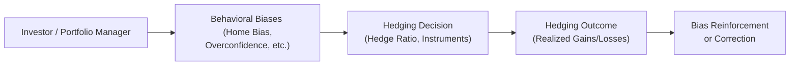

## Introduction

Currency hedging decisions can get, well, tricky. Beyond economic fundamentals, interest rates, and spot/forward prices, many investors discover that their own minds can sometimes sabotage rational analysis of spiky exchange rate movements. It might sound surprising, but our emotional responses—fear of losses, overconfidence in predictions, or that nagging feeling that “the euro can’t possibly stay this high forever”—all play a role in how we decide whether (and how) to hedge currency exposures.

In this section, we’ll explore the major behavioral biases that affect currency hedging decisions. We’ll consider how these biases manifest in everyday portfolio management, discuss practical ways to reduce their impact, and reflect on how to make more systematic decisions regarding currency risk. By developing awareness of these behavioral tendencies, you’ll be on your way to designing better hedging strategies that serve your (or your clients’) long-term goals.

## Behavioral Biases and Their Impact on Currency Management

Behavioral finance research has made one thing quite clear: human beings are not always rational. Sometimes we rely on mental shortcuts—often unconsciously—that can lead us astray. In currency markets, where exchange rates can fluctuate almost around the clock, these biases can heavily influence our response to risk. Let’s examine some of the most common biases and see how they show up in currency hedging decisions.

### Home Bias

Many investors exhibit a distinct preference for domestic assets—a phenomenon known as home bias. When it comes to currency exposures, this bias often translates into a reluctance to hedge local currency positions because we tend to see our home currency as inherently “safe” or “less risky.”

• Example: Imagine a Canadian pension fund manager who invests internationally but is slow to hedge Canadian dollar (CAD) exposures, under the belief that “it’s our home currency, so we understand it best.” The manager might:

  – Over-allocate to CAD-denominated investments.  
  – Underestimate exchange rate risks related to foreign currency positions.  
  – Avoid or reduce hedging strategies for Canadian equity outflows, assuming domestic currency trends are more stable.

• Consequences: This approach might create significant unrecognized risk if the CAD suddenly weakens or strengthens at an unexpected pace. The perceived safety can turn into unwelcome volatility.  

### Overconfidence

Overconfidence bias occurs when investors overestimate their ability to predict market movements. We see this often with foreign exchange, as some investors believe they have an especially keen intuition for spotting when, say, the Japanese yen is about to appreciate or when the Brazilian real is undervalued.

• Example: A portfolio manager might hold a large, unhedged position in emerging market debt denominated in local currency. Convinced that their currency forecasts are accurate, they opt to remain unhedged, even though currency movements can be volatile and the manager’s track record of predicting exchange rates might be spotty at best.

• Consequences: Overconfidence can lead to insufficient hedging or attempts at “timing the market,” potentially incurring higher trading costs when the manager repeatedly adjusts positions trying to catch every twist and turn in exchange rates.

### Anchoring

Anchoring bias involves fixating on a reference point—often a historical price or rate—and basing decisions on that point, even if new market conditions warrant a different view. Investors might anchor to a historical average exchange rate (like USD/EUR at 1.20) and mentally treat deviations from it as “temporary,” failing to see a shift in underlying fundamentals.

• Example: An investor might say, “The yen is definitely going back to 100 per dollar because it always does.” They cling to 100 as an “anchor,” ignoring changes in monetary policy or structural shifts in global trade that push the currency’s fair value to a different level.

• Consequences: Rigid reliance on an outdated anchor can distort hedge ratios and lead to suboptimal currency forward or option hedges. Decision-makers may overhedge or underhedge if exchange rates deviate drastically from their anchored reference.

### Loss Aversion

Loss aversion is the tendency to weight losses more heavily than gains of comparable size. This bias might drive investors to hedge excessively if they obsess over potential forex losses, or it might result in no hedging at all if high hedging costs feed fears of “locking in” losses.

• Example: A corporate treasury might decide to hedge virtually all foreign earnings, even at high forward premiums, simply because the CFO has a strong aversion to any possibility of negative currency surprises. Alternatively, the CFO may abandon hedging if a previous expensive hedge led to the feeling of “we lost money hedging when the currency moved in our favor anyway.”

• Consequences: Overhedging can mean missed opportunities if the move in the exchange rate would have been advantageous. Underhedging because of fear of hedging costs can expose the portfolio to severe currency declines.

### Regret Aversion

Regret aversion is a cousin of loss aversion. Here, we avoid decisions that might result in future regret, which can make us reluctant to change a currency hedging strategy that “worked fine” in the past, even though current market conditions suggest that an adjustment is wise.

• Example: A fund manager who previously implemented a hedge that backfired might then drastically reduce all future hedging. The manager’s thinking often goes: “I’d regret it so much if I hedged again and the market moved the other way.”

• Consequences: This inertia can reduce the manager’s willingness to explore cost-effective or partial-hedge strategies. Missing out on new approaches, such as dynamic hedging or options-based strategies, can leave the portfolio exposed to unmitigated currency shifts.

### Framing Effects

The way information is presented can shape decisions. If currency gains or losses are shown separately from the overall portfolio return, the strong fluctuation in exchange rates might seem more alarming, prompting more intense reactions.

• Example: An investor who sees a dedicated currency loss line item of −$5 million could panic, ignoring that the overall portfolio delivered significant gains due to strong equity performance. Conversely, if currency results were consolidated into total returns, they might appear as part of mildly positive overall performance, raising fewer alarm bells.

• Consequences: Inconsistent or dramatic reporting of currency fluctuations might encourage hasty hedging decisions or hamper disciplined portfolio rebalancing approaches (see Chapter 2.5 for a discussion on tactical uses of derivatives in asset allocation).

## How Biases Affect the Hedging Process

Let’s visually represent how these behavioral biases can play out in the hedging decision process:

In this sequence, the investor’s biases feed into the hedging decision, which influences the eventual outcome. That experience, whether good or bad, can reinforce the same bias or prompt reflection that leads to more rational behavior the next time around.

## Practical Examples and Case Studies

To shed light on how these biases manifest in the real world, let’s look at a few scenarios:

• International Equity Portfolio: A US-based pension fund with large allocations to European and Japanese equities. The trustees experience anchoring by always hedging the EUR/USD whenever the rate goes above 1.15, ignoring the fact that the fair value of the euro relative to the dollar has changed considerably in the wake of policy changes by the European Central Bank. Each time the EUR rises above 1.15, the fund quickly executes forward contracts to hedge, leading to unrecovered costs when the currency frequently reverts in the short term.

• Corporate Treasury in Emerging Markets: A Brazilian company with revenues in USD but local operations in BRL. The CFO exhibits overconfidence by believing they can predict short-term moves of the USD/BRL exchange rate. They either hedge too late or not at all, resulting in repeated short-term adjustments. Over time, transaction costs accumulate and the currency volatility remains largely unmitigated.

• Pension Fund Fearful of Losses: Suppose a pension board decides on a strict full-hedge policy on all foreign bond exposures to avoid any currency losses. When bond yields in foreign markets shift, it’s discovered that currency hedges have become quite expensive due to interest rate differentials. The scheme’s performance lags its peers, and ironically, any small movements in the favored direction of the currency could have improved returns—but these gains were sacrificed under the “100% hedge, no matter what” approach.

## Mitigating Behavioral Biases in Currency Hedging

While biases are deeply ingrained, there are methods to reduce their impact:

• Systematic Decision-Making: Use explicit models and rules to drive currency hedging decisions. For instance, define pre-set hedge ratios based on specific risk tolerance bands or volatility thresholds rather than relying on gut feelings.

• Mechanical Rebalancing: Commit to rebalancing currency hedges at scheduled intervals, such as monthly or quarterly, to limit the influence of day-to-day market noise and emotional responses (see Chapter 3.4 on “Managing Hedge Ratios Using Forward Contracts and FX Swaps”).

• Scenario Analysis and Stress Testing: Project potential currency outcomes under different market scenarios—positive, neutral, and negative. Stress tests reduce overconfidence and highlight the range of possible outcomes, helping anchor decisions in rational risk assessment.

• Communication and Education: If managing a board or committee, regularly describe how currency hedging integrates into the overall risk management approach. Educate stakeholders on how biases can creep in, so they’re more accepting of strategies that deviate from their initial intuition.

• Aggregated Performance Reporting: Incorporate currency results into total portfolio returns. Show the net effect on the portfolio, not just the standalone currency line item. This reframes currency hedging decisions from a separate risk silo to an integrated portfolio consideration, potentially lowering the impact of framing bias.

• Risk Budgeting: Allocate a “currency risk budget” that explicitly quantifies how much exchange rate volatility is tolerable within the broader risk-return framework. This quantitative approach often removes some personal biases by focusing on objective metrics.

## A Bit of Math on Currency Returns

Though the spotlight here is on behavioral aspects, it’s useful to revisit how we calculate currency returns, as referencing the “math behind returns” can help keep us grounded when biases whisper in our ears. In a simplified form, the domestic currency return for a foreign investment can be expressed as:


r_{\text{domestic}} = \left(1 + r_{\text{fc}}\right) \times \frac{S_1}{S_0} - 1


Where:  
• \\( r_{\text{fc}} \\) = return on the underlying foreign currency asset.  
• \\( S_0 \\) = spot exchange rate at inception.  
• \\( S_1 \\) = spot exchange rate at t=1 (same currency units as \\( S_0 \\)).  

When we overlay a forward or options hedge, we effectively lock in or partially lock in \\( S_1 \\). Behavioral biases often creep in when deciding on the timing or extent of that hedge. For instance, an overconfident investor might attempt to pick the “perfect moment” to enter the forward contract, ignoring that perfect timing is rarely achievable consistently.

## Best Practices and Common Pitfalls

• Best Practice: Before establishing or adjusting hedge ratios, explicitly write down your reasons. This step can reduce impulsive decisions and highlight potential biases (like anchoring on a particular exchange rate).

• Pitfall: Letting short-term currency movements overshadow long-term strategic objectives. For instance, an abrupt strengthening of the USD might tempt managers to remove hedges that protected them from depreciation of foreign holdings, only to regret it when the trend reverses.

• Best Practice: If predictions of currency direction lead to frequent changes in the hedge ratio, track each decision’s performance against the existing benchmark strategy. If evidence shows repeated overshoot or undershoot, it may be time to adopt a more rules-based approach.

• Pitfall: Using anchoring-based assumptions about what a “normal” level is for a currency pair. Markets can remain above or below your anchored level longer than you might expect, leading to large cumulative losses or missed opportunities.

## Exam Relevance and Tips

For the CFA Level III exam, you might see a constructed response question describing a scenario in which a portfolio manager shows overconfidence in yen forecasts or refuses to hedge local currency risk because of home bias. The question could ask you to:

• Identify the behavioral bias at play.  
• Propose a more systematic or balanced hedging policy.  
• Explain the likely outcomes of continuing with the biased approach.

Or an item set might present performance results for a portfolio’s currency exposures and highlight how framing the currency result separately swayed the investment committee into suboptimal decisions. You might be asked to recommend improvements, focusing on the integration of currency performance into overall portfolio returns and a consistent approach to rebalancing.

Key exam strategies:  
• Be prepared to name the bias and define it clearly.  
• Cite how that bias specifically influences currency hedging.  
• Offer at least one technique to mitigate it (e.g., systematic rebalancing, scenario analysis).  
• Use direct, concise language—especially helpful in the constructed response format.

## Glossary

Behavioral Finance: A field of finance exploring how psychological factors affect financial decision-making.  
Home Bias: The tendency of investors to undersubscribe to foreign assets and favor domestic securities.  
Overconfidence Bias: Overestimating one’s ability to predict economic outcomes or exchange rate movements.  
Anchoring Bias: Relying too heavily on an initial reference point or historical level when making decisions.  
Loss Aversion: A greater sensitivity to potential losses than gains of similar magnitude.  
Regret Aversion: Avoiding actions for fear of future regret, which can hamper proactive risk management.  
Framing Effect: Decisions shaped by how information or results are presented or “framed.”  
Systematic Decision-Making: An approach where decisions follow predefined processes or rules, reducing emotional influences.

## References and Further Reading

• Kahneman, D. and Tversky, A. “Prospect Theory: An Analysis of Decision under Risk.” Econometrica.  
• Shefrin, H. “Beyond Greed and Fear: Understanding Behavioral Finance.”  
• Statman, M. “Behavioral Finance: Key Concepts and Research.”  
• Montier, J. “Behavioural Investing: A Practitioners Guide to Applying Behavioural Finance.”

## Test Your Knowledge: Behavioral Currency Hedging Quiz



### Which of the following best describes home bias in currency hedging?  
- [ ] Preferring to hedge only foreign currency exposures  
- [x] Over-allocating to domestic assets or resisting hedging local currency exposures  
- [ ] Always taking short positions on foreign currencies  
- [ ] Relying on a historical exchange rate as fair value  

> **Explanation:** Home bias means investors typically favor domestic assets and may be reluctant to hedge local currency exposure, perceiving it as safer.

### An investor fixates on a “fair” exchange rate of 1.30 USD/EUR because they remember it from a few years ago. This is an example of:  
- [ ] Overconfidence bias  
- [ ] Regret aversion  
- [x] Anchoring bias  
- [ ] Loss aversion  

> **Explanation:** Anchoring occurs when the investor clings to a reference point (here, 1.30 USD/EUR) as if it were intrinsically fair, ignoring new fundamental data.

### If a portfolio manager repeatedly attempts to time the market for currency hedging, assuming they have superior forecasting skills despite a poor track record, this illustrates:  
- [x] Overconfidence  
- [ ] Home bias  
- [ ] Framing effect  
- [ ] Systematic decision-making  

> **Explanation:** Overconfidence leads them to believe they can predict exchange rate movements consistently, which is rarely the case.

### Which bias might lead an investor to adopt an overly cautious, fully hedged position to avoid the possibility of currency losses altogether?  
- [x] Loss aversion  
- [ ] Anchoring  
- [ ] Overconfidence  
- [ ] Framing effect  

> **Explanation:** Loss aversion drives an investor to prioritize avoiding losses, sometimes excessively, even if this approach foregoes favorable moves.

### Which of the following approaches best helps mitigate behavioral biases in currency management?  
- [x] Using systematic rules or mechanical rebalancing procedures  
- [x] Applying scenario analysis to highlight potential outcomes  
- [ ] Basing decisions solely on gut feelings  
- [ ] Anchoring decisions to the last known exchange rate  

> **Explanation:** Systematic decision-making and scenario analysis are key tools in reducing emotional influences and capturing a realistic range of outcomes.

### In behavioral finance, regret aversion refers to:  
- [x] Avoiding actions that might result in feeling regret later  
- [ ] Taking excessive risk to seek large gains  
- [ ] Adjusting positions too frequently based on short-term fear  
- [ ] Instinctively trusting past price data  

> **Explanation:** Regret aversion manifests as the fear of making decisions that could lead to regret. It can cause investors to remain in their comfort zone, even if conditions have changed.

### How can framing effects negatively affect currency hedging decisions?  
- [x] By exaggerating currency fluctuations when viewed in isolation, leading to hasty adjustments  
- [ ] By reducing the urgency of currency hedging  
- [x] By encouraging more risk-taking when exchange rate data is embedded in overall returns  
- [ ] By simplifying the reporting of results  

> **Explanation:** When currency results are shown separately, short-term losses might appear alarming and trigger overreactions. Conversely, if aggregated within the total portfolio in a way that hides currency risk, decision-makers may overlook the need for prudent hedges.

### An investor who refuses to adjust a currency hedging strategy despite evidence of shifting fundamentals due to fear of “repeating a previous hedging mistake” is most likely demonstrating:  
- [ ] Overconfidence  
- [x] Regret aversion  
- [ ] Home bias  
- [ ] Framing  

> **Explanation:** Regret aversion specifically prevents them from acting, because they dread repeating a past perceived mistake.

### All of the following are potential consequences of excessive loss aversion in currency hedging EXCEPT:  
- [ ] Missing out on favorable currency movements  
- [ ] Incurring high hedging costs  
- [ ] Reducing overall portfolio volatility  
- [x] Reducing the risk of overconfidence  

> **Explanation:** Excessive loss aversion does not reduce the risk of overconfidence. Instead, it can lead to overhedging, missed gains, and added costs.

### Using a strict set of rules for hedge ratio adjustments, combined with a quarterly review, is an example of:  
- [x] Systematic decision-making  
- [ ] Regret aversion  
- [ ] Anchoring bias  
- [ ] Home bias  

> **Explanation:** A rules-based approach reduces the role of emotion in currency hedging, aligning with systematic decision-making principles.


