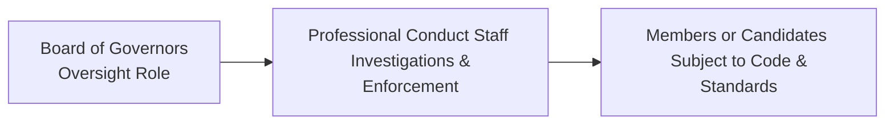

Overview and Context  
Sometimes, when I think about professional ethics, I recall a conversation with a friend who doubted that any single organization could effectively uphold global standards. She asked, “How can one body ensure that thousands of financial professionals worldwide stay ethical?” The CFA Institute’s Professional Conduct Program (PCP) is precisely what I pointed her to. It’s a structured system designed to ensure that everyone bearing the CFA designation—along with all CFA candidates—maintains a high level of integrity. This program underpins public trust in our industry and preserves the reputation of the CFA charter.

Key Objectives of the PCP  
One major reason the Professional Conduct Program exists is to safeguard public confidence in the capital markets. In other words, we aim for clients and investors to feel, “Yep, I’m in good hands,” whenever they’re working with a CFA professional. From another angle, the PCP’s purpose is not to be punitive for the sake of being punitive; it’s about fostering fairness, transparency, and trust. This means that whenever you see “CFA” next to someone’s name, you can expect that person adheres to strict ethical standards—and if they don’t, there’s a rigorous system in place to address that.

Oversight and Governance  
The CFA Institute Board of Governors provides high-level oversight of the PCP. The board’s involvement ensures neutrality and consistency—so decisions aren’t left to personal biases or local business politics. That’s pretty neat, right? You’ve got a global board with a bird’s-eye view of how ethical conduct is managed, stepping in when needed and reviewing systemic processes to keep them fair and uniform.  

Below is a simple representation of how the PCP structure fits together:

In this diagram, you can see that the Board of Governors provides broad oversight, while the Professional Conduct staff handles the day-to-day work of investigations and enforcement. Ultimately, the individuals under the board’s watch include CFA charterholders, members, and candidates.

Operation of the PCP  
The PCP covers all CFA Institute members and candidates. Whether you’ve just enrolled in Level I or you’re a seasoned CFA charterholder with decades of experience, participation in the CFA Program means you must follow the Code of Ethics and Standards of Professional Conduct. The PCP’s role is to investigate potential breaches of these Standards and see if there’s any reason for disciplinary action.  

Professional Conduct staff at CFA Institute might open an investigation for many reasons—maybe a complaint from a client, an employer’s notice of termination for unethical practices, or even a tip from news media. In some cases, the PCP itself will pick up on red flags just by routinely monitoring regulatory filings or public news sources. Their investigative process is quite thorough: they interview relevant parties, gather documents, and review events leading up to an alleged violation.

Investigation and Evidence Gathering  
When the PCP receives an allegation (or even a slight whiff) of misconduct, the staff’s first step is to gather evidence. This isn’t a casual process, like merely checking a few references. It’s often systematic, requiring:

• Review of all relevant documents, from emails to marketing materials.  
• Interviews with individuals who might have witnessed or been involved in the alleged misconduct.  
• Analysis of trading data or official statements, if the case involves inappropriate investment recommendations or insider trading.  
• Cross-reference of any prior infractions or relevant litigation history.

A thorough approach is vital because the PCP aims to be both fair and balanced. There is a strict emphasis on procedural fairness—no one wants to convict a member on rumor or gossip alone. Neutrality is key: The staff can’t really say, “I have a hunch this person is guilty,” and close the case. They have to methodically collect, examine, and weigh evidence.

Self-Disclosure Obligations  
One of the lesser-known but crucial aspects of the Code and Standards is members’ and candidates’ obligations to disclose any information that’s potentially relevant to professional conduct. This might encompass:  

• Criminal charges or convictions  
• Civil litigation that relates to professional ethics or potential fraud  
• Regulatory investigations from the SEC or another body  
• Any professional complaint that questions one’s honesty or integrity  

For instance, let’s imagine you’re a portfolio manager who got into a minor property dispute with neighbors. That might not be relevant to your professional ethics. But if you were accused of misappropriating investor funds? You definitely can’t hide that. Members and candidates are required to self-disclose such matters to the CFA Institute. Proactively stepping forward is often viewed more favorably than waiting for others to discover the misconduct and then reacting to it.

Preserving Professional Ethics  
At its core, the PCP is about upholding the highest standards of professionalism. The program’s main function is less about scaring folks into compliance and more about instilling a deep-rooted culture of integrity. Sure, if you break the rules, there can be sanctions, possibly even revoking the right to use the CFA designation. But that’s the last resort.  

The real success of the PCP is when financial professionals act ethically no matter what. That consistent, unwavering commitment to honesty? That’s exactly how we collectively elevate the profession. And from a capital-markets standpoint, greater public trust encourages wider participation and fosters long-term stability.

Proactive Monitoring and Investigations  
The PCP isn’t just reactive—it’s proactive. If you think about it, the public doesn’t really send in official complaints every time they see something suspicious. Often, folks might not even know that a certain activity is unethical. The PCP staff, therefore, monitors headlines, regulatory notices, and disciplinary actions by authorities. If a detail emerges—like a candidate found guilty of forging documents—the PCP might open its own case.  

Because we live in a world with 24/7 news coverage and instant social media updates, the PCP’s job gets more complex. You can’t rely on old-school methods alone. The staff might need to check multiple sources, verifying the facts before launching an investigation. This diligence ensures the evidence is accurate and that investigations are only launched when truly necessary.

Practical Financial Example  
Picture a scenario: A Level II candidate, Anna, works as a junior analyst at a hedge fund. She’s chasing a big promotion and decides to “beautify” her analysis by selectively excluding some negative data points. One day, her senior manager realizes that Anna’s reports don’t match the official market data. After an internal review, the manager suspects Anna’s analysis misled her clients and contacts CFA Institute. The PCP staff then:

• Reviews Anna’s financial analyses and compares them with market data.  
• Interviews Anna, the manager, and possibly clients.  
• Examines Anna’s workflow to see how the negative data was omitted.  
• Considers whether Anna’s action was deliberate manipulation—a potential violation of Standard I (Professionalism) and Standard V (Investment Analysis, Recommendations, and Actions).

If found in violation, Anna could face disciplinary sanctions, such as suspension or termination of her participation in the CFA Program. Maybe in a milder case, she receives a private censure. The big point: once an investigation is completed, the PCP’s outcome might vary depending on aggravating or mitigating factors.

Best Practices, Pitfalls, and Strategies  
• Best Practices:  
  – Clarify your understanding of each Standard before making professional decisions.  
  – Keep thorough records of all communications and research processes—this helps if you ever face a dispute.  
  – Promptly disclose any personal or professional legal issue that could breach the Code.  

• Common Pitfalls:  
  – Not taking self-disclosure seriously enough. A small oversight can become a big headache if it’s not addressed immediately.  
  – Letting personal biases or corporate pressures override ethical judgment.  
  – Assuming that minor infractions won’t be noticed. The PCP has eyes in more places than you may think.  

• Strategies to Overcome Issues:  
  – Develop an internal review system. Even if you trust your own judgment, a second or third pair of eyes can spot something you missed.  
  – Read the Standards of Practice Handbook regularly. This ensures you’re aware of all updates.  
  – Engage in ongoing ethics training within your firm.  

Practical Advice for the Exam  
For the CFA Level III exam, you’ll likely encounter scenario-based questions about professional conduct. They might describe a slightly murky situation—maybe an analyst “considering” whether to disclose certain conflicts or a candidate who inadvertently used insider info. Your best bet is to:  
• Understand the structure of the PCP—know that the Board of Governors oversees it, and that the staff does the legwork of investigation.  
• Recognize that the core objective is to protect market integrity and maintain public trust, so any action undermining these goals may be a violation.  
• Remember that self-disclosure is mandatory. If you see a scenario about a candidate ignoring a lawsuit, that’s probably a red flag.  
• Practice how to quickly identify the relevant Standard in an exam question. Typically, you’ll be asked whether a contravention of the Code and Standards has occurred and the correct course of action.  

References  
• CFA Institute. (2022). Standards of Practice Handbook. Charlottesville, VA: CFA Institute.  
• CFA Institute official website on Ethics Enforcement: https://www.cfainstitute.org/ethics  
• Ethics in Practice Casebook: Real-world case studies and analyses from CFA Institute.  
• Bogle, J. C. (2005). The Battle for the Soul of Capitalism. Yale University Press.  

## Test Your Knowledge: Structure and Purpose of the CFA Institute Professional Conduct Program



### Which of the following best describes the primary purpose of the CFA Institute Professional Conduct Program (PCP)?
- [x] To protect market integrity and maintain public confidence in the investment profession
- [ ] To generate revenue through professional fees
- [ ] To replace the need for local regulatory oversight
- [ ] To mediate employment disputes between charterholders

> **Explanation:** The PCP’s overarching goal is to protect the integrity of the capital markets and maintain public confidence in the profession by ensuring members uphold the Code and Standards.

### Under whose oversight does the PCP operate to ensure neutrality and consistency in professional conduct enforcement?
- [ ] The local securities regulator
- [ ] Regional CFA Societies
- [x] The CFA Institute Board of Governors
- [ ] Individual CFA charterholders

> **Explanation:** The PCP operates under the oversight of the CFA Institute Board of Governors, which promotes fairness and consistency in investigations.

### Which of the following best characterizes the investigative process conducted by the Professional Conduct staff?
- [x] Evidence-driven and unbiased, including document reviews and interviews
- [ ] Primarily rumor-based, focusing on hearsay
- [ ] Conducted solely through third-party agencies
- [ ] Limited to grievous criminal allegations only

> **Explanation:** The PCP’s investigative approach is systematic, focusing on collecting and evaluating relevant evidence without bias.

### What is a key reason members and candidates must comply with self-disclosure requirements in the context of the PCP?
- [ ] Because regulators have exclusive authority over ethical compliance
- [ ] Because it helps them avoid paying voluntary dues
- [ ] Because the PCP only accepts anonymous tips
- [x] Because timely disclosure supports transparency and protects the integrity of the profession

> **Explanation:** Self-disclosure helps ensure that matters relevant to professional conduct are brought to the attention of the CFA Institute, preserving transparency and trust.

### Which statement about the role of the PCP in maintaining professional ethics is correct?
- [x] The PCP seeks to foster a strong ethical culture, not merely punish infractions
- [ ] The PCP only focuses on fines and penalties
- [x] The PCP promotes neutrality and consistency in enforcement
- [ ] The PCP handles international financial reporting disputes

> **Explanation:** The PCP is intended to promote and maintain ethical conduct among professionals, pursuing corrective measures where necessary but primarily aiming to encourage integrity and trust.

### How does the PCP typically initiate an investigation into alleged misconduct by a member or candidate?
- [x] Upon receiving a complaint or detecting potential violations from media or regulatory news
- [ ] By randomly selecting charterholders on a monthly basis
- [ ] By auditing only the highest-earning members
- [ ] By investigating purely academic performance

> **Explanation:** The PCP can accept complaints from various sources (e.g., the public, employers, regulators) and also conducts proactive monitoring of news outlets and regulatory filings.

### Which of the following is a potential outcome if someone is found in violation of the CFA Institute Code and Standards?
- [x] Sanctions including suspension, revocation, or public censure
- [ ] Board membership appointment
- [x] Private censure if mitigating factors are present
- [ ] Unrestricted usage of the CFA designation

> **Explanation:** Disciplinary measures may be imposed, ranging from warnings to revocation of the right to use the CFA designation, depending on the severity of the violation.

### Why does the PCP mandate that disclosures be prompt when members face legal or regulatory action?
- [x] To maintain timely information and protect public confidence
- [ ] Because unsubmitted information receives instant approval
- [ ] Because it automatically removes legal liability from the member
- [ ] So that candidates can skip exam questions related to ethics

> **Explanation:** Prompt disclosure is central to upholding transparency and ensuring that ethically relevant issues are addressed quickly.

### Which of these best describes the PCP's approach to enforcement?
- [x] Proactive monitoring complemented by formal investigations
- [ ] Only ad-hoc reviews when a board member requests it
- [ ] Complete reliance on media sensationalism
- [ ] Infrequent audits every five years

> **Explanation:** The PCP is both proactive (monitoring the news and regulatory filings) and reactive (launching investigations after complaints or red flags).

### True or False: The PCP’s primary function is to identify legal infractions unrelated to ethics.
- [x] True
- [ ] False

> **Explanation:** While the PCP focuses on ethical conduct, it also addresses any legal infractions that bear on a member’s honesty and professional reputation. “Unrelated” legal matters may sometimes be relevant if they speak to one’s integrity or fitness to practice.


