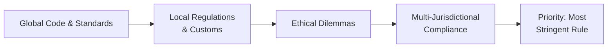

## Introduction

Investment professionals juggle enough already—analyzing market data, managing client relationships, and staying on top of every new regulation that seems to pop up. But if you're working across multiple countries, well, that’s a completely different ballgame, right? You’ve got varied legal systems, different languages, and sometimes culturally accepted gifts and practices that might make folks at headquarters raise an eyebrow. I once found myself in a meeting in Tokyo, for instance, receiving a meticulously wrapped box of sweets. To my host, this was a sign of respect and friendship. To my compliance officer back home, it was dangerously close to an unapproved gift. Navigating these nuances can be tricky. So, let’s step back and talk about how to align local regulations with the global Code and Standards of the CFA Institute when crossing borders.

## The Scope of Cross-Border Transactions

Cross-border transactions can be anything from managing a portfolio for an overseas client to operating entire branches of your investment firm in different jurisdictions. These transactions bring new opportunities, yes—but also potential conflicts related to culture, regulation, and ethical norms. The CFA Institute Code of Ethics and Standards of Professional Conduct (“the Code and Standards”) offer a unifying ethical perspective, but they don’t automatically overwrite local laws.

Cross-border transactions often highlight what we call "jurisdictional conflict": you might be required to follow multiple—and sometimes contradictory—sets of laws. Then throw in cultural norms, like gift-giving or local data privacy constraints, and the puzzle gets more complex.

Let’s sketch out a simplified view of these influences:

In a nutshell, the diagram sums up how the Code and Standards interacts with local laws and traditions—producing ethical dilemmas that investment professionals must address with robust compliance frameworks. If you’re regularly doing cross-border transactions, it’s wise to keep this interplay in mind.

## Reconciling Local Regulations with the Code and Standards

One of the hallmark principles from the CFA Institute is the directive to abide by the most stringent requirement. Right away, you might ask, “What does that actually mean?” Well, if local regulations are more restrictive than the Code and Standards, you follow local regulation. But if the Code and Standards is more restrictive, you have to go with the Code and Standards. In other words, you can’t use local law as an excuse to degrade your professional standards. It can feel like you’re being pulled in two directions, but the solution is: whichever set of rules is stricter is the one you abide by.

Consider the following example. Suppose your firm manages money for a client in Country A, which has no strong guidelines regarding the use of soft dollars from brokerage commissions, whereas the Code and Standards require full disclosure. You follow the more stringent guidance. So, you disclose your use of soft dollars. This ensures that you’re remaining consistent with your global ethical obligations, even if local practice is laxer.

## Cultural Variations and the Gift-Giving Dilemma

You know that moment I mentioned earlier, being offered a gift in Tokyo? In some parts of the world, giving gifts is not just a casual courtesy—it’s deeply ingrained in the culture as a sign of respect and hospitality. In other regions, giving gifts to a business associate is automatically suspicious and might be seen as an attempt to buy influence. Because of the Code and Standards’ focus on independence and objectivity, accepting large gifts can be problematic. There's this tension: You want to respect local customs, but you also want to avoid the appearance (or reality) of impropriety.

The best approach is to do your homework:
• Research gift-giving practices in the local culture.  
• Establish internal guidelines and thresholds for the value and frequency of gifts.  
• Document every gift you receive or give.  
• If in doubt, politely decline or offer a symbolic gift in return of similar nominal value.

It may feel awkward—let’s be honest, turning down a fancy gift can feel a bit rude—but remember that your fiduciary duty and professional reputation come first.

## Necessity of Robust Cross-Border Compliance Protocols

As cross-border transactions grow in frequency, the possibility of inadvertently committing a violation also grows—especially in areas like insider trading and data protection. Let’s break down two especially tricky areas:

Insider Trading:  
• Different countries may have different rules about what constitutes material nonpublic information.  
• Some jurisdictions require publicly-traded companies to disclose price-sensitive data in particular ways or beyond certain thresholds.  
• The Code and Standards mandate a zero-tolerance stance, so if local regulations are more lenient, you stick with the more stringent approach anyway.

Data Protection:  
• Regulations like the EU’s General Data Protection Regulation (GDPR) require certain standards for storing and transferring personal data.  
• The Code and Standards emphasize safeguarding client confidentiality—so you must ensure compliance with all relevant data protection mandates.  
• Violating local data privacy laws can lead to huge fines, negative press, and, of course, a direct breach of your ethical obligations.

Setting up robust compliance protocols might mean establishing separate compliance teams or assigning local compliance officers who deeply understand the local regulatory environment, with oversight from a global compliance function that ensures you stay consistent overall.

## Language Barriers and Interpretive Differences

One big, sometimes overlooked, challenge in cross-border business? Language. Subtle differences in words or phrases can completely shift the meaning of compliance documents or contract clauses. I recall, while reviewing a client’s asset management agreement in a foreign language, stumbling over what I thought was a fairly standard phrase about “performance fees.” Except it turned out the local language’s translation basically implied "guaranteed returns.” Yikes! That was definitely not the intent.

Professionals need to undertake extra due diligence in these scenarios:
• Provide certified translations of key documents.  
• Offer local-language training or compliance manuals to employees.  
• Hold bilingual or multilingual Q&A sessions for staff, ensuring clarity on crucial provisions.  

All this might sound cumbersome, but it’s well worth the effort to avoid misunderstandings that could result in a regulatory or ethical breach.

## Best Practices and Continuous Monitoring

With so many variables in play—laws, customs, languages—what’s the best approach to stay on track? Here are a few pointers:

Thorough Local Research:  
• Before establishing a presence in a new jurisdiction, consult with legal experts and local regulators.  
• Identify unique demands or unexpected pitfalls, like specialized disclosure rules.

Staff Training and Cultural Acumen:  
• Conduct ongoing workshops about cultural norms, gift-giving, and data protection.  
• Encourage employees to discuss any concerns early on.

Extra Vigilance:  
• Keep an ear to the ground for shifts in local regulations.  
• Conduct regular audits to ensure alignment with both local laws and the Code and Standards.

Maintaining an Ethical Culture:  
• Reinforce your firm’s commitment to ethical values from the very top.  
• If leaders talk the talk but don’t walk the walk, employees quickly pick up on that—no matter which country you’re in.

## Real-World Case Studies

Let’s consider a scenario. A multinational firm sets up an advisory branch in Country X, where it’s common practice to give corporate gifts worth upwards of $1,000. One day, a local prospective client offers a $2,000 watch to the relationship manager. The relationship manager worries about refusing it (might offend the prospective client), but under the Code and Standards, such a gift likely exceeds the threshold for a “token allowed if it’s modest,” and acceptance might compromise independence. The manager works with the compliance department to politely decline but expresses deep appreciation for the sentiment. The client may initially appear disappointed, but repeated explanations about the firm’s strict global policy eventually fosters deeper trust in the manager’s ethical stance.

Another case might be how a firm with offices in three countries, including the U.S., inadvertently violates data protection laws in the European branch by transferring certain client data to an American server. The firm claimed ignorance of local data privacy rules. That argument didn’t fly with regulators. They had to pay penalties in Europe and faced censure in the U.S. for negligence. This underscores the need for “anticipatory compliance,” where the firm actively prepares robust data protection and cross-border data flow guidelines.

## Practical Examples

Short Example—Cross-Border Investment Communication:  
Imagine you have a U.S.-based client who invests in emerging market equities through your Singapore desk. A crucial earnings report from the target company in, say, Indonesia, is released in the local bahasa language—completely foreign to your main research team. If you draw the wrong conclusion (maybe the translation missed an important negative footnote?), you could end up making trades on incomplete or inaccurate information. The best practice: engage local translators or local analysts who fully comprehend the nuances. And always cross-check the data’s authenticity to avoid potential missteps that might not only harm returns but also be deemed unethical if you misrepresent the investment risk.

Numeric Example—Comparing Tax Regimes:  
Let’s say your firm invests in Country A and Country B.  
• Country A imposes a 15% withholding tax on dividends for foreign investors.  
• Country B requires a 25% tax but allows foreign investors to file for partial reimbursement under certain conditions.  

On the surface, you might think Country A is automatically more favorable. But if the Code and Standards requires full disclosure of effective tax rates for clients in each jurisdiction, you must carefully calculate the net tax burden in both places and communicate that to clients. This might mean presenting something like:  
• Country A: 15% final withholding, no further recoveries allowed.  
• Country B: 25% initial withholding, but a 10% credit is obtainable with a bit of local paperwork, so the effective washing out is 15%.  

Your job is to walk the client through these complexities—ensuring they don’t inadvertently end up paying more taxes than necessary due to incomplete disclosures.

## Conclusion and Final Exam Tips

The global nature of our work is both exciting and challenging. We gain opportunities to diversify client portfolios and build cross-cultural relationships, but we have to navigate a thicket of local laws, languages, and norms. The overarching message? Always follow the highest standard—whether local law or the Code and Standards. Do your homework. Train your team. Establish robust compliance frameworks. And remember that cultural sensitivity often goes hand in hand with professional integrity.

For the CFA Level III exam:
• Expect scenario-based items: “A manager in Country X receives a gift – is it allowed or not?” and “How should she handle this data privacy scenario?”  
• Read each question carefully, noting whether local law or the Code and Standards sets higher requirements.  
• Think about possible translations or misinterpretations that might appear in item-set vignettes.  
• If in doubt, prioritize ethical obligations—no matter how small the detail might appear.

## References

• CFA Institute. (2022). “Standard I(A): Knowledge of the Law,” cross-border guidance notes.  
• Mackenzie, C. (2007). “Boards, Incentives and Corporate Social Responsibility: The Case for a Multinational Approach.” Journal of International Business.  
• Official websites of prominent regulators: the U.S. SEC, the UK FCA, the MAS in Singapore, the EU’s data protection authorities.  

## Test Your Knowledge: Cross-Border Ethical Challenges



### A firm operates in multiple countries with substantially different data privacy requirements. Under the Code and Standards, what is the best approach?
- [ ] Follow the least strict data privacy standard if it saves costs.
- [x] Adopt the most stringent requirements to protect client data.
- [ ] Only follow the local regulations of the country where headquarters is located.
- [ ] Follow the local requirement that imposes minimal record-keeping.

> **Explanation:** The Code and Standards mandate upholding the highest standard of data protection, even if local laws are more relaxed.

### Which of the following practices is most aligned with the Code and Standards when handling gift-giving in different cultures?
- [ ] Accepting lavish gifts in strict cultures but disclosing only in your home market.
- [x] Establishing firm-wide guidelines on the value and frequency of permissible gifts.
- [ ] Never accepting any gifts under any circumstances.
- [ ] Allowing each region to handle gifts however they see fit.

> **Explanation:** Firms should set clear, firm-wide guidelines to maintain consistency and uphold independence and objectivity. 

### How can a CFA charterholder manage language barriers when analyzing foreign company reports?
- [x] Seek certified translations or rely on bilingual experts for clarity.
- [ ] Rely on automated translation tools for cost savings.
- [ ] Ignore minor discrepancies as long as the main content is understood.
- [ ] Wait until an official English-language version is published, even if it delays analysis by months.

> **Explanation:** Ensuring accurate interpretation is critical. Certified or professional translation removes ambiguity and supports an objective analysis.

### A relationship manager in Asia receives a valuable present from a client for Lunar New Year. According to the Code and Standards, what is the most appropriate action?
- [x] Politely decline if the gift exceeds a reasonable value threshold.
- [ ] Accept the gift without disclosing it.
- [ ] Accept the gift only if it’s from a long-time client.
- [ ] Keep the gift for personal use while making a mental note to repay the favor.

> **Explanation:** Accepting lavish gifts could compromise the manager’s independence and objectivity. Ethics demand caution and transparency.

### When facing conflicting local laws and the Code and Standards, which principle generally applies?
- [x] Follow whichever is stricter to avoid ethical breaches.
- [ ] Only adhere to local law because it has legal precedence.
- [x] Attempt to harmonize them, but if there’s a tough conflict, choose whichever is easier to implement.
- [ ] Follow the Code and Standards only when local law is silent.

> **Explanation:** The Code and Standards instruct professionals to comply with the most stringent rule, ensuring the highest level of ethical conduct.

### What is one effective method to anticipate changes in cross-border regulations?
- [x] Engage local legal counsel and maintain ongoing monitoring.
- [ ] Wait until violations occur to adjust compliance procedures.
- [ ] Delegate all monitoring to a single global external consultant.
- [ ] Focus only on large markets; smaller ones pose negligible risk.

> **Explanation:** Proactive compliance—“anticipatory compliance”—involves continuous monitoring and local expertise. 

### A firm’s analyst is about to publish a report in multiple languages. What step is crucial to avoid miscommunication across jurisdictions?
- [x] Use standardized terminology and confirm consistent language across versions.
- [ ] Fully trust local teams to figure out any differences.
- [x] Assume footnotes will remain the same in all languages automatically.
- [ ] Draft versions only in technical English with no local translations.

> **Explanation:** Consistency in terminology and phrasing is critical in multiple languages to avoid legal or ethical ambiguities.

### A client invests in two countries, each imposing different withholding tax rules with partial refunds possible in certain cases. Under the Code and Standards, what must the adviser do?
- [x] Disclose the effective tax impact for each jurisdiction based on all recoveries.
- [ ] Provide a rough estimate without specifying the details.
- [ ] Provide full detail to local regulator only.
- [ ] Disclose it only if the client specifically asks.

> **Explanation:** Duty to clients demands full disclosure of potential tax consequences, including any refunds or complexities.

### An investment manager encounters a cultural tradition that includes reciprocating gifts. How should they respond under the Code and Standards?
- [x] Discuss reciprocal gift value limits with compliance and abide by guidelines.
- [ ] Refuse to reciprocate under any condition.
- [ ] Provide an even more expensive gift to maintain goodwill.
- [ ] Hide the gift exchange from management to avoid conflicts.

> **Explanation:** Cultural traditions can be honored only within the firm’s and CFA Institute’s guidelines for ethical behavior.

### Cross-border transactions often intensify ethical dilemmas. True or False?
- [x] True
- [ ] False

> **Explanation:** Managing multi-jurisdictional factors and cultural differences often increases complexity and potential ethical conflict.


