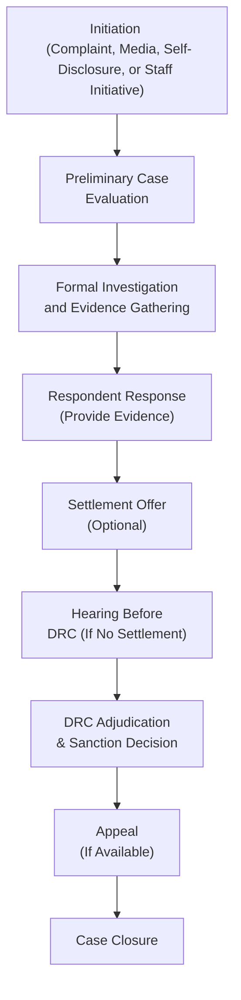

## Introduction and Context

Picture this: You’ve just wrapped up a big project at your firm, and everything seems to be going great. Suddenly, you get a notice from the CFA Institute’s Professional Conduct team that a complaint has been filed about a potential violation of the Code and Standards. You’re shocked, maybe a little nervous. The good news is that the CFA Institute has a well-defined Disciplinary Review Process (DRP) to address such situations. While it can still feel daunting, the DRP is designed with fairness in mind, protecting both the rights of CFA members or candidates (the respondents) and the integrity of the profession. 

This article dives deeply into that Disciplinary Review Process. We’ll take it step by step—from the very first spark that can trigger an inquiry to the final adjudication and possible sanctions. Along the way, we’ll also talk about the crucial elements of due process, the role of the Disciplinary Review Committee (DRC), and how a settlement might streamline the whole procedure.

## Sources of Initiation

A critical aspect of the DRP is that inquiries can start from a variety of sources, not just a formal complaint by a third party. Maybe a regulator flagged something, or there’s a questionable news story about someone’s professional conduct. You can also have self-disclosures—yes, some folks voluntarily report their own possible breaches if they realize they may have crossed a line. Plus, the Professional Conduct staff can initiate an investigation all on their own if they spot something irregular. Below are the main triggers you’ll want to keep in mind:

• Formal Complaints: Either a client, colleague, or any individual can lodge a complaint if they believe a violation has occurred.  
• Media or Regulatory Flags: News articles, press releases, or official regulatory actions might lead the Professional Conduct staff to take a closer look.  
• Self-Disclosures: Sometimes, a CFA charterholder or candidate might voluntarily come forward with a potential issue.  
• Independent Investigation: The CFA Institute’s Professional Conduct staff can act on its own initiative if they see evidence of misconduct.

In other words, the net can be cast pretty wide. This ensures that even subtle or unexpected issues of misconduct don’t slip past the radar.

## Preliminary Case Evaluation

Once an inquiry is triggered, the Professional Conduct staff (that’s the group within the CFA Institute assigned to handle ethics and compliance matters) reviews all the information they can get their hands on. You could think of this as a sorting stage—figuring out if the matter is serious, credible, and tied closely enough to the ethical obligations under the Code and Standards.

### Key Considerations in Initial Screening
• Is there enough evidence to move forward with a formal investigation?  
• Does the alleged behavior fall under the jurisdiction of the CFA Institute Code and Standards?  
• Are there any external legal or regulatory actions pending that might affect the timeline or nature of the investigation?

If the staff decides there’s not enough to go on—maybe the complaint is baseless or purely personal—they can close the matter. That’s it, complaint dismissed. But if they sense there’s some fire behind the smoke, the process continues.

## Formal Investigation and Respondent Participation

When the Professional Conduct staff determines that further action is warranted, they’ll notify the individual under investigation (the respondent). At this point, the staff may request additional documentation—like emails, trade records, or anything else relevant to the alleged violation. The respondent gets an opportunity to respond to the allegations. This step is vital because it embodies the principle of due process, which ensures no one is sanctioned without a fair chance to tell their side of the story.

### Access to Evidence
Respondents often ask: “Will I see what the complaint says?” Generally, yes. The staff provides sufficient disclosure so the respondent can meaningfully address the complaint. However, certain sensitive materials might be redacted to protect confidentiality or the identity of witnesses.

### Statement of Defense
Just as in many legal or quasi-legal procedures, the respondent can provide evidence, witness statements, or explanations. If you believe that you never violated any standard, you’ll want to produce any relevant evidence at this stage. If you think you might have made a mistake, you can communicate those circumstances too—sometimes clarifying context can help mitigate misunderstandings.

## Settlement Procedures

There’s a step in the DRP where a settlement might be proposed. Think of a settlement like a plea agreement in a legal context—except it’s within the framework of the CFA Institute’s disciplinary system. Here’s how it might unfold:

• The Professional Conduct staff evaluates whether the alleged violation can be resolved without a formal hearing.  
• A settlement agreement is drafted, outlining the proposed sanction and the findings.  
• The respondent can choose to accept or reject the proposed settlement.  

If the respondent accepts, the matter ends, and the proposed sanctions go into effect. If the respondent refuses, the next stage usually involves a full hearing before the Disciplinary Review Committee (DRC). Settlements help avoid further legalistic proceedings, which can be time-consuming and costly for everyone involved. 

## Role of the Disciplinary Review Committee (DRC)

The Disciplinary Review Committee is a body of CFA charterholder volunteers who step in when a formal hearing is needed or when a settlement can’t be reached. These folks are deeply committed to maintaining the integrity of the profession. Because they’re charterholders, they get what it means to uphold the Code of Ethics and Standards of Professional Conduct. 

### Functions of the DRC
• Conduct Hearings: The DRC hears testimony, reviews evidence, and asks questions to both the respondent and the Professional Conduct staff.  
• Evaluate Violations: Based on the facts presented, they decide whether a violation did indeed occur.  
• Determine Sanctions: If they conclude that a violation took place, the DRC will impose sanctions ranging from censure to suspension or even revocation of the charter.

The DRC’s role is essential because it ensures that a group of experienced peers makes judgments about professional misconduct, rather than a single staff member. This peer review mechanism strengthens fairness and credibility.

## Hearing and Adjudication

If you’ve ever watched a courtroom drama on TV—well, the DRP hearing isn’t quite the same. But it does have a formal structure:

1. Both sides present their cases.  
2. The respondent can present evidence or call witnesses.  
3. The Professional Conduct staff can rebut or clarify.  
4. The DRC members ask questions and deliberate.  

After the hearing, the DRC deliberates privately to reach a decision. This decision is the formal adjudication, or in simpler terms, the final call on whether the respondent is at fault. If the verdict is that no violation has occurred, the case is closed. If the DRC deems the respondent breached the Code and Standards, then sanctions come into play.

## Sanctions and Enforcement

Violations vary in severity, so the sanctions do too. This helps ensure that the punishment is proportional to the gravity of the misconduct. Here are some of the most common sanctions:

• Censure: Think of it as a formal slap on the wrist. The respondent’s record reflects the censure, but they retain their CFA status.  
• Suspension: The individual is barred from using the CFA designation for a set period—often a year or more, depending on the seriousness of the violation.  
• Revocation: This is the big one—losing the right to use the CFA designation indefinitely.  

In extremely serious instances, a permanent revocation might be imposed, essentially ending the respondent’s future in the CFA Institute community. If you’re wondering whether the respondent can appeal, yes, there’s usually an appeals process built in, providing one more layer of protection for the respondent’s rights.

## Due Process: The Cornerstone of Fairness

We keep mentioning due process because it truly is the beating heart of the DRP. From the moment an inquiry begins to the final resolution, respondents have multiple opportunities to respond, present evidence, and appeal decisions. The CFA Institute wants to protect both the profession’s reputation and the individuals who might be wrongly accused.

### Key Elements of Due Process
• Notice: Respondents are informed promptly of the charges.  
• Access to Evidence: Relevant evidence is shared in a transparent manner, except in highly sensitive cases.  
• Right to Respond: Respondents can submit evidence or testimony on their own behalf.  
• Appeal: Often, there’s a chance to appeal before a higher-tier body or an appellate panel.  

Due process ensures no knee-jerk decisions are made. It also helps maintain trust that the system is balancing fairness to individuals with the profession’s need to uphold ethical standards.

## A Quick Personal Anecdote

I once had a close colleague who got tangled in a DRP case. The reason: a client had accused them of misrepresenting performance returns in marketing materials. Turns out it was an honest oversight—they had used outdated calculations. Even though it was a stressful few months for everyone involved, the DRP process gave them ample opportunity to show that the error was not willful. The final decision was a small censure and a requirement to take additional ethics training. They learned a lot from the experience (and so did I, watching from the sidelines) about how robust and thorough the DRP can be. The fact that evidence, testimony, and thorough review shaped the final outcome gave us all some relief and a sense of fairness.

## Common Pitfalls and Best Practices

Below are a few missteps that can lead to trouble—and strategies to stay on the right track:

• Ignoring the Initial Notice: You don’t want to bury your head in the sand. If you receive a complaint notice, respond promptly.  
• Relying on Verbal Explanations Alone: Written documentation is your ally. Keep emails, memos, and any relevant materials that can support your position.  
• Underestimating Settlement Options: Sometimes, a fair settlement can be reached before a full-blown hearing. Evaluate the proposed sanction carefully and negotiate if needed.  
• Failing to Seek Counsel Early: If the stakes are high, consulting legal or professional counsel can preserve your rights and ensure you respond effectively.  

On the flip side, staying proactive about compliance, self-reporting when necessary, and thoroughly documenting professional interactions are tried-and-true ways to avoid or mitigate complicated disciplinary actions.

## Visual Overview

To illustrate the stages of the DRP, here’s a simplified Mermaid diagram showing the core progression from the triggering event all the way to final adjudication.

In real life, there can be nuances—such as back-and-forth communication, or multiple attempts at settlement—but the main structure typically follows this flow.

## Real-World Examples

• A member discovered they inadvertently violated Standard III (Duties to Clients) by trading on insider information from an overheard conversation. They self-disclosed, acknowledging the error. Because of their prompt admission, the Professional Conduct staff proposed a settlement with a suspension rather than proceeding directly to a hearing that might have resulted in revocation.  
• Another candidate was reported by a regulatory agency for misstating educational qualifications. The preliminary evaluation found strong evidence, so the staff initiated a formal investigation. Ultimately, the DRC hearing led to revocation after the charges were proven accurate.  

These examples highlight how the extent of cooperation and seriousness of the violation can shape the outcome.

## Preparing for the CFP® or CFA Level III Exam?

While the DRP might not feature strongly in formula-based quantitative questions, it often appears in ethics vignettes. The exam might propose a scenario where a candidate is under investigation for a certain alleged violation. You’ll be asked how the DRP functions, what the respondent’s rights are, or which sanctions are most appropriate given the severity. Familiarity with these procedures gives you an edge in answering real-world scenario questions.

## Final Exam Tips

• Cross-Reference the Code and Standards: The DRP is all about alleged violations of the Code and Standards. Know your references in Chapter 2 (Guidance for Standards I–VII) so you can connect the dots between an alleged breach and potential outcomes.  
• Understand Settlement vs. Hearing Processes: Don’t mix them up on the exam. Settlement and hearing are distinct pathways.  
• Focus on Sanctions: The difference between censure, suspension, and revocation could appear in a multiple-choice item or essay prompt.  
• Be Clear on Due Process: If a question asks about fairness or procedural rights, mention the fundamental rights to notice, response, and appeal.  

## References, Suggested Readings, and Resources

• CFA Institute Disciplinary Process Documentation:  
  https://www.cfainstitute.org/en/about/governance/disciplinary  

• CFA Institute. (2022). “Bylaws and Rules of Procedure.” Charlottesville, VA: CFA Institute.

• Professional Conduct Enforcement Publications: For examples of real-world proceedings and outcomes, review official enforcement documents released periodically by the CFA Institute.  

• For additional insights, see “Code of Ethics: Purpose, Framework, and Principles” in Chapter 1.3 and “Guidance for Standards I–VII” in Chapter 2.

  
## Test Your Knowledge: The Disciplinary Review Process



### Which group within the CFA Institute makes the final decision on sanctions if a violation is found during a formal hearing?

- [ ] The candidate’s employer’s HR department
- [x] The Disciplinary Review Committee (DRC)
- [ ] The local CFA Society
- [ ] The CFA Institute Board of Governors

> **Explanation:** The DRC is the volunteer body of CFA charterholders that conducts hearings and determines sanctions based on the evidence presented.

### Which of the following sources can trigger the Disciplinary Review Process?

- [x] A self-disclosure by a member
- [x] A formal complaint lodged by a client
- [ ] A complaint about a member’s philanthropic activities unrelated to investments
- [x] A media report suggesting misconduct

> **Explanation:** The DRP can be initiated by formal complaints, media coverage, self-disclosures, or the Program staff’s own investigations, but it must be related to ethical or professional misconduct under the Code and Standards.

### What is the main purpose of the preliminary case evaluation?

- [ ] To immediately impose a sanction on the respondent
- [x] To determine whether there is sufficient evidence to proceed
- [ ] To finalize the hearing date
- [ ] To impose a temporary suspension

> **Explanation:** The preliminary evaluation assesses whether the complaint has enough merit and evidence to warrant a deeper, formal investigation.

### In the Disciplinary Review Process, how can a respondent conclude the matter without a full hearing?

- [ ] By ignoring the inquiries from Professional Conduct staff
- [ ] By accepting revocation of their membership immediately
- [ ] By appealing directly to the CFA Institute Board
- [x] By agreeing to a settlement offered by the Professional Conduct staff

> **Explanation:** Settlements allow respondents to accept a proposed sanction and end the case without the need for further hearings.

### Which statement accurately describes the difference between “censure” and “revocation” in CFA Institute sanctions?

- [x] Censure is a formal reprimand, whereas revocation results in losing the CFA charter indefinitely
- [ ] Revocation is always confidential, whereas censure is publicly disclosed
- [x] Censure allows a respondent to maintain membership, while revocation terminates it
- [ ] Both censure and revocation require a full hearing and are never settled

> **Explanation:** Censure is a lesser sanction that a member can receive while retaining membership, whereas revocation permanently removes an individual’s right to use the CFA charter.

### What is the primary role of due process in the Disciplinary Review Process?

- [x] To ensure fairness and protect the rights of respondents
- [ ] To cut down on paperwork
- [ ] To prevent the respondent from obtaining legal counsel
- [ ] To ensure the DRC issues penalties quickly

> **Explanation:** Due process ensures a fair procedure, giving the respondent the right to be notified of allegations, present evidence, and appeal decisions.

### If a respondent rejects a proposed settlement, which of the following is most likely to happen next?

- [x] The case proceeds to a hearing before the DRC
- [ ] The Professional Conduct staff automatically imposes the heaviest sanction
- [x] The respondent is required to present testimony in court
- [ ] The case is closed without further action

> **Explanation:** If no settlement is reached, the complaint generally moves forward to the Disciplinary Review Committee for a formal hearing. Hearings are quasi-legal and not typically done in a standard civil court.

### Which of the following best describes the Disciplinary Review Committee’s structure?

- [x] A group of CFA charterholders who volunteer to evaluate misconduct cases
- [ ] A single paid staff member assigned to investigate allegations
- [ ] A government-appointed arbitration panel
- [ ] A rotating panel of investment industry corporate executives

> **Explanation:** The DRC is composed of volunteer CFA charterholders who serve to maintain the profession’s ethical integrity by adjudicating misconduct cases.

### If the DRC finds that no violation occurred, what is the most likely outcome?

- [x] The case is closed
- [ ] The respondent is publicly censured
- [ ] The respondent’s membership is suspended for one year
- [ ] The respondent is automatically placed under a watch period

> **Explanation:** If the DRC determines no violation of the Code and Standards, the case is dismissed and closed.

### True or False: An individual can lose the right to use the CFA designation permanently if a severe violation is confirmed.

- [x] True
- [ ] False

> **Explanation:** Revocation is the most severe sanction and can result in a permanent loss of the CFA designation.


