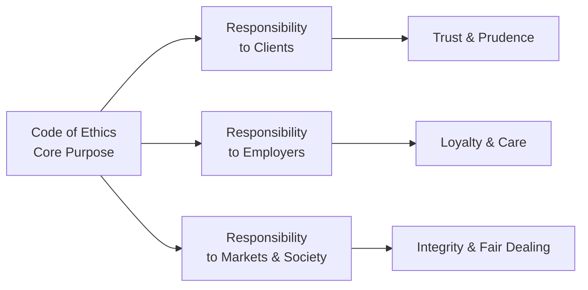
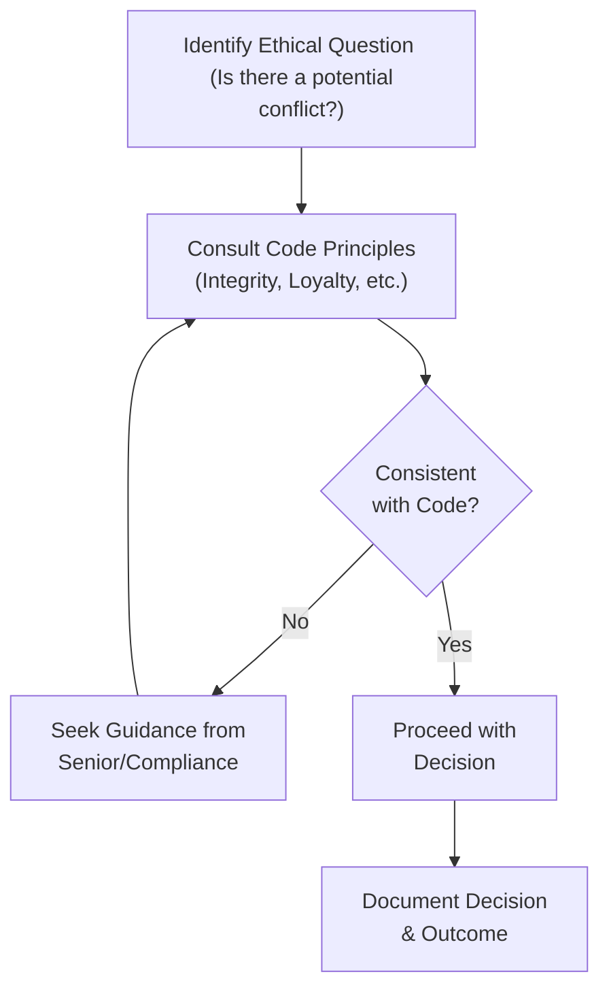

## Overview

Have you ever found yourself staring at a tough ethical dilemma and thinking, “Uh, what do I do now?” If so, you’re in good company. Many investment professionals wrestle with these questions every day. In fact, that’s exactly why the CFA Institute Code of Ethics exists. We need a guiding light when the path gets murky, and the Code basically says: “Hey, remember your duty to the client, your employer, and the broader financial community.”

But the Code isn’t just a laundry list of do’s and don’ts. Instead, it offers a high-level set of principles—the big ideas like integrity, loyalty, and care. In my own career, there have been times when I felt pressed by short-term pressures: bosses wanting immediate results, or clients expecting near-impossible returns. And I remember thinking, “Hmm, I think I could maybe push the boundaries on disclosure.” Then I recalled the Code’s emphasis on transparency and realized, well, that nudge to stay above board is precisely what ensures the long-term success of both my career and the trust in capital markets.

Below, we’ll walk through the purpose of the Code of Ethics, its essential framework, and how it underpins daily decision-making for CFA Institute members and candidates worldwide. And yes, we’ll talk about those six big pillars. We’ll also see how the Code differs from the Standards of Professional Conduct, how it can help you navigate those “gray area” ethical conflicts, and why it’s intentionally designed to support professionals in widely different legal and cultural contexts.

## Purpose of the Code of Ethics

The overarching purpose of the CFA Institute Code of Ethics is to set a behavioral foundation for all CFA Institute members and candidates—providing a robust, principles-based structure for conducting business with integrity. It goes beyond minimal legal compliance, urging us to act ethically even if the law or local norms wouldn’t necessarily require it.

• Client Focus: The Code is built around an unshakable emphasis on loyalty, prudence, and care. Essentially, hold the client’s best interest at heart.  
• Market Confidence: By promoting honesty and fair dealing, the Code fosters trust in global capital markets.  
• Culture of Integrity: The Code’s responsibilities push investment professionals to encourage ethical behavior within their firms and the broader financial system.

I remember the first time I read it—I was an eager Level I candidate, and I thought, “Okay, but one day, is someone really going to test me on these lofty statements?” Fast-forward a decade, and yes, you bet they will! Clients, colleagues, and regulators pay attention to how closely we align our actions with such principles.

## Framework and Key Principles

The Code’s framework, compared to a rigid rulebook, is more like a moral compass. It’s a set of guiding statements that outline duties not only to clients but also to employers, colleagues, and the larger society. This broad approach recognizes that the investment industry is a global ecosystem with many interconnected stakeholders.

### Principles-Based Approach  
One of the big calls the Code makes is: “Use good judgment.” It’s straightforward but also a bit tricky because we often encounter real-world complexities. The principles-based approach steps beyond technicalities and focuses on the “spirit” of ethical conduct.

### Global Applicability  
Maybe your firm is regulated under one jurisdiction, but you do business in another. The Code’s design allows it to travel seamlessly across borders. Whether you’re in New York, Tokyo, or São Paulo, the underlying values remain consistent.

### Personal Integrity  
Integrity underpins everything. The Code emphasizes that each professional’s moral accountability can’t really be outsourced or replaced by a rule. You’re the one who must uphold the standard, even if nobody’s watching.

The figure below visualizes how broad ethical responsibilities intersect with daily professional life:

In this diagram, everything flows from the central node (the Code and its core purpose) to the different spheres of responsibility we encounter in practice.

## Six Pillars of the Code of Ethics

People often talk about “the six pillars” of the Code. Although the exact wording can shift slightly between CFA Institute publications, these usually capture the essential values:

• Acting with integrity, competence, diligence, and respect.  
• Placing the interests of clients before personal interests.  
• Using reasonable care and exercising independent professional judgment.  
• Practicing and encouraging others to practice in an ethical manner.  
• Upholding the integrity and viability of global capital markets.  
• Maintaining and improving professional competence.

Let’s break it down:

1. Integrity: This is about honesty in everything you do, from drafting research reports to marketing your services. If something feels sneaky, that’s a red flag.  
2. Competence and Diligence: “Um, I guess that’s enough research, let’s just send the memo.” Ever done that? The Code’s second pillar reminds us to keep refining our technical skills and to treat due diligence as non-negotiable.  
3. Client Interests: We talk about “Loyalty, Prudence, and Care.” If you’re making an investment decision, you ask, “Is this truly in my client’s best interest?” The moment you start placing personal or employer interests first, you’re violating this principle.  
4. Ethical Culture: The Code goes beyond your personal conduct; you also have a responsibility to encourage ethical behavior in colleagues and juniors. In my opinion, that group synergy is vital for building a trust-based firm culture.  
5. Integrity of Capital Markets: It’s not just about your direct clients. If you shred documents or manipulate markets, you’re harming the entire financial ecosystem.  
6. Continuous Professional Development: The Code encourages us to keep pace with evolving industry trends, new regulations, and advanced investment strategies.

## Code vs. Standards of Professional Conduct

Here’s a question folks often ask: “What’s the difference between the Code and the Standards?” A good analogy might be the difference between a constitution and statutes. The Code sets out the overarching principles (like a national constitution), while the Standards of Professional Conduct provide the more detailed rules (like federal or state laws).

• The Code: High-level ethical pillars.  
• The Standards: More specific “dos and don’ts” that operationalize those pillars into day-to-day activities.

For instance, the Code might say: “Be honest and fair with clients.” The Standards might break that down into more explicit obligations regarding misrepresentation, use of nonpublic information, loyalty, and so on. In practice, both are integral. The Code provides the moral compass, and the Standards give you the map. If you follow them together, you’re far less likely to get lost in murky territory.

## Navigating Complex Ethical Situations

Let’s face it: The real world is messy. For example, imagine you’re a portfolio manager who’s just discovered a potential conflict of interest with a new product your firm is rolling out. Or perhaps you find yourself in a conversation with a colleague who suggests “massaging” a few numbers in a performance report.

In these moments, the Code can be a crucial anchor:

• Principle Over Procedure: Instead of asking “What’s legal in this jurisdiction?” ask “Is what I’m about to do consistent with the spirit of loyalty, prudence, and care?”  
• Long-Term Perspective: The Code encourages a viewpoint that a short-term advantage gained through unethical means can damage your reputation (and your firm’s) in the long run.  
• Consult Others: The Code fosters an environment where seeking advice from compliance officers or mentors is not just allowed, but encouraged.

## Real-World Example

Picture an analyst, Harper, who is preparing a research report on a publicly traded company. She stumbles upon confidential industry data that suggests the company’s stock will skyrocket. Or so she thinks. The data isn’t entirely verified, and it may be considered material nonpublic information. The Code’s principle on integrity and the Standard on “Material Nonpublic Information” would guide Harper to validate the source or, if it’s truly confidential, refrain from using it. Even if using that tidbit could give a massive advantage to clients or her firm, it would compromise market fairness.

## Global Applicability

One of the Code’s biggest strengths is how it transfers across geographic and cultural boundaries. The Code is principles-driven, so whether your local laws are more stringent or more lax, the emphasis remains on doing the right thing. There might be times when local regulations allow certain practices—perhaps a lenient approach to disclosure. But the Code insists you exceed the local minimum if it means upholding global best practices.

## Personal Integrity and Ethical Culture

Let’s talk about personal integrity. The Code basically says: “It’s on you.” You have the responsibility to act ethically, even if your boss or your local norms say otherwise. Some people interpret this as overly burdensome, but in truth, it’s quite empowering. By embracing the Code’s spirit, you cultivate long-term credibility.

Encouraging others to do the same creates a ripple effect. Set the tone with new analysts or interns. I always tell my mentees: “Look, if something seems fishy, speak up. Don’t be shy.” That might feel scary the first time, but it fosters a shared culture of responsibility—one that can weather storms, both regulatory and reputational.

## Protecting Markets and the Investing Public

Why does the Code matter to society as a whole? Because financial professionals are the stewards of capital markets. When we breach ethical lines, it’s not just about losing a client or dealing with a compliance headache; it erodes public trust in the entire system. Maybe you’ve seen or read about major corporate scandals—folks cooking the books or mismanaging client funds. Those events ripple out, reducing confidence and harming the public who rely on honest capital markets for retirement savings, business growth, and social stability.

The Code’s emphasis on fair dealing, disclosure, and a robust approach to risk management is designed to keep the financial system healthy. And that’s not just lofty talk—subpar ethical behavior can lead to real damage.

## Case Study: Ambiguous Cross-Border Practices

Consider a scenario where your firm operates in two countries, each with differing disclosure rules. In Country A, you must disclose all forms of compensation you receive from third parties to clients. In Country B, that specific requirement might be less explicit. Should you align with stringent standards from Country A or adopt different approaches in each jurisdiction?

The CFA Institute Code of Ethics would counsel you to err on the side of more disclosure. This upholds the principle of transparency and ensures clients have a clear picture of potential conflicts of interest. Even though local norms in Country B might be more lax, the Code’s global perspective safeguards the spirit of fair dealing.

## Common Pitfalls, Best Practices, and Personal Reflections

• Pitfall: Thinking compliance is enough. Just ticking boxes can lull you into believing you’re always acting ethically. The Code warns us that ethical conduct requires broader moral judgment.  
• Pitfall: Rationalizing “small” breaches. Maybe it’s a white lie or slight exaggeration in a marketing pitch. But once the door to lesser deceptions is open, it’s a slippery slope.  
• Best Practice: Discuss ethical scenarios openly in your workplace. Use the Code as a springboard for conversations. This is how you build an ethical “muscle memory.”  
• Best Practice: Document your decisions. If there’s an ethical gray zone, write down your thought process. It helps if you ever need to justify your actions to compliance or the CFA Institute’s disciplinary panels.

Personally, I’ve seen folks get in trouble for not continuing to educate themselves on the Code. They remember something from an older iteration but miss a new nuance introduced in the latest version. So, do yourself a favor: keep tabs on updates—and share what you learn!

## Diagram: Ethical Decision Flow

Here’s a quick flowchart to help visualize a step-by-step approach to an ethical decision. It marries elements of the Code with your real-world context:

Notice how consulting the Code principles is an early step. If the action is inconsistent with any principle—like ignoring a conflict of interest or bypassing honesty in professional communication—it’s time to pause, revisit, or escalate.

## Conclusion and Exam Tips

At the end of the day, the CFA Institute Code of Ethics is your moral checklist. It’s a set of broad “North Star” principles that help you navigate any questionable situation that might come up—no matter how complex the local rules or how intense the short-term pressures.

For those preparing for the CFA Level III exam, here are some suggestions:

• Familiarize yourself with both the Code and the Standards. The exam loves scenario-based questions that test your judgment.  
• Think critically: “If I were in this scenario, what is the underlying principle at stake?”  
• Watch for conflicts of interest or inaccurate disclosures in vignette-based questions. The right decision usually aligns with client interests, transparency, and professional integrity.  
• Practice writing out your reasoning: The exam’s constructed-response sections often require you to justify your answers.  
• Time management: Ethical questions can be tricky, so practice reading carefully, identifying the principle, and applying it systematically.

## References and Suggested Readings

• CFA Institute. (2022). “The Code of Ethics,” in the Standards of Practice Handbook. Charlottesville, VA: CFA Institute.  
• Schilit, H., & Perler, J. (2018). Financial Shenanigans. McGraw-Hill.  
• “ESG and Ethics: The Intersection of Responsible Investing,” CFA Institute webinar series.

These materials offer deeper dives into real-life ethical pitfalls and illustrate how the principles of the Code apply to various corners of the finance industry.

## Test Your Knowledge: Ethics and Professional Judgment



### Which statement best represents the core purpose of the CFA Institute Code of Ethics?

- [ ] To replace all local regulations and policies regarding ethical standards.
- [ ] To provide a list of rigid punishments for unethical behavior.
- [x] To establish overarching principles guiding members and candidates to uphold integrity, loyalty, prudence, and care.
- [ ] To ensure compliance departments have fewer responsibilities.

> **Explanation:** The Code of Ethics outlines foundational principles that transcend local regulations and inform ethical decision-making. It does not replace local rules or prescribe specific punishments, but rather acts as a high-level guide for integrity, loyalty, and prudence.

### What is a key difference between the CFA Institute Code of Ethics and the Standards of Professional Conduct?

- [x] The Code provides broad ethical pillars, whereas the Standards offer specific rules and applications.
- [ ] The Code and the Standards are identical sets of guidelines.
- [ ] The Code is enforced only in the United States, while the Standards apply globally.
- [ ] The Code supersedes all local laws and regulations in every country.

> **Explanation:** The Code acts as a high-level moral benchmark, and the Standards elaborate on these principles by offering detailed directives and rules for specific situations. They complement each other.

### Which of the following is considered a best practice for adhering to the Code’s principles?

- [x] Documenting the rationale behind ethically sensitive decisions.
- [ ] Prioritizing short-term gains over client welfare to meet performance targets.
- [ ] Providing disclosures only when legally mandated.
- [ ] Assuming local laws cover all ethical obligations.

> **Explanation:** Ethical decisions can be nuanced. Documenting your decision-making process helps ensure accountability and demonstrates alignment with ethical and professional standards.

### Why is global applicability a key feature of the CFA Institute Code of Ethics?

- [ ] It allows investment professionals to disregard local laws if they are less strict.
- [ ] It prohibits investment professionals from working outside their home country.
- [x] It ensures the Code remains relevant and consistent across differing cultural and regulatory environments.
- [ ] It only applies to professionals in developed markets.

> **Explanation:** A key strength of the Code is that it sets universal principles, urging practitioners to exceed local standards when necessary to maintain integrity and protect markets.

### Which action best demonstrates the principle of loyalty, prudence, and care?

- [x] Placing the client’s interest first, even when it conflicts with the firm’s short-term revenue goals.
- [ ] Accepting a performance-based bonus without disclosure.
- [x] Considering the client’s risk tolerance before making an investment decision.
- [ ] Gathering and using nonpublic information to beat the market.

> **Explanation:** Acting in the client’s interest above all else and ensuring actions align with their risk profile illustrate loyalty and care. Using nonpublic information would undermine the integrity of capital markets.

### When faced with an unusual ethical challenge not explicitly addressed by local regulations, a CFA charterholder should:

- [x] Refer to the overarching principles in the Code and Standards.
- [ ] Ignore the situation unless it violates a regulatory rule.
- [ ] Delegate the decision to a non-CFA colleague.
- [ ] Immediately inform the media.

> **Explanation:** The Code and Standards provide guiding principles that help navigate ethical situations beyond formal laws. Charterholders have the responsibility to uphold these values, even in gray areas.

### A firm operating across multiple jurisdictions finds two sets of disclosure requirements. In line with the Code, the manager should:

- [x] Comply with the higher (more stringent) of the two standards to maintain transparency.
- [ ] Follow whichever rule might save on administrative costs.
- [x] Only comply with local law where it is strictly enforced.
- [ ] Omit disclosures to avoid client confusion.

> **Explanation:** The Code emphasizes transparency and integrity. When in doubt, adopt the higher standard of disclosure to protect client interests and maintain market integrity.

### If an analyst accidentally obtains material nonpublic information, the Code advises:

- [ ] Using the information since it was not obtained illegally.
- [ ] Sharing it within the team to enhance collective analysis.
- [ ] Trading quickly but quietly.
- [x] Refraining from trading or sharing until the information becomes public.

> **Explanation:** The Code and Standards firmly prohibit the use of material nonpublic information. Trading on such data jeopardizes market fairness and can lead to severe legal and ethical consequences.

### Which of the following is a direct benefit of fostering an ethical culture within an organization?

- [ ] It completely eliminates human errors in investment analysis.
- [x] It increases long-term trust and credibility among clients and counterparts.
- [ ] It reduces the need for compliance controls or audits.
- [ ] It guarantees superior investment returns.

> **Explanation:** While no code of ethics can guarantee perfect decisions or returns, fostering an ethical culture significantly enhances trust, credibility, and resilience to reputational risks.

### True or False: The CFA Institute Code of Ethics solely aims at legal compliance requirements and has no bearing on broader moral considerations.

- [x] True
- [ ] False

> **Explanation:** This statement is false. The Code of Ethics goes beyond minimal legal or regulatory compliance, emphasizing moral and professional duties, building a culture of integrity, and protecting clients and markets.


