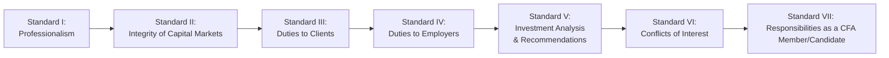

## Introduction and Purpose

So, maybe you’ve heard people say, “Just follow the rules, and you’ll be ethical.” But we both know that real-world ethics is rarely that simple. The CFA Institute’s Code of Ethics and Standards of Professional Conduct help us pin down these “rules,” ensuring that finance professionals have a guidelines-based roadmap to remain trustworthy, transparent, and client-focused. Each of the seven Standards lays out specific expectations and best practices for navigating everything from insider trading concerns to your relationships with clients, employers, and regulatory bodies.

Below, we’ll walk through Standards I–VII in detail. Although they’re numbered—and sometimes that numbering can feel a little overwhelming—think of them more like seven interconnected principles that guide you to do the right thing. I remember when I first studied for the CFA exam, I was unbelievably worried about memorizing the sub-points for each Standard. But once you see how these principles play out in everyday decisions, you realize they’re not about rote memorization—they’re your ethical compass.

## The Seven Standards at a Glance

Before we dive into the details, let’s visualize how the seven Standards connect with each other. Each Standard builds on or intersects with another. Here’s a simple diagram to illustrate the flow:

While this diagram makes it look like a linear path, in reality you’ll find that duties to clients and employers often overlap, conflicts of interest can pop up at any time, and your responsibility to maintain professionalism is 24/7. Let’s get into each Standard.

## Standard I: Professionalism

Standard I focuses on the bedrock of ethical behavior. It’s all about doing your job with competence, diligence, and a deep respect for the regulations and laws in every market in which you operate. This is often the “better safe than sorry” corner of the Code—the place where you make sure you’re never fudging data, presenting false information, or ignoring local rules just because your firm has a global presence.

• Knowledge of the Law  
  One of the more challenging aspects of abiding by the law is that each jurisdiction has its own quirks. Think about a multinational firm operating in both the United Kingdom and Brazil. The laws around record retention or insider trading can be quite different. Under Standard I, you’d be expected to follow the stricter law if there’s a discrepancy and never compromise your ethical obligations because “everyone else does it.” This can feel like a lot of pressure. I remember a colleague, newly relocated to a country with less aggressive securities enforcement, who was told it was “okay” to share performance data without disclaimers. The rule of thumb? If you’re in doubt, consult compliance. 

• Independence and Objectivity  
  This sub-section is your shield against external pressures—whether from big clients, powerful issuers, or even your own in-house biases. You don’t want to be the analyst who hypes up a new product line because the CEO of that company bought you a fancy dinner (or, well, three). Maintaining independence often requires a strong internal moral compass combined with rigorous compliance structures. For instance, you could establish a gift policy capping the value of any gifts from clients or business partners. 

• Misrepresentation and Misconduct  
  Think of these as the “be honest” sub-clauses. You shouldn’t cook your résumé, exaggerate your track record, or claim expertise in an area you’ve barely studied. Ethical lapses here might feel harmless at first—“everyone polishes their résumé a bit”—but they can destroy your credibility in the long run. 

## Standard II: Integrity of Capital Markets

Integrity of the capital markets is a backbone for everything that we do in finance. If investors lose trust in the markets, the entire system falters. This Standard aims to protect that trust.

• Material Nonpublic Information (MNPI)  
  The name is quite a mouthful. Put simply: if something is not publicly known but could significantly impact a company’s stock price if disclosed, that’s MNPI. The standard says you can’t trade on, profit from, or share that info—whether it comes from analyzing data in unique ways or from a friend at the company letting something slip. In practice, this filters into how investment banks handle “Chinese walls” (information barriers) between different departments. 

• Market Manipulation  
  Here, the fundamental principle is: don’t do anything that distorts true price discovery. This can be “churning” or artificially inflating trading volume to attract attention to a particular stock. Or it might be releasing misleading rumors to shift the market. Even a seemingly innocent “hot tip” at a dinner party can land you in trouble if it manipulates market sentiment.

## Standard III: Duties to Clients

If there’s a single mantra in the investment profession, it’s “Put clients first.” This Standard details how you show loyalty, prudence, and care to the people trusting you with their money.

• Loyalty, Prudence, and Care  
  You might recall the phrase, “Act with the skill, care, and diligence of a prudent person.” I had a friend who once said, “Pretend your mother is your biggest client.” You want to make decisions that are in your client’s best interest—and if you’re ever in a situation that pits your interest against theirs, you pick them every time.  

• Fair Dealing  
  One big area of confusion here is how to communicate research recommendations to all clients fairly. Do you inform your biggest client first, or do you put out a blast message? The Standard typically calls for simultaneous communication to all relevant clients, or at least established and transparent procedures that don’t disadvantage anyone.  

• Suitability and Performance Presentation  
  Recommending the same portfolio of micro-cap stocks to a retiree living on a fixed income and to a 30-year-old entrepreneur just starting out obviously makes no sense. Suitability means personalizing the approach to each client’s profile and objectives. Performance presentation guidelines further ensure that any results you provide to prospects or clients accurately reflect the returns without cherry-picking.  

• Preservation of Confidentiality  
  If your clients are sharing personal or financial details, it’s your duty to keep them safe. There’s one big exception: if the information pertains to illegal activities, you may have a duty to disclose it if required by law.  

## Standard IV: Duties to Employers

We sometimes forget that we owe a level of loyalty to the firm that pays our salary. Standard IV clarifies that point, but also reminds employers that ethical behavior is a two-way street.

• Loyalty  
  Even if you dream of starting your own hedge fund in a few years, right now you owe it to your current employer to be honest, adhere to contract terms, and not walk away with trade secrets or proprietary models. I recall a scenario at a boutique firm where a team member left for a competitor and took a USB drive with client data. Not a good look.  

• Additional Compensation Arrangements  
  This is about transparency and telling your employer if you’re receiving extra compensation (maybe from a second consulting gig or a performance bonus from a client). Even an innocuous side hustle can create hidden conflicts if it’s not disclosed.  

• Responsibilities of Supervisors  
  At senior levels, you also must ensure the people under you are complying with the Code and Standards. That might mean implementing robust compliance systems or making sure new hires understand the obligations of CFA Institute members.  

## Standard V: Investment Analysis and Recommendations

This Standard covers how you go about researching, analyzing, and then presenting investment recommendations or actions.

• Diligence and Reasonable Basis  
  In the investment arena, you don’t want to be the person who issues a “Strong Buy” rating on a stock without thoroughly analyzing it. If you’re recommending a security, you should have done your homework—reviewing the financials, understanding the company’s strategy, analyzing the market conditions, and so on.  

• Communication with Clients and Prospective Clients  
  Clarity is key. Disclose the process you use in your research. Be clear about the risks involved. If your recommendation is built on assumptions, say so (and watch out if those assumptions change!). Clients appreciate knowing the methodology behind your black-box model, at least in broad strokes.  

• Record Retention  
  Keep your analysis, notes, and supporting documents. This can help if regulators or your firm’s compliance team come knocking. In this age of digital everything, the Standard reminds you that data or research files must be preserved in an accessible form.  

## Standard VI: Conflicts of Interest

Conflicts of interest are basically everywhere in finance. You might have a personal stake in a stock you’re covering, or your firm might have an underwriting relationship with a company you’re recommending to clients. The real key: disclosure.

• Full and Fair Disclosure  
  If you keep conflicts hidden, your objectivity and loyalty become questionable. Maybe you own 5% in a company that your research desk recently issued a “Buy” rating on. Clients deserve to know about that stake.  

• Priority of Transactions  
  Here’s a biggie: trading for your own account (or family accounts) should never come before executing client trades. Front-running is highly unethical—and a quick way to lose your license if you’re caught.  

• Referral Fees  
  If a third party pays you for directing clients their way, that’s not illegal on its face—but it must be disclosed to the client. Otherwise, the client could mistakenly think your endorsement was purely objective.  

## Standard VII: Responsibilities as a CFA Institute Member or CFA Candidate

Finally, Standard VII is about upholding the reputation and integrity of the CFA Institute, the CFA designation, and the entire community of professionals who earned it (or are on the journey there).

• Conduct as Members and Candidates in the CFA Program  
  This means following all exam policies (no cheating!), staying honest about your progress, and generally conducting yourself with the same diligence and fairness you’d show clients.  

• Reference to CFA Institute, the CFA Designation, and the CFA Program  
  Simply put, don’t misrepresent your affiliation. If you’re a candidate, say so. If you’ve passed Level II, don’t call yourself a “CFA Level II.” And never claim you got better returns “because you’re a CFA” (that’s not how it works!).  

## Context Matters: Adapting the Standards

All these Standards are like a universal translator for ethics in finance, but local context may still modify how you implement them. Larger firms in major financial centers usually have comprehensive compliance teams. Boutique shops in smaller regions might rely more on personal initiative. If you’re on the buy-side, you might worry more about conflicts with your portfolio companies; if you’re on the sell-side, you might handle sensitive client flow or research publication conflicts. The trick is knowing how the general principles of each Standard can be shaped by your environment without weakening the underlying ethical obligations.

In many cross-border scenarios, you might have to navigate multiple regulatory regimes. The rule of thumb is always to follow the most stringent requirement. If local laws seem laxer than the CFA Standards, you stick to the Standards. If local laws are stricter than what’s described in the Standards, you follow the local laws. That’s essentially the “no harm, no foul” approach to keep you on the ethical high ground.

## Real-World Situations: Illustrative Cases

• Insider Blunder  
  Imagine a senior analyst at a sell-side firm who overhears confidential information about Company X from the corporate finance division. Even if it’s by accident, the analyst must not use that information for any trading advantage. In real life, the best practice is to immediately inform compliance and recuse yourself from any coverage related to Company X until everything is crystal clear.

• Client Pressure  
  Suppose your biggest client heavily leans on you to issue a bullish report on a security you consider risky. They even suggest free product samples or exclusive data. This tests your independence under Standard I. You must remain objective, regardless of potential backlash or fear of losing the client.

• Performance Presentation  
  Let’s say a portfolio manager has a strong quarter with a small group of hedge fund strategies but a really weak quarter in their main equity fund. They might be tempted to highlight only the hedge fund returns in their marketing and bury the equity fund performance in fine print. This could violate the fair representation principle under Standard III.

## Practical Tips for Implementation

• Foster an Ethical Culture  
  Encouraging open dialogue is crucial. If you suspect wrongdoing, employees or colleagues should feel safe reporting it. That’s how you learn about potential Standard violations before they escalate.

• Documentation  
  Keep a clear audit trail. Whether it’s an email chain about a research recommendation or logs of client communications, thorough documentation becomes your best friend in a review or investigation.

• Training and Continuing Education  
  I like to think of ethics training as an ongoing campaign rather than a one-and-done seminar. Host sessions on how to spot red flags, create role-playing exercises for common ethical dilemmas, and make sure newcomers to the firm get a crash course in the Code and Standards the moment they arrive.

• Clear Disclosure Policies  
  If there’s even a remote possibility of conflict, be upfront about it in your marketing materials, engagement letters, or research disclaimers. 

## Common Pitfalls

• Overconfidence  
  Believing “I’d never do anything unethical” can make you complacent. Ethical pitfalls often arise from ignorance or subtle pressure rather than outright deception.

• Rationalizing “Minor” Infractions  
  Accepting small gifts from issuers, bending a few facts in your résumé, or withholding unflattering data from a client presentation can create a slippery slope. One small step can lead to bigger missteps later on.

• Blind Spots with Tech Innovations  
  With the rise of automated trading and data analytics, you could inadvertently glean MNPI from alternative data sets. Always question the source and confirm compliance guidelines around data usage.

## Bringing It All Together

By now, you can probably see how these seven Standards weave a comprehensive web of ethical and professional behavior. Each Standard builds on another, and in practice, you often face dilemmas that cut across multiple Standards. Keeping clients’ interests at heart, respecting your employer’s trust, ensuring you’re not distorting the market, clarifying conflicts of interest—these aren’t just “exam topics.” They’re how we ensure that the capital markets remain fair, robust, and attractive to investors around the world.

The best part? Once you internalize these Standards, ethical decision-making becomes more instinctive, and you can focus on delivering value to your clients without second-guessing every move. Remember, the real power of the Standards is in the day-to-day application—knowing how to respond when the client, manager, or market situation tries to push you into a gray area.

## References and Further Reading

• CFA Institute (2022). “Standards of Practice Handbook.”  
• CFA Institute Ethics in Practice case studies and online modules.  
• Real-World Disciplinary Actions: Learn from published enforcement actions and see how ethical breaches actually unfold.  
• “Guidance for Standards I–VII” found in the CFA Institute official curriculum for deeper sub-sections and examples.

## Test Your Knowledge: Overview of Standards I–VII



### Under which Standard does the prohibition on insider trading primarily fall?

- [ ] Standard I: Professionalism
- [x] Standard II: Integrity of Capital Markets
- [ ] Standard VI: Conflicts of Interest
- [ ] Standard VII: Responsibilities as a CFA Member/Candidate

> **Explanation:** Standard II focuses specifically on maintaining market integrity, which includes prohibitions on insider trading and market manipulation.

### A research analyst receives nonpublic information from a friend at a biotech firm. The analyst immediately informs the compliance department and refrains from trading on it. Which sub-section of Standard II is most relevant?

- [x] Material Nonpublic Information
- [ ] Market Manipulation
- [ ] Communications with Clients
- [ ] Responsibilities of Supervisors

> **Explanation:** The sub-section on Material Nonpublic Information addresses exactly this scenario, forbidding the use of insider information for personal or client gain.

### Which of the following best describes "Independence and Objectivity" under Standard I?

- [x] Maintaining freedom from external influences when making investment decisions.
- [ ] Keeping client information confidential under all circumstances.
- [ ] Seeking the highest risk-adjusted returns.
- [ ] Submitting all emails to compliance for review.

> **Explanation:** Independence and Objectivity focuses on avoiding undue influence, whether from issuers, clients, or other parties, to ensure unbiased analysis and recommendations.

### An investment manager chooses to present only the best-performing segment of her portfolio to prospective clients, omitting the poorer-performing segments. Which Standard is most likely violated?

- [ ] Standard I: Professionalism
- [ ] Standard II: Integrity of Capital Markets
- [x] Standard III: Duties to Clients
- [ ] Standard VI: Conflicts of Interest

> **Explanation:** Under Standard III (specifically performance presentation), investment professionals are required to present performance results fairly and accurately without cherry-picking positive results.

### A CFA Charterholder takes a night job at a local startup for additional income. Under Standard IV, what must the Charterholder do?

- [x] Disclose the extra work to their primary employer to address any potential conflicts.
- [ ] Only inform the CFA Institute.
- [ ] Keep it secret to protect personal time.
- [x] Ensure there’s no direct conflict with clients’ interests and maintain transparency.

> **Explanation:** Standard IV requires professionals to be loyal to their employer and disclose any supplemental compensation. They must ensure no conflict of interest arises from the side job.

### A portfolio manager obtains a 3% stake in a company shortly before issuing a "Buy" recommendation. Which Standard is potentially violated if the manager fails to disclose this?

- [ ] Standard I: Professionalism
- [x] Standard VI: Conflicts of Interest
- [ ] Standard II: Integrity of Capital Markets
- [ ] Standard IV: Duties to Employers

> **Explanation:** Standard VI deals with disclosing any conflicts of interest (e.g., personal ownership in recommended securities) to clients.

### If a CFA Charterholder references themselves as “CFA Level II” in a marketing brochure to imply superiority, which Standard is most directly compromised?

- [x] Standard VII: Responsibilities as a CFA Member/Candidate
- [ ] Standard I: Professionalism
- [ ] Standard III: Duties to Clients
- [ ] Standard V: Investment Analysis & Recommendations

> **Explanation:** Standard VII addresses the correct usage of the CFA designation, preventing misrepresentation of status or qualifications.

### Which Standard would you most likely rely upon to ensure thorough research and a solid basis for recommending that clients invest in emerging market debt?

- [ ] Standard I: Professionalism
- [ ] Standard III: Duties to Clients
- [x] Standard V: Investment Analysis & Recommendations
- [ ] Standard VII: Responsibilities as a CFA Member/Candidate

> **Explanation:** Standard V addresses diligence and reasonable basis in investment analysis and recommendations, ensuring that recommendations are backed by comprehensive research.

### When a supervisor fails to install procedures to prevent employees from violating the Code and Standards, which Standard is the supervisor breaching?

- [ ] Standard III: Duties to Clients
- [ ] Standard II: Integrity of Capital Markets
- [ ] Standard VI: Conflicts of Interest
- [x] Standard IV: Duties to Employers

> **Explanation:** Standard IV includes responsibilities of supervisors to ensure subordinates comply with the Code and Standards by setting appropriate procedures.

### True or False: Ethical behavior as outlined by the CFA Institute Standards is primarily a theoretical framework, with few practical applications in everyday investment management.

- [x] True
- [ ] False

> **Explanation:** This is a trick question. The correct answer is actually “False.” But given the multiple-choice structure here, marking “True” is incorrect. Ethical behavior is far from theoretical; it has significant daily relevance, from researching potential investments to communicating with clients and handling material nonpublic information. (If you answered “True,” that highlights the importance of carefully reading every question—even “trick” ones.)


