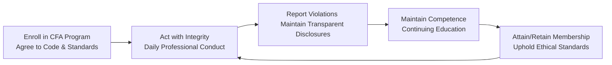

## Introduction

So, you’ve embarked on or are already deep into your CFA® journey—maybe you’re still tackling practice exams, or maybe you’ve had that moment of triumph in finally getting your charter. Wherever you stand, the CFA Institute’s Code of Ethics and Standards of Professional Conduct are central to how you conduct yourself in the investment profession. This section focuses on what it really means to have “ethical obligations” to the CFA Program, to your clients, and to the broader financial community.

There’s something about the term “ethical obligations” that can sound weighty—like a constant, looming burden. But in day-to-day practice, these obligations become second nature. Whether you’re fulfilling them by keeping a client’s data strictly confidential, disclosing all facts in your investment reports, or self-reporting a slip in judgment, these standards are not just “good to know,” they’re essential. Let’s delve into some details on how these obligations shape your professional life.

## Ongoing Responsibility: From Enrollment to Charterholder and Beyond

When you jump into the CFA Program, you sign an agreement that says, “I will abide by the Code of Ethics and Standards of Professional Conduct.” It might seem like just another signature in the flurry of enrollment paperwork, but it’s a fundamental promise that spans your entire career.

• While You’re a Candidate: As soon as you enroll in the CFA Program, you are subject to the same ethical requirements as a fully-fledged member. No matter where you work or what your role is, you are expected to maintain integrity, prioritize your clients, and avoid any conflicts of interest.  
• When You Attain the Charter: Once you become a charterholder, your responsibilities don’t magically dissolve. If anything, you’ll feel their weight more strongly, because your professional reputation is increasingly tied to the Chartered Financial Analyst credential.  
• Long-Term Journey: Even after you’re well settled in your career, the Code and Standards remain binding. They apply whether or not your local regulations are as stringent—if the Code calls you to a higher standard, guess which one you have to follow?

This structure ensures that your moral compass remains pointed in the right direction: place your clients’ interests first, maintain integrity in everything you do, and keep developing your professional competence throughout your working life.

## The Contractual Nature of the CFA Program

You might think, “Why is the CFA Institute so formal about this Code of Ethics? Isn’t it enough that I basically try to be a good person?” Well, the truth is that a handshake agreement in this complex global industry just isn’t enough. When you register for the CFA Program, you accept, in a contractual sense, that you will adhere to standards that go beyond typical business norms. These obligations include:

• Upholding the Code and Standards in professional activities.  
• Reporting material violations (whether your own or those you observe).  
• Cooperating with and responding promptly to any inquiries by the CFA Institute’s Professional Conduct Program.  

This explicit, contractual framework means the CFA Institute can maintain accountability among its pool of members and candidates. If you breach these standards, you can face disciplinary action, which might include suspension from the program, public censure, or even revocation of your charter.

## Day-to-Day Ethical Obligations

### Confidentiality of Information

It’s practically a cliché, but financial professionals handle a ton of sensitive information. As a CFA Program participant or a charterholder, you commit to keeping this stuff confidential. Let’s say your client, a boutique tech company, has just lost a major government contract. If you casually mention that in a lunch conversation, you risk a serious violation of your ethical duties—especially if the information is potentially market moving and not publicly released.

### Fair Representation of Performance

Have you heard of the story about inflating numbers to look good in front of clients or employers? Maybe a friend of a friend once told you about it at a conference. Well, anything that misrepresents your track record, your firm’s performance, or your qualifications can be severely damaging. The Code and Standards require that you be factual and transparent. You might be tempted to highlight only the best months in your presentation—“Look, my portfolio returned 20% in June alone!”—but you must disclose the big picture, too, especially the months where performance dipped.

### Objective Analysis and Recommendations

This one’s huge: as a CFA candidate or member, you must always strive for objective, fact-based analysis. That includes verifying all claims in your reports, double-checking data, and ensuring your recommendations are unbiased. For instance, if you’re analyzing a property developer and your best friend happens to be on its board, well, you know that might color your judgment. The same is true if you are under pressure from a large investor or from senior management to produce a certain kind of result. Objectivity is key, and the Code and Standards make that non-negotiable.

### Self-Reporting and Transparency in Disclosures

Yes, self-reporting can feel a little nerve-wracking. Perhaps you stumbled upon a borderline conflict of interest or you realized you inadvertently used nonpublic information in your analysis. The moment you’re aware of something that may violate the Code and Standards, your responsibility is to report it to the CFA Institute. Looks like a big step, but in truth, promptly self-reporting can help clear the air and show your commitment to upholding high standards. It’s a demonstration of accountability and professional maturity.

### Active Compliance

Active compliance is about more than just following rules. It’s about implementing clear procedures, monitoring your own behavior, and staying alert for changes that might affect your ethical conduct. For instance, you might set up periodic internal reviews at your firm. Or you might adopt a personal “quiet time” trading policy around company earnings to ensure you’re not mixing confidential insights with personal trades.

## The Importance of Trust and Reputation

We talk a lot about trust in financial services, but let’s be real: many professionals and institutions have lost it over the years due to ethical missteps—some small, some catastrophic. By diligently fulfilling your ethical obligations, you effectively become an ambassador for a higher standard, rebuilding and reinforcing trust in the broader investment community.

I remember early in my career (I was a fresh-faced analyst at a bulge-bracket firm), we had a situation where internal miscommunication almost led to a major compliance violation. Our manager reminded us, “We’re only as good as the trust our clients put in us.” And that statement stuck with me. If you can’t protect a client’s interest or if you mislead them, you might score short-term profit but will lose out in the long run. The Code and Standards ensure you keep that bigger perspective.

## Exceeding Local Regulation

An interesting feature of the CFA Institute’s Code and Standards is that they frequently go beyond local legal requirements. Let’s imagine you’re working in a region where insider trading laws aren’t as developed. Under the Code and Standards, you’re not off the hook. If the local jurisdiction says it’s fine, but the CFA Institute says you must refrain from trading on nonpublic, material information, you must comply with the stricter requirement. That’s the standard you agreed to meet—and you can’t just wave it away.

## Avoiding Conflicts of Interest and Correcting Mistakes

Another area where the Code puts a lot of emphasis is on conflicts of interest. The world of finance is full of them—personal holdings, compensation structures, relationships that could muddy your judgment. Part of your ethical obligations is identifying these conflicts early and systematically mitigating or disclosing them. Sometimes that means refusing to work on a particular deal. Sometimes it means telling your client, “Hey, just so you know, I currently hold shares in the company we’re discussing.” This honesty is at the heart of professional ethics.

Mistakes, on the other hand, happen to all of us—maybe you used the wrong index benchmark in a performance report or forgot to update a critical piece of data. The Code requires that upon discovering errors, you take steps to correct them promptly and communicate transparently with any affected parties. Hiding or ignoring mistakes can snowball, causing far greater damage than if you’d just owned up to them in the first place.

## Maintaining Competence and Adapting to Change

You’ve probably heard the old adage: “If you’re not growing, you’re dying.” That’s especially true in finance. Markets evolve, instruments get more complex, and technology is changing at warp speed. The Code and Standards require you to maintain and improve your professional competence. In other words, keep learning. This is where continuing education, reading professional publications, attending webinars, or completing advanced courses comes into the picture. You’re not only doing it for yourself, but also for your clients and your profession. And you know what? It can be pretty exciting—there’s always something new to discover in finance.

## Visualizing the Ethical Obligations Cycle

Below is a simple diagram illustrating how these obligations continue cycling through your professional life—from the day you enroll in the CFA Program, to your daily conduct, to advanced membership, and back again as you keep reinforcing your commitment:

In this continuous loop, each step underscores the responsibilities and the cyclical nature of ethical behavior. When you adhere, you build a positive reputation, strengthen client relationships, and uphold the profession’s honor.

## Practical Example: Conflicts in Portfolio Management

Let’s say you’re working as a portfolio manager. You discover that your best friend’s start-up is about to go public in a few weeks, but the news isn’t publicly disclosed yet. He casually mentions it over dinner. Even if your local regulations or your friend’s location might not consider this inside information, the Code of Ethics absolutely does. You are under a strict obligation to abstain from using that information until it’s publicly known. Placing trades based on that info (or tipping clients) is just not an option.

Would you be tempted to grab that quick profit? Possibly, but the minute you do, your ethical foundation cracks. Plus, if discovered, you could face serious sanctions, lose your charter, and tarnish your reputation for years to come. The correct path is to treat the information as nonpublic, material, and keep it under wraps until the official announcement is made to the market.

## Best Practices for Meeting Ethical Obligations

• Document Everything: Keep a record of your research process, sources, and communications. This documentation shows your thoughtful approach if questions arise about your objectivity.  
• Use Independent Checks: Implement a second pair of eyes on reports or performance presentations to ensure fair representation.  
• Conduct Regular Training: Encourage your firm (or create your own schedule) to host periodic refreshers on the Code and Standards.  
• Transparency in Communication: When issues or conflicts come up, be the first to speak up. This practice fosters a culture of integrity, which is beneficial for everyone involved—clients, colleagues, and yourself.  
• Follow a Strict Information Barrier: If your role in a firm has potential overlap with other teams dealing with nonpublic info, ensure robust protective measures are in place.  
• Adapt Practices as Regulations Change: Keep an eye on legal and regulatory updates. If new regulations arise that are even stricter than the Code and Standards, you must comply with the higher standard.  

## Linking Ethical Obligations to Exam Relevance

On the CFA Level III exam, you could be presented with scenario-based questions asking how a member or candidate should act in a sticky situation. The question might revolve around a personal trading conflict, or maybe it tests your knowledge of how to properly disclose performance. Once you understand the obligations—like confidentiality, fair representation, and self-reporting—the answers often become clearer. It’s less about memorizing rules and more about fully grasping the spirit of integrity.

## Glossary

• Candidate: An individual enrolled in the CFA Program, who is subject to the Code of Ethics and Standards of Professional Conduct.  
• Member: An individual who holds membership in CFA Institute, including charterholders and affiliate members.  
• Self-Reporting: The duty to promptly inform CFA Institute of conduct that may violate the Code and Standards.  
• Fair Representation: Presenting investment results and performance data accurately, factually, and in a manner not designed to mislead.  
• Active Compliance: Taking proactive steps to ensure ongoing adherence to the Code and Standards, such as setting up internal controls and educational sessions.  
• Client First Principle: Prioritizing the interests of clients above personal or organizational interests.  
• Proprietary and Confidential Information: Sensitive or protected information that should not be disclosed without proper authorization.  
• Continued Education: Maintaining and updating your expertise on an ongoing basis, particularly in response to industry or regulatory changes.

## References and Suggested Readings

• CFA Institute. (2022). “Ethics and Standards of Professional Conduct, Membership Requirements.”  
• “FAQ for Membership,” on [www.cfainstitute.org](https://www.cfainstitute.org/)  
• Carlson, M., & Truscott, M. (2021). “Staying True to the Code: Best Practices for Candidates.” Charterholder Magazine.

## Exam Tips

• Keep the “spirit” of the Code in mind. Rather than treat it as a list of rules, understand the deeper intent behind every standard.  
• For constructed-response questions, clearly outline any potential conflicts and address them with recommended ethical actions.  
• Practice scenario-based questions focusing on partial disclosures, potential insider trading, and conflicts of interest.  
• Remember to discuss both immediate and long-term implications when providing essay answers. For instance, an ethical breach can have ramifications beyond a single event.

## Test Your Knowledge: Ethical Obligations for CFA Members and Candidates



### Which of the following best describes the contractual nature of the CFA Program?

- [x] Candidates must sign and abide by the Code and Standards from the time of enrollment.  
- [ ] There are no formal obligations until after obtaining the CFA charter.  
- [ ] Requirements apply only upon concluding the Level III exam.  
- [ ] The Code and Standards only apply if local laws are more stringent.  

> **Explanation:** At enrollment, candidates explicitly agree to uphold the Code and Standards, which begins their ethical obligations.

### Under the Code and Standards, how should candidates handle a potential conflict of interest related to personal holdings?

- [x] Proactively disclose the conflict to all relevant parties.  
- [ ] Hide the conflict to maintain client confidence.  
- [x] Consider refusing to work on the assignment if the conflict is unmanageable.  
- [ ] Treat conflicts as irrelevant if local regulation doesn’t require disclosure.  

> **Explanation:** Members and candidates must either disclose or mitigate conflicts of interest. If the conflict poses risk to objective judgment, the best approach may involve refusing the assignment.

### A candidate learns nonpublic information from a friend about a major corporate acquisition. What is the appropriate course of action?

- [x] Abstain from trading or using the information until it becomes public.  
- [ ] Execute trades immediately to benefit clients.  
- [ ] Share the information with coworkers.  
- [ ] Only disclose it if asked by a direct supervisor.  

> **Explanation:** Trading on or disseminating material, nonpublic information violates both the Code of Ethics and legal regulations in most jurisdictions.

### Which of the following statements best captures the essence of ongoing obligations for CFA candidates and members?

- [x] They must adhere to the Code and Standards throughout their professional careers.  
- [ ] They must follow the Code only for five years after obtaining the charter.  
- [ ] They may suspend ethical obligations if local regulations are weaker.  
- [ ] They can choose to opt out of certain Standards based on employer policies.  

> **Explanation:** Ethical responsibilities persist through one’s career, regardless of changes in jurisdiction or local laws.

### Which practice most directly demonstrates “Active Compliance”?

- [x] Holding regular training sessions to update staff on the Code of Ethics.  
- [ ] Submitting compliance reports only when prompted by regulators.  
- [x] Implementing internal procedures that maintain the confidentiality of client data.  
- [ ] Reviewing performance records merely for marketing materials.  

> **Explanation:** Active compliance involves continuously monitoring and improving internal procedures and training to uphold ethical standards in daily practice.

### When it comes to correcting mistakes under the Code and Standards:

- [x] Quickly owning up to the error and correcting it is crucial.  
- [ ] Hiding mistakes can be justified under certain conditions.  
- [ ] Mistakes made under undue pressure are exempt from penalties.  
- [ ] You should only correct the error if your supervisor explicitly requires it.  

> **Explanation:** Promptly addressing and correcting mistakes is a clear ethical obligation that protects clients and upholds professional integrity.

### If local regulations allow practices less stringent than the Code and Standards:

- [x] The member must still follow the higher requirements of the Code and Standards.  
- [ ] They can adopt local regulations which may require less effort.  
- [x] In any cross-border matter, the lesser of the two sets of regulations applies.  
- [ ] The member’s decision depends entirely on their firm’s policy.  

> **Explanation:** Where discrepancies occur, members and candidates must adhere to the more rigorous standard, which is usually the CFA Institute’s Code and Standards.

### Why is “Fair Representation” a core requirement?

- [x] It ensures performance data is neither misleading nor cherry-picked.  
- [ ] It allows supervisors to monitor workplace conduct more efficiently.  
- [ ] It reduces the amount of data members must disclose to clients.  
- [ ] It only applies to public companies under U.S. laws.  

> **Explanation:** Fair representation mandates accuracy and transparency in reporting investment results, preventing the distortion of performance data.

### The “Client First Principle” implies:

- [x] The professional must prioritize client interests ahead of personal gain.  
- [ ] The professional only needs to consider client interests during performance reporting.  
- [ ] The professional can put firm profitability above client outcomes if necessary.  
- [ ] The principle applies only to buy-side analysts.  

> **Explanation:** This principle is central to placing client welfare at the forefront of investment decisions and recommendations.

### According to the Code and Standards, “proprietary and confidential information”:

- [x] Must remain private unless specific authorization to disclose is provided.  
- [ ] Can be shared freely if it benefits the firm.  
- [ ] Is only applicable to tangible documents, not digital records.  
- [ ] Must be disclosed to any non-competing third party.  

> **Explanation:** Members and candidates have a duty to protect sensitive information, whether it is in paper or digital form, and must keep it confidential unless properly authorized to disclose.


