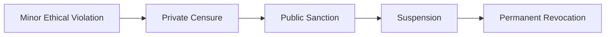
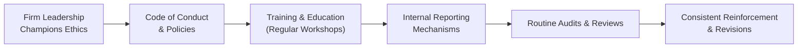

## Introduction

So, there was this time I heard about a friend of mine—it’s an old story, but worth sharing—who narrowly avoided disciplinary action by the CFA Institute. He’d accidentally forwarded non-public, material information to a colleague without realizing how serious that was. (He was new, and you know how easy it is to make a mistake when you’re juggling a million emails.) In the end, he apologized profusely and implemented stronger compliance checks to avoid repeating that slip. Luckily, he got off with a private censure and some stern advice. But oh boy, the mental stress! That minor breach of protocol made it clear just how deeply our professional reputation rests on each ethical judgment we make.

Stepping back, it’s almost amazing how something seemingly small can have major consequences—especially when you’re a CFA® charterholder or candidate. The repercussions range from a private reprimand to a full-blown, permanent revocation of your charter, not to mention the massive reputational fallout that can overshadow everything else you might have accomplished. Let’s explore the landscape of these consequences and the importance of consistently maintaining professional integrity.

## Exploring the Range of Possible Consequences

The CFA Institute outlines several disciplinary actions when members or candidates breach the Code of Ethics and Standards of Professional Conduct. These sanctions range from more discreet penalties to the extremely severe.

• Private Censure  
Sometimes you’ll see a private censure, which is the “lightest” penalty on the list. It’s basically a confidential reprimand. For instance, the CFA Institute might send a letter that tells you what you did wrong and informs you that your conduct ran afoul of the Standards. It’s not made public, so maybe your colleagues never hear about it directly. But trust me, the emotional impact is very real. Also, it’s a giant wake-up call.

• Public Censure  
If the misconduct is more serious, the Institute can make your sanction public. Public sanctions mean your name and violation details might be posted on the CFA Institute’s website or published in official communications. That’s a whole different ballgame. Public knowledge of wrongdoing can quickly snowball, damaging your reputation within the industry, diminishing client trust, and even alienating potential future employers.

• Suspension of Membership or Candidacy  
Violations that breach investor trust—or that the CFA Institute deems quite severe—may lead to a suspension of your membership or your candidacy in the CFA Program. Suspensions typically last a designated period, say one or two years. During that time, you’re not permitted to use the CFA designation, participate in local society events, or enjoy other membership perks. That can be brutal if you’re in a high-stakes environment where everything hinges on your professional credentials.

• Permanent Revocation of the CFA Charter  
At the far end is permanent revocation—like the nuclear option. This means you’re stripped of your charter, never allowed to use it again. Basically, it’s game over in terms of that credential. This penalty is very rarely administered, but it’s important to realize that the possibility is there. The knowledge of such a severe penalty might serve as a deterrent effect for any charterholder who’s tempted to cross ethical lines.

Below is a simple flow diagram showing the potential progression from lesser penalties to more significant ones:

Each arrow in this diagram emphasizes escalating severity. While many folks might never progress beyond one step, it’s essential to see how a cumulative record or a major single offense can move you further along that chain.

## Understanding Reputational Ramifications

Sometimes, it’s easy to focus on immediate penalties—like, “Oh no, I got censured!”—and forget that reputational risk can follow you for years. Reputational Risk is the threat of losing credibility and trust due to unethical behaviors or publicized investigations. Trust is the bedrock of the investment profession. If investors catch even a whiff of impropriety, they may look for a new manager, and the marketplace might become far less willing to collaborate or invest with you.

• Diminished Credibility and Lost Client Trust  
Clients choose a particular adviser or asset manager largely based on trust. If you’re publicly sanctioned or your violations end up in the news, many clients may jump ship. It’s like a restaurant receiving a health-code violation—patrons usually don’t wait around to see if conditions improve; they just leave.

• Potential Liability for the Firm  
Keep in mind, you might not just be hurting yourself. The firm you work for can also face liability or reputational damage. Regulators may subject the entire firm to stricter oversight. Prospects might question the entire company’s culture.

## What Is Professional Integrity?

Professional Integrity is the unwavering adherence to moral and ethical principles, forming the core of a trustworthy professional. This is not just about avoiding public scandal or passing the next compliance test. It’s an internal compass that guides our decisions day in and day out—especially when no one is watching.

Minor ethical lapses, like using inside jokes about a client’s net worth, or making a small omission in performance reporting, can lead to bigger issues down the line. Those “small” ethical gray areas can easily snowball into damaging behaviors or at least set the stage for more questionable decisions later. And yes, once that integrity is damaged, it’s extremely difficult to repair.

## Illustrative Cases: Seriousness of Violations

You might want to check out the CFA Institute’s “Outcome of Disciplinary Cases Report” (2022). It’s a fascinating (and sobering) read. In one of those real-life examples, a candidate participated in a scheme to cheat on the exam, which led to a multi-year suspension from the Program. Another case involved a charterholder who used client assets for personal transactions—he got a permanent revocation. The moment these transgressions surfaced, not only did the Institute step in, but many saw these individuals’ entire reputations tumble. If you asked them afterward, they’d probably say the penalty was tough but the reputational damage was worse.

## Proactive Steps for Maintaining Integrity

So how do you safeguard that precious credibility? Here are a few suggestions:

• Build a Culture of Ethics  
Firms committed to a Cultural Shift genuinely embed ethical values into everyday practices—like holding ethics workshops and building transparent reporting lines. And, well, dialing down the “what have you done for me lately?” approach that pushes employees toward questionable short-term achievements at any cost.

• Routine Compliance Checks  
Regular audits, training simulations, and robust record-keeping can catch potential cracks before they become cavernous breaches. If you see something that doesn’t jibe, talk to your compliance officer or use Internal Reporting Mechanisms to alert senior management. This is how issues get nipped in the bud.

• Personal Accountability  
Sure, it’s nice to lean on the compliance department, but real personal accountability means each professional—whether a brand-new associate or a seasoned portfolio manager—bears responsibility for upholding the Code and Standards. If you sense a conflict of interest or suspect you’re skirting a standard, it’s your responsibility to investigate, highlight it, and if necessary, blow the whistle internally.

• Evolving Integrity Over a Long Career  
No matter how experienced you are, new regulations, complex products, or shifting market structures can present fresh ethical challenges. Lifelong learning about ethics is key. If an advanced crypto investment or a new complicated structured product emerges, you want to ensure you’re applying the same ethical lens you did to more traditional securities. Over time, your approach to ethics might need to adapt, but the fundamental principles remain unwavering.

## How One Violation Can Overshadow a Career

It doesn’t matter how many philanthropic events you’ve chaired or how many pro bono lectures you’ve hosted—one dramatic ethical failure can overshadow it all. In everyday conversation, your peers might say, “Look at her track record—impressive.” But if you commit a severe breach, you’re going to be remembered for that, full stop. The notion of “the good overshadowing the bad” doesn’t work terribly well in ethics. People are quick to remember negative events because they call into question your trustworthiness and moral fiber.

## Practical Example: Trading on Non-Public Information

Imagine you’re a junior research analyst covering a tech company. Let’s say you stumble upon some material non-public info: perhaps you overhear a conversation about an earnings restatement. You get excited. You think, “Wow, I can definitely make a recommendation to buy or sell before the market finds out.” But that action, of course, violates Standard II(A): Material Non-Public Information. Even if you got “lucky” and no one caught you, the risk is enormous. If discovered, the CFA Institute and potentially the SEC (in the United States) or other regulators could investigate. The penalty might be larger than you can bear. Plus, you’d carry that scar for the rest of your career.

## Diagram: Maintaining a Culture of Ethics

Here’s a simple flowchart to visualize ways a firm can structure an ethical culture:

Leaders set the tone, which funnels down into clearly documented policies. Then come robust training sessions, easier-to-use reporting lines, routine audits, and a cycle of consistent reinforcement.  

## Sustaining Professional Integrity

Let’s face it: the investment profession isn’t static. Products modernize (ETFs, structured debt, digital assets), regulations update, and new corporate structures appear. What kept you out of trouble five years ago might need refreshing. So, continuing education is critical, and not just to accumulate Continuing Education (CE) credits for the sake of it. The best approach includes:

• Monitoring Regulatory Changes  
• Refreshing Knowledge of the Code and Standards  
• Attending Industry Roundtables  
• Engaging Mentors or Ethical “Sounding Boards”  

Think about mentors as social proof of your professional standards. If your mentors are known for unwavering ethics, chances are good you’ll mirror that (or at least feel a bit guilty when you slip).

## Key Glossary Terms

• Professional Integrity: The unwavering adherence to moral and ethical principles, forming the core of a trustworthy professional.  
• Reputational Risk: The threat of losing credibility and trust due to unethical behaviors or publicized investigations.  
• Private Censure: A less severe sanction, typically a confidential reprimand from CFA Institute.  
• Public Sanction: A penalty made known to the public, which can cause greater damage to status and career prospects.  
• Permanent Revocation: The ultimate penalty disallowing an individual from ever using the CFA charter again.  
• Deterrent Effect: The idea that known consequences discourage unethical behavior.  
• Cultural Shift: The process of embedding ethical values into everyday firm practices.  
• Internal Reporting Mechanisms: Systems within a firm that allow employees to report unethical activities or concerns.

## Final Exam Tips

• Think About Real-World Scenarios: In the CFA Level III exam, you might see item sets or constructed-response questions asking for an analysis of a potential ethical breach. Carefully identify which Standard is violated, discuss the short- and long-term consequences, and show how to correct or prevent the violation.  

• Provide Clear Explanations: CFA graders want well-structured responses. If you’re asked how you’d respond to an ethical dilemma, reference specific Standards and demonstrate knowledge of their practical application.  

• Time Management: The exam can be intense. Don’t spend too long on one scenario. Outline the key points and move on.  

• Be Familiar with the Disciplinary Process: The exam often poses questions about the consequences faced by members or candidates. Know the difference between private censure, public sanction, suspension, and permanent revocation.  

• Use the Institute’s Resources: The CFA Institute publishes real cases and summary outcomes. Skim them; they give insight into how certain breaches are deemed more serious than others.

## References, Suggested Readings, and Resources

• CFA Institute. (2022). Outcome of Disciplinary Cases Report.  
• Paine, L. S. (1994). Managing for Organizational Integrity. Harvard Business Review.  
• Guiso, L., Sapienza, P., & Zingales, L. (2015). The Value of Corporate Culture. Journal of Financial Economics.  

• For cross references within this volume, see:  
  – “Code of Ethics: Purpose, Framework, and Principles” in the same chapter for a deeper grasp of foundational ethical concepts.  
  – “Identifying Ethical Violations in Real-World Situations” in Chapter 3 for complex portfolio management scenarios.  

Anyway, keep reminding yourself: your professional choices stand on the pillars of ethics. One slip can lead to far-reaching consequences. Be vigilant, stay informed, and maintain your integrity for the long haul.  

## Test Your Knowledge: Ethics & Integrity Quiz



### Which sanction is considered the least severe penalty by the CFA Institute for a violation of the Code and Standards?
- [x] Private Censure
- [ ] Public Sanction
- [ ] Suspension
- [ ] Permanent Revocation

> **Explanation:** Private censure is generally a confidential reprimand, while public sanctions, suspensions, or permanent revocations are more severe.

### Which of the following best describes reputational risk in the context of ethical violations?
- [ ] The temporary drop in exam scores after a study break.
- [x] The threat of losing credibility and trust due to unethical behaviors or investigations.
- [ ] An increase in client referrals after a public sanction is published.
- [ ] A permanent elimination of professional membership.

> **Explanation:** Reputational risk refers to potential damage to credibility and trust from being associated with unethical acts or negative publicity.

### What could be the most likely impact on a firm if a portfolio manager publicly violates the Code and Standards?
- [ ] Gains immediate recognition for transparency.
- [ ] Experiences a surge in new client inflows.
- [x] Suffers both reputational damage and potential regulatory scrutiny.
- [ ] Benefits from reduced operating costs due to the manager’s suspension.

> **Explanation:** Firms often face both reputational fallout and greater regulatory attention when an employee commits a public ethics breach.

### According to the CFA Institute, which sanction permanently removes a member's right to use the CFA designation?
- [ ] Public Sanction
- [ ] Suspension
- [ ] Private Censure
- [x] Permanent Revocation

> **Explanation:** Permanent revocation is the ultimate penalty and disallows future usage of the CFA charter.

### Why is it so challenging to recover from even a minor lapse in professional integrity?
- [x] People tend to recall negative events more vividly, prompting a loss of trust.
- [ ] Minor infractions are always anonymous and thus impossible to address.
- [x] Ethical lapses rarely become public knowledge, which hinders improvement.
- [ ] The CFA Institute has no mechanism for redemption.

> **Explanation:** Once trust is fractured, others may remain wary. Even small lapses can raise doubts about one’s moral standards, making it challenging to restore full credibility.

### Which of the following best characterizes personal accountability in maintaining professional integrity?
- [x] Ensuring one’s own actions adhere to ethical standards rather than relying solely on compliance.
- [ ] Delegating all ethical decisions to a dedicated firm committee.
- [ ] Expecting regulations to identify and correct all unethical behavior.
- [ ] Bypassing the reporting of unethical behavior if it occurs outside your department.

> **Explanation:** Personal accountability means individuals bear direct responsibility for identifying and preventing unethical conduct in their own work.

### In practical terms, how can a professional best be sure they stay current as financial products and regulations evolve?
- [x] Engage in continuing education and maintain awareness of emerging ethical challenges.
- [ ] Wait until a violation occurs to learn about new regulations.
- [x] Avoid any product that is not explicitly referenced in the current Code and Standards.
- [ ] Only rely on peer feedback for ethical updates.

> **Explanation:** Participation in continuing education, reading updated regulatory guidance, and actively researching new products help maintain integrity in changing environments.

### Suppose an analyst inadvertently shares material non-public information with a colleague. What is the first and most crucial step they should take?
- [x] Self-report the incident to compliance and/or superiors.
- [ ] Hope no one notices and move on.
- [ ] Dismiss the significance, assuming minimal harm done.
- [ ] Immediately resign from the firm.

> **Explanation:** Self-reporting is essential to preserve integrity, manage the issue transparently, and comply with internal reporting mechanisms.

### What is the main purpose of an internal reporting mechanism in a firm?
- [x] Provide a safe channel to report suspected ethical breaches.
- [ ] Increase a firm’s overhead costs to deter malicious insiders.
- [ ] Keep sensitive client data hidden from compliance officers.
- [ ] Guarantee anonymity to the public about potential scandals.

> **Explanation:** Internal reporting mechanisms encourage employees to report unethical behavior internally so that problems can be addressed proactively and responsibly.

### True or False: A single ethical violation can overshadow an otherwise exemplary long career.
- [x] True
- [ ] False

> **Explanation:** Even a single incident can create a lasting negative impression, significantly harming one’s professional reputation and trustworthiness.


