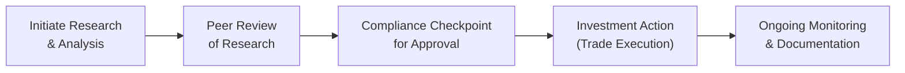

## Overview of a Robust Compliance Framework

When you think about it, compliance isn't about drowning under a sea of paperwork—it's about creating that trustworthy environment where everyone’s on the same page, ethically speaking. A well-crafted compliance framework usually starts with high-level principles, like the ones spelled out in the CFA Institute Code of Ethics and Standards of Professional Conduct (see Section 1.3). Then it maps these principles onto the day-to-day tasks of portfolio managers, analysts, and indeed anyone else engaged in investment decision-making.  

At its core, the framework’s job is to ensure that people, systems, and processes collectively meet obligations under laws, regulations, and the Code and Standards. Whether you’re working at a large asset manager or running a small boutique advisory, the steps to build, implement, and maintain a compliance framework generally look quite similar—though the scale will differ.  

Below, we’ll walk through these steps in practical detail, weaving in a few personal anecdotes (like the time I inadvertently walked into a compliance meeting with four competing project deadlines—I’ll never forget how critical it was to have a flexible but thorough compliance resource in place) and sprinkling in some real-life strategies that help keep everyone on track.

## Creating and Enforcing an Internal Code of Conduct

An internal Code of Conduct is basically a firm-specific adaptation of what the CFA Institute requires. Yes, the firm can’t just drag-and-drop Standard I(A) through Standard VII(B) onto an intranet page and call it a day. You want a code that resonates with the specific products, client types, and operational workflows at your firm:

• Align the Code with Core Values: The internal code should reflect the fundamental ethical standards of the CFA Institute (see Section 1.3 for an introduction to the Code of Ethics), but also incorporate the nuance of your firm’s business model. If you specialize in private wealth management, you might have a separate clause addressing confidentiality in dealing with high-net-worth individual clients.

• Integrate Regulatory Requirements: If your firm operates in multiple jurisdictions, reconciling different regulation sets can be tricky. You must ensure that the code captures local regulations without compromising Tier-1 ethical standards.  

• Communicate “Why”: It’s not enough to say, “Here’s the code—please follow it.” People need to understand why each policy exists. Tie the code’s provisions back to the real risks faced by your firm, such as insider trading or front-running.  

• Ongoing Updates: The code is always a living document. Annually, maybe even quarterly, you’ll want to re-evaluate to see if you need to tweak its provisions.  

In my experience, the best internal codes of conduct strike a balance between being comprehensive enough to cover relevant scenarios and being user-friendly enough that employees and management can engage with it daily.

## Structured Training Modules and Ongoing Development

All the internal policies in the world won’t matter if nobody understands them. This is why structured training and ongoing professional development are your next big steps—like an engine that keeps the entire compliance program humming.

• Orientation Programs: Offer an “Ethics 101” session for new hires that clarifies not just rules, but the rationale behind them. People are more likely to follow policies they understand in context.

• Scenario-Based Workshops: My absolute favorite approach is the scenario workshop, where participants informally debate real or hypothetical ethical dilemmas. For instance, discussing a case where an analyst might have inadvertently come into possession of market-moving insider info and walking through the correct steps to handle it.  

• Regular Refreshers: There’s a natural “forgetting curve” for everything we learn, and ethics is no exception. Quarterly or semi-annual refreshers with fresh examples keep the conversation alive.

• Online Ethical Training Modules: Microlearning modules that employees can access on-the-go are incredibly powerful. A quick five-minute module on personal trading guidelines is easier to digest than a single lengthy session.  

Professional development in ethics is not just about avoiding trouble; it also boosts your firm’s reputation and fosters collaboration. Employees trust each other more in an environment explicitly committed to integrity.

## Role of the Chief Compliance Officer (CCO) or Ethics Committee

An essential part of the compliance puzzle is leadership. In many firms, leadership is in the hands of a Chief Compliance Officer (CCO) or, alternatively, an ethics committee. The CCO or committee should be accessible, known to employees, and empowered to enforce the rules:

• Policy Development and Monitoring: The CCO typically crafts the compliance policies and ensures their enforcement. They also keep tabs on emerging regulatory shifts and update the internal code to stay ahead of the curve.  

• Oversight and Investigations: The CCO or ethics committee may investigate potential violations. To build credibility, the process should be transparent, consistent, and supportive, focusing on root-cause analysis.  

• Day-to-Day Guidance: Think of the CCO as a friendly resource. Many employees hesitate to ask compliance questions for fear of divulging ignorance. An approachable CCO fosters an “ask me anything” culture, so small ethical doubts don’t turn into big problems later.  

## Pre-Approval Processes for Personal Trading

Let’s be honest: personal trading is where many unwitting mistakes happen. One small slip—like trading a security a few days before your firm issues a report on it—can turn into a huge compliance headache or even an integrity breach under Standard VI (see Section 2.6). So, the solution is often a robust pre-approval process:

• Submission of Trade Requests: Employees must fill out a simple form or use an automated system to request authorization. In many cases, a “cooling-off period” (some folks have to wait 24-72 hours after a trade request is approved) further reduces the chance of conflicts.  

• Restricted and Watch Lists: Firms maintain lists of securities under coverage or subject to special restrictions. Automated systems can flag these if employees attempt to trade them.  

• Immediate Reconciliation: The compliance team compares personal trades with the firm’s client trades. Any deviation or suspiciously timed trades trigger follow-up.  

Honestly, it might feel like a hassle for employees sometimes, but it’s a huge reassurance for clients. Personal trading pre-approval is one of the strongest signals that your firm truly walks the talk on ethics.

## Record-Keeping Strategies and Reasonable Basis

Record-keeping is about telling the story of your research and actions. Standard V of the CFA Institute’s Code and Standards (see Section 2.5) requires you to have a reasonable basis for investment recommendations, which typically means you’ve documented how you arrived at a particular conclusion:  

• Research Documentation: Keep track of raw data, analyst notes, and external inputs (like third-party reports). For instance, if you rely on a microeconomic forecast from an external vendor, document it.  

• Automated Paper Trails: Many portfolio management systems do the heavy lifting by capturing trading rationale, risk analytics, and even compliance flags.  

• Organizing Data: This might involve a folder structure or a software solution, but the bottom line is that it should be easy for an auditor—or for you—to reconstruct the logic behind your decisions.  

• Retention Periods: Regulations often have explicit time frames for holding onto records (like five or seven years). Make sure your policy meets or exceeds local laws.  

## Ethical “Checkpoints” in the Investment Process

Let’s face it: it’s not always obvious that an ethical line is about to be crossed. That’s why building in “pause-and-check” moments can help. These are structured points where someone else in the firm (or even a specialized committee) reviews your work:

• Peer Review of Research: Perhaps a fellow analyst looks over your assumptions. They might challenge your numbers or highlight potential confirmation bias.  

• Portfolio Construction Meetings: During these, team members might check if a given investment idea aligns with client suitability, risk tolerance, and the stated investment mandate.  

• Compliance Sign-Off on Marketing Materials: Before your marketing team sends a fact sheet or performance chart to potential clients, a compliance professional can review the disclaimers and underlying data for accuracy.  

Think of these checkpoints as quality assurance—like how a pilot runs through a pre-flight checklist. We might not always love the extra time involved, but it significantly reduces the likelihood (and severity) of ethical “turbulence.”

Below is a simple Mermaid diagram illustrating a possible compliance “checkpoint” workflow:

## Self-Assessments and Third-Party Audits

Yes, audits can feel stressful, but they’re essential. Whether it’s a self-assessment or an external examination, you’re basically verifying that the compliance framework is doing its job:

• Self-Assessment: Many firms conduct internal audits at least annually, where department heads fill out questionnaires on how well they’re adhering to policies. This helps highlight areas that need improvement.  

• External Audits: Third-party auditors—whether from a regulatory body or an independent consultant—bring fresh eyes. They might uncover blind spots or help refine best practices.

• Implementation Feedback Loop: Once an audit is complete, you’ll likely have a list of recommendations or required actions, such as training enhancements, new policies, or stricter record-keeping. The result should feed back into your compliance framework to strengthen it continuously.

## Best Practices, Common Pitfalls, and Mitigation Strategies

• Best Practices:  
  – Maintain an open, approachable compliance culture where employees can ask questions.  
  – Encourage buy-in at every level, from the front desk to the executive suite.  
  – Align policies with real business contexts rather than adopting an off‑the‑shelf approach.  

• Common Pitfalls:  
  – Failing to adapt global ethics to local laws, leading to conflicting instructions.  
  – Inadequate or outdated training programs that bore employees or skip emerging ethical challenges (e.g., use of big data in client analytics).  
  – Overcomplicating personal trading rules to the point that employees ignore them or find workarounds.  

• Mitigation Strategies:  
  – Use short, regular training sessions focusing on the riskiest pain points.  
  – Implement and enforce a mindful set of approvals for personal trading while keeping the process user-friendly.  
  – Encourage employees to speak up about unclear guidelines or potential conflicts.  

## Conclusion and Cross-References

Upholding professional conduct isn’t a one-and-done affair. It’s ongoing, evolving, and almost always involves collaboration. Compliance programs that thrive emphasize adaptability, continuous learning, and clear, concise documentation. As you delve deeper into the specific sections of the Code and Standards, keep these implementation guidelines in mind:

• For specific details on how the Standards shape professional conduct (including references to personal trading and the concept of reasonable basis), see Chapter 2, especially Section 2.5 (Standard V – Investment Analysis, Recommendations, and Actions) and Section 2.6 (Conflicts of Interest).  
• For ways to evaluate real-time ethical decision-making, see Chapter 3, particularly Section 3.7.  
• For guidance on how to align your Asset Manager Code responsibilities at a firm-wide level, see Chapter 4.  

May these steps help you create a resilient and transparent ethical environment—and ensure that your firm doesn’t just talk about ethics but truly lives it.  

## References, Suggested Readings, and Resources

• CFA Institute. (2022). “Standards of Practice Handbook.” Sections on building and managing a compliance program.  
• Sporkin, C. (2017). “Internal Controls in the Investment Management Sector.” Journal of Securities Regulation.  
• Sample Codes of Ethics from large asset management firms (publicly available on their websites).  

## Test Your Knowledge: Upholding Ethical Conduct in Practice



### Which of the following is the most critical benefit of building structured ethical training programs?

- [x] They provide employees with ongoing reinforcement of ethical standards and real-life compliance scenarios.  
- [ ] They eliminate the need for future updates to the internal code of conduct.  
- [ ] They focus primarily on advanced market analytics.  
- [ ] They replace the requirement for employees to document their investment rationale.  

> **Explanation:** Structured training programs ensure constant engagement with ethical principles through real-life examples, fostering an environment of continuous learning.  

### Which practice strengthens a firm's record-keeping to satisfy the requirement of having a “reasonable basis” under Standard V?

- [x] Maintaining comprehensive documentation of research, analyses, and third-party data inputs.  
- [ ] Consolidating all research notes into a single summary PowerPoint.  
- [ ] Discarding notes after the investment recommendation has been presented.  
- [ ] Allowing each team member to manage personal files in an ad hoc manner.  

> **Explanation:** Having thorough and organized research documentation helps demonstrate due diligence and evidence of a reasonable basis for recommendations.  

### Which of the following is the primary role of the Chief Compliance Officer (CCO) in an investment advisory firm?

- [x] Crafting and monitoring the firm’s standards to ensure compliance with relevant regulations and ethical codes.  
- [ ] Executing trades in the firm's principal accounts.  
- [ ] Preparing returns-based performance attribution for client portfolios.  
- [ ] Mandating employees to invest in the firm’s proprietary hedge fund.  

> **Explanation:** The CCO is responsible for developing, implementing, and monitoring adherence to compliance policies and ethical standards.  

### What is the main purpose of pre-approval processes for personal trading?

- [x] To ensure employees do not trade securities that might create conflicts of interest or front-running concerns.  
- [ ] To encourage employees to align their personal portfolios with client portfolios.  
- [ ] To prevent employees from saving on brokerage costs.  
- [ ] To increase the frequency of discretionary trading by employees.  

> **Explanation:** Pre-approval processes safeguard against conflicts of interest by reviewing and approving employees’ personal trades before they occur.  

### Which of the following best describes a common “checkpoint” in an investment firm?

- [x] A pre-trade approval step and compliance review before executing any client-facing orders.  
- [ ] Automated tools that block all personal trades for an entire quarter.  
- [x] A final sign-off from the research head that ensures alignment with client mandates.  
- [ ] A requirement to wait 30 days after a public company’s earnings report has been filed.  

> **Explanation:** Ethical checkpoints typically involve both pre-trade approval and ensuring alignment with client objectives. They can occur at various points in the investment process, e.g., strategy meetings, research reviews, or compliance sign-offs.  

### Which factor most commonly leads to confusion when creating an internal code of conduct?

- [x] Handling differences between international regulations and the overarching ethical standards of the CFA Institute.  
- [ ] Adapting policies to be more stringent than local laws.  
- [ ] Consulting with an external lawyer for support.  
- [ ] Citing references from the CFA Institute’s Standards of Practice Handbook.  

> **Explanation:** When operating across multiple jurisdictions, reconciling the variety of local regulations with a unified global standard often causes confusion.  

### Why are scenario-based ethics workshops considered particularly effective?

- [x] They allow participants to debate realistic ethical dilemmas, fostering deeper critical thinking.  
- [ ] They completely eliminate potential conflicts of interest.  
- [x] They ensure compliance with all local regulations automatically.  
- [ ] They free senior management from the responsibility to provide guidance.  

> **Explanation:** Scenario-based workshops encourage problem-solving and discussion, which leads to better retention of ethical principles. They do not guarantee compliance but cultivate awareness of real-life ethical pitfalls.  

### Why might a firm conduct both self-assessments and third-party audits?

- [x] Self-assessments enable ongoing improvements, while third-party audits provide independent validation of the compliance program.  
- [ ] Self-assessments allow firms to bypass regulatory requirements, while third-party audits address local legislation.  
- [ ] Third-party audits replace the need for training modules.  
- [ ] Neither method can meaningfully improve compliance frameworks.  

> **Explanation:** Internal reviews frequently uncover everyday issues, while external audits bring a fresh perspective and can reveal blind spots missed by internal teams.  

### What is the primary advantage of having an easily accessible and approachable CCO or ethics committee?

- [x] It encourages employees to seek guidance before small compliance questions become major violations.  
- [ ] It reduces the documentation required for third-party audits.  
- [ ] It guarantees that no employee will ever commit an ethical breach.  
- [ ] It reduces regulatory reporting requirements by half.  

> **Explanation:** When the compliance function is approachable, employees are more likely to clarify doubts, thus reducing the risk of misconduct.  

### The main goal of implementing ongoing professional development for ethics is to:

- [x] True  
- [ ] False  

> **Explanation:** True. Ongoing professional development keeps employees up to date with emerging ethical challenges, ensuring they understand new regulations and are equipped to deal with evolving market practices.  


