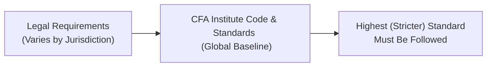

## Introduction
So, what's the big deal about “ethical responsibilities” versus “legal requirements,” anyway? Well, in the realm of professional conduct—especially under the CFA Institute Code of Ethics and Standards of Professional Conduct—it’s not always enough to simply follow the law. Ethical conduct can (and often does) go beyond what is formally required by local regulations.

Let me share a quick personal anecdote: I remember my very first job in the investment world. We had these flashy marketing brochures that showcased the performance of certain products—fully within legal limits. But, oh boy, some of my colleagues and I felt uneasy about how those brochures glossed over risk factors. Our compliance officer said we were good on the legal front, but ethically, we really should have been more transparent. That situation stuck with me and made me realize there’s often a difference between checking a box for legality and embracing deeper ethical standards.

Throughout this section, we’ll explore these differences in detail. We’ll look at why ethics can supersede the law, how the CFA Institute’s Code offers a more robust framework, and why following the highest (most stringent) standard is crucial—particularly when navigating multiple jurisdictions. If you ever wondered why the CFA Institute keeps emphasizing that it’s not enough just to follow the law, you’ve come to the right place.

## The Legal Minimum vs. Ethical Standard
One key thing to remember is that law sets a baseline—a “Legal Minimum,” to borrow from our handy glossary—but ethics turns it up a notch and guides our moral compass. Local legislation will tell you what must be done to avoid legal repercussions, but an “Ethical Standard” challenges you to do the right thing for clients, markets, and society, even if no law explicitly requires it.

Imagine a situation where marketing communications might be legally permissible—say, a promotional piece that highlights only the best years of fund performance. Legally, this may meet disclosure requirements. Yet from an ethical standpoint, it can be misleading. In other words, the line between “fully legal” and “fully ethical” might be a lot wider than you think. 

Here’s a tiny table to illustrate the difference:

| Category            | Legal Minimum                                           | Ethical Standard                                       |
|---------------------|---------------------------------------------------------|--------------------------------------------------------|
| Key Focus           | Fulfilling statutory or regulatory requirements         | Ensuring integrity, transparency, and fairness         |
| Motivation          | Avoid fines, sanctions, or legal penalties             | Build long-term trust, maintain integrity, safeguard stakeholders |
| Behavior Catalyst   | Fear of punishment                                     | Commitment to do what’s morally right                  |
| Flexibility         | Generally rigid, based on written laws or regulations   | Fluid, principle-driven; can exceed legal requirements |

Now, does this mean laws aren’t important? Absolutely not. Laws are necessary to maintain order in markets and society. But from the CFA Institute’s perspective, you want to treat the minimum regulatory standard as merely a floor. The Code and Standards serve as the next level up—enabling you to truly act with professionalism and protect the public interest.

## The “Higher Standard” Principle in Practice
You might be thinking, “So if my local law is less stringent, do I still have to follow the Code?” The short answer (and official stance) is yes. The “Higher Standard Principle” asserts that we always follow the more demanding rule—regularly summarized as “follow the strictest standard.” In jurisdictions where the law is more stringent than the CFA Institute requirements, you stick to the law. Conversely, if the Code demands more than the local law, you must follow the Code.

This can absolutely lead to some interesting conundrums in cross-border transactions. Picture you’re trading securities in two countries with conflicting regulations. If one country’s rules are more lax about disclosure, well, the Code’s stance is that you honor the strictest regulations for all. Realistically, that means you might have to do additional diligence to ensure you’re not inadvertently violating the Code by following the weaker local regulation.

And let me be honest: sometimes that can be frustrating. You might be surrounded by peers saying, “We’re within the law—no problem.” Yeah, legally you might be fine, but ethically, you could be heading for trouble.

## Cross-Border Considerations
Speaking of which, “Cross-Border Conflict” is a common scenario for investment professionals. CFA charterholders often operate at an international level with clients, regulators, and counterparties across multiple jurisdictions. While a single “Legal Minimum” can vary significantly, the Code holds all members to a consistent “Global Consistency” in ethical conduct.

For instance, maybe you’re based in Country X, which has lenient insider trading laws (though that’s rare). Meanwhile, your firm’s headquarters sits in Country Y, which has some of the strictest insider trading rules on the planet. Regardless of Country X’s lax stance, you’re expected to uphold the more stringent rules your home office must follow, as well as the strict rules spelled out by the Code. And, in the eyes of the CFA Institute, ignorance is not a defense. You must know the laws and apply whichever standard is tightest.

## Diagram: Navigating Legal vs. Ethical Standards
Below is a simple diagram that illustrates how different legal frameworks and ethical standards can interact. The final node shows the outcome of following the “Strictest Standard Rule.”

This high-level view can help you visualize why we might “go beyond” local guidelines—particularly if local law is ambiguous or underdeveloped.

## Real-World Scenarios: Where Legal Meets Ethical
Let’s consider a few real-world type examples—some may come from reading the headlines, others from personal experiences in the field:

• Marketing Materials: Legal disclaimers might be in tiny print, and everything might be “technically” disclosed. Yet if potential investors are left with an overly rosy outlook, you may be skating on unethical ice, even if local statutes are satisfied.

• Trading Strategies: Suppose the local law doesn’t specifically forbid front-running your own firm’s trades. Surprise—CFA Institute says that’s a big conflict of interest. Even if your local statutes don’t mention front-running, it’s ethically off-limits.

• Cross-Border Merger Deals: In some places, you might not be obligated to provide comprehensive disclosures about environmental or social risks. However, an ethical approach—particularly in the spirit of ESG considerations—would require a more thorough treatment of the potential impacts.

• Tax Structures: Some jurisdictions permit extremely aggressive tax strategies that push the envelope of “legal.” But if these structures mislead regulators or violate the spirit of the law, a professional abiding by the Code should probably steer clear, at least from an ethical standpoint.

In each of these examples, legal compliance does not necessarily guarantee that you’re meeting higher ethical principles.

## Reputation Risk and Long-Term Trust
Even if you never face a lawsuit or formal sanction, unethical (but not necessarily illegal) behavior can cost you dearly in the long run. “Reputation Risk” refers to the harm done to your credibility, relationships, and future opportunities when your conduct is perceived as shady. A single scandal—think of major investment banks that engaged in borderline-legal product sales—can tarnish an entire firm’s image for years.

Why does this matter so profoundly? Besides the moral imperative, trust is the currency of financial markets. The moment your partners, clients, or regulators start to doubt your authenticity, everything’s at stake. So, even if something is legal but questionable, seasoned professionals often avoid it to preserve the intangible asset called “trust.”

## Consequences Beyond Legal Penalties
Remember, Section 1.2 in this text (“The Disciplinary Review Process”) elaborates on how the CFA Institute can impose sanctions or even revoke memberships for members who violate the Code. You might escape a courtroom entirely but still be subject to professional discipline. And, oh, let’s face it: losing the trust of your peers and having a stain on your professional record can be just as damaging—sometimes more—than a legal penalty.

Also, the entire organization can suffer if it’s discovered that employees follow the law to the letter but ignore the spirit of the Code. If leadership fosters a culture that encourages workers to “push it to the edge,” the negative ripple effect can hamper hiring, client relationships, and brand reputation.

## Due Diligence in Ethical and Legal Obligations
Ensuring that both legal and ethical obligations are met generally calls for “Due Diligence,” which often involves a methodical review of activities, policies, or transactions to identify any potential pitfalls. For instance, before rolling out a new product, a thorough (and not just cursory) review helps determine if you’re meeting all regulations and also ensures that any potential ethical red flags (like misleading advertisement or conflict of interest) are addressed well in advance.

In cross-border tasks, due diligence becomes especially critical. Staff must understand which jurisdiction’s regulations apply, how those rules align with or conflict with the CFA’s Code, and how to integrate the strictest standard. This might involve consulting legal counsel in multiple countries, checking with compliance teams, or even bringing in industry experts who can help interpret local nuances.

## Strategies for Harmonizing with the Code
One of the best ways to maintain consistency with the Code across varying jurisdictions is to embed ethical guidelines into the organization’s policies and day-to-day procedures. It could involve:

• Annual or quarterly training sessions reminding staff of the Code’s higher standard.  
• Requiring sign-offs that employees understand both local regulations and the Code.  
• Building ethical checks into project lifecycles. For example, in every new marketing campaign, check whether there’s a complete depiction of risks.  
• Establishing processes that escalate potential conflicts to a cross-border ethics committee.  

Yes, sometimes these steps might seem like “extra bureaucracy.” But in my opinion, it’s better to address ethical concerns upfront than try to repair a damaged reputation after the fact.

## Practical Insights for Exam Day
If you’re preparing for the Level III exam, scenarios around legal vs. ethical responsibilities often appear in both item sets and constructed-response questions. The examiner might give you a situation where a manager adheres to a local law that is less stringent than the Code’s requirements and ask whether the manager acted appropriately. Typically, the correct approach is to identify that the manager had to meet the more demanding standard, even if local law didn’t require it.

Also, be prepared for cross-border complexities. You might see a question where a firm is operating in two different countries with contradictory marketing disclosure requirements; you’ll need to note that the ethicist must prioritize the higher standard.  

Keep in mind that the exam focuses on the “why” behind instructions. Understanding the conceptual rationale—that trust underpins the entire investment profession—will help you interpret questions that appear ambiguous at first glance.

## References, Suggested Readings, and Additional Resources
• CFA Institute. (2022). “Standard I(A): Knowledge of the Law,” in “Standards of Practice Handbook.”  
• Paine, L. (1996). “Why Companies Need Vision and Values.” Harvard Business Review.  
• “Cross-Border Issues” section of <https://www.cfainstitute.org/ethics> for more details.  
• See Section 1.7 for “Implementation Steps for Upholding Professional Conduct” and Section 1.9 for “Ethical Culture and Organization-Wide Conduct.”  

Anyway, the overarching message is that abiding strictly by the law or local regulations isn’t enough to guarantee ethical conduct. Across all jurisdictions, following the Code of Ethics and Standards of Professional Conduct ensures integrity, fosters trust, and enhances both individual and industry credibility.

## Test Your Knowledge: Distinguishing Ethical vs. Legal Requirements



### Which best describes the difference between legal requirements and ethical standards?
- [ ] Legal requirements are more stringent than ethical standards in all jurisdictions.
- [x] Legal requirements establish a baseline; ethical standards often exceed that baseline. 
- [ ] Ethical standards are typically less demanding than legal requirements.
- [ ] Legal requirements and ethical standards are always identical.

> **Explanation:** The Code and Standards demand a higher level of behavior than some local laws. Legal requirements set the baseline, whereas ethical standards often push professionals to go further.

### In cross-border conflicts where two sets of laws contradict each other, CFA Institute members should:
- [ ] Follow whichever standard is specified by their home country.
- [ ] Follow the more lenient law to remain consistent with local customs.
- [x] Abide by the most stringent rule or law that applies. 
- [ ] Ignore all laws and rely solely on the Code and Standards.

> **Explanation:** The CFA Institute instructs members to follow the highest standard among the applicable legal requirements and the Code and Standards.

### A marketing piece for a new investment product is legally permissible but includes only the best past performance and omits key risks. According to the Code and Standards, this is:
- [x] Potentially misleading and unethical, even if legal. 
- [ ] Acceptable if local regulations do not prohibit it.
- [ ] A criminal act that should be reported immediately.
- [ ] Required by marketing personnel to preserve the firm’s image.

> **Explanation:** Even if permissible under local marketing laws, presenting performance without adequate risk disclosure is ethically questionable and may violate several Standards on fairness and clarity.

### Which term refers to the possibility of losing credibility by acting unethically, even if no law is violated?
- [ ] Cross-Border Conflict
- [ ] Due Diligence
- [x] Reputation Risk
- [ ] Legal Minimum

> **Explanation:** Reputation Risk is the harm done to one’s credibility or standing due to unethical conduct, even if no law is broken.

### If the local law in a member’s jurisdiction is stricter than the Code and Standards, the member should:
- [x] Comply with the stricter legal requirements.
- [ ] Default to the CFA Institute Code, ignoring local laws.
- [x] Document the discrepancy but still follow the Code alone.
- [ ] Focus only on the Code since it is a global benchmark.

> **Explanation:** The principle is always to follow the most demanding standard, whether that is the Code or local law.

### A member who follows legal regulations precisely but misleads clients through selective information is:
- [x] Violating the Code’s ethical guidelines.
- [ ] In full compliance with the Code and Standards.
- [ ] Acting ethically, since it’s not explicitly illegal.
- [ ] Following best practices in marketing.

> **Explanation:** Ethical standards require fairness, honesty, and transparency that exceed many legal disclosure requirements.

### What is the primary intent of “Due Diligence” in ensuring ethical conduct?
- [x] Identify and mitigate legal and ethical shortcomings.
- [ ] Facilitate the fastest route to market for new products.
- [x] Guarantee that marketing materials look appealing.
- [ ] Satisfy the annual requirement for regulatory compliance updates only.

> **Explanation:** Due diligence ensures that all potential legal and ethical issues are addressed, helping professionals avoid violations that might be missed by a narrow legal compliance focus.

### Why might ethical conduct be important even when no legal requirements exist?
- [ ] Laws always exist, so this situation can’t happen.
- [x] Ethical conduct promotes trust and long-term professional credibility.
- [ ] Enforcement agencies will create new laws if needed.
- [ ] It makes marketing simpler by removing disclaimers.

> **Explanation:** Ethical principles often extend beyond legal demands. Independently of law, abiding by ethical guidelines fosters client trust and integrity in the profession.

### A manager in Country A, where insider trading rules are lax, must follow CFA Codes that classify insider trading as prohibited. The manager should:
- [x] Abide by the Code and treat insider trading as prohibited.
- [ ] Engage in insider trading if it’s not illegal locally.
- [ ] Rely on local legal statutes to determine the appropriate standard.
- [ ] Only follow local legal statutes in daily practice.

> **Explanation:** Even if local laws are lax, CFA charterholders must adhere to the Code’s strict stance on insider trading and follow the highest standard.

### True or False: Ethical standards established by the CFA Institute can require members to go beyond local rules.
- [x] True
- [ ] False

> **Explanation:** The CFA Institute Code and Standards often set a higher bar than local laws. Members must comply with the stricter requirement, upholding a global benchmark of professional conduct.


