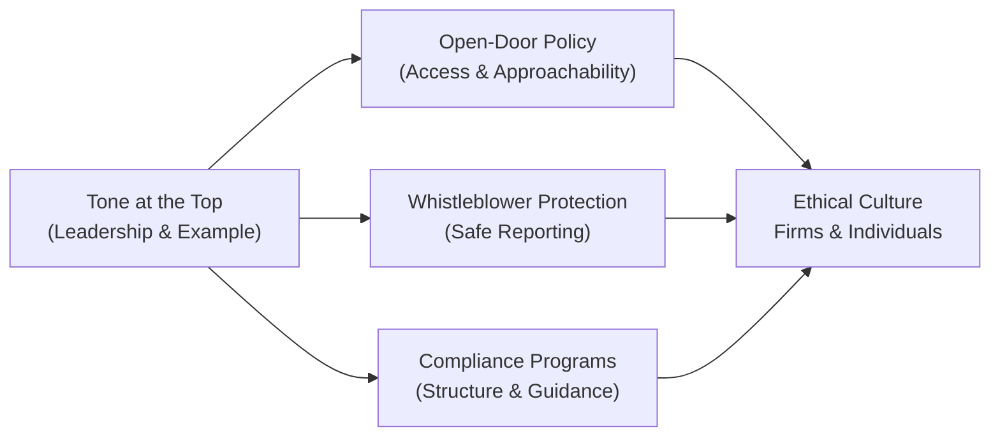

## The Importance of an Ethical Culture in Organizations

A lot of folks assume that ethics is all about rules and regulations, but the real magic begins when it becomes a genuine part of a firm’s DNA—something that influences all levels of decision-making and is felt in every single action. In other words, an organization’s culture shapes how employees think, behave, and react, even under significant pressure. At the CFA Level III stage, we’re not just memorizing the Code and Standards anymore; we’re learning how to apply them in the real world—particularly within complex organizational structures. Let’s explore the nitty-gritty of how ethical culture operates in a firm, focusing on leadership, structure, compensation, communication, and more.

## Tone at the Top: Where It All Begins

Everybody knows that leadership sets the tone at the top, but maybe you’ve wondered, “How exactly does that work in practice?” If a CEO is known for transparency and authenticity, you can bet employees will feel more inclined to do the right thing. Conversely, if senior managers cut corners or brush off small ethical violations, it can quickly cascade into a broader environment of questionable behavior. 

In one of my earlier roles (well before I got involved in compliance-related projects), I remember the head of a department explicitly complaining about “unnecessary paperwork” after we implemented new oversight processes. He’d roll his eyes at daily compliance checks. Before I knew it, his team was ignoring them, too. It was a classic example of how the boss’s attitude can echo throughout an entire division.

Key lesson: strong leaders who communicate and demonstrate ethical standards every day are essential. It’s not enough to send out an “Ethics Day” memo once a year. Senior folks who consistently walk the talk create an atmosphere where employees genuinely believe in doing the right thing—even if nobody’s watching.

## Organizational Structures That Support Ethical Conduct

So, how do you build an organizational structure that practically supports ethics? It isn’t always about fancy committees or extremely rigid compliance frameworks, though those can be helpful. The essence is to create spaces where employees feel safe raising concerns and know that they’ll be heard. Let’s consider the elements that often come into play:

• Open-Door Policies: This is more than a catchy HR phrase. An open-door policy must be backed by real action, with managers who are approachable and willing to discuss sticky, potentially uncomfortable issues. If folks suspect they’ll get brushed off for bringing up a legitimate ethical concern, they’ll avoid talking. 

• Whistleblower Protections: People need formal assurances they won’t be punished for speaking up. Many organizations struggle with this, especially if there’s a history of retaliation. But robust whistleblower programs help uncover problems sooner, which can prevent significant damage down the line.  

• Compliance Programs: These programs typically outline the guidelines and procedures employees must follow. However, compliance shouldn’t hinder day-to-day business. When done thoughtfully, compliance programs provide a safety net—helping employees navigate issues like conflicts of interest or questionable reporting.  

•••

Let’s illustrate the relationships among these elements in a quick diagram:

This chart shows how strong leadership fosters multiple supportive structures that feed into an ethical culture. Not surprisingly, they also reinforce each other.

## The Role of Compensation Structures

Compensation is a tricky beast. When it’s poorly aligned with organizational values, it can encourage unethical shortcuts. For instance, if bonuses are heavily tied to short-term performance metrics (like quarterly earnings or near-term sales) without any offsetting controls, employees might feel tempted to inflate numbers or bend trading rules just to meet those targets.

However, balanced pay-for-performance systems consider not only short-term outcomes but also longer-term sustainability, risk management, and ethical adherence. Maybe you structure bonuses to include a multi-year vesting period. Or you add an ethics component to performance reviews that can materially impact a manager’s incentive package. Yes, that might mean a portion of someone’s bonus is contingent on them demonstrating consistent compliance with internal policies. It may sound radical to some, but ironically it’s a lot less radical than dealing with a massive scandal.

Case in point: Some global investment banks introduced “clawback” provisions after the 2008 financial crisis, which legally allow an employer to rescind previously awarded incentives if an employee’s behavior was found to be unethical or resulted in major financial or reputational damage. These types of mechanisms can really reshape attitudes about risk-taking.

## Continuous Communication: Embedding Ethics in Corporate DNA

If you’ve read prior sections in this volume, you might recall that continuous education on the Code and Standards is one of the central pillars of professional conduct. That principle applies equally to organizations themselves. Training, workshops, and well-crafted internal communications can keep ethical guidelines front-of-mind rather than letting them fade into the background between annual policy updates.

“Ethical intensity,” or how strongly an organization perceives certain ethical issues, tends to increase when leadership frequently engages in open discussion of potential dilemmas. Whether it’s a quarterly workshop where teams walk through a hypothetical conflict of interest, or a monthly newsletter spotlighting real—sometimes even embarrassing—ethical dilemmas from across the industry, the point is to weave these dialogues into the normal flow of business. It’s kind of like reminding folks to do security patches on their computers. If you don’t keep reminding them, it’ll never get done, right?

## Aligning the Firm’s Code of Conduct with the CFA Institute Code of Ethics

Many organizations have their own codes of conduct and mission statements. These statements often overlap with the principles in the CFA Institute Code of Ethics. That’s one reason it’s so straightforward for employees who are CFA charterholders to integrate ethical values into their day-to-day roles—they’re used to it already. But alignment can’t be superficial. If there’s a mismatch between the firm’s stated mission (like “We put clients first.”) and actual practice (like “We chase short-term profit at all costs.”), employees sense the hypocrisy. That’s when cynicism sets in.

On the other hand, organizations that thoughtfully align their mission statement with the broader industry standards—such as the Code and Standards, or the Asset Manager Code (discussed in Chapter 4)—demonstrate that they truly value ethical excellence. Don’t underestimate the power of employees feeling part of a well-respected global tradition of professionalism. It can make a genuine difference in how they conduct themselves, especially in tough situations.

## The Long Road: Building Ethical Culture Over Time

You can’t just snap your fingers and create a top-notch culture. It requires consistent action across multiple dimensions—leadership behavior, communication, training, policies, compensation structures, you name it. Some leaders get discouraged because they don’t see immediate change, but culture is like an ocean liner. It takes quite a while to steer it in a new direction.

An organization might begin by rolling out monthly ethics training sessions, establishing a compliance hotline, or rewriting its conflict-of-interest disclosures. But it might take months, or even years, to see a deeply integrated culture shift. This is where organizational patience and perseverance become crucial.

## Linking Ethical Culture to Employee Satisfaction and Performance

Let’s talk about employees. Research consistently shows that an ethical culture—one that fosters honesty, transparency, and respect—contributes to higher job satisfaction, increased retention, and yes, improved long-term profitability. Employees who trust that their employers “have their back” are more engaged. That can translate into better client service and more stable client relationships. Over time, the brand grows stronger. 

You’d rather not have your best analysts or portfolio managers leave because they feel uneasy about your firm’s moral compass, right? Turnover costs are huge, especially when losing top talent. So it’s not merely a moral or compliance argument—there’s a very real business case for building an ethical environment. 

I remember the CFO at one firm who publicly praised employees for pointing out potential conflicts of interest. Word got around that being transparent was actually rewarded, and morale soared. Sure, there were some grumbles about “too many compliance checks,” but overall, turnover plummeted, and they ended up attracting some great hires from competitors.

## Engaging All Levels: Top to Bottom (and Bottom to Top)

It’s easy to put all the focus on upper management. But an ethical culture is also shaped by mid-level managers, front-line employees, and even interns. Ultimately, it’s a shared responsibility. Sometimes an entry-level analyst might notice a data discrepancy that the manager misses. Or a client service representative might sense that a prospective client is subtly implying a request for inside info. If each individual feels personal ownership of ethical standards, that’s when you know the culture is real and not just pinned to the wall as a corporate slogan.

## Handling Ethical Ambiguities

Ever run into a gray area? Me too. Actually, most real-life dilemmas sit on a spectrum rather than being purely black or white. Ethical culture can help employees navigate these tricky spots. When in doubt, employees can consult the compliance team or request a brainstorming session with a manager. In well-established ethical cultures, you see a collective effort to interpret the situation in line with the firm’s mission statement and with the broader context of CFA Institute Standards.

The worst scenario is the “Is it legal? Then it’s fine,” approach—where employees judge an action solely on whether or not it breaks the law or a black-and-white rule. Instead, a robust ethical culture encourages employees to ask, “Is it right? Does it align with profession-wide ethics?” That shift from a purely legal lens to a broader moral lens is a hallmark of advanced maturity in an organization.

## Real-World Example: Conflict in a Global Asset Management Firm

Picture a large asset manager with offices in several countries, each subject to different regulatory regimes. Suppose the local market in Country A has relatively lax rules on certain disclosures, whereas Country B requires stricter transparency. Employees in Country A might argue they only need to meet local regulations, but is that enough if the firm’s code—aligned with the CFA Institute Standards—demands a higher level of disclosure?

In a robust ethics-oriented firm, leadership clarifies that the higher standard prevails. They might also deploy training to illustrate how cross-border differences should be handled. The local teams are encouraged to exceed, rather than merely meet, local minimums. Over time, the entire global organization aligns with the best practices, regardless of region. This approach fosters consistency and a reputation for professionalism that resonates with clients worldwide.

## Best Practices for Implementation and Sustainability

Implementing and sustaining an ethical culture can feel overwhelming. But let’s break it down:

• Leadership Integration: Executive committees and board members must actively promote ethics. Encourage them to mention ethical considerations in routine business discussions and set formal goals around ethical engagement.

• Regular Ethical Audits: Just like financial audits, an ethical audit checks whether practices align with stated values. It might involve surveys, focus groups, or compliance checks to identify patterns that may lead to unethical conduct.

• Multi-Level Training: Provide scenario-based sessions not only for new hires but also mid-level managers and senior leaders. Tailor them to real case studies from the industry (perhaps referencing Chapter 2’s practical examples).

• Transparent Reporting: Publish occasional updates on ethics investigations or resolutions—while respecting confidentiality. This fosters trust that the process is working and isn’t just for show.

• Rewards and Accountability: Incentivize employees who uphold ethical standards, whether through recognition, promotions, or performance reviews. Also, be consistent about holding people accountable when they violate policies.

## Connecting This Topic to Other Sections

This discussion ties closely to many parts of the CFA curriculum. For instance, you’ll see in Chapter 2: Guidance for Standards I–VII that each standard becomes more or less effective depending on the organization’s culture. Similarly, in Chapter 3, the real-world application is heavily influenced by a firm’s overall environment—especially the reliance on strong communications to spot and resolve potential violations (3.2 Identifying Ethical Violations in Real-World Situations).

And, of course, you might cross-reference Chapter 4: Asset Manager Code of Professional Conduct for more specific guidelines about manager obligations. All these pieces come together to illustrate that strong, organization-wide ethical culture is truly the foundation of professional excellence.

## Final Thoughts and Exam Tips

For the Level III exam, scenario-based questions typically reveal the presence (or absence) of an ethical culture. It’s not just about identifying which standard was violated; it’s about recognizing the organizational factors that either facilitate or hamper ethical behavior. Be prepared to critique a firm’s culture in a constructed response format. You may be asked to provide specific steps for fostering a stronger tone at the top, or to outline how a pay-for-performance plan could be better aligned with the firm’s stated mission.

Remember, organizations that have an authentic commitment to ethics lead to professionals who practice ethical conduct as second nature. Not only is that crucial for exam success, but it’s also a guiding principle that can shape your entire career.

## References, Suggested Readings, and Resources

• Treviño, L. K., & Nelson, K. A. (2017). Managing Business Ethics: Straight Talk About How to Do It Right. Wiley.  
• Kotter, J. (various articles). “Corporate Culture and Performance,” Harvard Business Review.  
• CFA Institute. (2022). “Building an Ethical Organization,” E-Learning Module.  

---

## Practice Questions on Ethical Culture in Organizations



### Which of the following best describes the term “tone at the top”?

- [ ] A firm’s external marketing campaign that emphasizes corporate social responsibility.
- [x] The example of ethical or unethical behavior set by a company’s senior leadership.
- [ ] The compensation structure for entry-level employees focusing on short-term profits.
- [ ] The frequency of staff meetings discussing internal policy changes.

> **Explanation:** Tone at the top refers to the ethical example set by senior leadership. When executives value transparency and integrity, this attitude filters down through the organization.

### Which structure helps ensure employees feel safe reporting misconduct?

- [ ] Strict pay-for-performance incentives.
- [x] Whistleblower protection policies.
- [ ] Annual marketing campaigns with client testimonials.
- [ ] Minimal documentation requirements to streamline processes.

> **Explanation:** Whistleblower protections encourage employees to report misconduct without fear of retaliation, supporting a more open and ethical culture.

### What is a key benefit of including an ethics component in performance reviews?

- [ ] It guarantees employees will never engage in unethical activities.
- [x] It aligns individual incentives with the organization’s ethical standards.
- [ ] It replaces the need for compliance training.
- [ ] It eliminates the potential for conflicts of interest altogether.

> **Explanation:** Linking ethics to performance evaluations helps reinforce that ethical behavior is integral to success, not just an afterthought.

### How might leadership effectively reinforce an open-door policy?

- [ ] By installing more locked offices for senior executives.
- [x] By actively encouraging discussion of concerns and following through on reported issues.
- [ ] By limiting communication to official memos and quarterly updates.
- [ ] By instructing managers to dismiss trivial concerns quickly.

> **Explanation:** An open-door policy is truly effective when leaders follow through on employee concerns and show genuine interest in resolving ethical issues.

### Which of the following is a result of strong ethical culture in an organization?

- [x] Higher employee satisfaction and retention.
- [ ] Lower expectations for meeting regulatory requirements.
- [x] Enhanced reputation in the eyes of clients and stakeholders.
- [ ] Compensation solely focused on short-term gains.

> **Explanation:** A robust ethical culture can increase job satisfaction and strengthen the organization’s reputation. It does not reduce the need for compliance but effectively complements it.

### What is one practical way for firms to align their mission statements with the CFA Institute Code of Ethics?

- [x] Integrate the same principles from the CFA Standards into internal policies and public statements.
- [ ] Encourage employees to focus exclusively on local regulations rather than higher, global standards.
- [ ] Base promotions strictly on financial performance, ignoring ethical metrics.
- [ ] Completely outsource ethics training to external trainers with no internal follow-up.

> **Explanation:** Real alignment occurs when firms embed the Code’s principles in their day-to-day policies and mission statements. Outsourcing without follow-up or ignoring global standards undermines true integration.

### Which mechanism is commonly used to address unethical actions even after bonuses are paid?

- [ ] An open-door policy.
- [x] Clawback provisions in compensation agreements.
- [ ] Anonymous employee surveys once a year.
- [ ] Periodic suspension of performance reviews.

> **Explanation:** Clawback provisions allow firms to recoup compensation if unethical or illegal behavior is discovered later. This ensures that short-term gains don’t undermine long-term accountability.

### Why is continuous communication important for sustaining an ethical culture?

- [x] It reinforces ethical standards and keeps them top-of-mind throughout the year.
- [ ] It enables executives to reduce the frequency of compliance audits.
- [ ] It allows employees to ignore posted rules in favor of oral updates.
- [ ] It replaces the need for formal mission statements.

> **Explanation:** Ongoing training, workshops, and discussions keep everyone engaged with ethical principles, preventing them from fading into the background.

### How can organizations handle cross-border ethical differences effectively?

- [ ] Adopt the least stringent local standard in regions with lax regulations.
- [ ] Create separate codes of ethics for each country, so employees don’t get confused.
- [x] Enforce a unified standard that meets or exceeds global best practices.
- [ ] Permit local offices to determine what “ethical” means in their region.

> **Explanation:** Organizations that enforce higher standards across all jurisdictions promote consistency and avoid confusion about which standard to follow.

### An ethical culture is primarily shaped by strong statements rather than daily actions.

- [ ] True
- [x] False

> **Explanation:** Culture is formed by consistent behaviors and decisions over time. A mere statement without matching conduct will not meaningfully transform an organization.


