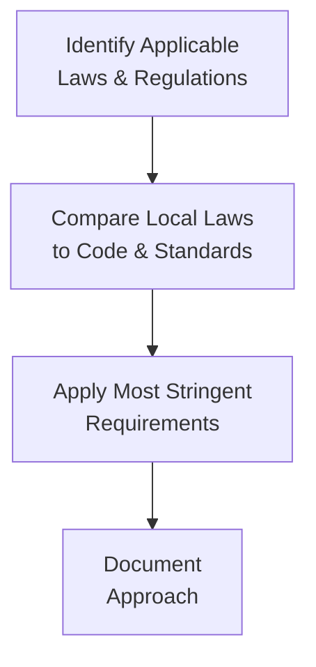

## Overview
Professionals in the investment industry shoulder a huge responsibility: it’s not just about crunching numbers or building fancy models, but also about protecting investor trust and fostering market integrity. That’s where Standard I – Professionalism comes in. This standard outlines how CFA Institute members and candidates should maintain credible, ethical, and client-focused behavior. It reminds us—sometimes with a bit of a nudge—that having knowledge of the law, preserving independence, and avoiding dishonest behavior are non-negotiable.

Now, I remember once overhearing a colleague—years ago—insisting that shortcuts didn’t matter so long as we hit performance targets. Yikes. That was a painful reminder that ethical slip-ups can creep in fast if we don’t hold ourselves accountable. Standard I – Professionalism was designed to keep individuals, firms, and the broader financial community on solid ethical ground.

## Key Requirements of Standard I – Professionalism

### Knowledge of the Law
In the investment realm, it’s not unusual for multiple sets of laws, regulations, and professional guidelines to collide. Perhaps you’re licensed in multiple jurisdictions, each with its own rules. Standard I reminds you to do the following:  
• Know the relevant laws and regulations in every region where you operate.  
• Abide by the strictest applicable rule among local laws, global regulations, and the CFA Institute Code and Standards.  

This “most stringent rule” principle is a straightforward way to ensure that whenever conflicts arise—between local rules and the Code and Standards or among the various laws themselves—professionals prioritize the most demanding compliance requirement. Essentially, if you’re not sure, ask yourself which set of rules is more protective of the market and the client. Then adhere to that one.

### Independence and Objectivity
Financial professionals face constant price. Maybe it’s a well-intentioned gift from a business partner or an extra “thank you” bonus from a client. The problem? Even small tokens of appreciation can turn into big conflicts of interest.

Under Standard I, you must:  
• Identify personal or professional interests that could cloud your judgment.  
• Refuse or disclose any gift, compensation, or advantage that might compromise (or seem to compromise) your objectivity.  
• Avoid external pressures—like strong-arming from a supervisor or a star client—that might lead you to provide questionable recommendations.

Independence and objectivity help you keep a direct line of sight on what matters: acting in the best interest of clients and markets. If you feel your neutrality slipping, it’s time to pause, talk to a compliance officer, and sort out the conflict before proceeding.

### Misrepresentation
Misrepresentation happens when you either exaggerate the benefits of something or outright fudge the facts. Think of it this way: if you’re touting unrealistic projections or leaving out key risks, or maybe you’re presenting performance data without footnotes about fees, you’re skating toward an ethical breach.

To comply with Standard I, professionals must:  
• Provide factual, balanced, and complete information in all documentation, from marketing decks to pitch books.  
• Emphasize the limitations and potential downside of investments—not just the rosy side.  
• Carefully check disclosures and disclaimers, ensuring they aren’t inadvertently misleading.

Misrepresentation can be unintentional, especially for folks who are used to “selling the dream” in marketing roles. But good intentions aren’t enough. This standard demands the exercise of diligence and thoroughness—so be sure to scrutinize your materials.

### Misconduct
Sometimes, it’s tempting to think “I’ll never do anything fraudulent, so I’m clean.” But misconduct covers more than blatant fraud. It includes a broad range of dishonest acts and unethical behavior that compromise your professional reputation. 

Examples:
• Using company resources to further personal investment schemes.  
• Spreading rumors to manipulate market sentiment about a stock.  
• Bribery or hush payments—obviously.  

Violation of these guidelines can bring serious consequences, both for your career and your firm. Let’s just say that the last thing you want is a news headline linking your name to an SEC investigation.  

## Practical Implementation to Uphold Standard I
Implementing Standard I – Professionalism is about building a rock-solid compliance framework at all levels. Many firms go beyond a single policy document and adopt a culture of consistent ethical reinforcement:

• Establish Internal Compliance Protocols:  
  – Set up escalation processes for unusual conflicts (e.g., suspicious gifts or newly discovered personal trading accounts).  
  – Maintain well-documented compliance records—these help if regulators come knocking.  

• Conduct Regular Training:  
  – Bring in compliance officers or external experts for sessions on evolving regulations.  
  – Use real-life case studies so employees recognize potential pitfalls early on.  

• Foster an Ethical Culture:  
  – Develop firm-wide statements championing ethical leadership.  
  – Encourage open-door policies so employees feel comfortable reporting concerns—anonymously if necessary.  

• Prioritize Ethical Decision-Making:  
  – In a dilemma, ask: “Does this action uphold client trust? Does it protect market integrity?”  
  – If laws are silent or ambiguous, anchor your decisions on the Code and Standards anyway.

## Real-World Considerations: Cross-Border Challenges
Globalization can complicate things. Different countries interpret regulatory frameworks differently, and some markets have less robust enforcement than others. Having a “lowest common denominator” mindset is a huge mistake, though. If you stick to the principle that the highest standard applies, you’ll usually do just fine. The big challenge is thoroughly knowing the laws in each relative jurisdiction.

Below is a simple illustration of how many practitioners approach conflicting regulations:

1. Identify all relevant authorities where you operate.  
2. Compare them carefully to see which demands the strictest compliance.  
3. If the Code and Standards is stricter, follow it. If local law is stricter, you follow local law.  
4. Document your steps in case you need to show your reasoning to compliance officers or regulators.

## Case Study: A Subtle Gift
Let’s say your client, a major institutional investor, has invited you to an exclusive resort for a weekend “investment retreat.” The schedule includes one small seminar and plenty of leisure activities. Well, sure, it might be fun, but do you have any concerns about your objectivity afterward? Could your recommendations be influenced by a sense of obligation to this client?

Standard I – Professionalism suggests you’d better be cautious. If the “retreat” is purely for a lavish getaway, you might politely decline or at least seek guidance from your firm’s compliance department. Accepting might be okay if it has legitimate educational and business content—and if it’s not extravagant. The main question is whether it places you in a position that could compromise or appear to compromise your professional judgment.

## Best Practices and Pitfalls
• Best Practices:  
  – Always cross-check laws and guidelines—never assume minimal compliance is enough.  
  – Keep lines of communication open with your compliance team.  
  – Document your decisions, especially for potential conflicts.  

• Common Pitfalls:  
  – Relying on “common sense” instead of actual knowledge of the law or Code.  
  – Accepting or offering gifts without transparent disclosure.  
  – Omitting disclaimers regarding performance data or forward-looking statements.  
  – Getting caught up in the “everyone does it” mentality—unfortunately, that’s no defense.

## Exam Relevance and Tips
On the CFA Level III exam, expect scenario-based questions that drop you into the middle of a conflict-of-interest nightmare or ask you to parse out whether a certain marketing flyer misrepresents performance. You may also see constructed-response questions that involve a mismatch between local regulations and the Code and Standards.

• Key tip: Distinguish between what the law requires and what the CFA Institute Code insists upon. If the local law falls short, the Code’s more stringent guidelines prevail.  
• Another tip: Provide thorough justifications in your answers. If a scenario seems borderline, reference the relevant sub-section of Standard I (e.g., “Misconduct” or “Independence and Objectivity”).  

Time management is crucial. Many exam takers get bogged down in details. So quickly figure out which standard or principle is relevant, then articulate your reasoning step by step.

## References and Further Reading
• CFA Institute Standards of Practice Handbook, 12th Edition: Chapters covering Standard I – Professionalism.  
• “Ethics in Finance” by John R. Boatright.  
• Regulatory Websites:  
  – U.S. Securities and Exchange Commission (SEC)  
  – European Securities and Markets Authority (ESMA)  
  – Hong Kong’s Securities and Futures Commission (SFC)  

These resources provide in-depth discussions, real-world examples, and updates on emerging regulatory requirements.  

-----

## Test Your Knowledge: Standard I – Professionalism Quiz



### Question 1
Which of the following most accurately describes Standard I – Professionalism?

- [ ] It focuses exclusively on avoiding insider trading.  
- [x] It requires adherence to all applicable laws, plus higher standards when necessary.  
- [ ] It only addresses conflicts of interest.  
- [ ] It is primarily a guideline for marketing practices only.  

> **Explanation:** Standard I – Professionalism mandates compliance with the strictest applicable laws along with higher ethical standards. It covers independence, objectivity, misconduct, and misrepresentation, not just insider trading or marketing rules.

### Question 2
When facing conflicting regulations, a CFA Institute member should:

- [ ] Always follow the local regulation.  
- [ ] Follow whichever rule allows for greater business flexibility.  
- [ ] Ignore the local regulation if it conflicts with the CFA Institute Code.  
- [x] Adhere to the most stringent of the conflicting requirements.  

> **Explanation:** Standard I – Professionalism specifically requires that if multiple sets of rules apply, the member or candidate must comply with the more rigorous requirement.

### Question 3
Which scenario could be considered a violation of the “Independence and Objectivity” principle under Standard I?

- [·] Declining a client’s invitation to a modest business luncheon to discuss current market conditions.  
- [x] Accepting a luxury all-expenses-paid vacation from a broker to “celebrate a good quarter.”  
- [ ] Documenting all gifts received from clients in a compliance log.  
- [ ] Recusing yourself from analyzing a stock where you currently hold a large personal position.  

> **Explanation:** Accepting a lavish vacation could compromise—or appear to compromise—your independence and objectivity. Modest gifts can be acceptable with proper disclosure, while big perks pose a clear conflict.

### Question 4
Misrepresentation under Standard I would include:

- [ ] Clearly stating projected returns with disclaimers for economic uncertainties.  
- [ ] Stating only realized fund performance in marketing materials.  
- [x] Omitting critical risk disclosures in a pitch deck to potential investors.  
- [ ] Providing a balanced overview of historical performance.  

> **Explanation:** Failing to mention material risks or disclaimers constitutes misrepresentation since it withholds key facts investors need to gauge an investment’s potential outcomes accurately.

### Question 5
An investment manager who discovers her local regulations require less disclosure than the CFA Institute Code and Standards should:

- [x] Still follow the more rigorous CFA Institute Code and Standards.  
- [ ] Apply only the local regulation, since it is actually law.  
- [ ] Calculate the estimated cost savings from less disclosure and weigh them against risk.  
- [ ] Seek a temporary waiver from the CFA Institute.  

> **Explanation:** Under Standard I, the Code and Standards apply if they are stricter than local laws. The professional is bound by the highest standard to protect client and market integrity.

### Question 6
Which of the following is the best example of proactive independence and objectivity?

- [x] Recusing yourself from analyzing a company whose CEO is your close relative.  
- [ ] Accepting high-value memorabilia from a major client to maintain the client relationship.  
- [ ] Relying on others to check for conflicts of interest.  
- [ ] Avoiding gifts under $25 but accepting those over $1,000.  

> **Explanation:** Stepping away from situations that create clear conflicts—like analyzing a company a family member leads—helps ensure unbiased professional judgment.

### Question 7
A portfolio manager with a new prospective client exhibits which professional practice under Standard I?

- [x] Conducting due diligence on the client’s local regulatory environment before offering services.  
- [ ] Proposing to accept the engagement without confirming the applicable laws.  
- [ ] Only abiding by parent company guidelines, regardless of local law.  
- [ ] Sending a standard marketing brochure with no disclaimers.  

> **Explanation:** Understanding the full legal context in which the client operates is a key requirement to ensuring compliance with all applicable laws and upholding professional conduct.

### Question 8
A conflict of interest that must be disclosed under Independence and Objectivity would include:

- [ ] Recommendations provided by a general news source.  
- [x] Ownership of a significant personal stake in the securities being recommended.  
- [ ] Reporting performance results in line with Global Investment Performance Standards (GIPS).  
- [ ] Providing a scenario analysis for potential market downturns.  

> **Explanation:** Owning a big personal stake in a recommended security can color your judgment and absolutely requires disclosure to preserve trust and transparency.

### Question 9
How does Standard I define misconduct?

- [ ] Limited to intentional fraud and insider trading only.  
- [ ] Anything that violates only the local civil codes.  
- [x] Any dishonesty, fraud, or ethical breach harming professional integrity.  
- [ ] Activities outside of one’s professional capacity.  

> **Explanation:** Misconduct under Standard I covers any dishonest behavior or ethical breach that undermines the professional credibility, not just overtly criminal acts.

### Question 10
Standard I states that if there is no clear local law governing a situation, a member or candidate should:

- [x] Follow the CFA Institute Code and Standards.  
- [ ] Assume no regulatory framework applies.  
- [ ] Seek the path that maximizes personal benefit.  
- [ ] Defer to the client’s own preference.  

> **Explanation:** When the local law is silent or ambiguous, the default standard is the CFA Institute Code and Standards, which always aim to protect client and market integrity.


