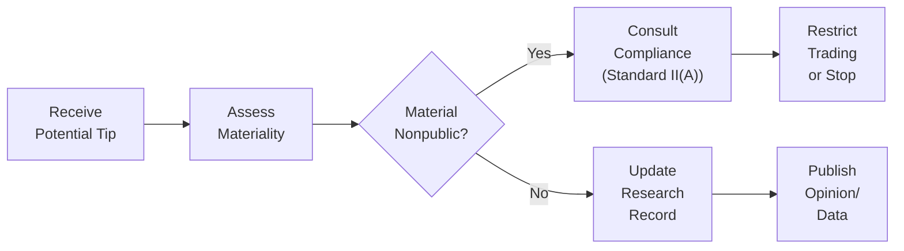
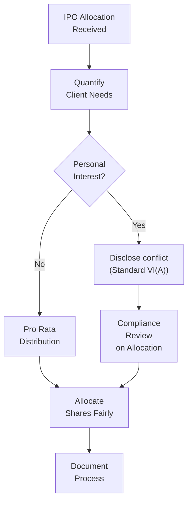

Throughout your CFA journey, you’ve probably pored over the Code of Ethics and Standards of Professional Conduct, studied numerous do’s and don’ts, and wondered how everything actually applies in the messy real world. Perhaps you’ve thought: “Sure, I know the guidelines, but what happens when the lines get blurry?” This section explores real-life cases drawn from finance experiences to illuminate how things unravel—or ideally, hold together—once ethical boundaries are tested in genuine situations. By immersing ourselves in these scenarios, we can develop sharper reflexes to identify red flags and confidently navigate moral gray zones.

Practical “case analyses” are grounded in actual incidents that force us to confront complicated ethical questions. These might revolve around insider trading, mishandling client orders, or even something as subtle as mixing personal bias into investment research. In each example, we’ll weave in relevant Standards (from Standard I – Professionalism through Standard VII – Responsibilities as a CFA Institute Member or CFA Candidate), highlight where individuals veered off course, and propose best practices for future situations.

–––––––––––––––––––––––––––––––––––––––––––––––––––––––––––––––––––
Insider Trading: When Casual Conversations Cross the Line
–––––––––––––––––––––––––––––––––––––––––––––––––––––––––––––––––––

Let’s start with one of the most well-known pitfalls: insider trading. Maybe you’ve heard stories of a casual lunch chat turning into a career-ending fiasco. In truth, the boundary between a benign conversation and material nonpublic information can be razor-thin.

Consider the scenario of an equity analyst, Rachel, who obtains private data about a pending merger from an old friend casually mentioning that workers at their firm are buzzing about a "big announcement." Rachel, eager to make a profitable trade, acts on this tip before it’s publicly disclosed. Though the friend never explicitly said “merger,” the talk included enough hints to qualify as material nonpublic information. Rachel’s actions fell under Standard II(A): Material Nonpublic Information—specifically, utilizing confidential details to benefit herself and clients. Unfortunately, it’s not always so blatant: sometimes a single cryptic comment can be enough to trigger a violation.

Case Analysis:  
• Rachel overlooked Standard II(A): She traded on information that hadn’t been released to the public.  
• A crucial fact is that the information was material (the upcoming “big announcement” would certainly affect the company’s stock price significantly) and nonpublic (nobody outside a small group of insiders or close staffers knew).  
• The moment Rachel realized (or should have realized) the significance of the tip, the correct action would have been to contact compliance or legal counsel, not quietly capitalize on it.  

This scenario reminds us that even “innocent” tips can land us in serious trouble. Many members or candidates rationalize such tips as mere gossip or speculation. But under the Code and Standards, you’re responsible for recognizing red flags and halting trades until that information is either confirmed as immaterial or widely disclosed.

–––––––––––––––––––––––––––––––––––––––––––––––––––––––––––––––––––
Portfolio Management Conflicts: Juggling Client Interests
–––––––––––––––––––––––––––––––––––––––––––––––––––––––––––––––––––

Now, imagine you’re managing client portfolios with a hot IPO on the horizon. It’s extremely oversubscribed, and you only get a small allocation. You have multiple clients with different asset levels, and you personally also invest in a side account. You want to be fair but also see a chance for personal gain. Sound nerve-racking?

Under Standard III(B): Fair Dealing, investment professionals must deal fairly with clients when taking investment action. Allocating limited or oversubscribed opportunities is a minefield if not handled scrupulously. The “big no-no” would be giving yourself (or favored clients) a bigger piece of the pie at the expense of everyone else. If that scenario feels uncomfortable, trust that it can quickly become an ethical—and legal—nightmare.

Case Analysis:  
• Olivia, a portfolio manager at a midsize firm, receives an IPO allocation of only 2,000 shares. She has three major clients plus her own personal account. Without a clear and consistent allocation policy, she might impulsively favor her personal interest or her top fee-paying client.  
• Proper ethical conduct requires, at the very least:  
  – A written policy detailing the pro rata distribution of oversubscribed IPO shares.  
  – Full and fair disclosure of allocation protocols so no client feels shortchanged.  
  – Additional oversight to ensure compliance officers can verify the fairness.  

By adhering to Standard III(B), you show respect for every client’s portfolio objectives and risk tolerances. This is more than a neat rule—it’s about trust.

–––––––––––––––––––––––––––––––––––––––––––––––––––––––––––––––––––
Communication and Research Reporting Errors: Fact vs. Opinion
–––––––––––––––––––––––––––––––––––––––––––––––––––––––––––––––––––

Think about the last time you read an equity analyst report. It probably included data (e.g., growth rates, price-to-earnings multiples), plus a hearty dose of commentary on why the analyst believes the stock is a “Buy” or “Hold.” When your opinions begin to masquerade as indisputable facts, you risk misleading your audience.

Under Standard V(B): Communication with Clients and Prospective Clients, members and candidates must distinguish between fact and opinion. Little slips can cause big confusion. Suppose an analyst, Nick, prepares a research note on a tech company’s new semiconductor product. Nick’s data indicates that the device has a 10% higher processing speed. He then writes, “Given the company’s superior product, we can safely predict a 25% earnings boost next quarter.” The problem? That 25% number is purely Nick’s forecast, not a confirmed fact. If he represents it as near-certain, or fails to label it an estimate, he risks misleading investors. Even well-intentioned analysts might present personal projections as if they’re guaranteed, crossing the line into misrepresentation.

Case Analysis:  
• Nick should label speculative statements clearly: for instance, “We estimate earnings will rise by around 25%, contingent on product adoption and normal market conditions.”  
• Where actual data is lacking, disclaimers and rationales belong front and center. Tying personal predictions to real-world assumptions can help clarify that there’s uncertainty.  

–––––––––––––––––––––––––––––––––––––––––––––––––––––––––––––––––––
Role-Playing Ethical Dilemmas
–––––––––––––––––––––––––––––––––––––––––––––––––––––––––––––––––––

It’s one thing to read about insider trading or note mislabeling in a research report, but it’s another to feel the stress of being confronted by a friend, a client, or your boss in real time. That’s why many firms use role-play scenarios in ethics training. People get immersed in tense simulations, forced to make calls under pressure and rationalize their decisions. The emotional weight can replicate real-life stress far better than reading a bullet-point list of “don’ts.”

For instance, a role-play might have you act as a junior analyst who overhears a senior partner on a phone call disclosing nonpublic details. Your peers play the part of the boss or the compliance officer. You must decide how to react—whether to keep quiet, share it with a colleague, or escalate it properly. The activity fosters deeper empathy for real-world situations, so you can navigate future ethical gray areas more definitely.

–––––––––––––––––––––––––––––––––––––––––––––––––––––––––––––––––––
Glossary in Action
–––––––––––––––––––––––––––––––––––––––––––––––––––––––––––––––––––

Case Analysis: A thorough, step-by-step review of a specific event to draw out lessons and best practices. This method is especially effective for seeing how a single ethical misstep often stems from multiple smaller lapses.

Real-World Scenario: An illustration derived from actual (or close-to-actual) professional environments to showcase how the Code and Standards play out beyond textbooks.

–––––––––––––––––––––––––––––––––––––––––––––––––––––––––––––––––––
Mermaid Diagram: Ethical Decision Flow
–––––––––––––––––––––––––––––––––––––––––––––––––––––––––––––––––––

Below is a simple flow diagram showing the thought process you might follow when confronted with ambiguous information—like a “friendly tip.” Notice how each step references relevant Standards or compliance checks. Sometimes, a quick mental map is all it takes to save you from a career-ending decision.

This simplified chart underscores the mental loops you should be jumping through under time pressure. If you decide, “Wait, it might be nonpublic and definitely important,” the next step is contacting compliance. If you confirm that it’s not material or already public, you can proceed, but do so thoughtfully and still keep thorough records.

–––––––––––––––––––––––––––––––––––––––––––––––––––––––––––––––––––
Communicating with Clients and Colleagues
–––––––––––––––––––––––––––––––––––––––––––––––––––––––––––––––––––

You’re probably aware that simply following the Code in your own domain isn’t enough if your broader environment encourages corners to be cut. In cross-border situations (discussed further in 2.14 Harmonizing Standards Across Multiple Jurisdictions), cultural norms might differ. But ethical responsibilities don’t take a backseat just because something is “common practice” in one region or another. Part of your role is upholding a strong ethical culture around you—educating junior analysts, clarifying policies for senior managers, and sometimes pushing back against questionable “industry norms.”

–––––––––––––––––––––––––––––––––––––––––––––––––––––––––––––––––––
Handling Pressure: A Quick Anecdote
–––––––––––––––––––––––––––––––––––––––––––––––––––––––––––––––––––

I recall a time early in my career when a senior colleague, with the best intentions, offered me a project that sounded borderline unethical. I was asked to “adjust” some projections in favor of a prospective client. It wasn’t outright fraudulent, but it felt...off. At first, I hesitated—this was a senior person handing me a direct order. But I school myself now: trusting your instincts when something feels wrong is critical. My eventual response was to flag the discrepancy in an internal note and connect with compliance. Yes, it was awkward. But it prevented a bigger fiasco down the line. You know, sometimes the hardest part is reminding yourself that job security shouldn’t trump your integrity.

–––––––––––––––––––––––––––––––––––––––––––––––––––––––––––––––––––
Best Practices to Avoid Common Pitfalls
–––––––––––––––––––––––––––––––––––––––––––––––––––––––––––––––––––

• Develop Clear Written Policies: Whether it’s for IPO allocations, communication methods, or insider tips, specifying step-by-step procedures leaves less room for “judgment calls” that turn unethical.  
• Implement Thorough Disclosure: For research reports, disclaimers help separate fact from forward-looking opinion.  
• Use Checks and Balances: Encourage a culture where analysts double-check each other’s findings, ensuring multiple people confirm or question assumptions.  
• Continuous Training: Incorporate role-plays and scenario-planning sessions where staff can practice responding to hypothetical ethical dilemmas.  
• Keep a Compliance-First Mindset: Especially for sensitive issues like insider trading. If in doubt, escalate or consult your compliance department.  

You can also explore 2.9 Recommended Procedures and Best Practices for further reading on proven techniques to uphold these principles.

–––––––––––––––––––––––––––––––––––––––––––––––––––––––––––––––––––
Practical Example: Distinguishing Fact from Hunch
–––––––––––––––––––––––––––––––––––––––––––––––––––––––––––––––––––

Sometimes you’ll see a numeric assumption in an analyst report. For instance:  
“Assuming a 5% growth in net income, the stock should reach $80 by year-end.”

While we’re dealing with an assumption, it’s easy for readers to treat that 5% as gospel if not clearly labeled. Under Standard V(B), highlight your disclaimers and assumptions (such as stable commodity prices or no major supply chain disruptions). If the results are based on a proprietary model, say so, and briefly disclose the limitations of that model to avoid misleading clients.

–––––––––––––––––––––––––––––––––––––––––––––––––––––––––––––––––––
Case Analysis: Mixed Fact and Opinion in an Equity Report
–––––––––––––––––––––––––––––––––––––––––––––––––––––––––––––––––––

Let’s see a short example:

• Analyst: Dina  
• Company: Vortex Electronics  
• Fact: Most recent quarter’s revenue up 4% from prior quarter  
• Opinion: “We firmly believe Vortex will continue growing revenue at >10% YOY.”  

Dina includes both statements in one paragraph, but italicizes the second statement to show it’s an estimate. She also includes a footnote: “Our forecast is based on the assumption that new product lines succeed in acquiring 25% of emerging-market share.” This approach clarifies the line between data and Dina’s personal forecast.

–––––––––––––––––––––––––––––––––––––––––––––––––––––––––––––––––––
Handling Ethical Dilemmas in Real-Time
–––––––––––––––––––––––––––––––––––––––––––––––––––––––––––––––––––

Base your approach on CFA Institute’s “Ethical Decision‑Making Framework”:

• Identify: Pinpoint the facts, the Standards at play, and the relevant stakeholders.  
• Consider: Assess potential conflicts, possible biases, and alternative actions.  
• Decide: Choose the ethical action that best aligns with the Code and Standards.  
• Reflect: Post-decision, evaluate whether the outcome adhered to your professional responsibilities.

One technique is to press “pause.” If you’re unsure, refrain from immediate action. A short delay to consult compliance or review rules can avert the risk of unknowingly violating the Standards. Hasty decisions under stress often lead to misjudgments.

–––––––––––––––––––––––––––––––––––––––––––––––––––––––––––––––––––
Visualizing a Conflict of Interest in Portfolio Management
–––––––––––––––––––––––––––––––––––––––––––––––––––––––––––––––––––

Another mermaid diagram below illustrates how a portfolio manager’s conflicting obligations might play out, from internal pressure to personal gain, and how each step should meet an ethical checkpoint.

–––––––––––––––––––––––––––––––––––––––––––––––––––––––––––––––––––
Key Takeaways
–––––––––––––––––––––––––––––––––––––––––––––––––––––––––––––––––––

• Be aware of subtle ways insider tips can slip into your routine conversations.  
• Whenever you have limited resources (like oversubscribed IPO shares), establish a transparent, objective framework for allocation.  
• Label opinions and projections clearly to avoid misleading clients, especially in formal reports.  
• Pressure from senior colleagues doesn’t change your duty to uphold ethical standards.  
• Don’t rely solely on “common practice” in your region; rather, adopt global best practices that align with the Code and Standards.  

–––––––––––––––––––––––––––––––––––––––––––––––––––––––––––––––––––
References and Additional Resources
–––––––––––––––––––––––––––––––––––––––––––––––––––––––––––––––––––

• CFA Institute: “Code of Ethics and Standards of Professional Conduct” – Core Ethical Foundations.  
• CFA Institute: “Ethical Decision‑Making Framework” – Offers a step-by-step approach for analyzing ethical dilemmas.  
• U.S. SEC Enforcement Actions – Case examples for insider trading and other violations.  
• “Case Studies in Ethics and Finance” – A collection of real-life scenarios showcasing ethical and unethical behaviors.  

If you’re hungry for more, look at disciplinary roundups published by financial regulators from different countries. Reading about actual enforcement actions not only clarifies what’s at stake but also demonstrates how easily unintentional errors can spiral.

–––––––––––––––––––––––––––––––––––––––––––––––––––––––––––––––––––
Final Thoughts
–––––––––––––––––––––––––––––––––––––––––––––––––––––––––––––––––––

Hopefully, these case analyses shine a bright light on the real-world complexity that underscores the Code and Standards. Ethical slip-ups usually start small: an overheard detail, an overlooked disclaimer, or a half-baked assumption about fairness. Don’t wait until you’re knee-deep in spreadsheets to consider what’s ethically correct. Make it part of your day-to-day practice—train yourself to question, “Is this the right move under Standard X or Y?”—and you’ll be well on your way to championing integrity in every professional pursuit.

May your path be guided by conscientious analysis, thorough documentation, and unwavering resolve when faced with gray areas. Embrace that tension, armed with knowledge and a strong moral compass.

## Test Your Mastery of Practical Examples and Case Analyses



### Which Standard directly addresses material nonpublic information?

- [x] Standard II(A)
- [ ] Standard III(B)
- [ ] Standard V(B)
- [ ] Standard IV(C)

> **Explanation:** Standard II(A) covers interactions with material nonpublic information. Members must not use or cause others to use information that’s not publicly available and could affect a security’s price.

### In the example of oversubscribed IPO allocation, which Standard is most relevant to fair dealing among clients?

- [ ] Standard II(A)
- [ ] Standard V(A)
- [x] Standard III(B)
- [ ] Standard VI(A)

> **Explanation:** Standard III(B) deals with Fair Dealing, requiring fair treatment of clients in investment actions such as IPO share allocations.

### Why is it important to distinguish between fact and opinion in investment communications?

- [x] To ensure clients are not misled by forward-looking statements
- [ ] To reduce portfolio turnover
- [ ] To comply with all regulation across all jurisdictions automatically
- [ ] To maximize short-term returns

> **Explanation:** Mixing personal forecasts or opinions with factual data can mislead clients, hence Standard V(B) emphasizes transparency in distinguishing fact from speculation.

### What is a key role of role-play scenarios in ethics training?

- [x] They simulate real-world pressures that can reveal how individuals might respond under stress.
- [ ] They are strictly for entertainment and have little impact on actual behavior.
- [ ] They help only junior analysts; senior staff remains unaffected.
- [ ] They are used to calculate portfolios’ Sharpe ratios.

> **Explanation:** Role-plays replicate authentic ethical dilemmas, allowing participants to practice responses under realistic tension.

### According to the article, which action should be taken first if you suspect you're dealing with material nonpublic information?

- [ ] Execute the trade but notify compliance after
- [x] Consult compliance or legal counsel immediately
- [ ] Ignore the information as irrelevant
- [ ] Confirm the rumor with the source

> **Explanation:** Standard II(A) states that if the information is potentially material and nonpublic, you should immediately contact compliance, not act on it.

### In a research report, what is the best practice when listing a projected growth figure?

- [ ] Label it as fact
- [ ] Hide the projection in a footnote
- [x] Clearly state it’s an estimate and provide assumptions
- [ ] Present it only in internal discussions

> **Explanation:** Standard V(B) says you must identify which parts of your report are factual and which are based on estimates or opinions, including their underlying assumptions.

### Which Standard primarily focuses on avoiding conflicts of interest with personal trades?

- [ ] Standard III(B)
- [ ] Standard IV(A)
- [x] Standard VI(A)
- [ ] Standard VII(B)

> **Explanation:** Standard VI(A) deals with disclosure of conflicts, particularly personal investments or interests that could conflict with client interests.

### Why might an ethical dilemma not always be black and white in real practice?

- [x] Because subtle hints, cultural norms, and pressure from colleagues can cloud judgment
- [ ] Because the CFA Institute Code is unclear
- [ ] Because the laws are always contradictory
- [ ] Because compliance is rarely relevant

> **Explanation:** Real-world context and everyday pressures can obscure otherwise clear guidelines, leading to ethical gray areas.

### How can a short “pause” help when faced with potential insider information?

- [x] It allows time to analyze the situation and consult resources like compliance policies
- [ ] It guarantees you will not violate the Code
- [ ] It replaces the need for a written policy
- [ ] It ensures you can profit from quick trades first

> **Explanation:** Taking a pause to reflect or consult compliance can prevent inadvertent violations of Standards, particularly Standard II(A).

### A portfolio manager’s duty to allocate IPO shares fairly among various clients is based on:

- [x] True
- [ ] False

> **Explanation:** Fair dealing means ensuring each eligible client receives equitable treatment in oversubscribed offerings, as stated in Standard III(B).


