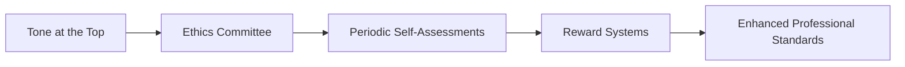

## Introduction

So, let’s say you’re fresh out of a meeting where a senior leader casually told the team, “We only recognize the rainmakers here—just exceed your targets and you’ll do fine.” Ever had that gut feeling that something was off, that maybe the laser focus on sales and revenue overshadowed the more fundamental commitment to ethical standards? Well, I’ve been there. And let me tell you, while “just make more money” might sound great in the short term, it can quickly breed a culture where cutting little corners becomes the norm—and that’s a slippery slope for any investment firm.

This section explores how organizations and individuals can shift beyond minimal compliance to truly embody ethical excellence. Referencing the insights from Chapters 1 and 2, we’ll discuss ways to integrate and enhance professional standards, consistent with the CFA Code of Ethics and Standards of Professional Conduct. In an industry where trust is currency, building and maintaining a strong ethical foundation is crucial not only to protect clients and remain on the right side of regulators, but more importantly to shape a sustainable, vibrant, and even better environment for employees, clients, and society at large.

## A Broader View: Moving Beyond Compliance

Many professionals view ethics in terms of compliance: “Which boxes do I check to ensure I’m not breaching regulations or the CFA Institute Standards?” Don’t get me wrong—compliance is vital. But an overemphasis on compliance alone can distract from a bigger goal: fostering a values-driven context where high standards are embraced not just to avoid penalties but to do the right thing.

Creating a culture that prizes integrity and accountability can produce a range of benefits. It can help avert damaging scandals, foster deeper trust with clients and stakeholders, and protect brand reputation in an era where social media can amplify ethical missteps in a flash. Moreover, organizations with high ethical standards often see improved job satisfaction, better teamwork, and more sustainable financial performance.

## Ethics Committees or Councils

One proven strategy for raising professional standards is to establish a dedicated ethics committee or council, sometimes known as a governance committee. This formal body can convene regularly to review policies, analyze emerging ethical challenges, and provide guidance or dispute resolution when complex scenarios crop up.

Ethics committees are not just a “nice to have.” Properly structured, they become a central pillar for shaping a consistent ethical vision. They can:

• Resolve gray-area dilemmas: Real investment advisory work is rarely black-and-white. A well-informed committee can interpret Standards I–VII of the CFA Code within the nuances of specific business lines, geographies, or client segments.  
• Update policy and training modules: Markets, regulations, and technologies shift rapidly, so ethical guidelines should be reviewed and refreshed periodically.  
• Support fairness and impartial investigations: Nothing undermines confidence like a process that appears biased. An independent oversight group can demonstrate fairness in investigating potential breaches.  

By the way, I once sat on an ethics council for an asset management firm, and it was pretty amazing to see how quickly we could adapt to fast-changing market practices. We’d meet quarterly—even more often during volatile times—to address new issues like big data usage, social media communications, or remote-work guidelines. The best part was that the whole firm knew there was a dedicated body constantly scanning the horizon for ethical pitfalls.

## Leadership and Tone from the Top

You’ve probably heard the phrase: “Tone at the Top.” But it’s more than a catchy slogan. Responsibilities for shaping the culture rest heavily on an organization’s senior leaders—the firm’s CEO, CIO, board members, and top-level managers. When leaders speak and act in ways that consistently reinforce ethical behavior, employees get the message that it matters.

In many prior sections (see especially 2.1 Standard I – Professionalism), we noted the direct link between leadership behavior and staff conduct. For instance, if managers question your every decision or push you to achieve returns “at all costs,” well, guess what? Ethical corners might get cut. Conversely, if top executives celebrate employees who blow the whistle on shady practices and ensure they’re protected from retaliation, that instills a sense of moral vigilance.

### Examples of Strong Tone at the Top

• Public Commitment: Prominent references to ethical conduct in company-wide memos or updated websites.  
• Walk the Talk: Leaders refrain from cheery “Do as I say, not as I do.” If a senior manager is always on time with compliance training and exhibits high standards, more junior employees see that as the cultural norm.  
• Transparent Processes: Provide open channels for employees to raise concerns, plus consistent follow-up.  

## Periodic Self-Assessments

No matter how robust your policies or leadership commitment, an “ethical stagnation” can set in without regular self-checks. Firms and individuals—especially CFA charterholders—are encouraged to conduct self-assessments. This process systematically reviews how well the existing ethical guidelines and standards are upheld in daily operations.

### What Is a Self-Assessment?

A self-assessment typically involves:  
• Identifying actual business practices vs. stated policies  
• Reviewing employee surveys or feedback on the corporate culture  
• Evaluating how policies measure up to emerging laws, regulations, or recognized best practices  
• Testing for knowledge and application of the CFA Code of Ethics (particularly relevant in advanced portfolio management, see also Chapter 3.3, Ethical Dilemmas in Portfolio Management)

These internal reviews can reveal misalignments, such as incentives that push teams to keep relevant data hidden, or insufficient resources allocated to compliance technology. It’s helpful to think of it like a regular health check—you catch small issues early on and prevent them from blooming into major compliance fiascos.

## Reward Systems for Ethical Conduct

In many organizations—especially those in high-stakes financial services—compensation structures revolve heavily around short-term performance. That can become, ironically, a breeding ground for ethical lapses if employees feel that the only thing that matters is pumping up short-run returns or sales metrics. One practical step: incorporate ethics-based metrics into performance evaluations.

### Designing Ethical Reward Systems

• Tie promotions or bonuses to metrics of long-term client satisfaction, not just short-term profitability.  
• Publicly applaud team members who handle ethical dilemmas correctly. This might look like a monthly “Ethics Spotlight” award.  
• Communicate the rationale: Show employees that robust compliance and strong ethical conduct help sustain firm value, thus boosting long-term incentives.

I recall an instance where an associate proposed turning away a large potential client whose source of funds seemed suspicious. Plenty of folks might have ignored the red flags—after all, we’re talking about big revenue. But the firm’s leadership recognized and commended that associate publicly, sending a crystal-clear message that ethical diligence isn’t just tolerated; it’s celebrated.

## Practical Examples and Case Studies

A big question, you know, is how this all looks in real life. Below are a few scenarios that highlight the difference a proactive ethical strategy can make:

• High-Pressure Sales Tactics: A retail investment firm’s star broker was raking in fees. However, investigations revealed coerced sales to older clients who didn’t fully grasp the products. An ethics committee halted the practice, and leadership publicly reaffirmed the priority of client well-being. Over time, the firm regained trust that was on the brink of collapse.  
• Research Analysts with Conflicts: A research department discovered that an analyst’s favorable coverage on a firm was shaped by a personal advantage—she owned a substantial stake in the stock. Leadership swiftly required periodic self-assessments and strengthened disclosures, preventing repeated conflicts down the line.  
• Overly Complex Derivatives Product: A portfolio manager recognized that a newly structured derivative product could be too complicated for the average client. He flagged this to the ethics committee before marketing it widely. The committee advised that additional disclaimers and simpler workflow diagrams be introduced.  

## Illustrative Flowchart

Below is a Mermaid diagram showing a simplified flow of how these elements feed into each other, driving improved professional standards:

Observe that each building block in this flow triggers and reinforces the next. For instance, strong leader support encourages robust ethics committees; their guidance helps shape honest self-assessments, which in turn inform the design of more balanced reward systems, all culminating in higher professional standards.

## Common Pitfalls and Overcoming Challenges

While these strategies appear straightforward, there can still be stumbling blocks:

• Lip Service from the Top: Leaders might talk about ethics but fail to act—this undermines the entire framework.  
• Real or Perceived Retaliation: Even the best channels are useless if employees fear being penalized for calling out misconduct.  
• Overlooking Local Cultures: See 1.10 Cross-Border Regulatory and Cultural Considerations. Some client or subsidiary offices might adhere to norms that conflict with the firm’s stated ethical stance.  
• Unbalanced Incentives: If employees perceive that prominence or profit is all that matters, they may ignore the less tangible signals about ethics.  

Teams that recognize these hazards early can plan for them. For example, routine internal surveys can identify if employees suspect retaliation or if local cultures deviate from expected norms. Then leadership can intervene with new policies or training.

## Real-World Anecdote

Once, I worked with a portfolio manager who prided himself on “disruptive strategies.” He often boasted of skipping compliance checks because he viewed them as tedious. It took a quiet word from his line manager—someone who unwaveringly championed high ethical standards—to change his tune. The manager calmly explained that each compliance short-cut risked eroding trust with clients. Rather than punishing the portfolio manager outright, the manager offered additional coaching and mentorship. Soon afterward, the portfolio manager actively helped reduce compliance breaches on his team. The bottom line: if you approach these issues constructively, you can often turn potential disasters into success stories.

## Linking Ethical Standards to Performance

Ethics connect directly to firm value, especially in an age of intense media scrutiny. Let’s illustrate with a simple notional formula in KaTeX:


\text{Expected Cost of Misconduct} = p(\text{Detection}) \times \left( \text{Potential Fines} + \text{Legal Fees} \right) + \text{Reputational Damage}


Here, \\( p(\text{Detection}) \\) is the probability that misconduct is discovered. Multiply that by the direct financial liabilities, then add intangible reputational costs. High ethical standards effectively reduce both the probability of detection (by preventing misconduct in the first place) and the magnitude of reputational hits. In practice, of course, these variables can become complex, but the principle stands.

## Conclusion and Exam Tips

As we witness in advanced portfolio management—whether you’re analyzing factor models, derivatives, or multi-asset strategies—doing the “right thing” is integral to creating sustainable, long-term value. Implementing ethics committees, setting a strong tone from the top, conducting periodic self-assessments, and rewarding ethical conduct aren’t just theoretical ideals. They’re practical levers that can transform organizational culture and help you do your job more confidently.

From an exam standpoint—particularly for the CFA Level III candidates—keep in mind:

• Scenario-based approach: Expect “constructed response” or item-set questions exploring how you’d address tricky ethical conflicts. Remember to integrate frameworks from the Code and Standards.  
• Provide rationale: In short-answer formats, show thorough understanding of how you’d respond ethically, not simply “what the rule number is.”  
• Time management: Carefully read each scenario. If the question calls for multiple violations or solutions, tackle them systematically.  
• Use the “why” behind each recommended action: Examiners love to see how well you relate your reasoning to the underlying ethical principles.

If you’re working on any real engagements, be proactive. Engage your committee, reference the CFA Standards, and set an example. You’ll be better prepared for the exam and, more importantly, better equipped for real-world challenges.

## References and Further Reading

• “Creating a Culture of Integrity.” White Paper by the Institute of Business Ethics  
• CFA Institute’s official resources on promoting ethical leadership and accountability  
• UK Corporate Governance Code (for comparative insights into best practices)  
• King IV Report on Corporate Governance, South Africa  

## Test Your Knowledge: Enhancing Professional Standards Quiz



### Which of the following is a central function of an organizational ethics committee or council?

- [ ] To develop only revenue-generating strategies for the firm
- [x] To provide guidance on complex or ambiguous ethical situations
- [ ] To replace regulatory bodies in enforcement
- [ ] To dissuade employees from performing routine self-assessments

> **Explanation:** Ethics committees exist to give structured guidance on complicated ethical matters, clarify best practices, and resolve disputes. Revenue or profit generation is not their chief purpose.

### In establishing a strong tone at the top, which of these leader behaviors would be most effective?

- [ ] Emphasizing short-term revenue targets over long-term values
- [ ] Maintaining a strict “office only” availability and ignoring staff concerns
- [x] Publicly recognizing employees who report potential misconduct
- [ ] Delegating all ethical responsibilities to a middle manager

> **Explanation:** Demonstrating visible support—such as recognizing employees who uphold ethical standards—helps align staff attitudes and fosters an environment of accountability.

### What is one critical benefit of routine self-assessments?

- [ ] They guarantee immunity from all regulatory fines
- [ ] They serve as a complete substitute for external audits
- [x] They help identify inconsistencies between policy and real-world practice
- [ ] They eliminate the need for an ethics committee

> **Explanation:** Self-assessments help detect policies that might be outdated or improperly enforced, bridging the gap between “what’s on paper” and “what’s actually happening.”

### Why might a firm tie bonuses partially to ethical conduct rather than purely to performance targets?

- [x] To encourage decision-making aligned with client interests and long-term sustainability
- [ ] To reduce overall compensation expenses
- [ ] To meet local tax regulations in certain jurisdictions
- [ ] To discourage open communication about ethical concerns

> **Explanation:** Recognizing ethical conduct steers employees’ attention toward long-range firm health and client welfare, diminishing misconduct risks.

### Which scenario best illustrates a tangible “reward system for ethical conduct”?

- [x] Monthly “Ethics Spotlight” awards for employees who exemplify integrity
- [ ] Large bonuses exclusively for exceeding short-term revenue targets
- [x] Positive peer recognition for spotting potential client vulnerabilities
- [ ] Publicly shaming employees who make mistakes in compliance tasks

> **Explanation:** Publicly celebrating ethical conduct (through awards or peer recognition) is a powerful motivator for sustaining high standards.

### When an ethics committee handles complex issues, they should ideally:

- [x] Foster an environment of unbiased investigation
- [ ] Overrule government regulations if they believe otherwise
- [ ] Exclude senior leadership to maintain secrecy
- [ ] Focus solely on minor infractions

> **Explanation:** Ethics committees should remain impartial, ensuring fair handling of cases and transparent communication of results.

### Which of the following best embodies effective “Tone at the Top”?

- [x] Senior executives explicitly model and communicate ethical behaviors
- [ ] External consultants performing ethics checks behind closed doors
- [x] Top management acknowledging employees who highlight potential conflicts
- [ ] A company website link to the code of ethics with no enforcement mechanism

> **Explanation:** Leadership must actively exhibit the values they endorse and visibly recognize individuals who contribute to a strong ethical culture.

### A periodic self-assessment often includes:

- [x] Comparing actual practices to the stated policies
- [ ] Avoiding any reference to updated regulations
- [ ] Reviewing only client profitability
- [ ] Ignoring feedback from junior employees

> **Explanation:** A thorough self-assessment checks if stated policies align with actual behavior, referencing stakeholder feedback and evolving regulations.

### What is a major risk of focusing incentive structures solely on short-term revenue growth?

- [x] Employees may cut corners and compromise ethics to meet immediate revenue goals
- [ ] The firm will never attract new clients
- [ ] Regulatory bodies will automatically punish the firm
- [ ] Senior management must fund an ethics committee at all costs

> **Explanation:** A sole focus on short-term numbers could lead to unethical shortcuts that harm clients and endanger trust and reputation.

### Ethics committees and periodic self-assessments are more likely to be effective when:

- [x] True
- [ ] False

> **Explanation:** They are more likely to be effective when there is strong endorsement from top leadership, consistent follow-through, and proper resource allocation.


