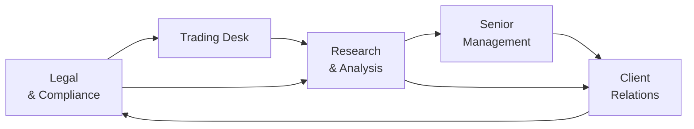

## Introduction

Have you ever sat in a portfolio review meeting and realized the compliance folks were seeing issues the analysts never noticed? Or maybe the trading desk had insights that could have saved everyone from a nasty regulatory headache? Well, that’s kind of what we’re talking about here—collaboration and communication among all the different stakeholders in a financial organization. It’s easy to think about “ethics” or “professional standards” as abstract concepts. But in practice, ethical success hinges on how well your legal, compliance, investment, research, and client relations teams actually talk to each other—and, of course, how well they all listen.

This section supports the broader guidance found in Standards I–VII (see also sections 2.1 through 2.7 for more details on each Standard). Collaboration isn’t explicitly “Standard VIII,” but you’ll find it’s woven into every dimension of the CFA Institute Code of Ethics. Whether we’re discussing duties to clients (Standard III), conflicts of interest (Standard VI), or responsibilities as CFA Institute members (Standard VII), it’s clear that open channels of communication really matter. And guess what? This collaboration extends beyond your internal teams to include peers, clients, industry associations, and regulators. That broader communication helps ensure a unified approach to ethics that meets—or exceeds—global professional standards.

Below, we’ll walk through why collaboration and communication matter, how to foster a strong cross-functional ethic within your firm, ways to engage with industry peers, and best strategies for open client dialogue. We’ll also highlight potential pitfalls, real-life examples, and a short personal anecdote or two. Trust me, bridging those silos was never more important than it is today.

## Why Collaboration Matters for Ethical Practice

Organizations that work in silos (compliance in one corner, trading in another, research in yet another) can be more prone to ethical blind spots. A compliance officer might not know how the traders are interpreting certain client instructions. The research department might discover a conflict of interest involving a major stock but not fully communicate that conflict to the client-relations team. When these departments operate independently, you increase the risk that something ethically questionable slips through the cracks, possibly damaging both your clients and your firm’s reputation in the long run.

Moreover, as we’ve learned in Standard V – Investment Analysis, Recommendations, and Actions, maintaining objectivity and diligence often requires input from multiple angles. Collaboration ensures that these angles come together into a single ethical framework. Cross-functional collaboration cultivates a culture of transparency and accountability that flows across the organization, all the way up to senior management. And remember, senior management is key to establishing an ethical tone at the top, so you really want them in the conversation.

Open communication also shortcuts the “I didn’t know that was an issue” narrative. Once you have frequent check-ins and cross-departmental input, even small red flags can be spotted early and addressed before they blossom into full-blown crises. I once worked in a mid-sized asset management firm that formed a special team—composed of compliance, research analysts, and product marketing—to handle ESG-related concerns from new corporate bond issuances. The synergy was astounding: not only did they preempt regulatory concerns, but they also caught potential brand image problems before any external damage occurred.

## Cross-Functional Collaboration

When we talk about cross-functional collaboration, we’re referring to forming committees or task forces that bring together diverse perspectives: legal, compliance, trading, client services, research, risk management, and sometimes even HR or IT. Essentially, it’s about tapping into varied skill sets to identify, analyze, and address ethical risks.

To illustrate these dynamics, check out the following diagram showing a simplified flow of cross-functional communication. Each node represents a department or stakeholder group, and arrows show how information ideally moves in a proactive, ongoing cycle:

This cyclical flow might look too neat, but it captures the ideal: each area regularly informs, and is informed by, the others. For example, compliance might see a potential legal risk that the client relations team should immediately communicate to clients. Meanwhile, the trading desk might stay aligned with compliance by clarifying any new trade limitations required under new or revised regulations.

### Case Example: A New Structured Product Launch

Imagine your firm is rolling out a complex new structured product that invests in fast-growing technology equities but also utilizes derivatives for downside protection. The research team identifies potential conflicts of interest with a sister company that invests in the same sector. Compliance wonders if the marketing disclosure is thorough. The trading desk sees an opportunity for alpha but is worried about the derivative’s volatility under stressed market conditions. Legal has concerns about cross-border distributions and the complexities they bring. If each group addresses these questions separately, you can guess how messy it might get. Forming a cross-functional task force ensures that all voices are heard and potential blind spots are tackled from multiple angles.

## Industry Collaboration

Ethical standards aren’t created in a vacuum. Industry-level collaboration propels ethical norms forward and helps create a more level playing field—even among competing firms. Local CFA societies, for instance, often spearhead or co-sponsor conferences and roundtable discussions that encourage the sharing of best practices. Remember, Standard I – Professionalism emphasizes integrity and knowledge-sharing, and industry-wide gatherings help reinforce that emphasis.

### Tapping Into Industry Resources

• Peer Firms: Building a dialogue with peer firms to discuss new regulatory challenges can help you stay ahead of the curve. You don’t necessarily need to share proprietary secrets, of course—just general best practices and lessons learned.  
• Trade Associations: Groups like the Investment Company Institute, the International Organization of Securities Commissions (IOSCO), or local councils often publish research or guides on emerging ethical and regulatory issues.  
• Local CFA Societies: These societies frequently facilitate events that connect professionals across different institutions, letting them exchange experiences and strategies for more robust ethical compliance.  

By participating in industry activities, your firm can refine its internal standards to align with (or exceed) what other reputable players are doing. This also signals to clients, regulators, and employees that you’re committed to continuous improvement in your ethical framework. 

## Client Communication

Clients are, of course, a major stakeholder—and they are often the most directly affected by your ethical or unethical behavior. Maintaining an open channel of communication with clients fosters transparency and trust, especially regarding fees, conflicts of interest, or the complexities of the products in which they’re investing.

### Why It Matters

In Standard III – Duties to Clients, the CFA Institute Code emphasizes fairness, loyalty, and objectivity. You can’t fulfill those duties if you’re talking to your clients in cryptic legalese or withholding important risk-related disclosures. Even if your firm is operating ethically behind the scenes, a lack of transparency can raise suspicions. And let’s face it, sometimes the biggest reputational hits come from miscommunications rather than outright wrongdoing.

### Practical Tips for Strong Client Communication

• Maintain Plain Language Disclosures: Particularly for more complex instruments, use approachable language that an informed client can understand.  
• Offer Regular Educational Sessions: If your firm regularly invests in derivatives or emerging markets, monthly or quarterly client seminars are a useful way to walk them through changes, potential risks, or new strategies.  
• Provide Timely Updates: If something changes—like your approach to ESG standards—update your clients before they have to ask. Keep in mind that different demographics of clients might prefer updates through different mediums (email, phone calls, in-person meetings, or web-based portals).  

Remember, strong relationships with clients keep them engaged and reduces the perception that “something fishy” might be happening. It also nurtures brand loyalty and trust, which is vital in the competitive market for asset management services.

## Overcoming Silos and Common Challenges

Even though collaboration sounds great in theory, it can be challenging in practice. Silos happen for many reasons: departmental budgets, specialized knowledge, or even personal turf wars. Sometimes you’ll encounter a manager who says, “That’s not my department’s problem.” We’ve all been there.

### Strategies to Break Down Silos

• Leadership Buy-In: Senior management has to champion collaboration. If the C-suite doesn’t emphasize cross-department communication, most employees won’t either.  
• Incentive Structures: You might want to reward teams (not just individuals) for meeting ethics and compliance goals. This ensures each group sees the practical benefit of working together.  
• Regular Check-Ins: Routine weekly or monthly cross-functional calls can keep teams aligned. Even a 15-minute video chat can help surface issues early.  
• Shared Tools and Systems: Enterprise-wide compliance systems or integrated customer relationship management (CRM) platforms break down informational barriers and keep all relevant stakeholders in the loop.  

Here’s a (somewhat simplified) formula to envision the synergy effect in collaborative efforts:


\text{Collaborative Synergy} = \text{Enterprise Value from Unified Decisions} - \sum_{i=1}^{n} \text{Value if Each Dept Acts Alone}


The idea is that collaboration can produce a net benefit that’s greater than the sum of what each siloed department can achieve independently.

## Example of a Cross-Functional Approach

Let’s consider an ethics scenario that crisscrosses multiple departments in a portfolio management setting:

• Scenario: Your asset management firm is preparing to roll out a marketing campaign for a brand-new global equity fund. Compliance has flagged a concern about performance reporting periods. Meanwhile, the research team is analyzing more granular risk metrics, and the marketing department wants to highlight only the best returns in promotional materials.  
• Action: A cross-functional meeting is held with representatives from marketing, compliance, research, portfolio management, and senior management. Everyone sees the big picture: marketing’s desire for an appealing campaign balanced against the ethics of honest risk disclosure.  
• Outcome: A final campaign that includes an accurate discussion of historical performance, references to potential drawbacks in emerging markets, and disclaimers consistent with regulatory requirements. The result is both compliant and compelling for the client.  

Such an approach speeds up ethical decision-making and ensures consistency throughout your firm’s external communications. 

## Conclusion and Best Practices

Collaboration is a cornerstone of implementing the CFA Institute Code of Ethics and Standards of Professional Conduct in a real-world environment. From internal alignment across compliance and trading desks, to industry partnerships that share best practices, to transparent client engagement—communication breaks down barriers and reinforces a culture of integrity.

If you’re looking for an easy starting point, try scheduling a monthly cross-functional meeting with a short agenda: any recent regulatory changes, new product proposals, and pressing questions from clients. Invite compliance, marketing, research, trading, and, if possible, a representative from senior management. In my experience, these monthly “huddles” can quickly illuminate potential issues that each silo might not handle as well on its own.

Ultimately, a collaborative environment doesn’t just shield the firm from fines or reputational damage; it also boosts employee morale and trust. People feel heard, the firm is viewed as transparent, and clients appreciate the honest dialogue. It’s a win-win for just about everyone.

## References for Further Exploration

• CFA Society Events: Many local CFA societies host seminars and workshops on ethics and professional standards. Check your local society’s calendar for upcoming sessions.  
• Industry Roundtables: Organizations like the Investment Company Institute, the Securities Industry and Financial Markets Association (SIFMA), or the International Organization of Securities Commissions (IOSCO) often publish guidelines and hold events where firms can share best practices.  
• Enterprise Risk Management Frameworks: For a deeper look at how ethics can integrate with broader risk considerations, explore enterprise risk management (ERM) articles and guidelines from professional bodies like COSO (The Committee of Sponsoring Organizations).  

Make sure to also circle back to Chapter 2.10 (Practical Examples and Case Analyses) and Chapter 2.13 (Evolving Ethical Considerations in Data and Technology) for more on how collaboration unfolds under real-world complexities.

## Collaboration and Communication Among Stakeholders: Test Your Knowledge



### In a cross-functional ethical review committee, which of the following is the primary benefit of including representatives from different departments?

- [ ] Maximizing departmental autonomy
- [x] Identifying potential ethical issues from multiple perspectives
- [ ] Reducing discussions about new regulations
- [ ] Ensuring the senior management is solely responsible for decisions

> **Explanation:** Diverse departmental viewpoints help detect blind spots early, ensuring a more well-rounded, ethical decision-making process.

### Which of the following best describes industry collaboration in the context of ethics?

- [ ] Sharing proprietary trading algorithms for mutual benefit
- [x] Sharing general best practices and insights to elevate standards across the industry
- [ ] Discussing only marketing initiatives to prevent brand dilution
- [ ] Avoiding interactions with competitor firms to maintain dominance

> **Explanation:** Industry collaboration typically involves sharing ethical best practices, regulatory insights, and lessons learned, without disclosing proprietary strategies or violating antitrust laws.

### Why is an ongoing cross-departmental communication loop crucial in financial firms?

- [x] It allows each department to stay aware of potential ethical and compliance concerns raised in other areas.
- [ ] It reduces the need for senior management oversight.
- [ ] It forces departments to compete for budget allocations.
- [ ] It removes the ability to escalate issues promptly.

> **Explanation:** Continuous dialogue helps break silos, ensuring that concerns raised by one department can be addressed or complemented by others.

### What is a practical way to encourage ethical collaboration among different teams?

- [ ] Holding annual workshops that focus solely on departmental successes
- [x] Scheduling regular cross-functional meetings to discuss ethics and compliance
- [ ] Ensuring only the compliance team is trained on new regulations
- [ ] Providing no formal process for interdepartmental communication

> **Explanation:** Frequent, structured communications across departments promote unity and help surface potential ethical issues in a timely manner.

### In an example where the marketing department wants to highlight best returns, while compliance insists on full disclosure of risks, what’s the ideal resolution?

- [x] Developing a balanced campaign that includes both positive performance and relevant risk disclosures
- [ ] Only showing the best returns so investors stay optimistic
- [x] Suppressing risk data until after the campaign launch
- [ ] Canceling the campaign to avoid disputes

> **Explanation:** Ethical marketing materials should present a fair and balanced picture to comply with regulations and protect investors from misleading impressions.

### How can a local CFA Society help in fostering collaboration and communication among industry professionals?

- [x] Hosting events and roundtables for sharing best practices
- [ ] Recommending ignoring competitor insights
- [ ] Imposing strict regulatory rules in local markets
- [ ] Publishing proprietary research of rival firms

> **Explanation:** Local CFA Societies often facilitate dialogue and knowledge sharing, which helps elevate ethical standards across the industry.

### Which best describes the role of senior management in encouraging cross-functional collaboration?

- [x] Setting the tone at the top and prioritizing ethics across all departments
- [ ] Restricting communication solely to marketing materials
- [x] Removing compliance from product development decisions
- [ ] Delegating ethical decisions to junior staff

> **Explanation:** Senior management sponsorship is key. They model and enforce an organizational culture that values continuous communication and ethical decision-making.

### When a firm operates in silos, which of the following is a likely consequence?

- [x] Increased risk of ethical failures due to lack of interdepartmental awareness
- [ ] Lower risk of regulatory scrutiny
- [ ] Better client communication and transparency
- [ ] Enhanced synergy in compliance

> **Explanation:** Siloed organizations miss out on important insights from other departments, which can create ethical blind spots and increase reputational risk.

### Which tactic is most useful for preventing turf wars and promoting collaboration across departments?

- [x] Rewarding team-oriented ethical behavior and compliance outcomes
- [ ] Emphasizing departmental profit above all else
- [ ] Limiting cross-functional communication to emergency situations
- [ ] Encouraging competition for the best compliance metrics

> **Explanation:** Incentive structures that emphasize team-based success strategies can reduce departmental friction and encourage cooperation on ethical matters.

### Collaboration and communication among stakeholders are beneficial primarily because:

- [x] They foster trust, transparency, and higher ethical standards across the firm.
- [ ] They allow management to avoid accountability.
- [ ] They discourage regulatory bodies from performing audits.
- [ ] They guarantee that ethical breaches will never occur.

> **Explanation:** While collaboration doesn’t eliminate all risk, it significantly reduces ethical blind spots and fosters an environment of shared responsibility.


