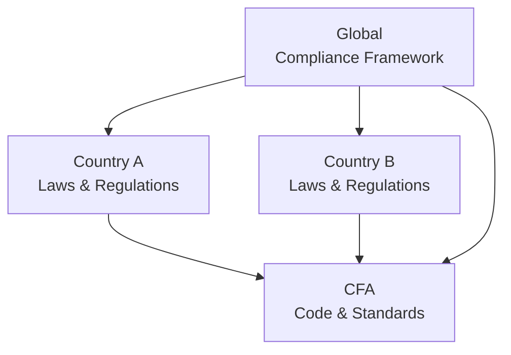

## Introduction
Harmonizing professional standards across different countries is kind of like trying to organize a family reunion when everyone has wildly different cultural expectations. You’ve got local regulations, global best practices, and the CFA Institute Code and Standards all converging in a single advisory or asset management practice. Sounds a bit overwhelming sometimes, right? But as professionals, we can’t just throw our hands up or say, “Well, local law trumps everything.” We must find ways to reconcile these differences and uphold the highest ethical responsibilities—while still complying with local regulations. This nuanced balancing act is crucial not only for the integrity of the global investment profession but also for earning and maintaining clients’ trust across diverse geographies.

In this article, we’ll explore the key considerations faced when working across borders, especially those that pit local legal obligations against the well-established and globally recognized CFA Institute Code and Standards. We’ll talk about practical strategies, highlight some reallife examples, and even show you a simple diagram to illustrate how all these moving parts can fit together (most of the time, anyway). By the end, you should feel more confident about addressing crossborder ethical dilemmas without losing sight of the big picture: preserving, and even reinforcing, the integrity of the profession.

## Reconciling Conflicts Between Local Law and the CFA Institute Code
One of the fundamental elements that we keep coming back to is the principle that when local law and CFA standards collide, members should abide by the more rigorous or stricter standard—unless, of course, following that stricter standard would itself violate the law. Sometimes it sounds a bit contradictory, but it’s actually simpler than it seems. Here’s a quick explanation:

• If local law is more stringent than the CFA Code and Standards, you follow local law.  
• If the CFA Code and Standards are more stringent, they become the guiding principle, provided that acting in accordance with them does not cause you to break local law.  
• In truly sticky situations where strict compliance with both the local law and the CFA Code is impossible, you must adhere to the law (no question about that), but you also must disclose and address the discrepancy.

This stance reflects ethical leadership and often protects professionals from inadvertently misrepresenting or harming clients. In my early days as a junior analyst at a multinational bank, I remember reading an internal memo that basically said: “Hey everyone, we know the global firm standard says to disclose X, but in Country A, that kind of disclosure is actually illegal or heavily restricted.” I was confused—should we do the full disclosure or not? The firm’s legal counsel eventually clarified that we were to comply with Country A’s laws, document the conflict, and provide what disclosures we could without violating those laws. That’s a classic example of how the Code is applied in real life.

## Notice of Departures and Minimizing Ethical Compromises
Just because local law disallows some provisions of the CFA Code and Standards does not mean you simply stop caring about ethics. In fact, this is precisely the moment to lean into the transparency. Document the differences. Make a record of precisely why you’re not able to comply fully and show that you’re at least trying to meet the spirit of the Code to the best of your ability. It feels a bit like telling your friends you’re going on a diet, but you can’t stop eating bread because of a dietary restriction. You highlight the limitations and you do the best you can.  

From a practical standpoint, ensuring there’s a written record not only demonstrates your commitment to the CFA Code—it also provides a point of reference if you ever need to explain your actions to a regulator or professional review body. Plus, this documentation can serve as a red flag that your firm’s compliance department might need to craft new guidelines specific to that jurisdiction.  

## Global Consistency in Firm Policies
Most large investment firms want a consistent set of global policies. It’s way easier for staff to follow a single, cohesive code of conduct than to memorize a big patchwork of region-specific policies. But consistency should not come at the expense of ignoring those local nuances—especially if ignoring them leads to legal or cultural blind spots. If you’re tasked with rolling out a global set of guidelines, you might:

• Define a “global baseline” that captures the most rigorous ethical and professional standards found in both local law and the CFA Code.  
• Layer on top those additional requirements that might apply in specific cases or regions.  
• Provide training sessions, real-time Q&A, and scenario-based learning to help employees understand how to apply these requirements in day-to-day business.  

Although many of us may wish to unify everything into a single, neat manual, reality is that you’ll still have references to region-specific rules. This is especially important in areas like data privacy or marketing constraints, which vary widely.

## Engaging Multijurisdictional Legal Expertise
If you remember that scene from a legal thriller—where different attorneys debate the same contract from different vantage points—well, that’s pretty close to what might happen in a global firm. Unless you have specialized counsel who understands multiple jurisdictions, you’ll often find yourself juggling advice from separate local law firms, each tied to the specifics of one locale. It might also be necessary to have a centralized (or “global”) legal team to coordinate and harmonize these local viewpoints with the firm’s code of conduct, which ideally aligns with the CFA Code and Standards.

An integrated approach could look like this:  
• A global counsel ensures adherence to universal ethical principles.  
• Local counsel highlights specific laws that could override or dictate certain behaviors.  
• Compliance and risk management teams produce guidelines bridging the global baseline with local legal constraints.  

You might even host a cross-team workshop once a quarter, bringing together the legal folks, compliance experts, portfolio managers, and key decision-makers to review any changes, pitfalls, or new ‘gray areas’ that have popped up.

## Practical Examples of Cross-Border Ethics
Picture a portfolio manager who oversees investments in both Emerging Market A and Developed Market B. Suppose in Emerging Market A, public companies are not legally required to disclose certain related-party transactions, whereas in Developed Market B, this information must be disclosed in line with stricter regulations (which are heavily inspired by global best practices). How does the manager or the firm handle it?

1. The firm’s standard procedure is to request full related-party disclosures from all companies in its investable universe. Generally, that’s aligned with the CFA Code.  
2. Companies in Emerging Market A might refuse to provide that data, claiming the law does not require it.  
3. Even if local law does not mandate disclosure, an adviser may face higher risk (and potentially compromise the client’s best interest) by investing in a firm that withholds information. So the portfolio manager might decide not to invest or at least to limit exposure until adequate transparency is achieved.

That approach ensures you’re not just blindly accepting local law if it leads to questionable practices. Typically, it also fosters a reputational advantage and can encourage local companies to embrace better transparency in order to attract foreign investment.

## Diagram: Multifaceted Cross-Border Compliance

Here’s a simple diagram to visualize how local regulations, the CFA Code, and the goal of global consistency intersect:

• The Global Compliance Framework sets an umbrella for internal policy.  
• Each local jurisdiction has its own specific rules.  
• The CFA Institute Code & Standards serve as a unifying benchmark.   
• Tensions or conflicts? The framework adapts to reflect the best outcome that neither violates local law nor falls below the CFA Code’s threshold.  

## Best Practices and Common Pitfalls
Let’s outline some go-to strategies for handling crossborder ethical dilemmas, while also mentioning pitfalls that might trip you up.

Best Practices:  
• Establish a global baseline policy that meets or exceeds the highest of all applicable jurisdictions’ standards.  
• Maintain an active watch on local regulatory changes—especially in data privacy, anti-money laundering rules, and marketing.  
• Document every departure from the CFA Code, along with mitigating measures.  

Common Pitfalls:  
• Assuming that if something is permissible in one country, it’s automatically permissible in all.  
• Overlooking the importance of training staff on region-specific differences, resulting in unintentional violations.  
• Failing to engage local counsel for “small offices.” Even a minor overseas presence can lead to unexpected legal obligations.

## Encouraging a Consistent Ethical Culture
Yes, we talk a lot about the technical side of compliance. But at the end of the day, building a culture of ethics goes beyond checking boxes. This is especially vital in multinational firms, where staff members might have different cultural norms around transparency, gift-giving, conflict-of-interest disclosures, and so on. By setting an example from the top, leadership can unify everyone under a shared sense of professional pride and accountability.  

Sometimes, it helps to share personal stories or experiences that resonate with local staff. Incorporate robust internal communications—chat groups, videos, or even role-playing sessions to drive home how the CFA Code applies in daily business life. The more your people believe in it, the less friction you’ll face between local “ways of doing business” and global standards.

## Time-Saving Tips for the CFA Level III Exam
• Scenario-based learning is your friend. Try out sample questions involving crossborder conflicts. If the question says, “Local law allows X, but the CFA Code says Y,” think carefully about which standard is higher.  
• Be specific about documenting departures. The exam might test your ability to interpret hypothetical scenarios that revolve around partial compliance.  
• Don’t forget the big picture: if abiding by the Code is going to make you break local law, that’s impermissible.  

On the actual exam, you might see a constructed-response question that sets up a scenario across multiple jurisdictions. You’ll likely have to explain which standard to follow, how to document any conflict, and ways to limit negative impacts on clients. The key is to show both your knowledge of the standard principle (the more rigorous standard wins out) and the practical steps you’d take to uphold or document compliance.

## References for Further Exploration
• Enderle, G. & Murphy, P. E. (Editors). “International Business Ethics.” This provides a deeper look at how companies handle conflicting cultural norms.  
• Consult local CFA Societies for region-specific guidance and regulatory updates.  
• Learn from global asset management firms’ case studies on standardizing ethics across multiple geographies.  

## Test Your Knowledge: Cross-Border Ethical Compliance



### Which principle best describes how to handle a conflict between local regulations and the CFA Institute Code and Standards?
- [ ] Always follow local regulations, regardless of how lenient they may be.  
- [x] Follow the stricter standard as long as doing so does not violate local law.  
- [ ] Obey the Code in all cases, even if it conflicts with local law.  
- [ ] Defer the decision to local legal counsel, who has final authority.  

> **Explanation:** The CFA Institute Code and Standards explicitly require that when local laws are less strict than the Code, the more rigorous standard should be applied, provided doing so is not illegal.

### If a certain aspect of the CFA Code is prohibited by local law, what is the recommended action?  
- [ ] Comply with local law and ignore the Code altogether.  
- [ ] Attempt to change local legislation.  
- [x] Document any necessary departures from the Code and minimize the ethical compromise.  
- [ ] Proceed with the Code anyway and hope the law changes.  

> **Explanation:** The CFA Code encourages members and candidates to follow the higher standard whenever possible; if that’s not feasible, you should keep a clear record of the conflict and your rationale.

### Why might a global investment firm implement one set of standardized ethical policies worldwide?  
- [x] It reduces confusion for employees and can enhance overall trust in the firm’s brand.  
- [ ] It ensures local branches feel fully autonomous.  
- [ ] It guarantees uniform legality in all markets.  
- [ ] It absolves employees from having to learn local laws.  

> **Explanation:** A single set of ethical guidelines simplifies training and fosters a consistent culture, although one must still adapt where local regulations demand unique measures.

### Which scenario illustrates a departure from the Code due to local law constraints?  
- [x] A firm cannot disclose all related-party transactions because local law prohibits such public disclosures.  
- [ ] A firm chooses not to comply with the Code because it’s too costly.  
- [ ] An employee forgets to request client permission before trades.  
- [ ] An employee invests in high-risk securities without disclosing risk.  

> **Explanation:** The first scenario directly reflects a conflict between local law and a typical CFA Code requirement, forcing only partial compliance.

### A multinational asset manager needs to limit bribery risk in two countries with different anti-bribery regulations. What’s the best approach?  
- [x] Create a global standard that meets or exceeds the more stringent law, so long as it remains legal in both markets.  
- [ ] Let each local office decide based on immediate conditions.  
- [ ] Default to whichever law is more lenient.  
- [ ] Abandon the Code’s bribery provisions to keep operations simple.  

> **Explanation:** Adopting the higher standard (assuming it doesn’t violate law elsewhere) ensures consistency and a strong ethical baseline.

### In practical terms, what is the greatest benefit of maintaining a written record of local law conflicts?  
- [x] It provides documentation for regulators and compliance reviews.  
- [ ] It guarantees exemption from local laws in the future.  
- [ ] It replaces the CFA Code requirement to disclose conflicts of interest.  
- [ ] It eliminates the need to abide by local regulations.  

> **Explanation:** Documenting conflicts helps demonstrate a good-faith effort to follow the higher ethical standard, while maintaining transparency for all stakeholders.

### Which of the following is a common pitfall for professionals operating in multiple jurisdictions?
- [ ] Seeking local legal counsel for every new office.  
- [ ] Creating comprehensive training on local variations.  
- [x] Automatically assuming a practice legal in one jurisdiction is permissible everywhere.  
- [ ] Documenting potential conflicts in every jurisdiction.  

> **Explanation:** Failing to verify local laws when scaling a practice across borders can lead to unintentional violations or ethical lapses.

### When evaluating a potential investment in a market with minimal disclosure requirements, a portfolio manager adhering to the Code would most likely:  
- [ ] Proceed with the investment without further research.  
- [ ] Demand fewer disclosures to stay aligned with local norms.  
- [x] Require additional disclosures or refrain from investing if transparency is inadequate.  
- [ ] Defer the client’s best interest to the local market practices.  

> **Explanation:** Even if local laws don’t mandate the same disclosures, the Code stresses diligence and transparency. Managers should avoid investing blindly if disclosures fall below a safe threshold.

### How can regular workshops with cross-functional teams facilitate compliance with both local regulations and the CFA Code?  
- [x] They allow legal, compliance, and portfolio management teams to exchange updates and clarify conflicts.  
- [ ] They eliminate the need for local counsel.  
- [ ] They serve as a replacement for written policies and procedures.  
- [ ] They provide a chance to avoid discussing conflicts.  

> **Explanation:** Collaboration ensures that new regulations are promptly addressed, and any conflicts with the Code are resolved in a transparent manner.

### True or False: The CFA Institute Code and Standards always override local laws, no matter the jurisdiction.  
- [ ] False  
- [x] True  

> **Explanation:** Actually, this is a bit of a trick question. According to the Code, members should uphold the stricter standard—however, they must comply with the law if the law is more restrictive or if following the Code would be illegal. So to be precise: The Code doesn’t override the law in a sense that would force you to break local law. If local law compels you to act in a way that’s less rigorous, you must comply with local law but document the departure.  


