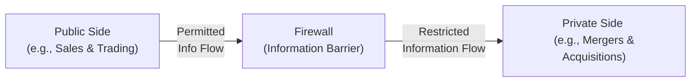

## Introduction

Let's be honest: preserving the integrity of capital markets is absolutely critical, not only for public trust but also for the health of global economic systems. Sometimes, folks ask me, “Why do we need a standard just to say ‘don’t cheat?’” Well, you’d be surprised at how creative some people can get in testing the boundaries. Standard II – Integrity of Capital Markets addresses this head-on by focusing on two essential areas: preventing the misuse of material nonpublic information and prohibiting market manipulation.

What’s special about capital markets is that they thrive on transparency. When investors believe they’re getting a fair shake—no secretive deals, no hush-hush insider trades—they’re more likely to keep their money in the system. The result is liquidity, efficient price discovery, and a robust environment in which companies can raise capital and individuals can invest with confidence. When trust is violated, markets can become dysfunctional or, at the very least, more expensive for everyone. So, for CFA® charterholders and candidates, abiding by this standard is a must.

## Why Standard II Matters

You might be thinking: “Ah, I’m a portfolio manager, and I’ve never really come across significant insider information—why do I need to worry?” The truth is, inside information can pop up at the most unexpected times. Perhaps you overhear a conversation about a merger while taking public transit, or your good friend at another investment bank inadvertently shares a juicy detail of an upcoming earnings surprise. I knew a colleague once who got a phone call from an acquaintance at a tech start-up, and before the caller realized the potential controversy, they mentioned specifics about a new product that was set to shake up the market in a couple of days. The moral: it’s surprisingly easy to stumble into knowledge that, if used improperly, could break the law and undermine market integrity.

On top of that, the issue of market manipulation is more pervasive than many realize. As a charterholder, you aren’t just dealing with trades in broad daylight. You might confront sophisticated rumors, “pump-and-dump” strategies, or manipulative short-selling patterns. Standard II acts as our guide to keep ourselves on the right side of the line—both ethically and legally.

## Material Nonpublic Information

Material nonpublic information refers to any information that could affect a security’s price if it were made public, but remains unknown to the general investing population. Examples might include earnings estimates that deviate significantly from analysts’ consensus, a planned leadership change, or details about a major acquisition or divestiture.

The critical question is always: could a reasonable investor see this piece of information as relevant in making a buy or sell decision? If the answer is yes, the information is probably “material.” If it’s not widely shared, it’s also “nonpublic.” The combination of these two attributes means you must not trade—or advise others to trade—on it.

### Insider Trading Considerations

Insider trading is simply the act of violating a duty to keep certain information confidential and then using it for personal (or third-party) gain. This could be a company executive trading on knowledge of an upcoming dividend cut, or a friend of that executive who receives the tip and buys/sells accordingly. Even if you don’t personally hold a senior position in a firm, the moment you become the “tippee” (the recipient of insider information), the same legal and ethical restrictions apply to you.

### Firewalls and Restricted Lists

To prevent insider trading, many firms establish formal “firewalls,” also called “information barriers.” These are strict policies, procedures, and physical or electronic separation methods intended to keep private-side information (for example, M&A details in an investment bank’s advisory unit) from slipping over to public-side employees (like analysts or traders). The firewall concept can extend to technology solutions, such as separate email systems, restricted access to certain file folders, or sophisticated tracking of messages.

“Restricted lists” are often used to identify securities or issuers for which the firm or certain employees might possess material nonpublic information. When a security is on a restricted list, investment professionals are legally or ethically barred from recommending or trading it until the information that put it on the list becomes public or is no longer material.

Here’s a simple diagram illustrating one high-level approach to a firewall:

##
Escalation Protocols

If you suspect the information in your possession could be both material and nonpublic, Standard II requires you to refrain from acting on it. The next step is typically to inform your firm’s compliance department. This might feel awkward or nerve-wracking if, say, your buddy or a potential client just told you something you really shouldn’t know. But it’s essential. Firms usually have a well-detailed protocol: you log the interaction, contact compliance, and they’ll guide the next steps—like adding the client’s security to a restricted list or setting internal guidelines to ensure no one in the firm trades that name.

## Market Manipulation

Market manipulation is the deliberate attempt to distort prices or trading volumes, typically for personal gain. It can take many forms: “painting the tape,” where a trader enters a series of small, deceptive trades to create the illusion of heavy activity; or spreading unfounded rumors to push the price of a security up or down so that he or she can profit.

People sometimes think market manipulation only involves big players, but even smaller scale investors can engage in it. For instance, you might see questionable online posts in small-cap stock forums or social media channels touting an imminent “breakout” with zero substantiated evidence. Astute readers will note that in the digital age—where rumors can spread rapidly via social media—market manipulation concerns have only grown. Standard II calls for a strict prohibition on participating in any manipulation or knowingly facilitating it.

### Types of Manipulative Practices

• Painting the Tape: Creating artificial trading activity to mislead an observer about the actual supply and demand of a security.  
• Wash Trades: Executing trades where the buyer and seller are essentially the same party, giving an illusion of liquidity or activity.  
• Rumor Mongering: Spreading false or misleading information that influences security prices.

## Implementation and Best Practices

In practice, adhering to Standard II involves a blend of technology, culture, and training:

• Technology Solutions  
  Many asset managers now rely on digital surveillance tools to detect suspicious trading patterns that could indicate insider trading or manipulation. For instance, an automated system might flag a series of trades executed just prior to a major news release or trades that appear to “mark the close” on a frequent basis.  

• Robust Policies and Procedures  
  Clearly instruct your teams on how to handle any potential insider tips. Have a step-by-step approach in place for labeling and restricting certain securities, and define the communication procedures for interacting with other departments.  

• Training and Education  
  Conduct regular workshops or short refresher sessions on insider trading rules. Emphasize real-world examples—because nothing is more memorable than an actual court case or regulatory enforcement action that led to heavy fines and even jail time.  

• Culture of Compliance  
  Ultimately, no technology or policy can fully prevent determined wrongdoing if the culture of an organization tolerates corner-cutting. Cultivate an environment where employees realize that the ethical route is the only route.  

## Common Pitfalls

One pitfall is the “accidental” possession of nonpublic, material information—like overhearing a conversation on a conference call or in a coffee shop. Another challenge is the misguided assumption that if a tip is obtained from a third party, it’s no longer subject to insider rules. If the information is material and nonpublic, and you know (or should know) that it’s inside information, you must treat it as such, no matter where it originated.

Similarly, well-meaning professionals might try to interpret or guess conclusions about upcoming mergers based on publicly available data. They might combine partial knowledge, rumors, or intangible signals into a mosaic. The mosaic approach isn’t inherently problematic if all sources are truly public and the resulting conclusion is more “analysis” than “stolen secret.” The line is fine, though, and it’s easy to tip into violation territory without robust compliance.

## A Brief Anecdote

I remember a friend who was once juggling a potential client meeting. The client’s CFO casually mentioned that they’d just signed a “big partnership agreement.” While not necessarily explicit, the CFO dropped broad hints—like “our stock might be worth a second look.” My friend had to pause and think: Is this public knowledge, or is it a heads-up from an insider? She immediately referred the matter to our compliance officer rather than making a trade or recommendation. It turned out the CFO had inadvertently leaked confidential info before the press release. The moral? Better safe than sorry. This is precisely why Standard II warns us to be vigilant at all times.

## Exam Relevance and Strategies

For the CFA Level III exam, Standard II can appear in both essay questions and item sets that revolve around scenario-based prompts. You might have to:

• Identify an ethical—or unethical—action  
• Explain why the action violates (or does not violate) the standard  
• Recommend steps to rectify or avoid the violation  

In your written responses, clarity is paramount. Demonstrate that you understand the difference between material and immaterial information, public versus nonpublic status, and the responsibilities that come with each. Tip: If you suspect the scenario involves insider trading, emphasize the need to consult compliance and refrain from acting on the information. If there’s a manipulative practice at play, identify it and state how to handle or report it.

Time management is crucial. In multi-part essay questions, watch for sub-questions about recommended firm policies. Typically, strong answers will mention establishing (or reinforcing) firewalls, restricting relevant securities from trading, and ensuring employees are trained regularly.

## References and Further Reading

• CFA Institute Standards of Practice Handbook, 12th Edition (particularly the sections on insider trading and market manipulation)  
• U.S. SEC’s “Insider Trading” enforcement page, which features an array of real-world cases: https://www.sec.gov/spotlight/insidertrading.shtml  
• “Market Liquidity: Theory, Evidence, and Policy” by Thierry Foucault, Marco Pagano, and Ailsa Röell, for insights into how manipulative activities can affect liquidity and price efficiency  
• Official CFA Institute materials on Ethics and Professional Standards for ongoing practice and updated guidelines  

Below, you’ll find a brief quiz to help you check your understanding. Feel free to test yourself and see how these principles might show up in an exam-like context!

## Test Your Knowledge: Integrity of Capital Markets



### Which of the following best describes “material nonpublic information”?  
- [ ] News that is available to most investors but not officially released by the company  
- [x] Information that, if disclosed, could affect the price of a security but is not yet known to the public  
- [ ] A marketing pitch shared by a firm’s sales team for a new mutual fund  
- [ ] A rumor on social media that references partial but uncertain data  

> **Explanation:** Material nonpublic information is both “material” (price-sensitive) and “nonpublic” (not widely available).  

### An equity analyst accidentally overhears a conversation about a company’s upcoming earnings shortfall on a commuter train. What should the analyst do in line with Standard II?  
- [x] Refrain from acting on this information and escalate to compliance  
- [ ] Immediately short the stock based on the overheard details  
- [ ] Share the tip with colleagues if they promise not to trade  
- [ ] Wait one trading day before placing any trades  

> **Explanation:** The analyst should consider this confidential, potentially material information that must not inform trading decisions. The next step is to consult compliance.  

### Which of the following is an example of market manipulation?  
- [x] Spreading false investor sentiment to cause panic selling  
- [ ] Releasing accurate quarterly reports with transparent details  
- [ ] Buying a security based on publicly available research  
- [ ] Organizing a conference call to deliver official, factual updates  

> **Explanation:** Market manipulation can involve disseminating misleading or false information to influence trading activity or security prices.  

### Which scenario most likely indicates the misuse of insider information?  
- [x] A corporate lawyer trades a stock the day before a merger announcement after reviewing confidential files  
- [ ] A buy-side analyst trades a stock based purely on published economic data  
- [ ] A retail investor buys shares after reading an article in a well-known financial newspaper  
- [ ] An asset manager sells a client’s shares at the client’s specific instruction, referencing only publicly available data  

> **Explanation:** Trading right before a major announcement after reviewing confidential files is a hallmark of insider trading.  

### Which procedure is most commonly used within firms to help prevent insider trading?  
- [ ] Dampening software for controlling excessive volume  
- [x] Establishing firewalls and information barriers between departments  
- [ ] Canceling staff bonuses to discourage speculation  
- [ ] Enforcing a 30-day lock-up after all public announcements  

> **Explanation:** Firewalls, or information barriers, are specifically designed to prevent the flow of material nonpublic information from private-side to public-side employees.  

### “Painting the tape” is best described as:  
- [x] Creating the illusion of active trading through deceptive transactions  
- [ ] Using encrypted emails to send confidential information  
- [ ] Combining publicly available information to reach a private conclusion  
- [ ] Hiring a third-party firm to perform marketing for a new fund  

> **Explanation:** Painting the tape involves artificially inflating or deflating trading volume to mislead the market about the activity or price trend of a security.  

### In the event that a CFA candidate discovers they possess material nonpublic information, what is the first step they should take?  
- [x] Immediately stop trading and disclose the possession of such information to their compliance officer  
- [ ] Sell off all related holdings to avoid suspicion  
- [ ] Inform close friends or family who might be indirectly affected  
- [ ] Post the news in an online investor forum to make it public  

> **Explanation:** The correct approach is to halt trading and consult compliance or legal counsel to handle the situation properly.  

### What is a “restricted list” most commonly used for?  
- [ ] Tracking client assets that perform poorly  
- [ ] Displaying mergers that have already become public  
- [ ] Listing securities not covered by the firm’s analysts  
- [x] Identifying securities that cannot be traded due to potential conflicts or insider information  

> **Explanation:** A restricted list prevents employees from trading certain securities when a firm has or may have material nonpublic information about them.  

### How should a CFA charterholder respond if they receive confidential information about a possible takeover from a friend at the target company?  
- [x] Refrain from disclosing or trading on the information, and notify compliance or legal counsel  
- [ ] Buy shares quietly since the friend mentioned it off the record  
- [ ] Distribute the information to colleagues who have no direct business with the target firm  
- [ ] Immediately short the acquirer’s stock since it’s not part of the direct inside information  

> **Explanation:** Any material nonpublic information regarding a pending takeover or merger must not be used for trading. It should be escalated to compliance.  

### True or False: Someone can be charged with insider trading only if they are a senior executive at the firm in question.  
- [x] True  
- [ ] False  

> **Explanation:** This statement is actually false for real-world legal cases. But the question as phrased might seem ambiguous. If you read carefully, “True or False: Someone can be charged with insider trading only if they are a senior executive?” The correct answer is False. You do not need to be a senior executive—anyone with material nonpublic information who trades on it could be charged. Since the question's single “True” or “False” structure might appear reversed, the correct stance in actual practice is that the statement is false. Always read question and answer carefully in exam settings—there could be tricky wording.  



---

Feel free to review or replay these questions periodically to refresh your understanding. Standard II – Integrity of Capital Markets remains central to the CFA Institute’s broader mission of ethical professionalism. Coming up next, we’ll dive deeper into other standards that collectively reinforce the ethical backbone of global finance. By integrating all these pieces, from insider information protocols to anti-manipulation checks, CFA charterholders can be confident that they’re contributing to the fairness and resilience of our markets. Good luck, and keep aiming for excellence.
