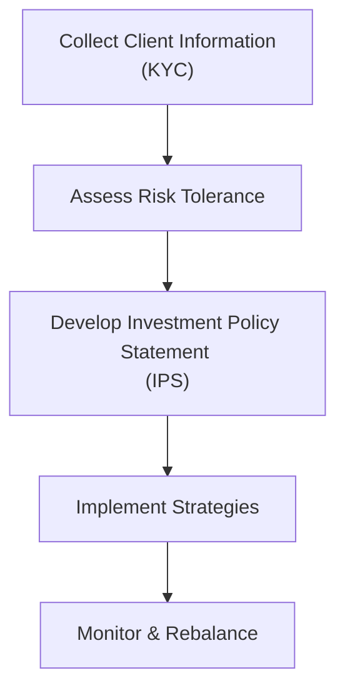

When we talk about Standard III of the CFA Institute Code and Standards—Duties to Clients—we’re really focusing on the heart of a professional investment manager’s mission: putting clients first. This might sound simple, but in practice, there can be a whole lot going on behind the scenes. Maybe you’ve faced a situation where a really important (and, let’s be honest, high-revenue) client wants that little extra attention on their portfolio. Or maybe you’ve got a brand-new client with a unique set of needs you haven’t encountered before. It can feel a bit overwhelming to juggle everyone’s interests, especially in a fast-paced environment with markets that don’t stop moving. But that’s precisely why Standard III—Duties to Clients—is indispensable for any serious professional.

This Standard outlines the responsibilities investment professionals must fulfill to protect and prioritize their clients’ well-being. These responsibilities include Loyalty, Prudence, and Care; Fair Dealing; Suitability; Performance Presentation; and Preservation of Confidentiality. In the sections below, we’ll break these concepts down, relate them to real-world scenarios, and look at why these responsibilities are more than just legal requirements. This is also your chance to see how the knowledge gleaned in earlier chapters—like Code of Ethics or cross-border regulatory considerations—dovetails with the duty owed to your clients every single day.

Loyalty, Prudence, and Care  
It’s one thing to talk about putting the client first. It’s another to actually do it in a tough situation. Let’s say you’re analyzing an emerging-market security that’s high risk, but you believe it offers tremendous upside. Looks great, but is it really okay for your retired client who can only tolerate very modest volatility? This is where the principle of loyalty, prudence, and care shines through. You must consider the client’s unique financial situation, risk tolerance, and even their investment horizon. If you think the risk is too large relative to their capacity and tolerance, you politely pass on that shiny idea.

In my early days as a portfolio manager, I recall being so excited about a cutting-edge biotech stock that I nearly forgot a client’s risk aversion. I was convinced this company would disrupt the industry and perhaps yield triple-digit returns. Then—thankfully—my supervisor reminded me that the client in question was near retirement, with minimal tolerance for large drawdowns. Sure enough, that biotech stock eventually had a massive price swing that would have caused sleepless nights for our retiree client. The principle of loyalty, prudence, and care isn’t just theoretical; it keeps us from making decisions that could wreck our clients’ financial well-being and confidence.

Keeping these concepts in mind also means paying close attention to the finer details: thoroughly researching investment strategies, understanding the effect of each trade on the client’s portfolio, and documenting the rationale behind each decision. If an idea, strategy, or trade does not align with the client’s risk tolerance and objectives, you have a professional duty to refrain, regardless of its potential upside. That’s real loyalty, and it requires prudent judgment at all times.

Fair Dealing  
One of the trickiest aspects of Standard III can be fair dealing, because it calls on you to ensure that no client is disadvantaged or has preferential access to information. This can get tricky when you consider large and more sophisticated clients who might be able to understand complex products much faster. For instance, imagine you have a brand-new economic analysis indicating a shift in central bank policy that could significantly impact fixed-income prices. Suppose a big institutional client calls you to share concerns and you walk them through the details, but you fail to provide the same insights to your smaller retail clients. Well, that’s a no-no from a CFA ethics perspective: you should strive to disseminate new or material investment information fairly.

Equally important is how you allocate trades, especially in a hot initial public offering (IPO) or a corporate bond issuance where supply is limited. It’s easy to think: “Let’s give the lion’s share to our biggest client.” But that can cross the line into favoritism. Instead, the recommended approach is to ensure your allocation procedures systematically and fairly distribute opportunities. Everyone deserves an equitable shot at beneficial trades or timely disclosures, consistent with your firm’s policies. Not to mention, showing fairness across the board is a great way to build trust and loyalty with all clients.

It’s not always easy. In many real-world scenarios, timescales can be extremely tight, and big institutional clients often have entire teams that call you for updates. But as a CFA charterholder or candidate, you’ve got to carefully document how you disseminate new information and ensure that your compliance systems cover distribution lists, email blasts, or pre-set forms of communication. Even the best of us can slip up if we handle urgent trading bulletins on a first-come, first-served basis without a robust protocol. So, do yourself a favor: keep a well-documented approach so that if something goes awry, you have evidence of your objective process.

Suitability  
Imagine a scenario: your client is a high-net-worth tech entrepreneur who says, “I want market-beating returns. I can handle swings.” That sounds straightforward. But does that same client understand the possibility (however remote) of a near-total loss if a highly concentrated position tanks? Suitability is about ensuring the client’s portfolio appropriately matches their risk tolerance, return objectives, and constraints—no matter how sophisticated or confident they might seem.

A vital element of suitability is the so-called “Know Your Client (KYC)” process, which you’ve probably heard about a thousand times. If you’re rolling your eyes thinking, “I already know this,” hang on. By properly documenting every aspect—income needs, liquidity desires, estate-planning considerations, potential tax constraints, even ethical or religious preferences—you’re building an institutional memory on the client. This helps you not only tailor recommendations but also adapt them as the client’s circumstances evolve. For Level III exam readiness, remember that the KYC process is central to writing and updating the Investment Policy Statement (IPS). Make it robust. Make it consistent. And keep it updated because clients’ lives change, and your recommendations should too.

Below is a simple diagram showing how the compliance-minded manager might approach the ICS (Information Collection and Suitability) cycle:

If you skip any of these steps, you risk making an unsuitable recommendation. For instance, if you fail to update a client’s personal circumstances—perhaps they’re about to pay college tuition or they retired earlier than scheduled—you could inadvertently keep them in a high-volatility investment that no longer fits. Suitability demands that you be vigilant in gathering information and tailoring every action to the specific client.

Performance Presentation  
Accurate and fair performance reporting is a cornerstone of Standard III. Nothing erodes trust like overinflating your track record or omitting less flattering performance windows. I once worked with a team excited to share performance highlights from the best quarter in our firm’s history. The marketing folks tried to emphasize that quarter in new pitch materials with minimal mention of performance over less spectacular quarters. We had to rein them in and remind them that balanced, transparent reporting is key to meeting ethical standards.

Adhering to Global Investment Performance Standards (GIPS) can be an excellent approach for presenting historical returns that are comparable, consistent, and transparent. GIPS guidelines help ensure that your methodology—such as how you treat cash flows, price securities, or calculate composite returns—is standardized. However, even if you’re not GIPS-compliant, you should carefully follow your local regulatory rules and your firm’s principles to avoid painting an incomplete or misleading picture. Provide disclaimers where needed, and ensure that performance metrics reflect reality, warts and all. Nothing’s perfect; clients appreciate honesty as much as they appreciate strong results.

Preservation of Confidentiality  
Picture this: you’re a portfolio manager at a local coffee shop, finishing up some investment analytics for a client with some hush-hush restructuring needs. You hop on the café Wi-Fi, open the spreadsheet, and—surprise—the connection is not secure. Worse yet, there’s a curious person seated behind you who can easily see your screen. Maintaining client confidentiality isn’t just a matter of not talking about them casually at a cocktail party; it extends to digital security, physical records, and even your daily social interactions.

Standard III requires you to maintain your client’s confidentiality at all times unless you have explicit permission or are required by law to disclose. Even well-meaning professionals can easily slip up by chatting about a “potential big investor” in a public area. Overhearing might let people piece the puzzle together, especially in niche markets. So it’s best practice to keep records locked up, use secure connections, and reduce references to client specifics in non-secure settings. Because trust and loyalty aren’t just about performance returns; they depend on your ability to safeguard sensitive information.

Ensuring Compliance: KYC, IPS, and Performance Reporting  
An effective way to ensure compliance with Standard III is to have well-structured policies and keep them updated. The Investment Policy Statement sits at the center of this process, specifying how the portfolio should be managed, the client’s specific constraints, and the performance benchmarks. Done right, the IPS isn’t just a formality: it’s your day-to-day blueprint. If a client with a moderate risk tolerance calls asking for leveraged strategies, you have the IPS to back you up when you politely say, “That’s not in line with our stated objectives. Let’s evaluate if it truly aligns with your updated risk tolerance.”

Performance reporting protocols also protect you from misrepresenting results. Many firms rely on standardized templates referencing standard metrics like time-weighted or money-weighted returns. This fosters consistency and helps ensure no one can claim you cherry-picked periods. Make sure your team also understands how to spot errors or unusual data anomalies. If the firm invests heavily in robust back-office systems or third-party performance measurement tools, that’s money well spent. No one wants performance that can’t be explained or reconciled.

And let’s not forget the broader compliance environment. You might be working in multiple jurisdictions, each with different rules about confidentiality or suitability. For instance, in some countries, bank secrecy laws might be extremely strict, while others might have more lenient data-sharing frameworks. Maintaining a cross-border perspective is essential for managers with international or traveling clients. It’s not just about not messing up the local regulations; it’s about ensuring your global practice remains consistent and ethically sound.

Common Pitfalls  
• Conflicts of Interest: For example, a manager might be tempted to direct trades in a beneficial manner to related accounts. If there’s even a hint of personal gain overshadowing client interests, that is a clear breach of Standard III.  
• Overpromising Returns: Tying in with performance presentation, it’s all too easy to use unrealistic backtests to illustrate “potential” returns. Overstated benefits undermine your credibility and your ethical commitments.  
• Insufficient Data Gathering: Suitability can’t be guaranteed if you don’t have robust data on a client’s financial situation, experience, and goals. Failing to update these details frequently is a sure path to an ethics stumble.  
• Inconsistent Communications: Telling one client material information and forgetting to inform the others is, in effect, unfair dealing. If you find yourself playing catch-up after key market events, you might need a better system for distributing updates.  
• Casual Oversharing: Innocently discussing a client’s investment strategy at a social gathering might lead to a confidentiality breach. This extends to your technology usage, phone calls, and even how your team discusses sensitive info in open workspace environments.

Case Studies  
It can help to see real or hypothetical examples of how these factors play out in practice:

First Scenario:  
A portfolio manager, Sasha, has two large institutional clients. One is a pension fund that invests conservatively; the other is an endowment that’s willing to take on more risk. She uncovers a promising but volatile tech stock that’s about to go through an IPO at a favorable price. Sasha wonders if she should allocate most of it to the endowment because of the risk appetite. However, she also contemplates whether her pension client should get some allocation since it fits within their small opportunistic bucket. By carefully applying the principles of fair dealing, Sasha pro-rates the allocations in accordance with her firm’s documented policy. Each client receives a share consistent with their overall portfolio constraints. She documents her rationale meticulously, ensuring no unwarranted favoritism.

Second Scenario:  
Sam is an equity research analyst who has discovered a significant piece of non-public information relevant to corporate earnings—specifically that a top executive from a major firm is leaving. This information, once disclosed, could move the firm’s stock price significantly. Sam wonders if he can share this “secret” with a smaller, long-term client who has been with the firm for decades and is somewhat of a personal friend. Big mistake! The moment you start selectively disclosing or front-running material information, you’re trampling all over the fairness principle. Sam must either keep the information private (if it’s truly insider info) or strive to ensure that any public disclosure is disseminated fairly and legally. Trust me, the meltdown of professional reputation that results from selective disclosure is not worth it.

Advanced Portfolio Situations  
At the Level III exam level, you might be tested on intricate portfolio case studies, perhaps involving alternative investments or complex derivative overlays. Maybe you’re evaluating a real estate limited partnership for a wealthy client who invests heavily in lower-liquidity vehicles. Even if the client has been investing in illiquid assets for years, you still need to re-verify that this aligns with their updated situation each time, plus confirm the strategy meets the duty of loyalty, prudence, and care. Perhaps they’re nearing the distribution phase of a trust, making a five-year lock-up period less appropriate now.

Sometimes, these advanced scenarios will incorporate global or cross-border elements. What if your client is subject to certain foreign exchange controls, or if local law in their home country imposes strict constraints on how you can invest on their behalf? The exam wants to see if you can integrate these layers—suitability under Standard III plus compliance with local regulations. For instance, if local law requires you to invest in certain government bonds, you must find a balanced approach that still benefits the client while respecting said law. Knowing how to navigate these complexities is part of what sets a truly professional manager apart.

Practical Exam Tips  
• Read Scenario Details Carefully: The CFA® exam’s constructed-response questions often detail a client’s background, risk tolerance, constraints, and other important tidbits. If you skip over these details, you might propose an unsuitable solution.  
• Document Rationale: You might have to walk through your thought process on the exam. Show the grader you understand the interplay of the code and the specifics of the case.  
• Beware of Small Print: Even if the client says, “I want to double my money,” the exam might reveal constraints that make it impossible to take on high risk. Indicate how you’d realign the client’s request with Standard III.  
• Summarize Suitability in the IPS: Refer to the client’s objectives and constraints carefully, as a well-structured IPS can be your ultimate guide.  
• Time Management: Ethics questions on the exam can be detail-intensive. Don’t get bogged down in trying to memorize every scenario from the real world. Focus on applying the principle.  
• GIPS & Performance: If performance presentation issues come up, clearly state how you’d ensure an accurate and complete portrayal of results.

References and Further Reading  
• CFA Institute Standards of Practice Handbook, 12th Edition  
• GIPS (Global Investment Performance Standards)  
• “Investment Analysis and Portfolio Management” by Frank K. Reilly and Keith C. Brown  

Just remember, Standard III is all about remembering you have a fiduciary and ethical duty to your clients that extends beyond mere compliance. Whether you’re a new analyst or an industry veteran, upholding these duties consistently not only fulfills your professional obligation but also fosters trust in the industry—trust that benefits everyone over the long haul.

  
## Test Your Knowledge of CFA Standard III: Duties to Clients



### Which of the following situations would most likely violate the principle of Fair Dealing under Standard III?

- [ ] Sending an in-depth research report only to institutional clients even though retail clients do not request it.  
- [ ] Providing additional general newsletters to larger accounts.  
- [x] Sharing material new investment recommendations with a few preferred clients first and then notifying everyone else a few hours later.  
- [ ] Providing different levels of client servicing based on client size so long as all material facts are shared.  

> **Explanation:** Under Fair Dealing, whenever you have a new or material investment recommendation, you must disseminate it fairly. Giving select clients first access for hours is an unfair advantage.

### A client meets with you and explicitly consents to share their account information with their tax attorney. How does Standard III address this consent?

- [x] The consent allows you to share the information with the attorney without violating confidentiality.  
- [ ] Consent never overrides client confidentiality, so you must refuse.  
- [ ] You must have a second witness sign off before releasing any information.  
- [ ] You may share the information but only if you provide disclaimers about possible shipping or label errors.  

> **Explanation:** Standard III allows disclosure with client permission or where required by law. If the client has explicitly consented, you’re not violating confidentiality by providing information to the specified parties.

### An investment manager decides to invest a conservative retirement client’s assets in a high-volatility emerging market fund because of potential high returns. Which principle of Standard III is most directly at risk?

- [x] Suitability.  
- [ ] Fair Dealing.  
- [ ] Performance Presentation.  
- [ ] Confidentiality.  

> **Explanation:** Suitability is compromised when a recommended investment is not consistent with the client’s risk tolerance, return requirements, and constraints.

### A portfolio manager has discovered a pricing anomaly in certain fixed-income securities. She makes a significant allocation to Client A’s portfolio in the hope of boosting returns, but she fails to mention this opportunity to other suitable portfolios. Which aspect of Standard III is she most likely violating?

- [x] Fair Dealing.  
- [ ] Performance Presentation.  
- [ ] Confidentiality.  
- [ ] Loyalty, Prudence, and Care.  

> **Explanation:** Fair Dealing requires that all clients with suitable profiles should have equal opportunity to benefit from new investment ideas.

### Under Standard III, when reporting portfolio results to clients, which of the following is considered best practice?

- [x] Providing total returns that adhere to GIPS methodology or local regulatory rules, ensuring the presentation is balanced and accurate.  
- [ ] Showing only the most recent quarter’s performance if it was favorable.  
- [x] Clearly disclosing relevant fees and disclaimers.  
- [ ] Omitting performance in down-market periods to keep the report concise.  

> **Explanation:** To comply with Standard III, performance should be fair, accurate, and comprehensive. Omitting bad times or ignoring fees can mislead clients. GIPS adoption, or similar local standards, is an excellent way to ensure compliance.

### A financial adviser overhears a discussion about a potential corporate merger involving one of her clients. She thinks this might be material non-public information. According to Standard III, what should she do next?

- [x] Refrain from sharing or acting on it and contact compliance for guidance.  
- [ ] Immediately update only the firm’s most valuable clients and wait 24 hours to tell everyone else.  
- [ ] Tell the client who might profit from a quick trade.  
- [ ] Post on social media to let the public know.  

> **Explanation:** Acting on or selectively disclosing material non-public information violates multiple Standards, including Fair Dealing. The correct course is to stop, verify, and seek compliance guidance.

### An adviser renews the Investment Policy Statement (IPS) with clients annually. After a mid-year market meltdown, the adviser neglects to update any client’s risk tolerance or liquidity needs. Which element of Standard III is most likely being overlooked?

- [x] Suitability.  
- [ ] Fair Dealing.  
- [ ] Confidentiality.  
- [ ] Performance Presentation.  

> **Explanation:** Failing to ensure that the investments remain suitable following major market changes or significant shifts in the client’s circumstances violates Suitability. Ongoing adjustments keep the portfolio aligned with evolving needs.

### A portfolio manager uses personal accounts to front-run trades before placing them for clients, reaping major gains. Which portion of Standard III is directly violated?

- [x] Loyalty, Prudence, and Care.  
- [ ] Performance Presentation.  
- [ ] Fair Dealing.  
- [ ] Confidentiality.  

> **Explanation:** Placing personal interests above clients constitutes a clear breach of loyalty and care. This practice also undermines Fair Dealing, but the direct violation is not putting clients’ interests first.

### During a performance review meeting, an investment firm presents a composite including only the best-performing portfolios while excluding poorer performers. How does this relate to Standard III?

- [x] Violates proper Performance Presentation.  
- [ ] Violates Fair Dealing.  
- [ ] Violates Confidentiality.  
- [ ] Violates Suitability.  

> **Explanation:** Presenting only favorable results is misleading and violates the principle of fair, accurate performance reporting. Presentations should be comprehensive and balanced.

### According to Standard III, the statement “client information should always be kept confidential unless required by law” is:

- [x] True  
- [ ] False  

> **Explanation:** Standard III requires safeguarding client information except in specific circumstances, such as client authorization or law enforcement mandates.  


