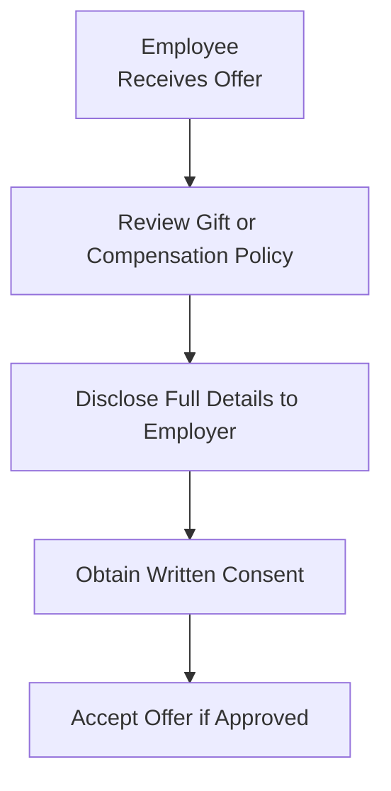

## Introduction

Imagine you're fresh out of school, excited about your first day at a reputable investment advisory firm, and your mind is buzzing with possibilities—maybe you'll establish a new valuation model or land a star client. But guess what? Even as you dream big, there are some pretty foundational ethical obligations you have to your employer. These obligations—often referred to collectively as “Duties to Employers”—are codified in Standard IV of the CFA Institute’s Code and Standards.

In the simplest terms, Standard IV emphasizes that CFA charterholders, candidates, and all investment professionals must remain loyal to their employers, be transparent about any existing or planned additional compensation arrangements, and uphold supervisory responsibilities to ensure everyone on the team plays by the rules. But let's go a step further and dig into why these obligations exist in the first place, how they impact your day-to-day decision-making, and how you can navigate tricky scenarios without losing your ethical footing.

## The Concept of Loyalty to Employers

Loyalty isn’t just an abstract value; it’s a practical requirement that says you must put your employer’s interests before your own—or anyone else’s—unless those interests conflict with the broader scope of professional ethics or the law. Standard IV demands that you act in good faith and avoid any behavior that harms your firm or compromises its trust in you.

Let me share a quick personal anecdote: I once had a friend who was a junior analyst at a boutique asset management firm. He was tempted to take on an exciting side gig analyzing venture capital deals for a small start-up. The pay was tempting, and, I mean, who wouldn’t want an extra paycheck? But it turned out that this start-up was competing (albeit indirectly) with his employer’s own private equity arm. If he had jumped in without telling anyone, he would have breached his duty of loyalty because his second job could undermine his primary employer’s interests.

### Key Points on Loyalty

• Acting in good faith.  
• Not misappropriating trade secrets or proprietary research.  
• Not engaging in activities that pose obvious conflicts of interest without proper disclosure and consent.  
• Refraining from exploiting corporate opportunities for personal gain.

The spirit here is simple: if your work for a side business, competitor, or client is going to impair your responsibilities to your primary employer, you need explicit written permission. It might feel like an extra step, but it is crucial to ensure you’re operating on the right side of your employer’s interests.

## Additional Compensation Arrangements

Beyond “loyalty,” Standard IV warns us about receiving additional compensation—whether it’s a monetary bonus, a gift from a grateful client, a performance incentive from a third party, or even acceptance of a seat on a philanthropic board that might conflict with your employer’s time or data constraints. In short, anything that could color your decision-making or hamper objectivity needs to be fully disclosed and ideally greenlit in writing by your employer.

It’s not that you can’t get a holiday gift basket from a client or a modest bonus for exceeding your fundraising targets—sure you can. But if a gift or arrangement is significantly large, is structured in an unusual way, or might create perceived or actual conflicts of interest, you must provide full disclosure and obtain prior written approval. And yes, “written approval” means official documentation—an email might suffice in some organizations, or you might need a formal contract addendum. The main point is: be transparent.

### Understanding Potential Conflicts

Conflicts of interest related to side compensation can manifest in surprising ways. Let’s say you’re managing a pension fund and one of the service providers offers you an all-expenses-paid trip to a major sporting event. Is it a token of appreciation, or is it an attempt to influence your future decisions regarding that vendor? If you accept it without telling your employer, you could be venturing into ethically murky territory. If you disclose it and your employer blesses it, you're typically on safer ground.

Below is a simple flowchart that illustrates how employees might handle an offer of additional compensation:

The key is clarity: no hidden bonuses or hush-hush arrangements that can compromise your professional judgment or raise questions about your independence.

## Responsibilities of Supervisors

If you supervise others—whether you’re a portfolio manager leading a team of analysts or a department head overseeing compliance—you have an ethical obligation to ensure that everyone on your team follows the rules. It’s not enough to set broad guidelines and hope people figure it out. You need to establish systems, processes, and controls to safeguard compliance.

### Core Aspects of Supervisory Responsibility

• Designing and implementing compliance systems that detect and prevent violations.  
• Training subordinates on the relevant statute, regulation, and internal procedures.  
• Monitoring employee behavior and conducting periodic reviews.  
• Documenting processes and following through consistently.  

We sometimes assume that the compliance department will handle everything. Not so fast! Supervisors can be held accountable if they fail to exercise adequate oversight. Think of it this way: if you’re a senior manager, you’re on the hook for building a culture where subordinates feel comfortable reporting potential issues. That means having open communication channels, a whistleblowing mechanism (if needed), and a formal procedure to investigate suspicious activities.  

## Common Pitfalls and How to Avoid Them

Even the most conscientious professionals can fall into ethical traps. Maybe you’re busier than usual, so you forget to disclose that “small” side arrangement. Or perhaps you assume your employer will be “okay” with a certain arrangement because it’s a standard practice in your region. Let’s walk through a couple of typical pitfalls:

• Underestimating the significance of a conflict: “It’s just a small client dinner; no one cares.” Over time, small overlooked items can snowball into major violations.  
• Assuming pre-approval: “My boss knows I’m consulting on the side.” Without explicit sign-off, you’re missing a crucial step.  
• Failing to document: “It’s a handshake deal.” The CFA Institute Standards specifically emphasize documentation and written records.  
• Inadequate training for subordinates: “My new hires should be able to figure out compliance themselves.” That approach is a recipe for lapses that you will be responsible for.

By taking a proactive stance—one that includes training, oversight, disclosure, and documentation—you and your employer can create a more robust ethical environment that benefits everyone, from the entry-level analyst to the firm’s executive leadership.

## Practical Examples and Real-World Scenarios

Sometimes, these rules can feel abstract, so let’s ground them in everyday business situations.

• Side Gig in a Related Industry: Suppose you’re an equity analyst at a large brokerage firm, and you publish a popular investing blog in your downtime. If your blog starts accepting paid advertising from startup companies that your firm might cover, you could face a direct conflict. At a minimum, you should inform your employer and get explicit permission.  

• Accepting Client Gifts: You’re the relationship manager for a high-net-worth individual who sends you front-row tickets to a major sporting event every year. These tickets could be seen as an attempt to influence the products you recommend. Better to check with your employer’s policies, get written approval, or politely decline if it’s beyond a nominal value.  

• Opaque Bonuses from Another Department: A specialized private equity squad within your firm offers you a performance-based bonus for providing them with proprietary research ahead of your standard distribution to the rest of the firm. This obviously jeopardizes fair distribution of research. Disclosing the arrangement is essential, and in many cases, the employer would disallow it.

These examples highlight that even if your intentions are good, not following Standard IV’s guidelines thoroughly can create or appear to create a conflict of interest. At the end of the day, perceptions matter in the investment world.

## Aligning Personal Ethics With Employer Interests

So, what if your employer’s direction seems to clash with other ethical or statutory requirements? Well, ironically, Standard IV does not mandate blind loyalty. If your employer is asking you to do something illegal or unethical, Standard I (Professionalism) and Standard II (Integrity of Capital Markets) take precedence. You must always respect the law, the Code of Ethics, and the Standards of Professional Conduct—even if it means conflict with your employer. In extreme situations, it could mean you have to leave your position to avoid complicity in unethical behavior.  

## Strategies for Effective Implementation

It’s helpful to design a structured approach for communicating, documenting, and monitoring potential conflicts:

• Maintain an Internal Disclosure Form: Some firms have a standardized form that employees can fill out whenever they receive a gift over a specified monetary threshold or propose an external consulting project.  
• Establish Clear Guidelines for Acceptable Arrangements: For instance, your firm might have a policy that strictly forbids personal roles in direct competitor businesses or sets thresholds for gift acceptance.  
• Conduct Periodic Training: Supervisors should hold regular training sessions on the Code and Standards. This ensures each team member remains current on rules and best practices.  
• Encourage a Speak-Up Culture: Let employees know it’s okay to ask questions and raise concerns without fear of reprisal.

Here’s a simplified diagram showing an internal compliance workflow that helps satisfy supervisory responsibilities:

## Exam Tips and Key Takeaways

If you’re facing a constructed-response (essay) question on Standard IV in the CFA Level III exam, be prepared to:

• Identify potential conflicts of interest and articulate how they violate loyalty or additional compensation rules.  
• Propose ways to disclose and obtain written consent to rectify potential issues.  
• Demonstrate awareness of the supervisor’s duty in preventing misconduct by subordinates.  
• Discuss boundaries: describing when it might be necessary to refuse gifts, outside duties, or even resign if unethical demands are made.  

In an item-set or multiple-choice scenario, you might see a question where an employee is offered a compensation arrangement by a third party. You’ll need to decide if the arrangement is permissible, permissible only with disclosure, or outright prohibited. The key is always to look for complete disclosure and explicit employer consent.

## References for Further Study

• CFA Institute Standards of Practice Handbook, 12th Edition: See the section on “Responsibilities of Supervisors” and read up on examples of additional compensation arrangements.  
• Corporate governance guides by recognized authorities like the OECD: Provide broad frameworks for best practices in internal controls.  
• Andrew Crane and Dirk Matten. Business Ethics: Managing Corporate Citizenship and Sustainability in the Age of Globalization (3rd ed.): Explores how businesses can embed ethical practices across the organization.

## Duties to Employers: Practice Questions for the CFA Level III Exam



### Which of the following is an example of breaching the loyalty owed to an employer?

- [ ] Accepting a small gift from a grateful client and promptly disclosing it per firm policy.  
- [ ] Refusing to carry out a manager’s request because it violates local regulations.  
- [x] Using employer resources to develop a personal business plan during working hours without disclosure or approval.  
- [ ] Filing a formal complaint about unethical activities at the firm.  

> **Explanation:** Using employer resources for personal gain without explicit permission violates the duty of loyalty and misappropriates employer assets.

### An investment professional is offered a substantial fee by a client for providing extra investment research outside normal responsibilities. Under Standard IV, what should the professional do first?

- [x] Disclose the offer to the current employer and seek written consent before accepting.  
- [ ] Accept the offer and then inform the employer afterward.  
- [ ] Decline it outright because such arrangements are never permissible.  
- [ ] Accept if it’s a common industry practice with no direct conflict of interest.  

> **Explanation:** Additional compensation arrangements must be disclosed to, and approved by, the employer. Failing to do so can create conflicts of interest.

### Which of the following best illustrates a proper supervisory structure under Standard IV?

- [ ] A single compliance officer who solely handles all aspects of oversight with minimal interaction with supervisors.  
- [x] A system of checks and balances where supervisors, compliance, and management coordinate to train, monitor, and discipline employees.  
- [ ] An informal arrangement where employees manage their own compliance with no direct oversight.  
- [ ] A top-down approach where only the CEO sets strict policies without aligning with department heads.  

> **Explanation:** Supervisory duties require a collaborative system involving compliance personnel, supervisors, and management to ensure consistent and effective enforcement.

### In evaluating whether to accept a side consultancy project while employed full-time, an analyst should primarily:

- [ ] Accept the project if it is not with a direct competitor.  
- [x] Seek employer approval and disclose all potential conflicts of interest.  
- [ ] Keep it confidential if the project is strictly outside market hours.  
- [ ] Decline it to avoid any possibility of conflict.  

> **Explanation:** Analysts must disclose and seek approval for outside engagements, ensuring they do not harm the employer’s interests.

### Which factor most likely triggers the need for written approval from an employer regarding a gift from a client?

- [x] The gift’s value exceeds a threshold established by firm policy.  
- [ ] The client and the employee have a long-standing personal relationship.  
- [x] The gift creates a perceived conflict of interest concerning the employee’s objectivity.  
- [ ] The gift is intangible with no market value.  

> **Explanation:** Standard IV specifically focuses on gifts or perks that are substantial or may affect an employee’s bias or loyalty. If the gift exceeds firm policies or might influence decision-making, it requires written approval.

### If a supervisor fails to enforce compliance policies and a subordinate commits an ethical breach, the supervisor:

- [x] May be held responsible for inadequate supervision.  
- [ ] Is automatically cleared if they can show they read the Code of Ethics.  
- [ ] Cannot be held accountable because each individual is solely responsible.  
- [ ] Would only be accountable if the breach broke criminal law.  

> **Explanation:** Supervisors can be held liable for the failings of subordinates if they did not take reasonable steps to establish adequate controls and oversight procedures.

### Which statement aligns with the principle of loyalty to an employer?

- [x] “I decline to pursue personal gain arising from my employer’s business opportunities without their consent.”  
- [ ] “As long as I don’t disclose trade secrets, other personal ventures are automatically fine.”  
- [x] “I inform my firm if a situation arises where I might profit from a firm-related deal independently.”  
- [ ] “If my employer’s policies differ from the local laws, I follow whichever is more convenient.”  

> **Explanation:** Loyalty means prioritizing your employer’s interests and disclosing any personal gain that uses employer resources or opportunities. You must also comply with legal and regulatory standards at all times.

### A portfolio manager instructs subordinates to alter performance metrics to secure higher fees from clients. One subordinate complies to avoid job loss. Under Standard IV, who is at fault?

- [x] Both the portfolio manager for issuing unethical instructions and the subordinate for failing to refuse.  
- [ ] Only the subordinate, because they carried out the unethical act.  
- [ ] Only the portfolio manager, because Standard IV does not apply to subordinates.  
- [ ] No one is at fault if the performance data is only slightly modified.  

> **Explanation:** Subordinates also have duties under the Code and Standards to refuse unethical directives. Supervisors are responsible for instructing subordinates ethically. Both parties are liable here.

### When is an investment professional legally permitted to leave their current employer to start a competing firm?

- [x] They may leave at any time, but must not take proprietary client data or violate confidentiality agreements.  
- [ ] They can take any information they helped develop for the firm.  
- [ ] They cannot resign to start a firm in the same industry.  
- [ ] They must give a full year’s notice before leaving to start a competing business.  

> **Explanation:** Standard IV permits career mobility, but departing professionals cannot take confidential materials or use trade secrets from the former employer. They must safeguard employer interests even when leaving.

### True or False: Supervisory responsibility under Standard IV applies only to top-level executives.

- [x] True  
- [ ] False  

> **Explanation:** Supervisory responsibilities attach to any position where someone oversees the professional conduct of at least one subordinate, regardless of title or hierarchy.  


