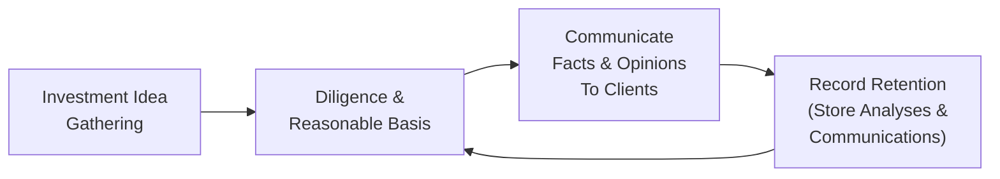

## Understanding Standard V

Standard V of the CFA Institute Code and Standards addresses the essential cornerstones for ethical and effective investment practices—namely, Diligence and a Reasonable Basis for all investment actions, proper Communication with Clients and Prospective Clients, and comprehensive Record Retention protocols. Let’s unravel these requirements and see how they play out in real-world scenarios, with a few personal reflections sprinkled in.

I remember a time early in my career when I was super excited about a “hot” IPO. Everyone was raving: “This new tech startup is unstoppable!” My more seasoned colleague gently asked: “Have you performed scenario analysis, looked at their revenue pipeline, or tested your assumptions about their future profitability?” Uh, well, I’d read a few articles and chatted with a buddy who was also bullish. That was it. If I’d adequately followed Standard V, I would have recognized the need for more rigorous research—ensuring I had a genuine, reasonable basis for recommending that stock. This moment underscores the importance of taking our time to dig deeper rather than simply riding market hype.

Below, we’ll walk through Standard V step by step.

## Diligence and Reasonable Basis

Diligence and Reasonable Basis can be broken down into three main responsibilities:

• Conduct Thorough Research and Analysis  
• Assess Reliability of Sources  
• Document Rationale and Methodologies

### Conduct Thorough Research and Analysis

At the heart of Standard V is the idea that you can’t just trust your gut or follow the crowd. You need to support recommendations with rigorous research. In some parts of the CFA curriculum, especially Level III, you’ll often see discussions around how to combine multiple data points (like macroeconomic indicators, bond yield forecasts, or corporate fundamentals) to obtain a holistic perspective.

For instance, you might:

• Perform fundamental analysis using discounted cash flow (DCF) models.  
• Check technical indicators for patterns or momentum signals.  
• Conduct scenario analyses, such as best‑case and worst‑case forecasts.  
• Evaluate how currency fluctuations or interest-rate changes could affect returns.

Combining these approaches ensures you are not relying on a single measure, which can be incomplete. Candidates examining multi-asset portfolios might do asset allocation optimizations that factor in correlation matrices, expected returns, and standard deviations, ensuring a robust approach to selecting investment positions.

### Assess Reliability of Sources

Look, not every source is created equal. Standard V reminds us that our data should be credible, timely, and from trustworthy providers. That might mean cross-checking company reports with third-party analytics, or using recognized data platforms like Bloomberg, FactSet, or government statistical bureaus. When in doubt, verify. And if you’re using “secondary research,” remember to confirm data accuracy and attribute it properly.  

Perhaps you’re analyzing a startup with limited public information. If the data is incomplete, you must highlight those gaps and, where possible, bolster conclusions with external benchmarks or peer comparisons. At times, you might have to attach disclaimers acknowledging the limitations of the data you’re using.  

### Document Rationale and Methodologies

You’ve probably heard of the classic advice: “If you didn’t write it down, it never happened.” When making an investment recommendation—especially in an organizational setting—clearly document:

• The reasoning behind the recommendation.  
• The data sources used.  
• Key assumptions (like future growth rates or discount rates).  
• Any stress tests or scenario analyses performed.

Adhering to Standard V(A) helps demonstrate that you thoroughly reviewed relevant factors underpinning the recommendation. It also gives you (and any relevant stakeholders) a reliable trail for subsequent evaluation of the investment thesis—especially important if the recommendation is challenged in the future.

## Communication With Clients and Prospective Clients

Communication is not simply tossing a flashy report at a client’s inbox. Instead, Standard V underscores four dimensions: clarity, differentiation between fact and opinion, disclosure of risks and limitations, and timeliness of delivery.

### Clarity in Reporting

Clients often rely on us to walk that fine line between detail and comprehension. Provide just enough explanation so they can grasp the rationale and mechanics behind your recommendation. And keep your language straightforward. It’s easy to let finance jargon slip in, so occasionally ask: “Would a bright, non-finance relative understand this write-up?” If the answer is no, it’s time to simplify.

### Distinguishing Fact From Opinion

Imagine you’re writing an investment note stating: “This firm’s EPS will definitely triple.” That’s a bold statement. Is it a fact or a forecast? If it’s a forecast, say so. We all know that forecasts carry inherent uncertainties. Express them with phrases like: “We estimate…,” “In our view…,” or “It’s possible that…based on current data.” Clients appreciate a direct distinction between objective analysis and subjective outlook.

### Disclosure of Risks and Limitations

No investor wants to read marketing fluff claiming “guaranteed returns.” In line with Standard V, highlight the main risks—market, sector, liquidity, interest rate, or even political/regulatory risk. If there are potential blind spots due to incomplete data, disclaim it. This transparency not only builds trust, it’s also crucial if you’re operating across borders, where additional complexities (see Chapter 1.10 for cross‑border regulatory and cultural considerations) can alter the risk landscape.

### Timeliness of Updates

Investment environments can change in a flash. Remember the 2008–2009 crisis? Market conditions evolved essentially overnight. If there’s material new information that impacts the viability of a recommendation, Standard V suggests informing clients promptly. That shows your dedication to placing client interests first, consistent with fiduciary responsibilities covered in Standard III—Duties to Clients.

## Record Retention

The third critical part of Standard V is maintaining records that back up your investment actions and decisions. This practice is not only essential for ethical and compliance reasons, but also practical if you need to revisit your assumptions or reference them for an audit.

### Legal and Regulatory Alignment

Different jurisdictions have unique requirements. For example, under MiFID II in Europe, firms must keep detailed records of every client interaction and recommendation rationale. In many countries, regulations specify minimum retention periods, anywhere from five years to as many as ten.

Creating a robust record-keeping system:
• Ensures compliance with local laws and regulations.  
• Demonstrates accountability in the event of a dispute.  
• Provides internal transparency—particularly helpful when new team members join a project midstream.

### Helpful Tools and Systems

In today’s environment, electronic records are crucial. Many firms use secure cloud-based platforms for storing reports, emails, outlines of analysis, and meeting minutes. The trick is to organize them in a manner that’s easily retrievable. Some people like folder structures by client. Others prefer tagging by investment thesis or strategy. Whichever method you choose, label it carefully and ensure backups exist.

### Collaboration & Cross-Referencing

In larger firms, your research might feed into multiple products or service lines. If you’re working with a multi-manager team (like what’s discussed in Chapter 4.9 about multi‑manager conflicts), you’ll likely want a cross-referencing system so each team member can see the underlying work for a shared recommendation. This fosters consistency in messaging and reduces the chance of contradictory investment guidance.

## The Diligence, Communication, & Record Retention Flow

Below is a simple diagram showing how the three components of Standard V interact in a typical workflow:

This cyclical flow underlines how record retention often feeds back into diligence. In other words, the documents you preserve from prior evaluations can help inform future investment analyses.

## Practical Examples and Case Studies

### Example 1: Equity Research for a Tech Startup  
You discover a tech startup with next-generation robotics. You gather data from the prospectus, industry reports, and your own company’s supply chain relationships. While you have a favorable opinion, you note that limited historical financial data introduces uncertainty. You clearly label your growth estimates as “speculative,” acknowledging that early-stage market acceptance can be volatile. You keep contact logs with the company’s management and store your notes in a shared folder. Months later, if the investment stumbles due to a new competitor, you can revisit your projections and refine your approach for future analyses.

### Example 2: Credit Analysis on a Sovereign Bond  
Say you’re analyzing a developing country’s sovereign bond. You incorporate macroeconomic data—GDP growth rates, interest rate trends, political stability metrics. By verifying sources (IMF reports, the country’s official finance ministry website), you ensure you have accurate data. Your final recommendation warns clients about potential currency risk. You highlight the assumption that the country’s currency remains stable, which may or may not hold true if capital flight accelerates. You store all analyses (including spreadsheets, references to IMF data) in a structured folder. Should the bond’s credit rating be downgraded later, you can walk back through your analyses to see what assumptions changed.

## Common Pitfalls

• Overconfidence in a single data source.  
• Failing to label speculative forecasts as opinions.  
• Lack of clarity on disclaimers regarding data or model limitations.  
• Inconsistent record retention practices, leading to confusion or regulatory complications.  
• Non-disclosure of updated risks, such as changes in management or new competitor entries.

## Strategies to Overcome Challenges

• Use multiple data sources to confirm or refute your initial beliefs.  
• Stay updated on regulatory rules related to disclosures.  
• Conduct stress testing for both best and worst-case scenarios.  
• Adopt a standard documentation template that reminds you to itemize assumptions, disclaimers, and references.  
• Maintain a review schedule for older recommendations. If something material changes, promptly update communications and files.

## Integrating With the Broader Code and Standards

Standard V, while central to providing robust recommendations, doesn’t stand alone. Here are some ways it connects to other parts of the CFA Institute Code and Standards:

• Standard I: Professionalism – Encourages you to rely on thorough research (Professionalism) and maintain the highest integrity when analyzing data or referencing external sources.  
• Standard II: Integrity of Capital Markets – By presenting clear, factual insights, you help maintain market integrity and avoid disseminating misleading information.  
• Standard III: Duties to Clients – Ties closely with Standard V’s communication protocols. Being transparent about risks and limitations is an essential aspect of client-centric duty.  
• Standard IV: Duties to Employers – Proper record retention and diligence doesn’t just help clients; it also safeguards your employer’s interests.  
• Standard VI: Conflicts of Interest – If you suspect a conflict (for example, your firm might hold a large block of the same stock you’re recommending), full disclosure to clients is vital.  
• Standard VII: Responsibilities as a CFA Institute Member – Complying with Standard V is part of upholding the holistic integrity that the CFA designation demands.

## A Quick Glimpse of DCF Modeling (If You’re Curious)

Just to give you a sense of how an analyst might incorporate diligence, here’s a simple reminder of a DCF formula. Let’s say the fair value of a company is computed via:


\text{Fair Value} = \sum_{t=1}^{n} \frac{FCFE_t}{(1 + r)^t} + \frac{TV_n}{(1 + r)^n}


Where:  
• FCFE_t is the forecasted Free Cash Flow to Equity in year t.  
• r is the discount rate (often taken as required rate of return based on the company’s risk profile).  
• TV_n is the terminal value at the end of year n.

In line with Standard V, you’d explain to your client that you used a 10% discount rate derived from CAPM, highlight the assumptions for future cash flows, and mention if any part of that data is more uncertain (for example, “We’re assuming future product expansion in Asia, but that depends on regulatory approvals that are still pending.”). This approach clarifies the difference between objective data (the discount rate or current revenues) and subjective hopes for expansion.

## Final Exam Tips for Standard V

• Know how to differentiate a “fact” from an “opinion.” In exam scenarios, look for phrases that indicate speculation vs. data-driven statements.  
• Understand how and when to disclose key risks. They’re often hidden in the prompt, so be thorough in your analysis.  
• Don’t forget the record-keeping requirement—CFA Level III exam items can test your ability to recognize insufficient documentation.  
• Provide a balanced narrative in constructed-response questions. Show your process for establishing a reasonable basis and highlight relevant disclaimers or caveats.

## References for Further Exploration

• CFA Institute Standards of Practice Handbook, 12th Edition: Detailed guidance on ethically making and documenting investment recommendations.  
• Graham, B. & Dodd, D. (1934). Security Analysis. Classic perspectives on fundamental research, though keep modern industry practices in mind.  
• MiFID II (EU Directive 2014/65/EU): Specific record-keeping requirements and client communication standards.  

## Test Your Knowledge: Standard V and Crafting Sound Investment Recommendations



### According to Standard V, why is it important to use multiple data sources?

- [ ] It guarantees that the recommendation will outperform.  
- [x] It reduces reliance on a single source and ensures a more robust analysis.  
- [ ] It is required to inflate the recommended security’s valuation.  
- [ ] It allows analysts to sidestep disclaimers and assumptions.  

> **Explanation:** Multiple data sources help prevent bias and provide a more well-rounded basis for any recommendation, aligning with the diligence and reasonable basis requirement.

### Which best describes “reasonable basis” under Standard V?

- [x] Having sufficient grounds backed by credible data analysis for a recommendation.  
- [ ] Only relying on company press releases.  
- [ ] Summarizing peer firm reports without critique.  
- [ ] Deferring research until after making the recommendation.  

> **Explanation:** “Reasonable basis” involves justifying recommendations with credible, thorough research and analysis that can stand up to professional scrutiny.

### A hedge fund manager shares an analysis that states, “We guarantee a 15% return next year.” Which aspect of Standard V might this violate?

- [ ] Record retention.  
- [x] Communication with clients, specifically distinguishing fact from opinion.  
- [ ] Trading on insider information.  
- [ ] Gifts and entertainment policy.  

> **Explanation:** Stating “guaranteed returns” is misleading and fails to differentiate between factual data and speculative opinion or forecasts.

### Scenario: A manufacturing firm you cover issues a notice that a major regulatory approval was denied. You rediscover you recommended a “strong buy” rating based on that approval. Under Standard V, what is your duty?

- [ ] Ignore it since the recommendation was already published.  
- [ ] Wait for the next quarterly report to update your recommendation.  
- [x] Immediately update your clients, explaining how the changed circumstance impacts the initial recommendation.  
- [ ] Only notify new clients who ask about it.  

> **Explanation:** New information that materially alters an investment recommendation must be quickly and transparently communicated to clients.

### When labeling forecasts or expected returns, what is the best practice under Standard V?

- [ ] Present them as absolute certainties to induce confidence.  
- [x] Clearly note that they are projections or opinions derived from a specific set of assumptions.  
- [ ] Exclude them entirely.  
- [ ] Bury them in footnotes.  

> **Explanation:** Standard V encourages clear disclosure that these are opinions or forecasts, not guaranteed outcomes. Transparency is key.

### If an analyst relies on one-year-old data from an online blog with no verifiable source for an investment thesis, this likely violates:

- [x] Diligence and reasonable basis.  
- [ ] The duty to boycott unverified information.  
- [ ] Performance presentation.  
- [ ] None of the above.  

> **Explanation:** Data from an unverified or outdated source undermines the thoroughness and reliability of the research, conflicting with Standard V’s strict diligence requirements.

### What is the main benefit of robust record retention?

- [ ] It allows analysts the freedom to change historical recommendations.  
- [ ] It helps conceal weaknesses in the analysis.  
- [x] It provides an audit trail for decisions, ensuring clarity and accountability.  
- [ ] It isn’t directly necessary if you present a thorough final report.  

> **Explanation:** Record retention ensures transparency and accountability, allowing for later verification of decisions and compliance with regulatory or firm policies.

### An analyst notices a major discrepancy in reported earnings vs. actual cash flow but publishes a buy advice without highlighting it. Which Standard V element is most likely violated?

- [ ] Send periodic updates.  
- [x] Provide sufficient diligence and factual basis for recommendations.  
- [ ] Retain client records.  
- [ ] Maintain personal trading logs.  

> **Explanation:** Failing to address a glaring discrepancy indicates insufficient diligence and an unsound factual foundation for the recommendation.

### Under Standard V, how should analysts approach disclaimers related to data or model limitations?

- [x] Prominently include them in the research report or communication.  
- [ ] Avoid disclaimers entirely to maintain client confidence.  
- [ ] Share disclaimers only if performance turns negative.  
- [ ] Provide disclaimers in a separate email days later.  

> **Explanation:** Disclaimers about data or model limitations must be clearly communicated so clients can understand the assumptions and risks embedded in the recommendation.

### True or False: Under Standard V, an analyst is permitted to give recommendations with no supporting research as long as the analyst has significant personal experience in the industry.

- [ ] True  
- [x] False  

> **Explanation:** Irrespective of personal experience, Standard V mandates a reasonable basis formed by thorough research. Personal intuition alone is insufficient.


