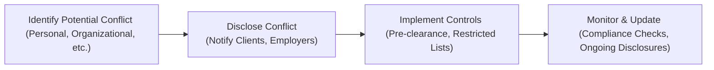

## Understanding Standard VI

Have you ever walked into a situation where you’re torn between what’s best for you personally and what’s best for someone else? We’ve all been there. In the investment industry, this tension can take the form of Conflicts of Interest—moments when an analyst’s or portfolio manager’s personal or professional motivations might undermine their objectivity or loyalty to clients or employers. Standard VI of the CFA Institute Code of Ethics and Standards of Professional Conduct is all about making sure you do the right thing when that tension arises. In other words, we’re talking about the big “C” word: Conflicts—identifying them, disclosing them, and managing them properly.

When I first started out as a junior analyst, um, I vividly remember a time I got super excited about a particular stock. I had done all the research, the fundamentals looked amazing, and my boss told me the firm was about to initiate coverage. The problem? I held a few shares in that same company personally. My mentor politely said, “Disclosure, disclosure, disclosure.” Indeed, that (slightly awkward) conversation was my introduction to Standard VI.

Below, we’ll dig into the nuts and bolts of Standard VI, talk about how and why we must apply these guidelines, and run through practical examples, real-world considerations, and exam-oriented tips. By the end, you’ll be able to spot conflict-ridden scenarios a mile away and know exactly how to handle them.

## Potential Conflicts of Interest

Conflicts of interest can pop up in many different areas—some obvious, some much less so. Here are a few main categories to keep in mind:

• Personal Investments and Holdings.  
  – For example, if you personally invest in a security that your firm recommends to clients, you have to consider the potential conflict. Are you front-running a client’s order for your personal gain?  
  – Another example: You own a large stake in a publicly traded company. Meanwhile, your investment firm has that same stock on its recommended list, and you’ve just been assigned to write the upgrade note.

• Organizational Conflicts Across Departments.  
  – This might occur if a broker-dealer division within the same firm is underwriting a new corporate bond, while the research department is analyzing the issuer.  
  – You might be required to maintain tight information barriers (sometimes known as “Chinese walls”) so that conflicting interests don’t spill over.

• Structured Financial Products.  
  – Complex financial products—think mortgage-backed securities, collateralized debt obligations, or specialized hedge fund strategies—can carry less obvious conflicts. Maybe your firm’s structured products desk packages assets that your portfolio management team invests in. Ensuring transparent communication and objective analysis becomes paramount.

• Referral Arrangements.  
  – Suppose your firm pays or receives fees for referring clients to or from an external partner. You must disclose these referral fees to clients promptly so they understand any incentive behind the recommendation.

• Board Memberships and Outside Business Interests.  
  – If you serve on the board of a nonprofit or a public company, that insider access creates a potential conflict with your role as a research analyst or a portfolio manager.

So basically, if you suspect something might look like or feel like a conflict, Standard VI wants you to speak up and address it. At its core, it’s about transparency and protecting the interests of clients and employers.

## The Importance of Clear Disclosure

The cornerstone of Standard VI is disclosure. In the investment profession, trust is everything. When conflicts of interest are hidden—or even appear to be hidden—clients or regulators may question the integrity of your work. That’s why Standard VI requires:

• Timely disclosure that is clear, concise, and not buried in footnotes.  
• Explanations of how the conflict could affect client interests.  
• Ongoing updates, because your or your firm’s conflict status might change over time.

Why is this transparency so crucial? Well, conflicts cannot always be completely eliminated—reality is complicated. But you can mitigate their impact by shining a spotlight on them. When clients know about potential biases, they can make more informed decisions. They can then evaluate the quality of your advice or question the timing of your trades without feeling duped.

## Priority of Transactions

Now, let’s talk priority of transactions. Standard VI strongly emphasizes that client orders (and employer transactions) come before personal trades. In simpler terms, you’re not allowed to front-run a client’s trade—buy or sell a security in your personal account right before your client does to take advantage of a price movement you effectively create.

Let’s say you know your client is about to make a big purchase of an illiquid micro-cap stock. If you buy early, you might push the price up (even slightly). Then, once your client’s bigger order hits, the stock’s price might spike further, letting you sell at a profit. That’s obviously not okay. It puts your personal interest in direct conflict with your fiduciary duty to the client.

### Example of Front-Running

Imagine you run a small equity fund specializing in green energy. You just got off the phone with a major client who wants to buy a large chunk of shares in a rising solar-tech company. Knowing that this massive block order will probably push the stock price higher in the short term, you quickly buy 300 shares in your personal brokerage account. The next day, your firm executes the client’s large buy order, the price goes up, and you realize a swift gain on your personal position. You guessed it: That’s front-running.

Under Standard VI, you must pre-clear your trades with compliance (so they can track the potential for front-running) and always place client orders first. If there’s a legitimate reason to trade personal shares, the compliance department will typically require that it happen well after the client order, often with additional restrictions like blackout periods.

## Referral Fees

“Hey, if you send more investors my way, I’ll give you a share in commissions.” Sound familiar? The concept of referral fees is widespread. It’s not inherently wrong to get paid a referral fee. But the CFA Institute wants you to let your clients and employers know about it.

For instance, suppose you’re a financial advisor who often partners with a local tax attorney. Every time a client of yours goes to that tax attorney, the attorney cuts you a small fee. Standard VI ensures that all parties (your clients and your firm) are crystal-clear about this arrangement. Clients need to understand any potential motive you have for suggesting that particular attorney. The basic question is: “Are you recommending them because they’re the best for me as a client, or because they pay you a fee?”

## Mechanisms to Manage Conflicts

When I first heard about all these ways in which conflicts can arise, I remember thinking, “Wow, how does one keep track of them all?” The good news is that many firms have robust compliance policies to help keep you on the right track. Typical mechanisms include:

• Pre-clearance of Personal Trades.  
• Restricted Lists.  
• Regularly Updated Holding Statements.  
• Requiring all employees to sign an annual disclosure statement listing outside business activities, directorships, major holdings, etc.  
• Mandatory Training Programs so employees are repeatedly reminded about conflict scenarios and how to handle them.

This is standard compliance tech, but it’s effective. Some large asset managers even enforce different physical office locations for research versus investment banking, ensuring minimal day-to-day interaction. The main principle is to keep each side objective, or at least well-informed about any potential biases that might sneak in.

## Illustration: Conflict-Management Flow

Below is a simple Mermaid.js flowchart showing a typical conflict-management process:

This flow highlights a key Standard VI message: Conflicts aren’t necessarily evil in themselves, but they must be managed transparently and diligently.

## Real-World Case Study

Let’s walk through a hypothetical scenario that might show up in your exam’s vignette:

• A buy-side analyst, Sarah, covers gaming stocks. Her brother just got hired as the CFO for a major casino chain.  
• Sarah’s firm is about to publish a high-profile upgrade on that casino’s stock.  
• Since Sarah is part of the research report writing team, she might have inside knowledge about the upcoming upgrade.  
• Erin, Sarah’s supervisor, notices that Sarah has a personal holding in that casino’s shares.

How should Sarah and Erin respond?

1) Sarah must disclose her personal connection (her brother is a top executive) and her personal stake.  
2) The firm’s compliance department might instruct her to either divest or restrict her trading in the stock.  
3) She might be removed from writing the final report to ensure objective analysis (depending on the firm’s policies).  
4) The compliance team will likely impose trading restrictions until after the report’s publication and after any material nonpublic information (MNPI) has been properly disseminated.

Sarah’s ties to the CFO and her personal holding create a conflict of interest. By disclosing it quickly and abiding by compliance rules, she stays on the right side of Standard VI.

## Breaking Down Key Components

### Disclosure of Conflicts
This is the lifeblood of Standard VI. Disclose early, disclose thoroughly, and keep disclosing as things change. If a relationship or a financial arrangement could color your objectivity, get it on the table so stakeholders can evaluate the potential impact.

### Priority of Transactions
Clients and employers come before you. If you have inside knowledge or you’re thinking of trading a security that your firm’s clients are heavily transacting—stop, talk to compliance, and follow the rules. Even if you accidentally trade right before your client’s big order, it can create major reputational damage and might get flagged by regulators for front-running.

### Referral Fees
Common in the financial services space. They are allowed, but you need to let everyone involved know about them—often in writing and in a clear, easy-to-understand format.

## Challenges in Implementation

Sure, it’s one thing to talk about conflicts in a textbook or a friendly conversation, but real-life challenges often arise:

• Cross-Border Regulations. Some firms operate globally. One jurisdiction might have a more lenient approach to personal trading; another might be stricter. Balancing global compliance rules can be tricky.  
• Technology & Data Issues. High-frequency trading systems or algorithmic trading might complicate how quickly you can place personal trades. Automated pre-clearance software is often employed to handle minimal but repeated trades.  
• Evolving Product Lines. New ETFs, alternative investments, or complex derivatives can spawn new conflicts. Possibly the marketing department touts the fund as “the hottest new product in the market,” while the research side sees major issues. Ensuring internal alignment can get complicated.

Whenever in doubt, the best practice (and your exam-friendly approach) is to prioritize transparency and consult your compliance department or the relevant regulatory guidelines.

## Best Practices for Managing Conflicts

• Have Written Policies and Procedures. Clear guidelines allow employees to quickly recognize and handle conflict situations.  
• Provide Ongoing Training. Annual or semiannual training sessions about conflicts of interest and the firm’s internal compliance protocols keep the topic front and center for all employees.  
• Enforce Accountability. If someone violates the policies, consistent disciplinary action reinforces the seriousness of compliance.  
• Encourage a Speak-Up Culture. No one should feel intimidated about reporting a potential conflict. Fear of retribution leads to hidden conflicts and huge risks.  
• Document Everything. Keep a paper trail or digital trail of disclosures, approvals, and any decisions made around conflicts.

## Exam-Taking Tips

For your CFA Level III exam, especially in a scenario-based question:

• Carefully identify any hint of personal interest or external affiliation mentioned in the vignette. If an analyst is on the board of Company X, that’s a direct red flag.  
• Check whether the storyline references a big client transaction that occurred right before or after a personal transaction. That could signal front-running.  
• Watch for statements regarding referral relationships or hidden fee arrangements.  
• If the question is about appropriate conduct, the correct answer typically involves immediate and full disclosure or seeking compliance guidance first.  
• Summarize the core conflict, pinpoint Standard VI’s relevant subsections (Disclosure and Priority of Transactions, or Referral Fees), and highlight exactly what must be done or shouldn’t be done.

Remember, exam questions might be layered. A single scenario could pack multiple ethical infractions. By focusing on the big picture—handling real or perceived conflicts in a transparent, client-first manner—you’ll be in good shape to tackle Standard VI exam items.

## References for Further Exploration

• CFA Institute Standards of Practice Handbook (12th Edition)—Comprehensive guidance on conflict disclosures and best practices.  
• FINRA Guidelines for Identifying and Mitigating Conflicts of Interest—Helpful for U.S. investment professionals.  
• Hillier, D., et al. “Financial Markets and Corporate Strategy”—Explores how conflicts arise in various finance sectors.  
• CFA Institute Continuing Education (CE) courses on Ethics—Updated modules on ethics, conflict resolution, and new tech-driven scenarios.

## Test Your Knowledge: Conflicts of Interest in Practice



### A portfolio manager holds a personal position in Company Z, which is about to release significantly positive earnings. The manager’s firm also has a large order to buy shares for a major client. According to Standard VI, what is the best course of action?

- [ ] The manager should execute the personal trade first, provided it is a small amount.
- [ ] The manager should only disclose the ownership to the client if the position exceeds 5% of total shares outstanding.
- [x] The manager must ensure the client order is executed first and disclose her personal holding to the firm’s compliance department.
- [ ] The manager has no obligation to disclose anything, as earnings releases are public events.

> **Explanation:** Standard VI emphasizes the priority of client trades and the responsibility to disclose conflicts of interest. Even if the position is small, executing a personal trade first could be seen as front-running.

### What is the primary objective of requiring disclosure of referral fees under Standard VI?

- [x] Ensuring clients fully understand any potential biases in recommendations.
- [ ] Helping firms attract a wider client base.
- [ ] Avoiding competition among financial advisors.
- [ ] Improving referral partner relationships.

> **Explanation:** When you disclose referral fees, you’re letting clients evaluate the possibility that your recommendations could be influenced by financial incentives.

### Which of the following statements about front-running is most accurate?

- [x] It involves placing a personal trade ahead of a large client trade to profit from the anticipated price movement.
- [ ] It refers to a situation where an investment bank updates research before the earnings announcement of a covered company.
- [ ] It describes a client’s privilege to place orders before an institution does.
- [ ] It is only relevant for high-net-worth clients.

> **Explanation:** Front-running is specifically the act of trading based on knowledge of an upcoming client order that’s likely to affect the security’s price.

### A junior analyst receives a generous holiday gift from a company executive she covers. What should she do according to Standard VI?

- [ ] Politely keep the gift without further action.
- [x] Disclose the gift to the compliance department and follow firm policy on acceptable gifts.
- [ ] Decline all gifts regardless of value.
- [ ] Keep the gift but refrain from covering the company going forward.

> **Explanation:** Even gifts can create a conflict. The best practice is to disclose it and let compliance decide the appropriate course of action.

### What is a common compliance mechanism for managing personal trading conflicts?

- [x] A pre-clearance requirement for all employee trades.
- [ ] A policy forbidding employees from holding any stocks individually.
- [x] A restricted list of securities employees can’t trade during certain periods.
- [ ] Allowing personal trades only on weekends.

> **Explanation:** Firms often require employees to get approval before trading in securities their firm is analyzing or transacting, and sometimes keep a restricted list of securities off-limits to employees.

### An analyst is also a board member of a non-profit organization that invests heavily in environmentally conscious companies. How might this create a conflict under Standard VI?

- [x] The analyst’s objectivity could be compromised if she covers the same companies the non-profit invests in.
- [ ] The non-profit does not have a financial motive.
- [ ] Serving on a non-profit board is never a conflict.
- [ ] The conflict only arises if the analyst owns more than 10% of the shares of the companies in question.

> **Explanation:** Board membership creates a dual set of interests. The analyst may have inside information or a strategic bias toward the companies the non-profit invests in, requiring disclosure.

### A financial advisor recommends a specific asset manager to clients. The advisor receives a 0.25% fee on all investments made through that manager. Which action is consistent with Standard VI?

- [x] Disclosing the referral fee to the client before or at the time of the recommendation.
- [ ] Accepting the fee without mentioning it, as it is a nominal percentage.
- [x] Demonstrating that the recommendation is based on the client’s best interest despite the fee.
- [ ] Sharing the fee only with the immediate supervisor.

> **Explanation:** Referral fees must be disclosed to ensure clients know about any external economic motivations. Moreover, advisors should always act in the client’s best interest when making recommendations.

### In a firm that provides both underwriting and research services, which measure is most effective for managing conflicts?

- [x] Maintaining an information barrier between the underwriting and research divisions.
- [ ] Encouraging frequent social gatherings between investment bankers and equity research analysts.
- [ ] Allowing research analysts to freely share reports with the banking division.
- [ ] Paying analysts bonuses based on how much underwriting business they bring to the firm.

> **Explanation:** Standard VI would favor strong internal controls and Chinese walls to ensure that research remains independent and unbiased, free from undue pressure from the underwriting department.

### A senior portfolio manager invests personally in a venture capital deal, while the firm’s private equity group considers an investment in the same venture. How should the manager proceed under Standard VI?

- [x] Disclose the personal investment in the venture to the firm’s compliance department and remove herself from decisions regarding the same venture.
- [ ] Wait to see if the deal is profitable before disclosing it.
- [ ] Provide brief verbal notice to team members but no formal documentation.
- [ ] Keep the deal private as long as the manager doesn’t influence the private equity group’s decision.

> **Explanation:** Timely disclosure is essential. If the manager remains involved, it poses a clear conflict. By removing herself from the investment decision and disclosing her interest, she upholds ethical responsibilities.

### Under Standard VI, is it true that analysts must always divest personal holdings that pose a potential conflict?

- [x] True
- [ ] False

> **Explanation:** Often analysts either have to divest the holding or be restricted from participating in the analysis or recommendation of that security. Policies vary by firm, but complete divestment or recusal from coverage is a common practice to maintain objectivity.


