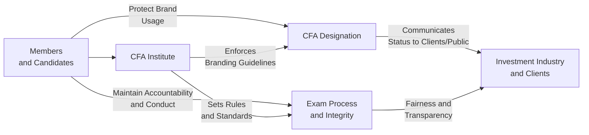

## Introduction
Standard VII – Responsibilities as a CFA Institute Member or CFA Candidate is all about maintaining the honor and integrity of the entire CFA (“Chartered Financial Analyst”) community. It gets a little personal for many of us because, well, it’s not just about passing the exams. It’s about living the values day to day, whether you’re studying for Level I or you’ve been a charterholder for twenty years. 

I remember a conversation at a study group meeting years ago. One candidate was joking about “having a friend who gets the exam questions early.” We all kind of froze. Even if it was an offhand remark, that’s precisely the stuff Standard VII wants us to avoid: any misconduct that threatens the fairness of the program or misrepresentation of your relationship to the CFA Institute. This standard expects you to be honest, uphold exam policies, use the designation properly, and generally protect the reputation of the CFA Institute and its members.

Below, we’ll unpack how Standard VII addresses two main areas: 
• Conduct as Participants in the CFA Program  
• Reference to CFA Institute, the CFA Designation, and the CFA Program  

We’ll talk about a few real-world examples. We’ll also connect these ideas to other ethical standards so that you can see how it all fits together.

## The Scope of Standard VII
When we say “responsibilities as a CFA Institute Member or CFA Candidate,” we’re talking about a unique brand of professionalism. This standard is a bit different from Standard I or II in that it’s specifically about your role in the CFA Program. The responsibilities revolve around:

• Demonstrating honesty and fairness during the exam process.  
• Presenting your status in the program factually—no overblown claims or half-earned titles.  
• Accurately referencing the CFA charter if you are a charterholder.  
• Maintaining and enhancing the dignity and credibility of the CFA Institute brand.  

These obligations don’t just help the Institute protect the exam’s integrity—they also create a level playing field for all candidates, ensuring that those three letters “CFA” continue to represent something exceptional.

## Conduct as Participants in the CFA Program
### Honesty in Exam Conduct
On the exam day, Standard VII calls for absolute honesty. That includes no cheating, no sneaking in unauthorized materials, no copying from your neighbor, and no forging performance references. It might sound obvious, but hundreds of people worldwide have faced disciplinary actions for behaviors like these, so the Institute keeps a close eye on it.

Even the appearance of misconduct is critical here. If you place your bag too close to your desk with a phone inside, or if your pencil has extra writing on it that looks suspicious, it can raise eyebrows. There’s an expectation: you must not do anything that could be interpreted as an attempt to cheat. 

#### Example of Exam Misconduct
Suppose you’re a Level III candidate, and you finish a section of the exam 30 minutes early. You decide to review your notes from memory or glance at a hidden slip of paper. This is a direct violation. Another scenario might be if your friend invites you to talk afterwards in the hallway about the specific item-set questions you each found most difficult. You’re not allowed to discuss exam content in a way that discloses confidential details—even after the exam is over.

### Respecting Testing Policies
Following directions from the proctors and adhering to the start and end times is part of fulfilling your duties under Standard VII. You must also respect the candidate pledge that prohibits sharing exam content. If the instructions say “pencils down,” you do it. If you ignore this, it’s easy for someone to interpret your extra scribbles as an unfair advantage. The point is: do not compromise the fairness of the exam environment.

## Reference to CFA Institute, the CFA Designation, and the CFA Program
### Correct Usage of the CFA Designation
Not long ago, I saw a LinkedIn profile that said, “John Doe, CFA (In Progress).” The user might have had good intentions—letting the world know they’re enrolled in the program can be tempting. However, referring to yourself as a “CFA in progress” is not permitted. You can state you are a “Level II CFA candidate” if you are actively registered, but that subtle distinction is crucial. You are not a “CFA (pending).” 

Once you earn the charter, the rule is to accurately identify yourself as “John Doe, CFA.” Or if you prefer, just “John Doe” with a mention “CFA charterholder” somewhere in the text. You cannot be “John Doe, Chartered Financial Analyst®” in the sense of writing it out as if it’s a degree from a university. The Institute has brand usage guidelines that specify precisely how to place the trademark symbol and how not to treat “CFA” as a noun. They stress using “CFA” as an adjective: “CFA® charterholder.” 

### Prohibited Usage Implying Superiority
While it might feel nice to boast about your qualifications, you can’t suggest that the CFA makes you better than your colleagues in ways that aren’t sanctioned by the Institute. Phrases like “I am the only truly objective manager because I have a CFA charter” can be misleading and arguably nonsense. That’s a big no-go. You can’t claim or hint that holding the CFA charter guarantees superior performance or ensures lower risk on investments—those are not guaranteed by the charter. The Institute specifically forbids such marketing pitches.

### Common Examples of Misrepresentation
• Labeling yourself as a “CFA expert,” which might incorrectly shape client perceptions.  
• Printing “CFA Level I” on your business card after you have passed the exam but aren’t currently registered for Level II. (If you’re not enrolled in the next exam, you lose the “candidate” status.)  
• Listing “CFA, CIPM, FRM” in a single run without clarifying that CIPM and FRM are separate designations administered by other organizations. 

## Maintaining Professional Integrity
### Protecting the CFA Institute Brand and Reputation
The CFA Institute invests heavily in promoting ethical and professional excellence in the investment industry. By upholding the brand’s reputation, you help guard the significance of the designation. Standard VII specifically calls for behavior that does not tarnish the CFA brand. There’s a sense of stewardship with the charter: it’s not just letters after your name. It’s an affirmation that you uphold the highest standards every day. 

Consider a scenario: Suppose you’re on an investment committee, and you do something notably unethical—like colluding with an external manager to get personal gains. Even though this might not violate a local law (hypothetically) or maybe Standard I–VI, it’s a moral question. People will inevitably link your action to the CFA Institute if you are widely known as a charterholder. This can degrade the brand's reputation. So, it’s critical to remain mindful of Standard VII in all your professional decisions.

### Encouraging Ethical Conduct Among Peers
Another vital dimension of Standard VII goes beyond your own conduct: the standard encourages you to help raise the bar of ethical practice among other CFA members and future candidates. This might mean:

• Sharing ethical perspectives at your local CFA society events.  
• Encouraging new candidates to follow the Code and Standards diligently.  
• Mentoring junior analysts or peers about the nuances of brand usage and exam conduct.  

In many ways, you become an ambassador of ethical investment practices. That’s the big picture: a self-sustaining cycle of professionalism throughout the CFA community.

## Practical Implementation in the Workplace
Let’s bring Standard VII into day-to-day life at your firm:

1. **Job Titles and Email Signatures**  
   If you’re a charterholder, you’re allowed to say “John Doe, CFA” in your email signature. If you’re only a candidate, you can mention “Level II Candidate in the CFA Program” or something that precisely reflects your current status.  

2. **Conference Presentations**  
   Maybe you’re invited to speak about portfolio construction. If you reference your CFA credential, ensure that your slides reflect the correct usage. “CFA® charterholder” is acceptable, but do not use “Chartered Financial Analyst” as a noun.  

3. **Marketing Materials**  
   If your firm is proud of its team’s credentials, check that you’re not making statements like “Our CFAs are guaranteed to generate alpha.” That’s a complete no-no because it implies performance superiority connected to the CFA brand.

4. **Online Profiles**  
   Platforms like LinkedIn or your company’s website bio can be tricky. Do a quick check with the Institute’s brand guidelines to confirm you’re listing your designation properly. If you pass Level III but haven’t yet received your charter, you must avoid phrases like “CFA Charter pending.”

## Violations under Standard VII
### Exam-Related Misconduct
Violations in the context of the exam are commonly reported and can lead to censure or suspension from the program (or, in extreme cases, a revocation of your right to continue). Some examples:  
• Copying from another candidate’s paper.  
• Taking notes or prohibited items into the testing hall.  
• Forwarding post-exam questions to a friend.  

### Misuse of Designation and Trademark
Using the CFA marks incorrectly or proclaiming yourself as a “CFA in progress” is a breach of Standard VII. The worst-case scenario is the disciplinary process that might suspend or even revoke your membership. The Institute actively polices public references to the designation, so it’s wise to be extremely careful.

### Potential Penalties
Penalties range from private censure (a mild but formal warning) to permanent revocation of the right to hold the charter. If you’re found guilty of major misconduct, your local society will likely know about it, and it can harm your professional standing for years.

## Summative Diagram
Below is a conceptual diagram outlining the critical relationships in Standard VII—between Members/Candidates, the CFA Institute, and the general public or clients:

In this diagram, you can see how members and candidates engage directly with the CFA Institute and the exam process, while also maintaining brand usage in the public sphere. The CFA Institute sets and enforces rules that shape member and candidate behavior. And the ultimate goal is serving the broader investment industry with integrity.

## Cross-Links to Other Standards
Though Standard VII is unique, it’s connected to all the prior standards (I–VI). For example:

- **Standard I – Professionalism:** Lays the foundation for ethical behavior, which includes abiding by official exam policies.  
- **Standard IV – Duties to Employers:** Encourages loyalty and honesty in the workplace, which indirectly ties into referencing or using the CFA charter appropriately, especially when dealing with marketing materials for your employer.  
- **Standard V – Investment Analysis:** Maintaining the integrity of research and analysis also ties back to honest representation of credentials.  
- **Standard VI – Conflicts of Interest:** Avoiding conflicts might require you to diligently disclose any compensation or benefits received for your endorsement of the CFA Program.

## Real-World Case Studies
### Case Study 1: The Overeager Candidate
Sasha is a Level I candidate and recently passed her exam. Ecstatic, she updates her email signature to “Sasha Smith, CFA Level I.” Although it might feel innocent, it’s a misrepresentation because simply passing Level I doesn’t grant you the right to put “CFA Level I” after your name. The correct way: “Sasha Smith, Level II Candidate in the CFA Program (if enrolled).”  

### Case Study 2: The Unapproved Social Media Boast
Eric is a brand-new charterholder. In a recent post, he states, “Hire me, because I’m a CFA—guaranteed to beat the market!” This claim is misleading because it implies that holding the CFA charter ensures superior investing results. The Institute would see this as a violation since it goes beyond what the charter promises.

### Case Study 3: Leaking Exam Details
Marisol, a Level III candidate, is pretty sure she nailed the options-strategies question on the exam. She logs into an online forum to share her strategies and confirm if she’s correct. By detailing the exam question, she’s unwittingly violating the confidentiality portion of the pledge. The Institute can track these posts and sanction her.

## Conclusions and Exam Tips
Standard VII is an important piece in the mosaic of CFA Institute standards. Honestly, it’s often overlooked until it’s too late—especially when a candidate inadvertently overshares exam content or incorrectly uses the letters “CFA.” Keep an eye on how you talk about your candidacy or your membership status.  
If you want a few parting reminders for exam day and beyond:

• Carefully read the Candidate Agreement. This is crucial so you know what exactly you can or cannot do during and after the exam.  
• If in doubt about how to present your credentials, refer to the official CFA Institute Brand Usage Guidelines.  
• Talk to your local CFA society or peers if something is unclear.  
• Stay humble in your communications—don’t promise unrealistic performance just because of the CFA designation.  

When we all respect these boundaries, we collectively preserve the prestige associated with “CFA” for ourselves, our peers, and future generations.

## References, Further Reading, and Resources
• CFA Institute Brand Usage Guidelines (members-only resource).  
• CFA Institute Bylaws and Rules of Procedure (updated regularly).  
• Professional Conduct Program pages on the CFA Institute website.  
• Approaching Level III exam? Revisit the Ethical and Professional Standards in the official curriculum for deeper analysis.  

--------------------------------------------------------------------------------

## Test Your Knowledge: Responsibilities as a CFA Institute Member or Candidate



### Under Standard VII, which of the following activities is most likely a violation?

- [ ] Mentioning on your social media profile that you are “enrolled to take the CFA Level II exam.”  
- [ ] Displaying your “charterholder” certificate in your office.  
- [x] Claiming superior investment returns based solely on earning the CFA charter.  
- [ ] Informing a client that you passed all CFA exams on your first attempt.  

> **Explanation:** Standard VII prohibits implying any performance advantage solely based on the CFA charter.  

### A candidate who has passed the Level II exam but does not intend to register for Level III should properly refer to themselves as:

- [ ] “CFA Level II”  
- [x] “Passed the Level II exam of the CFA Program”  
- [ ] “CFA in progress”  
- [ ] “Level III pending”  

> **Explanation:** The candidate is no longer an active candidate unless registered for Level III. Thus “passed Level II” is correct.  

### Which of the following best describes the brand usage guidelines for the CFA designation?

- [x] “CFA” is always used as an adjective and never as a noun.  
- [ ] “CFA” may be used interchangeably as a noun or adjective for clarity.  
- [ ] “CFA® charterholder” is not an acceptable phrase.  
- [ ] “Chartered Financial Analyst” must always be fully spelled out.  

> **Explanation:** The CFA Institute’s guidelines state that “CFA” should be used as an adjective, typically followed by “charterholder” or with the member’s name.  

### When referencing CFA Institute membership on a resume, which statement is most appropriate?

- [x] “Member of CFA Institute in good standing (2025–present).”  
- [ ] “Temporary member of CFA Institute due to exam status.”  
- [ ] “Granted partial charter by CFA Institute.”  
- [ ] “Anticipated membership once the passing results are out.”  

> **Explanation:** An individual may note membership in good standing, including relevant dates, but must not use inaccurate or partial references.  

### What is a potential penalty for violating Standard VII?

- [x] Suspension or revocation of the right to use the CFA designation.  
- [ ] Automatic pass on the next CFA exam as a penalty.  
- [x] Public censure by the CFA Institute.  
- [ ] Reimbursement of exam fees only.  

> **Explanation:** The CFA Institute’s disciplinary measures can include suspension, revocation, or censure.  

### Which of the following examples would be a violation under Standard VII?

- [ ] Stating on your business card that you “passed all three levels of the CFA Program.”  
- [ ] Showing your charter during a prospective client meeting.  
- [x] Sharing questions from the morning session with a colleague who will take the exam in a different time zone.  
- [ ] Displaying a digital badge provided by the CFA Institute upon earning the charter.  

> **Explanation:** Sharing any confidential exam content is a clear violation of Standard VII.  

### A newly awarded CFA charterholder claims that holding the charter “guarantees” a higher probability of beating the market. This claim:

- [ ] Is acceptable if based on factual data.  
- [ ] Is permitted as long as the candidate does not mention the Institute by name.  
- [x] Violates Standard VII because it implies benefits not guaranteed by the CFA designation.  
- [ ] Is allowed if the statement does not mention the CFA Institute specifically.  

> **Explanation:** You cannot claim the charter guarantees improved returns, as this misrepresents what the charter signifies.  

### During the exam, you notice another candidate looking at your answers. According to Standard VII, you should:

- [x] Report the incident to a proctor discreetly.  
- [ ] Ignore it and mind your own business.  
- [ ] Retaliate and copy that candidate’s paper.  
- [ ] Post an update to a CFA forum immediately.  

> **Explanation:** Reporting exam misconduct is important to maintain the integrity and fairness of the testing process.  

### Which statement is most aligned with Standard VII guidelines regarding referencing the CFA Program?

- [x] “I am a CFA candidate, currently enrolled to sit for the upcoming Level III exam.”  
- [ ] “After passing Level II, I am a partial CFA.”  
- [ ] “I am a designated CFA (in progress).”  
- [ ] “You should trust my investment picks because I’m basically a CFA.”  

> **Explanation:** The correct statement is factual about candidate status, and does not misrepresent partial credentials.  

### The CFA Institute encourages members and candidates to ensure peers adhere to the Code and Standards. True or False?

- [x] True  
- [ ] False  

> **Explanation:** Standard VII notes that members should promote adherence to ethical standards, effectively encouraging strong ethical culture among their peers.  


