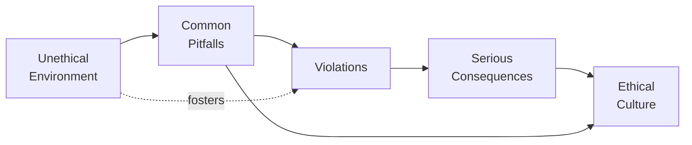

## A Holistic Perspective

So, let’s talk about some of the biggest stumbles and slip-ups that professionals make when trying to adhere to the CFA Institute Code of Ethics and Standards of Professional Conduct (discussed in detail throughout Chapter 2). We all know that Standards I–VII are fundamental to building trust in our industry. But, honestly, it can be pretty easy to make small, seemingly harmless mistakes that lead to big ethical problems down the line. Sometimes, these pitfalls are unintentional. Other times—let’s be real—people try to bend the rules for a quick advantage.

Regardless of how they arise, failing to spot and address them can seriously damage not only a career but also the broader financial system’s integrity. Anyway, let's look at some typical problem areas (like conflicts of interest or misrepresenting performance) and figure out how to avoid them.

## Why Pitfalls Occur

In many real-world cases, these pitfalls often take hold when:

• Short-term pressures override long-term ethics.  
• Firms provide limited or outdated training on compliance.  
• People ignore red flags either to maintain business relationships or meet unrealistic performance goals.  
• Supervisors fail to establish strong internal controls.  

I remember a colleague once saying, “We’ve always done it this way.” That attitude creeps in quietly and, before you know it—wham—someone’s just crossed the line. It’s way easier to prevent unethical behavior at the start than fix it after it’s caused reputational harm.

## Common Pitfalls and Their Consequences

Below is a quick table summarizing the typical pitfalls, what they involve, and some of the broader consequences.

| Pitfall                                     | Description                                                                                 | Potential Consequences                              |
|--------------------------------------------|---------------------------------------------------------------------------------------------|-----------------------------------------------------|
| Failing to Disclose Conflicts of Interest  | Not informing clients or employers about personal or financial interests in recommendations | Client mistrust, lawsuits, regulatory penalties     |
| Overstating Qualifications                 | Claiming credentials or experience you don’t have                                          | Reputation damage, disciplinary action             |
| Misrepresenting Performance Metrics        | Inflating or cherry-picking returns                                                         | Client losses, legal actions, possible revocation  |
| Relying on Incomplete or Outdated Research | Making recommendations based on stale data or ignoring critical updates                     | Poor performance, client dissatisfaction           |
| Breaching Information Barriers             | Using or leaking material nonpublic information                                            | Insider trading allegations, heavy fines, jail time|
| Inadequate Record‑Keeping                  | Failing to document rationales for decisions                                               | Compliance difficulties, suspicion of wrongdoing   |
| Poor Internal Controls                     | Lax oversight leading to front-running or improper trades                                   | Severe reputational harm, regulatory sanctions     |

### Failure to Thoroughly Assess or Disclose Conflicts of Interest

Conflicts of interest are basically anywhere you look in the investment management world—whether it’s a financial adviser getting a referral fee for promoting certain products or an analyst who holds shares of a company she covers.

But guess what? Many professionals overlook or understate these conflicts. Maybe it’s just a headache to fill out extra paperwork. Maybe they worry it’ll hurt client trust if they confess they have a stake in a recommended security. Here’s the thing: ignoring or hiding conflicts of interest usually causes more problems than it solves. The reason? Clients and employers rely on your judgment, and if they discover they’ve been misled, the trust they placed in you is gone quicker than you can say “fiduciary duty.” Refer back to Standard VI – Conflicts of Interest (Section 2.6) for more guidance on properly handling these situations.

### Overstating Qualifications or Misrepresenting Performance

Have you ever felt the urge to make your résumé, or your track record, sound just a little more impressive? In a hyper-competitive environment, it might be tempting. But the second you cross from emphasis into exaggeration, you risk disciplinary action. Maybe you claim to be a Chartered Financial Analyst (CFA) charterholder when you’re only a Level III candidate. Or perhaps your firm’s marketing materials highlight hypothetical returns that seem guaranteed. This kind of misrepresentation goes directly against Standard I – Professionalism (see Section 2.1) and definitely violates Standard V – Investment Analysis, Recommendations, and Actions (Section 2.5), which demands that you present investment performance fairly.

A typical example is misrepresenting the Sharpe ratio to make performance appear rosier. Remember, the Sharpe ratio is:

$$
\text{Sharpe Ratio} = \frac{R_p - R_f}{\sigma_p}
$$

Where:
• \\( R_p \\) = Portfolio return  
• \\( R_f \\) = Risk-free rate  
• \\( \sigma_p \\) = Standard deviation of the portfolio’s excess returns  

If you inflate \\( R_p \\) or selectively ignore certain data points to reduce \\( \sigma_p \\), you’re breaking the rules. And, oh yeah, you’re at risk of confirmation bias where you only see the data that supports your conclusion.

### Relying on Incomplete or Stale Research

Picture an analyst who’s too busy to check for updated earnings guidance or new competitor information. They might rely on research that’s a few months old. Happens all the time—it's subtle. But the problem is that financial markets shift fast, and your outdated recommendations could lead a client astray.

This issue often arises under Standard V, which requires diligence and a “reasonable basis” for recommendations. If your research is stale, you can’t claim a strong foundation for your advice. Clients might suffer losses, and the blame lands on you. In Chapter 2.5, we discuss how to ensure your research process remains robust, timely, and comprehensive—particularly when analyzing more complex investments like alternative assets or derivatives.

### Neglecting Strict Information Barriers

Oh, insider information. The holy grail for unscrupulous traders, right? Even if you’re not actively trying to trade on insider info, you could be in trouble just by being careless with material nonpublic information (MNPI)—like failing to lock your computer screen or mentioning a confidential tip in an open-plan office. That’s enough to trigger suspicions of insider trading or front-running. Yikes.

When you’re privy to market-moving data, you must erect a metaphorical wall (often called a “Chinese Wall”) between the sensitive info and your personal or professional trading decisions. Check out Standard II – Integrity of Capital Markets (Section 2.2) for more.

### Inadequate Record‑Keeping

Most oversights in record-keeping come from either a lack of awareness or, “Ah, I’ll fill out that form tomorrow” syndrome. But regulators and compliance officers don’t really care about your good intentions when the evidence is missing. Whether it’s your notes on why you made a particular recommendation or your email chain with a client about risk tolerance, you need to keep records. The disciplinary process discussed in Section 1.2 highlights real cases where missing documentation triggered bigger investigations.

### Poor Internal Controls

If your firm lacks robust internal controls, you’re asking for trouble. Picture a scenario: The portfolio manager also sits next to the compliance officer, but they rarely speak. The informal environment fosters an “anything goes” attitude. Next thing you know, employees might be front‑running client orders or engaging in other shady trading practices. Then regulators come knocking. In Chapter 3.1, we explore evaluating a firm’s practices and the importance of establishing systematic checks and balances.

## Practical Example: Conflicts in a Mergers & Acquisitions Team

You’re part of a small M&A advisory team inside a midsize firm. You get confidential news that two big healthcare companies plan to merge. This news isn’t public, so it’s essentially gold—some might see it as a chance to snap up shares in the target company before the announcement. Now, the ethical approach is to immediately notify compliance, lock down the relevant files, and ensure no one outside your team sees them until after the deal goes public. But a colleague (who’s not even on the M&A team) overhears you in the office hallway when you say, “That’s huge for HealthcareCo’s share price.” Next day, your colleague invests in HealthcareCo. Classic violation of Standard II. And if your firm doesn’t have good internal controls, guess who’s in big trouble?

## The Environment That Breeds (or Avoids) Violations

A crucial factor is the culture within an organization. If leadership prioritizes sales at all costs, employees might cut corners to meet targets. On the flip side, a strong ethical culture encourages people to call out suspicious actions. It’s really that simple. You can count on success in the long run if a firm invests in training, sets up policies for conflict-of-interest disclosures, and punishes unethical behavior swiftly when it occurs.

Check out Chapter 1.9, where we talk about ethical culture and how it relates to the entire organization’s conduct. Meanwhile, in Chapter 3.9, you’ll learn about mentorship programs and training approaches that reinforce these concepts daily.

Below is a simple diagram showing how an unethical environment can lead to pitfalls, violations, and eventually serious consequences—whereas firms that address problems early can steer themselves toward an ethical culture:

## Recommended Procedures to Mitigate Pitfalls

• Strengthen Internal Oversight: Implement specialized compliance teams that actively review trading records, client communications, and marketing materials.  
• Regular Training Sessions: Keep employees updated on relevant regulations and in-house best practices. Lax oversight often stems from outdated knowledge.  
• Effective Disclosure Protocols: Create a standardized process for employees to disclose any potential conflict, from personal stock holdings to side ventures.  
• Invest in Technology: Compliance surveillance systems can monitor real-time trades, compare them against “watch lists,” and flag suspicious activity.  
• Maintain a Culture of Compliance: Encourage employees to speak up if they suspect wrongdoing—whistleblower protections can help.  
• Document Everything: That means documenting assumptions, processes, and any disclaimers used.  

For tips, see Chapter 2.9 on recommended procedures for compliance, plus Chapter 2.11 for strategies to continually enhance professional standards.

## Another Real-World Illustration

Say your firm uses an external research provider that updates its reports monthly. A senior analyst notices the provider’s last update included partial year-end data, not the full year, possibly inflating growth figures. The senior analyst, strapped for time, uses that partial data anyway in a recommendation. Soon after, the real numbers are released—growth is half what was originally claimed. Clients are furious, and the blame rests on your group. With better record-keeping and a requirement to verify data completeness, you could have avoided this fiasco.

## The Psychological Side of Unethical Behavior

We’re all prone to rationalizing small acts of dishonesty if it seems harmless. In “The (Honest) Truth about Dishonesty,” Dan Ariely describes experiments showing how people cheat “just a little,” convincing themselves it’s no big deal. But these small acts add up over time, corroding the moral compass until major infractions seem less daunting. So, you can’t rely solely on your own sense of moral fortitude—you need structural safeguards (and maybe a nudge from compliance) to keep you on track.

## Broader Lessons and Exam Relevance

For DFA Level III candidates (and beyond), exam questions often place you in scenarios where you must identify potential pitfalls—like discovering a conflict of interest that the portfolio manager omitted, or noticing an inflated claim in a global performance measure. You might be asked: “Under the Code and Standards, what’s the appropriate next step?” Or “Which Standard has been violated, and what are the likely ramifications?” Remember, it’s not only about labeling the violation but also discussing how to address or prevent it.

Always consider that the same ethical standard can appear differently in multiple contexts—e.g., an equities team, a private wealth group, or a multi-asset investment strategy. Thorough knowledge of each standard’s scope is your best bet.

## Final Exam Tips for Tackling Pitfalls and Violations

• Read Each Scenario Carefully: On the exam, figuring out if an action violates a standard often requires subtle interpretation.  
• Spot the Red Flags: Look for potential conflict of interest, incomplete info, or undisclosed personal relationships.  
• Communicate the Correct Response: Usually, the next step involves disclosing, escalating to compliance, or refusing to act on questionable information.  
• Reference Specific Standards: Tie the scenario’s violation back to Standards I–VII.  
• Maintain a Logical Argument: When in doubt, do what fosters greater transparency and upholds client trust.  

## Further Reading and Resources

• Explore disciplinary case studies from the CFA Institute to see how common infractions play out.  
• “The (Honest) Truth about Dishonesty” by Dan Ariely for a deeper dive into the psychology behind unethical behavior.  
• Corporate compliance training modules from organizations like Deloitte, PwC, or KPMG for practical guidance on regulatory frameworks.  
• Chapter 1.3 (Code of Ethics) for an overview of fundamental ethical principles.  
• Chapter 2.2 (Standard II – Integrity of Capital Markets) for more insight into how to handle MNPI.  
• Chapter 3.8 on integrating ESG into ethical judgments.  

## Practice Questions: Identifying Common Ethical Pitfalls and Violations



### A financial adviser touts a new product to her clients without disclosing that she earns a bonus commission on each sale. This is most likely a violation of:

- [ ] Standard I – Professionalism  
- [x] Standard VI – Conflicts of Interest  
- [ ] Standard II – Integrity of Capital Markets  
- [ ] Standard V – Investment Analysis, Recommendations, and Actions  

> **Explanation:** Failing to disclose extra compensation compromises impartial advice. This scenario directly falls under conflicts of interest (Standard VI).

### An analyst claims that he has passed the CFA Level II exam when he has not. This is most likely a violation of:

- [x] Overstating qualifications under Standard I – Professionalism  
- [ ] Inadequate disclosure under Standard VI – Conflicts of Interest  
- [ ] MNPI handling under Standard II – Integrity of Capital Markets  
- [ ] None of the above  

> **Explanation:** Overstating credentials violates honesty and integrity requirements of Standard I.

### A research team uses half-year-old data and fails to verify any updates before issuing a bond recommendation. Which Standard is most likely being violated?

- [x] Standard V – Investment Analysis, Recommendations, and Actions  
- [ ] Standard I – Professionalism  
- [ ] Standard II – Integrity of Capital Markets  
- [ ] Standard VI – Conflicts of Interest  

> **Explanation:** They are not following the requirement for diligence and a reasonable basis in their analysis and recommendations.

### A portfolio manager regularly reviews her firm’s research but also trades on material, nonpublic information she obtains from a friend in a company’s corporate department. Which Standard is directly breached?

- [ ] Standard IV – Duties to Employers  
- [x] Standard II – Integrity of Capital Markets  
- [ ] Standard V – Investment Analysis, Recommendations, and Actions  
- [ ] Standard III – Duties to Clients  

> **Explanation:** Trading on MNPI violates Standard II.

### Which of the following is an example of poor internal controls?

- [x] No segregation of duties between marketing and compliance  
- [ ] Thorough training records for all staff  
- [x] Lax oversight of employees’ personal trading accounts  
- [ ] Active compliance checks and balances  

> **Explanation:** Without segregation of duties or oversight regarding personal trading, employees can misuse confidential information or present misleading marketing materials.

### An investment adviser is found entering sell orders in his personal account ahead of large trades he executes for clients, causing their trades to move the market. This is known as:

- [x] Front‑running  
- [ ] Insider trading  
- [ ] Disclosure misrepresentation  
- [ ] Whistleblowing  

> **Explanation:** Front-running occurs when an individual trades on material information about a future client trade to benefit personally.

### Which approach most effectively mitigates pitfalls related to outdated or incomplete research?

- [x] Implementing a policy requiring periodic updates and data verification  
- [ ] Encouraging the use of older data if it supports a bullish thesis  
- [x] Training analysts only once a year on new research methods  
- [ ] Eliminating all external data providers entirely  

> **Explanation:** A consistent policy for verifying data addresses the root cause of stale research. Ongoing training also helps, but merely a once-a-year refresh may not be enough.

### A firm’s compensation structure heavily rewards short-term performance with minimal checks. What is a likely outcome?

- [x] Increased temptation for employees to cut corners on ethics  
- [ ] Heightened sense of long-term responsibility  
- [ ] Lower risk of insider trading  
- [ ] Minimal conflicts of interest  

> **Explanation:** A disproportionately large short-term incentive can push employees to prioritize quick gains over ethical conduct.

### A candidate for the CFA charter purposefully omits relevant disclaimers highlighting that performance results are gross of fees and do not reflect actual client returns. Which standard is at risk?

- [x] Standard V – Investment Analysis, Recommendations, and Actions  
- [ ] Standard II – Integrity of Capital Markets  
- [ ] Standard VI – Conflicts of Interest  
- [ ] Standard IV – Duties to Employers  

> **Explanation:** Omitting disclaimers misrepresents investment performance, conflicting with Standard V’s requirements for fair and accurate presentation.

### A research director sets a casual tone in the office, encouraging analysts to share ideas freely without documenting all rationale. True or False: This is a best practice aligned with the CFA Code and Standards.

- [ ] True  
- [x] False  

> **Explanation:** Failing to document judgments and rationale can compromise diligence and transparency, violating CFA Institute’s record-keeping guidelines.




