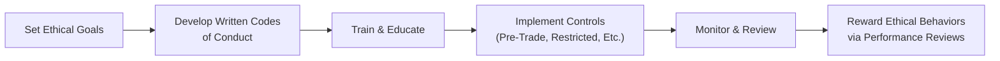

## Introduction and Purpose

So, let’s dive into the heart of what keeps ethical standards alive and well in the investment management industry—recommended procedures and best practices. After all, it’s not enough just to write down some guidelines or recite them at the quarterly meeting; we’ve got to implement these rules in such a way that everyone from the junior analyst to the CEO knows exactly what’s at stake.

By now, you’ve probably encountered a variety of ethical guidelines and procedures introduced back in sections 2.1 through 2.8, talking about Professionalism, Integrity of Capital Markets, Duties to Clients, and so on. Now the fun part is how to actually use them—installing them in day-to-day life. This section will focus on establishing written codes of conduct, ensuring we have robust compliance tools like pre-trade approvals, building strong business cultures, and forming leadership structures that actively encourage honest behavior.

## Importance of Structured Procedures

Formalizing ethical guidelines with deliberate procedures is the glue that holds your firm’s ethical approach together. Without structure, even the best of intentions can slip into that gray area we all want to avoid. Maybe you’ve seen it happen: your best friend at the firm wanted to do well, but they were never taught the right protocols. Before they knew it, they stepped into a questionable trade. It doesn’t mean they were inherently unethical; sometimes it’s just a failure of robust procedures.

### Key Points
• Written codes of conduct prevent guesswork and “situational ethics.”  
• Compliance training keeps employees updated on both old rules and new troubles.  
• Senior-level buy-in is the difference between lip service and real ethical accountability.

## Developing a Written Code of Conduct

Let’s start with the cornerstone: the written code of conduct. This is the “north star” of your firm’s ethical journey. In many real-world scenarios, employees want to do the right thing but simply don’t know what that “right thing” looks like in practice. A written code clarifies everything from the definition of acceptable personal trading to how to handle client data.

### Benefits of a Formal Code
• Provides clarity on acceptable and unacceptable behaviors.  
• Reduces confusion and inconsistent actions across departments or offices.  
• Reinforces the idea that ethics is a priority, not an afterthought.  

### Example
Imagine a firm includes in its code that staff must promptly disclose any personal relationship with potential clients to the compliance department. This explicit policy not only guides day-to-day interactions but also protects the firm from conflict-of-interest complications down the road.

## Compliance Training and Continuing Education

Even the most brilliantly crafted code of conduct won’t matter much if nobody reads it. You need a compliance training program that ensures every employee—especially new hires—fully absorbs what’s in that code. Moreover, continuing education helps staff remain agile in adapting to fresh challenges, such as new regulations, new derivative products, or even new technologies that might require additional oversight.

### Ongoing Training
• Annual refresher courses or seminars on updated regulations.  
• Specialized sessions: e.g., anti-money laundering workshops, data privacy, or cybersecurity.  
• Encouraging employees to earn or maintain professional designations (like the CFA charter).

### Practical Tip
Some firms integrate short interactive sessions monthly—like “Ethics Trivia Tuesday”—where employees can test their knowledge on hypothetical scenarios. This consistent engagement beats a yearly mass email that everyone forgets the next day.

## Pre-Trade Clearance and Restricted Lists

Pre-trade approvals and the maintenance of restricted lists are crucial for controlling unauthorized trades, preventing insider trading, and mitigating “front-running.” I remember back when I started in equity research, I saw how a restricted list functioned like a safety net: if something was on the list, you just didn’t trade it—no ifs, ands, or buts.

### Glossary Recap
- Restricted List: A set of securities that employees are barred from trading.  
- Pre‑Trade Approval: Requiring employees to get the compliance department’s green light prior to executing a personal trade.

### Why This Matters
• Minimizes the risk of insider trading.  
• Helps avoid potential front-running or conflicts of interest.  
• Protects the firm’s reputation and ensures clients’ interests come first.

## Deliberate Disclosure Protocols

Sometimes, especially in investment banks or asset managers, you’ll stumble upon conflicts of interest. It just happens: maybe the firm’s proprietary trading desk is heavily involved in a security that’s also in your client’s portfolio. Or a portfolio manager has a major family stake in a company they want to invest in for their clients. The best approach is to set systematic rules for when and how these potential conflicts must be disclosed.

### Key Elements
• Timeline: e.g., employees must disclose conflicts before a certain deadline or “immediately upon discovery.”  
• Format: standardized forms or an electronic system that logs conflict-of-interest disclosures.  
• Accessibility: compliance staff or managers should have quick access to all declarations.

### Real-World Example
A portfolio manager wants to invest client assets in a firm where her brother is on the board. The manager must alert compliance immediately, completing the required forms to determine if client portfolios should proceed with the investment or if alternative measures should be taken.

## Performance Review and Incentives Aligned with Ethics

Performance reviews and compensation systems are powerful tools for shaping behavior. If a firm says “ethics first” but then rewards only short-term revenue generation—well, you see how that might pan out. Aligning incentives with ethical behavior can truly elevate an organization’s culture. Conversely, ignoring ethical performance can undermine it.

### Approaches
• Incorporate ethical considerations into performance reviews (e.g., acknowledging individuals who reported or prevented unethical behavior).  
• Link manager bonuses not just to short-term portfolio returns but also to risk management and ethical compliance.  
• Publicly celebrate staff who exemplify the code in day-to-day activities.

### Case Note
A large asset manager revised its bonus structure to consider compliance track records. If no ethical lapses are found in an employee’s group, an additional portion of the bonus is awarded. This approach encourages employees to watch out for each other and fosters a mutual sense of responsibility.

## The Critical Role of Senior-Level Buy-In

We can talk about how to do everything perfectly down in the trenches, but if the executive leadership doesn’t really enforce the rules, staff will smell the hypocrisy quickly. True story: At a previous institution, leadership publicly touted the importance of abiding by pre-trade clearance, but senior managers themselves would frequently skip the process. Naturally, employees felt the rule didn’t matter. 

### Why Senior Leaders Must Remain Accountable
• They set the tone at the top.  
• They allocate budgets, ensuring compliance programs are well-resourced.  
• They signal to employees that ethical breaches will be taken seriously.

No matter how fancy the code of conduct is, if the C-suite isn’t practicing what they preach, the entire program risks collapse.

## Building and Nurturing an Ethical Culture

We often hear about “ethical culture” as if it’s some mystical aura. But let’s break it down: an ethical culture is really just a set of values, beliefs, and day-to-day habits emphasizing honesty and accountability. This culture forms organically over time but can be steered by deliberate actions, especially if top management truly champions it.

### Characteristics of an Ethical Culture
• Open communication.  
• Safe reporting of violations or concerns (whistleblower policies).  
• Consistent sanctions for wrongdoing, no matter who commits it.  

### Fostering Ownership
Encourage everyone to take ownership of an ethical culture—like letting analysts propose improvements to compliance processes or run their own “new product risk identification” sessions. The result is a sense of collective responsibility, rather than passively waiting for the compliance or legal team to step in.

## Implementation and Monitoring

All these procedures need a robust implementation plan. Typically, that involves:
1. Defining goals, timelines, and deliverables for each recommended practice.  
2. Setting up committees or working groups (with cross-functional representation) to guide rollout.  
3. Monitoring compliance metrics—like frequency of training, number of issues reported, resolution times, etc.  
4. Auditing or reviewing the entire system at least annually to identify weaknesses.

## Example Case: Implementing a New Pre-Trade Approval Tool

Let’s walk through a simplified example. Suppose your firm wants to upgrade from an outdated email-based system to specialized compliance software:

1. ▶ Define Requirements  
   - Include global offices, multi-asset coverage, real-time notifications to compliance.

2. ▶ Cross-Functional Team  
   - Representatives from technology, compliance, portfolio management, and user support.

3. ▶ Pilot Testing  
   - Start with one department, gather user feedback, refine the user interface.

4. ▶ Firm-Wide Rollout and Training  
   - Conduct mandatory training sessions, show step-by-step instructions, and remind staff about the policy for restricted lists.

5. ▶ Ongoing Monitoring  
   - Keep track of how many trades pass or fail approval. Follow up if anomalies pop up. Gather feedback for future enhancements.

## Common Pitfalls

• Overemphasis on Paper Policies: Great, you have a nice binder on the shelf! But if no one reads it or is trained on it, that’s worthless.  
• Inconsistent Enforcement: If a star performer breaks a rule and gets off easy, it sends the wrong message.  
• Limited Resources: Sometimes smaller firms or new funds may think they can’t afford robust compliance. In reality, the cost of not having it can be way higher.  
• Neglecting Technology: As data volumes grow, you can’t rely on manual checks forever. Upgraded systems are crucial for preventing and detecting suspicious behavior.  

## Visualizing the Workflow

Below is a simple Mermaid diagram illustrating how recommended procedures and best practices typically flow in a firm setting (from establishing goals to rewarding ethical behaviors).

## Exam Relevance and Practical Tips

If you’re prepping for the CFA Level III exam, you might see these ideas pop up in scenario-based questions. You’ll be asked to identify potential conflicts, propose recommended procedures, or critique an existing compliance system. Here are a few suggestions for approaching exam scenarios:

• Watch for trigger terms like “conflict of interest,” “restricted list,” or “senior-level disregard.”  
• Check if the question hints at missing controls or a lack of ongoing training.  
• Propose realistic, firm-wide solutions, rather than vague statements like “improve compliance.”  
• Time management: scenario-based essay questions can be lengthy. Address the key issues first, then outline recommended procedures in a clear, concise manner.

## References and Further Resources

• CFA Institute Webcasts: “Establishing an Ethical Culture.”  
• Harvard Business Review and MIT Sloan Management Review studies on compliance culture.  
• Sample internal compliance manuals from major investment banks (often posted online).  
• Official CFA Institute’s Code of Ethics and Standards of Professional Conduct.

Anyway, that’s a wrap on recommended procedures and best practices. By implementing these measures in a thoughtful, cohesive way, your firm can create and sustain an environment that discourages corner-cutting and encourages transparency. In the long run, these steps not only protect clients but also enhance the firm’s reputation and, let’s face it, help you sleep better at night.  

## Test Your Knowledge: Recommended Procedures in Practice



### Which of the following best describes the purpose of a Written Code of Conduct?

- [ ] It is used to list only legal requirements for financial transactions.
- [x] It clarifies acceptable and unacceptable behaviors, setting uniform expectations.
- [ ] It serves as a marketing document to attract new clients.
- [ ] It includes only guidelines for fulfilling continuing education requirements.

> **Explanation:** A written code of conduct delineates clear do’s and don’ts for all employees, reducing ambiguity and promoting consistent actions throughout the firm.

### How does pre-trade approval help in maintaining ethical standards?

- [ ] It completely prevents employees from trading on any public security.
- [ ] It ensures employees do not invest their personal savings irresponsibly.
- [x] It allows compliance to review proposed trades for conflicts or insider information concerns.
- [ ] It replaces the need for ongoing compliance training.

> **Explanation:** Pre-trade approval involves a compliance team or system that reviews the personal trades of employees so they can screen for potential conflicts of interest or instances of insider trading.

### What is the primary benefit of aligning incentives with ethical standards?

- [ ] It doubles employees’ salary overnight.
- [x] It encourages employees to incorporate ethical considerations into decisions, reducing misconduct.
- [ ] It eliminates the need for any compliance department oversight.
- [ ] It fosters swift promotions based solely on profit targets.

> **Explanation:** When rewards factor in ethical behavior, employees become motivated to act ethically rather than merely chasing short-term gains.

### Why is senior-level buy-in essential for effective ethical procedures?

- [ ] Senior-level executives rarely need to follow rules.
- [x] Employees observe leadership as role models, so executives must exemplify the standards they expect.
- [ ] Only mid-level managers influence organizational culture.
- [ ] Shareholders require minimal compliance input from top management.

> **Explanation:** If executives and senior managers don’t follow or enforce ethical standards, employees quickly sense inconsistency and the cultural tone weakens.

### Which of the following is NOT a recommended characteristic of an ethical culture?

- [x] A culture where only the compliance department can suggest changes to policies.
- [ ] Accessible channels for employees to report violations.
- [x] A culture where employees actively collaborate to uphold ethics.
- [ ] Consistent sanctions for misconduct, regardless of seniority.

> **Explanation:** An ethical culture encourages contributions from all employees. Restricting the ability to propose improvements solely to compliance is counterproductive and may miss valuable frontline perspectives.

### What is a key pitfall when establishing a code of conduct?

- [x] Creating an elaborate policy manual that employees rarely read or reference.
- [ ] Emphasizing clear definitions of acceptable and unacceptable behaviors.
- [ ] Integrating examples of potential conflicts in the policy.
- [ ] Providing accessible training that explains the manual’s content thoroughly.

> **Explanation:** A code of conduct that exists only on paper and isn’t reinforced or understood by staff fails to serve its purpose.

### Which of the following is an effective way to maintain ongoing compliance awareness?

- [ ] Send one annual reminder email and move on.
- [ ] Rely solely on employees reading industry news.
- [x] Offer short, periodic interactive sessions or quizzes to reinforce ethical knowledge.
- [ ] Punish employees who ask questions about compliance issues.

> **Explanation:** Consistent, interactive touch points—like short sessions or quizzes—keep ethical principles top-of-mind and encourage dialogue.

### How do restricted lists typically contribute to ethical behavior?

- [ ] They prohibit all trading in the securities markets permanently.
- [x] They identify securities in which employee trading is restricted due to potential conflicts or insider knowledge.
- [ ] They only deal with very small-cap stocks to avoid illiquidity.
- [ ] They replace the need for any performance or awards system in the firm.

> **Explanation:** A restricted list isolates securities that require special attention (or outright prohibition) due to conflicts of interest or regulatory concerns.

### What is a healthy first step when rolling out new compliance software?

- [ ] Provide no training to employees so they can figure it out themselves.
- [ ] Skip pilot testing to avoid delays.
- [ ] Immediately apply penalties to those who fail to use it on Day 1.
- [x] Conduct a pilot test with a small group and gather feedback for improvements.

> **Explanation:** A pilot run helps identify bugs or usability issues, ensuring the final rollout is smoother and more widely accepted.

### True or False: Incentive programs should prioritize short-term revenue generation over ethical compliance for the sake of firm profitability.

- [x] True
- [ ] False

> **Explanation:** Actually, this statement is false. Firms should strive for a balanced approach that rewards employees for adhering to ethical standards as well as achieving strong performance. Focusing too heavily on short-term revenue can create an environment ripe for misconduct.


