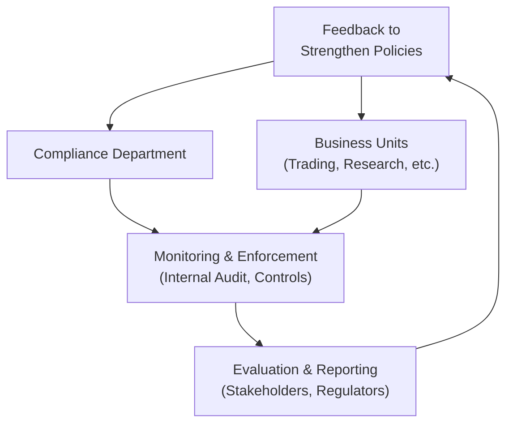

## Introduction

Picture this scenario: You’re visiting a firm for the very first time, maybe for a job interview or as an independent auditor. Folks are buzzing around, everyone’s busy, and there are corporate-sounding posters—things like “Integrity” and “Client First”—plastered on the walls. But how do you figure out if those posters mean anything? How do you really know whether the firm’s talk of ethics and client care translates into real, day-to-day practices?

That, in a nutshell, is what this section is about. As professionals aiming to uphold the CFA Institute Code of Ethics and Standards of Professional Conduct, we’re not just looking at our own behavior. We must also understand how a firm’s infrastructure—its practices, policies, and overall conduct—supports (or undercuts) those standards. Because even the most dedicated employees can be thwarted if the organization’s ethos is misaligned with ethical principles.

This segment of the curriculum focuses on how to evaluate firm-level policies, check for consistency with the Code and Standards, and identify potential breaches before they become costly. We’ll talk about compliance, internal governance, the importance of transparency, and more. By the time you’re done, you’ll have a framework for assessing whether a firm’s actions match its rhetoric, and you’ll be better prepared for both real-life ethical dilemmas and exam scenarios that test your understanding of organizational ethics.

## Understanding Internal Governance

Internal governance is the backbone of a firm’s ethical ecosystem. When I first started in this field—long before I’d even heard of the CFA Program—I was stunned at how different two firms could be simply based on their internal structures. One firm I visited had an ethics officer who was effectively a glorified bystander; nobody took them seriously if they raised concerns. Another firm, about the same size, had a robust governance framework that gave real teeth to the compliance team, and they integrated ethical considerations into every major decision. Guess which one recorded fewer compliance breaches?

Internal governance typically includes the following elements:

• A clear delineation of authority (an organizational chart that shows who reports to whom).  
• A set of documented policies (like codes of conduct, compliance manuals, or standard operating procedures).  
• Oversight mechanisms (this can be a compliance committee, a board of directors’ audit committee, or an external review process).  

The key question is whether these structures are arranged in a way that encourages ethical decisions. If your compliance officer theoretically reports to the CEO but in practice constantly gets shut down by mid-level managers, that’s a warning sign. Governance should not be a formality—it’s the basis for ensuring that the firm’s everyday practices align with the lofty standards on those wall posters.

## The Role of the Compliance Department

Now, compliance isn’t typically the “glamour” wing of a firm, at least not from the outside. But when done right, it’s a major pillar of integrity and trust. You might think of compliance as the firm’s immune system—it detects and fights off harmful practices that can cause damage to the organization in the long run.  

An effective compliance department should:

• Have the independence to investigate issues without fear of retaliation.  
• Be well-staffed with individuals who understand relevant regulations and the CFA Institute Code and Standards.  
• Be empowered to recommend and enforce disciplinary actions.  
• Stay up to date with changes in laws and industry best practices, constantly revising firm procedures to reduce risk exposures.  

Assessing how compliance interacts with other departments, such as Research or Portfolio Management, can be illuminating. Do portfolio managers get pushback if they try to push the boundaries on personal trading policies? When new employees come on board, are they trained thoroughly on how to treat client data? If compliance only shows up once a year to do a cursory check, that’s a big red flag.  

In many organizations, compliance is also supported by an internal audit function (if the firm is large enough). The internal audit team typically fosters objectivity by reporting directly to the board of directors or its audit committee. A well-run internal audit function ensures that compliance practices are not just “on paper” but truly embedded across the firm.

## Checking for Consistency with the CFA Institute Code and Standards

The CFA Institute Code of Ethics and Standards of Professional Conduct (the “Code and Standards”) serve as the gold standard of ethical conduct in our industry. When we speak of “consistency,” we’re talking about alignment between what the firm’s policies require and what the Code and Standards expect. This goes beyond bare-bones regulatory compliance—it’s about embodying the highest professional and ethical ideals.

Some of the key areas that deserve extra scrutiny include:

• Personal trading policies. Do they guard against frontrunning or insider trading? Do they require preclearance for trades?  
• Client confidentiality. Are there adequate safeguards for customer data? Whistleblower procedures?  
• Fair dealing. Does the firm allocate investment opportunities fairly? Are allocations done on a pro-rata basis or some method that ensures no one client is systematically favored over another?  
• Conflict-of-interest management. Look for robust disclosures, especially if the firm handles proprietary accounts or large principal deals.  

You might want to cross-reference these policies directly with specific Standards from the CFA Program—for instance, Standard III (Duties to Clients) or Standard VI (Conflicts of Interest)—to see if there are any glaring mismatches. If it feels like the firm is paying lip service to fairness but is, in practice, funneling all the best deals to a favored client, you’ve got an alignment problem.

## A Structured Evaluation Approach

Evaluating a firm’s conduct can feel overwhelming. Where do you even start? A structured approach helps:

• Gather Documentation: Collect employee handbooks, policies, compliance manuals, and so forth. You also want to see things like HR training modules, conflict-of-interest disclosures, personal trading attestations, and whistleblower safeguards.  
• Conduct Interviews: Talk to people at multiple levels within the organization—front-line employees, mid-level managers, compliance staff, and possibly even board members if you have the access. Look for consistency in how they view and apply ethical policies.  
• Observe Operations: If possible, spend some time on the trading floor, in client meetings, or in cross-departmental project reviews. Do you see actual signs of ethical conduct, or do staffers seem to bend rules under pressure?  
• Compare Behavior to Stated Principles: It’s easy to say you value transparency or fairness, but do you see that in real-life decisions about commissions, fees, or client communications?  

Be especially mindful of red flags. A single policy that’s inconsistent with the Code and Standards might be a one-off error or oversight. But if you find multiple mismatches between stated values and actual behavior, that’s usually a sign of deeper systemic issues.

## Reporting and Transparency

Ever run into a friend who is a bit cagey about their personal life? They share some details but skirt around what’s really going on. Firms can behave the same way. Transparency in corporate practices reflects how openly a firm deals with stakeholders—employees, clients, regulators, the public.

Questions to ask:

• Are disciplinary actions reported internally and promptly to relevant regulatory bodies, if required?  
• Does the firm provide timely disclosures about conflicts of interest, fees, and business relationships?  
• When a breach inevitably happens (no one is perfect), is it addressed head-on, or swept under the rug?  

In many cases, a firm that fosters transparency has open-door policies, encourages employees to speak up about concerns, and responds consistently. This fosters a culture of ethical behavior, as opposed to a culture of hiding mistakes.

## Ensuring Independent Oversight

You might be thinking, “Okay, so compliance is supposed to watch over us. But who watches over compliance?” Great question. Independent oversight often involves:

• External Audits: Independent antifraud or compliance audits can highlight systemic weaknesses.  
• Regulatory Reviews: Regulators conduct periodic examinations, though the scope can vary widely by jurisdiction.  
• Third-Party Consultants: For specialized areas like cybersecurity or complex quantitative trading, the firm may hire external experts to evaluate the system.  

The idea is that the more a firm welcomes external reviews—without foot-dragging or hostility—the more likely it’s serious about maintaining high standards. When a firm provides thorough documentation, addresses problems immediately, and shares findings with relevant stakeholders, that’s a signal that leadership truly cares about ethical alignment.

## Documentation and Recordkeeping

One of the old adages in compliance is: “If it’s not documented, it didn’t happen.” Proper recordkeeping is essential because it provides the paper trail that regulators and external investigators use to verify a firm’s claims.

Well-maintained records:

• Show that employees are consistently following ethical guidelines.  
• Provide historical data to pinpoint patterns of noncompliance (e.g., repeated issues with a particular product line or trading desk).  
• Demonstrate that the firm is serious about internal controls and accountability.  

For example, if the Code and Standards require that employees receive annual compliance training, there should be sign-in sheets or digital logs of who attended and when. If employees are required to report outside business activities, there should be forms or eDisclosures verifying that. The process of maintaining these records, plus robust version control on policies, can speak volumes about a firm’s sincerity regarding compliance.

## A Visual Overview

We can throw this all into a simplified diagram. Take a look:

• The firm’s ethical policies and overall governance structure feed into both the compliance department and the various business units.  
• Compliance, in conjunction with internal audit or similar functions, monitors whether those business units are following the code.  
• Findings are then reported to all stakeholders or regulators, and that feedback loop returns to the firm’s top-level governance, allowing leadership to refine policies further.  

## Real-World Examples

Let’s consider a scenario: A medium-sized asset management company, call it “Bonfire Capital,” had comprehensive compliance policies in their handbook—at least on paper. However, once you step onto the trading floor, you notice that portfolio managers regularly chat on personal phones and rarely log these conversations. The official policy states all trade-related communications with third parties should be recorded. But in practice? Not happening.

An internal audit (the firm’s first in two years) revealed staffers frequently placed trades in personal accounts ahead of client trades—a direct violation of Standard II (Integrity of Capital Markets). Although the compliance manual forbade it, there was no real enforcement, no routine pretrade approvals, and basically no monitoring. Despite the firm’s grand statements about protecting clients’ best interests, the day-to-day vibe was that folks could do whatever they liked.

In this case, the governance structure was a façade. The compliance department lacked authority, and management turned a blind eye as long as profits came rolling in. An external whistleblower eventually forced the regulatory authorities to intervene. The firm faced fines, reputational damage, and clients withdrew assets in droves.

## Best Practices

So, how do you keep that from happening in your firm (or the firm you might evaluate)? Let’s summarize some helpful practices:

• Involve Leadership. Ethical conduct needs a top-down commitment. Senior managers and even the board must publicly endorse and fund compliance initiatives.  
• Provide Adequate Resources. A compliance department can’t thrive on good intentions alone. Sufficient technology, staff, and training budgets are critical.  
• Schedule Regular Training. One annual session isn’t enough. Offer bite-sized “refreshers,” especially when new regulations come out or if there’s a new product launch that changes the firm’s risk profile.  
• Encourage Reporting. Foster a speak-up culture where employees can raise concerns. Whistleblower protections help employees feel safe reporting potential violations.  
• Conduct Surprise Audits. Sometimes, unannounced spot checks are crucial. People behave differently when they think no one is watching.  
• Document Everything. Keep thorough records of all compliance and ethics-related activities. This includes evidence of training, sign-offs on personal trading policies, and logs of compliance inquiries.  

When these elements come together, a firm is well-positioned to align with the Code and Standards in a tangible, meaningful way.

## Summing Up

Evaluating a firm’s practices, policies, and conduct might sound daunting, but it’s crucial for ensuring that the organization’s approach aligns with the Code and Standards. From personal experience, I’ve seen how firms that truly bake ethical responsibilities into their corporate DNA fare better in the long run—fewer regulatory issues, stronger client trust, and employees who are proud to be there.

The real test? Matching words to actions. Even the best-known ethics statement won’t matter unless day-to-day practices reflect ethical principles. By focusing on governance, empowering compliance, ensuring transparency, and inviting independent oversight, you’ll be on the right track to upholding the integrity that’s expected by the CFA Institute.

And if you’re sitting the exam soon, keep these concepts in mind. Often, CFA Level III will present scenario-based questions that require you to spot discrepancies between a firm’s official stance and actual behavior. Show the examiners that you get the difference between fluff and substance, that you can pinpoint where a firm is ignoring or undermining the Code and Standards, and that you know how to propose improvements. That combination of ethical insight and real-world practicality is exactly what the CFA Program aims to develop.

## Final Exam Tips

• Understand the Code and Standards thoroughly so you can quickly identify real-world violations.  
• In constructed-response questions, be direct: refer back to specific Standards (e.g., Standard I(C) – Misrepresentation) if you suspect misstatements in corporate policies or communications.  
• Offer solutions that are realistic and consistent with good governance—like recommending more robust compliance tools or external audits.  
• Time management is key. Some essay questions may ask you to evaluate multiple aspects of a firm’s policies—outline your response clearly and proceed with structured paragraphs.  
• If the question presents a “gray area,” leverage the principles of the Code and Standards. Indicate that further clarification or additional oversight might be needed.  

## References

• CFA Institute, “Standards of Practice Handbook.”  
• Treviño, Linda K. and Katherine A. Nelson, “Managing Business Ethics: Straight Talk about How to Do It Right.”  
• The IIA (Institute of Internal Auditors): www.theiia.org  

--------------------------------------------------------------------------------

## Test Your Knowledge: Evaluating Firm Policies and Ethical Conduct



### Which of the following actions best indicates a firm's commitment to effective governance?

- [ ] Publishing a detailed ethics policy but never conducting an internal audit.
- [x] Providing a confidential channel for employees to report potential violations.
- [ ] Paying large bonuses to high-performing traders regardless of compliance records.
- [ ] Conducting annual compliance training but assigning it as optional to employees.

> **Explanation:** A confidential channel for reporting violations (often called a whistleblower hotline) signals a firm's dedication to uncovering and addressing ethical issues proactively.

### In evaluating a firm’s alignment with the CFA Institute Code and Standards, which evidence would most strongly suggest a compliance gap?

- [ ] Well-maintained compliance records and frequent staff trainings.
- [x] Multiple incidents of personal trading violations without consequence.
- [ ] Board-level committee dedicated to oversight of compliance.
- [ ] Annual updates to the firm’s standard operating procedures.

> **Explanation:** Repeat personal trading violations that go unpunished indicate a breakdown in compliance enforcement and lack of accountability, contradicting Standard VI (Conflicts of Interest) and others.

### An asset manager states it has a "zero-tolerance policy" on insider trading. During your review, you find that employees receive minimal training, and suspicious trades are only reviewed once a year. What should you conclude?

- [x] The stated policy is not supported by robust controls, indicating potential gaps.
- [ ] The firm is simply trying to cut unnecessary costs, which is acceptable.
- [ ] Annual reviews are sufficient to ensure compliance.
- [ ] Zero-tolerance policies eliminate the need for training sessions.

> **Explanation:** If the firm truly had zero tolerance, it would invest in proper training, implement regular oversight, and promptly investigate suspicious transactions, not just once a year.

### Which of the following is most critical when assessing the role of a compliance department?

- [ ] The number of compliance officers relative to traders in the firm.
- [x] The independence and authority to enforce disciplinary actions.
- [ ] How often compliance staff attends trade association luncheons.
- [ ] Whether the firm has a separate IT department.

> **Explanation:** Independence and authority are crucial—compliance must have the power to investigate and enforce rules without being undermined by other departments.

### How can a firm demonstrate commitment to transparency in its reporting and investigation of breaches?

- [x] Reporting disciplinary actions to relevant stakeholders and regulators in a timely manner.
- [ ] Offering employees bonuses for silence about potential compliance problems.
- [x] Providing consistent, detailed disclosures in public financial statements.
- [ ] Conducting investigations internally but keeping findings secret from clients.

> **Explanation:** Timely communication to stakeholders and regulators, alongside full and accurate disclosures, reflect true transparency. Encouraging silence or withholding information from clients contradicts the spirit of the Code and Standards.

### Which most accurately describes a key element of an “independent oversight” practice?

- [x] External audits that review trading activities and compliance with ethical standards.
- [ ] Having the CEO review and sign off on all compliance matters personally.
- [ ] Only reviewing performance metrics without focusing on ethical behavior.
- [ ] Relying exclusively on a single self-assessment form filled out by employees annually.

> **Explanation:** Independence is best promoted with external or third-party evaluations that provide unbiased reviews of the firm’s processes, rather than relying solely on internal sign-offs.

### Which scenario best illustrates how recordkeeping can protect a firm during regulatory inquiries?

- [x] Maintaining logs of all compliance training completions and personal trade approvals.
- [ ] Allowing managers to store client communications only in personal inboxes.
- [x] Keeping no standardized documentation but encouraging employees to “use good judgment.”
- [ ] Destroying outdated personal trading records every six months to save costs.

> **Explanation:** Detailed records of staff training, compliance approvals, and relevant communications establish a transparent trail demonstrating adherence to policies. Periodic disposal of crucial documents can raise serious compliance questions.

### A firm’s code of conduct specifically prohibits gifts from vendors above a nominal value. If you discover senior managers receiving expensive vacations from a major service provider, what does this most likely indicate?

- [x] A discrepancy between stated policy and actual behavior.
- [ ] Justifiable perks for high-level managers.
- [ ] Vendor marketing strategy that doesn’t concern compliance.
- [ ] Transparency in promotions and services.

> **Explanation:** Accepting expensive gifts directly contradicts the explicit code of conduct and reveals a failure to enforce stated policies.

### If a company continually defers an external compliance audit, claiming it’s “too busy” with ongoing projects, what ethical concern is raised?

- [x] Possible reluctance to expose deeper compliance or governance issues.
- [ ] A solid demonstration of prioritizing business operations over minor formalities.
- [ ] An indication that external audits are not provided by regulators.
- [ ] Evidence that the firm is fully compliant without the need for confirmation.

> **Explanation:** Repeatedly postponing external audits may suggest the firm wants to avoid external scrutiny that could unearth unethical or noncompliant practices.

### Oversight and compliance structures must align with which CFA Institute principle?

- [x] True
- [ ] False

> **Explanation:** Oversight and compliance are integral to fostering trust in capital markets, as highlighted in the Code and Standards. If these structures do not align with such principles, client and market trust can be eroded.


