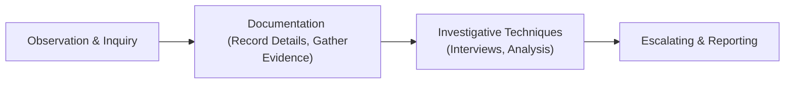

## Introduction

How do we spot actual ethical violations in the day-to-day hustle of a busy investment firm? I remember when I was a junior analyst—it was my first week on the job, and I saw an unusually large trade executed about ten minutes before a big M&A announcement. My gut said something was off, but I wasn’t sure what to do. Perhaps you’ve been there, too. In this section, we explore ways to identify and document ethical missteps before they crystallize into major compliance headaches. We’ll walk through how to handle suspicious activity, how to protect whistleblowers, and how to know when to escalate issues within your firm or to the authorities.

Along the way, we’ll cover systematic approaches for nipping these problems in the bud, drawing on the CFA Institute’s Code of Ethics and Standards of Professional Conduct. Let’s get into the details.

## Observation and Inquiry

Observation is a critical first step in identifying potential ethical breaches. Often, we spot an issue because something just “seems strange”–like a pattern of trades executed at times that look, well, suspicious. We can rely on:

• Vigilant Monitoring: Keep an eye on trades, interactions, or any irregular performance patterns.  
• Cultural Encouragement: Foster an environment where employees feel safe to say, “Hey, maybe we should take a second look here.”  

Remember, you want folks to speak up if they notice anything amiss. It’s not about being a snitch; it’s about protecting the integrity of the marketplace. And, you know, sometimes it’s just an innocent inquiry that turns out to be no big deal. But it’s better to ask questions early rather than let a potential front-running or insider trading scenario go unchecked.

### Encouraging an Open Culture

• Town Halls & Team Meetings: Create spaces where employees can voice concerns without fear.  
• Anonymous Feedback Channels: Provide hotlines or web-based reporting where staff can submit tips confidentially.  

Think of a compliance hotline as your “early detection system.” If people trust it, they’ll use it in good faith. After all, you can’t address what you don’t know.

## Documentation of Violations

Once you see a red flag or someone pings you about questionable conduct, the next step is to document it carefully. This might feel bureaucratic, but it’s essential for ensuring fairness and consistency.

• Record Details Promptly: Note the date, time, parties involved, and a factual description of the suspected violation.  
• Attach Evidence: Save trading logs, emails, or chat transcripts, if relevant.  

In my early analyst days, I once failed to document a tip in writing because I assumed it was trivial. Fast-forward two months, and that “trivial” matter turned into a full-blown compliance meltdown. Lesson learned: Always write it down.  

### Systematic Tracking

Let’s visualize the path from noticing suspicious behavior to thorough documentation, using a simple flow diagram:

This flowchart highlights how each step feeds into the next, ensuring no crucial details slip through the cracks.

## Investigative Techniques

So you’ve got your suspicious trade logs or your coworker’s tip about someone sharing non-public info at a bar. Now what?

• Gather Evidence: Work with your legal, compliance, or internal audit teams to collect data—trade records, phone call logs, or asset allocation shifts.  
• Conduct Interviews: Talk to the individuals involved. Think about how to ask open-ended questions that encourage them to clarify ambiguous activities.  
• Confidentiality vs. Transparency: Handle interviews and evidence with tact, balancing the right to privacy with organizational transparency.

### Collaboration with Legal and Compliance

You’ll usually involve the legal and compliance departments right away. If you’re venturing across borders—perhaps your firm has offices in different countries—there may be local regulations or cultural nuances to consider. For instance, in some jurisdictions, data privacy laws are very strict, so you must carefully manage how you gather digital evidence.

## Escalating and Reporting

When (and how) do you escalate? If you ignore obvious signs of wrongdoing, it’s bad news all around. Swift escalation often prevents further harm and underscores your firm’s commitment to ethics.

• Internal Reporting: Immediately notify senior management or the compliance department.  
• External Regulators: If the violation is serious (e.g., insider trading), you may be legally obligated to contact regulatory authorities.

### Timely Action

Imagine someone in your group notices that a portfolio manager is tinkering with client trades for personal gain. If you wait too long, you risk losing client trust and maybe even the firm’s operating license. As tough as it can be to blow the whistle, timeliness is crucial. Think of it like a leak in a dam: if left unaddressed, the whole structure could collapse.

## Challenges and Complexities

Identifying ethical violations is rarely straightforward. One challenge? Global operations. Some behaviors might be culturally accepted in one region but violate local or global regulations. That’s a tricky spot, especially if employees genuinely believe they’re not doing anything wrong.

### Cross-Functional Collaboration

Working with multiple teams helps you achieve objectivity. If an alleged incident involves trades from a foreign office, bring in compliance officers from that location. They might understand local norms and regulations better.

One of my colleagues recalls a case where a manager in a certain international branch was “giving gifts” to a government official. In that region, some gift-giving practices were normal. But for the firm’s global code of conduct? It was a problem. Talking with local compliance reps gave clarity and helped rectify the issue without overreacting or underreacting.

## Case Studies and Role-Playing

A great way to train yourself and your team is through simulations:

• Sample Scenario 1: An associate overhears a friend brag about a soon-to-be-announced corporate takeover. The next day, that associate places huge trades for personal accounts. Would you catch it? How?  
• Sample Scenario 2: A portfolio manager adjusts certain trades to position the firm’s proprietary account ahead of a client’s big transaction (front-running).  

Running these hypotheticals in workshops or small-group sessions builds confidence. People share pointers on how to respond, and you develop a consistent firm-wide approach.

## Preventive Measures

Now that we’ve talked about how to deal with potential violations, let’s pivot to preventing them in the first place. As the saying goes, an ounce of prevention is worth a pound of cure.

• Frequent Training & Refreshers: Employees might forget or grow lax over time. Offer annual or semiannual training on new developments in laws, codes, and best practices.  
• Know Your Employee (KYE) Checks: Sure, we do KYC (Know Your Customer). But do we apply the same diligence to employees’ backgrounds and ongoing professional behavior?  
• Regular Compliance Audits: Think of these as routine “checkups” on your processes. They can be internal or external, but they are invaluable for spotting early signs of wrongdoing.  

### Encouraging Anonymous Reporting

Hotlines or third-party tip-reporting services let employees speak up without fear of retaliation. When people trust that they won’t be punished for doing the right thing, they’re far more likely to come forward early.

## Glossary

• Ethical Violation: Failure to abide by a prescribed code of conduct or regulatory framework.  
• Whistleblower Policy: Protects anyone who reports unlawful or unethical activity from retaliation.  
• Front-Running: Using knowledge of upcoming large trades to profit or avoid losses.  
• Insider Trading: Trading on material, non-public information, typically illegal and severely punished.  
• Escalation Procedure: The established chain of command for reporting misconduct or compliance breaches.  
• Retaliation: Punitive actions taken against individuals who report wrongdoing, violating both ethical and often legal statutes.  
• Perceived Conflict of Interest: A situation in which personal interests might improperly influence professional judgment.  
• Material Non-Public Information: Information not made public but that could influence an investment’s price if widely known.

## Best Practices and Exam Tips

For the CFA Level III exam, ethical scenarios often show up in item-set or essay questions. They might describe a situation and ask you to identify potential violations and the next steps you should take.

• Read Each Detail: Exam ethics questions hinge on subtle clues.  
• Look for Red Flags: Insider tips, undisclosed gifts, personal trades ahead of client orders.  
• Map to Standards: Always connect behaviors to specific Standards of Professional Conduct.

If the exam prompt suggests something that just doesn’t pass the “smell test,” trust that gut reaction, then systematically apply the Code and Standards to confirm. You’ll often see how each standard (e.g., Standard II(A): Material Nonpublic Information) might be violated.

## References and Additional Resources

• CFA Institute, “Global Body of Investment Knowledge” – Sections on professional conduct.  
• Association of Certified Fraud Examiners (ACFE): http://www.acfe.com for fraud detection and prevention materials.  
• Business and Professional Ethics Journal – Offers in-depth research articles and practical ethical case analysis.  

These references can guide you in building robust compliance frameworks and help you sharpen your ethical detection skills.

---

## Test Your Knowledge: Identifying Ethical Violations in Real‑World Situations



### A portfolio manager executes trades for a personal account immediately before placing large client orders in the same securities. Which best describes this behavior?

- [ ] Insider trading
- [x] Front-running
- [ ] Misappropriation of client funds
- [ ] Negligence in investment analysis

> **Explanation:** Front-running occurs when a person trades for their own (or the firm’s) benefit, taking advantage of pending large transactions that could impact security prices.

### Which of the following best fosters a culture where employees can safely raise ethical concerns?

- [ ] Strictly limiting all internal communication channels
- [x] Providing anonymous hotlines and encouraging open discussion
- [ ] Punishing employees who raise false alarms
- [ ] Restricting dialogue to senior management only

> **Explanation:** An open environment with anonymous reporting encourages staff to speak up without fear of reprisal.

### When investigating a potential ethical violation, what is the most important initial step?

- [x] Documenting observations, including date, time, and parties involved
- [ ] Firing all parties involved immediately
- [ ] Submitting an anonymous tip to regulators
- [ ] Publicly reprimanding the suspected individual

> **Explanation:** Proper documentation is the foundation for a fair and thorough investigation.

### If an employee suspects a colleague is using material non-public information to trade, what should the employee do first?

- [ ] Confront the colleague directly in a public forum
- [ ] Immediately output all information on social media
- [ ] Stay silent until more evidence surfaces
- [x] Confidentially report to the compliance department

> **Explanation:** Confidential reporting allows the compliance department to gather evidence safely and determine if further escalation is needed.

### What is a key challenge in identifying potential ethical violations in a global firm?

- [x] Varied local regulations and cultural norms
- [ ] No requirement for documentation across offices
- [x] Confusion about whether "gift giving" is always unethical
- [ ] Centralized oversight that’s consistent worldwide

> **Explanation:** Operating across different regions involves multiple legal regimes and cultural practices, which can complicate identification and resolution of potential breaches.

### Which action is most critical for preventing future ethical violations?

- [x] Conducting regular compliance audits
- [ ] Eliminating all gift-giving in the firm
- [ ] Limiting employee access to corporate social events
- [ ] Issuing a single memo about ethical guidelines

> **Explanation:** Regular audits help spot patterns and weaknesses in procedures, significantly reducing the risk of unnoticed violations.

### Which best describes front-running?

- [x] Trading in advance of large pending client orders
- [x] Profiting from knowledge of an upcoming client transaction
- [ ] Buying shares of a company based on publicly disclosed information
- [ ] Complying with the CFA Institute’s guidelines

> **Explanation:** Front-running is taking advantage of nonpublic knowledge about a client’s upcoming trades to make personal or proprietary trades first.

### What interview strategy best encourages open dialogue when investigating a potential violation?

- [x] Asking open-ended questions and actively listening
- [ ] Interrogating the interviewee under bright lights
- [ ] Only allowing “yes” or “no” responses
- [ ] Avoiding follow-up questions

> **Explanation:** Open-ended questions foster an environment where the interviewee can provide detailed clarifications, increasing the likelihood of uncovering useful information.

### A compliance officer receives an anonymous tip about suspicious trades. The officer should:

- [x] Investigate according to formal procedures while protecting confidentiality
- [ ] Immediately accuse the department manager of wrongdoing
- [ ] Shrug it off unless additional tips are received
- [ ] Publicly expose the whistleblower to deter false allegations

> **Explanation:** The proper approach is to investigate using established protocols while maintaining the anonymity and rights of all involved parties.

### True or False: Failure to escalate an observed Code violation can itself constitute a breach of the CFA Institute’s Standards of Professional Conduct.

- [x] True
- [ ] False

> **Explanation:** Under the CFA Institute Code and Standards, members and candidates are expected to act when they see misconduct. Failing to report known violations can be deemed noncompliant behavior.


