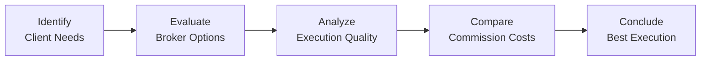
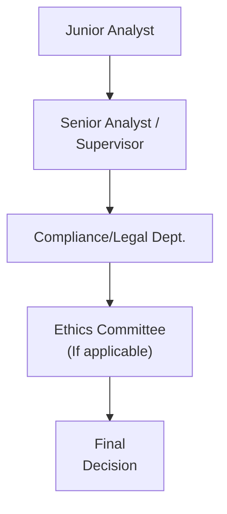

## Introduction
When you’re managing portfolios all day, it’s surprisingly easy for small conflicts of interest or little “gray areas” to pop up. You know, those moments where you think, “Well, is it really that big of a deal if I choose a particular broker who’s been super nice to me, even if they aren’t necessarily giving the best execution?” Or, “I’m stressed about reaching quarterly performance targets—maybe I can tweak the portfolio to look a bit better, just for these final weeks.” Those are exactly the kinds of dilemmas that push us to think about ethical responsibilities. Thankfully, the CFA Institute Code of Ethics and Standards of Professional Conduct offers a clear framework and consistent guidance on how to make the right call. Still, real life is messy, and ethical decisions often aren’t black and white.

Below, we’ll explore several core ethical dilemmas in portfolio management, from balancing client instructions with prudent practice to navigating best execution, from maintaining confidentiality to staying on the right side of performance presentation and marketing. We’ll also share real (and hypothetical) examples that highlight how easy it is to slip from a minor ethical compromise to a significant breach—and how robust processes and mindful oversight can help prevent that from happening.

## Common Dilemmas
One of the biggest ethical issues portfolio managers face is the tension between client instructions and the manager’s own sense of prudent investment practice. Sometimes, a client will demand a risky strategy: leveraging to the hilt or focusing solely on hot new tech stocks, for instance. If you believe such a strategy is contrary to their long-term best interests, do you follow their explicit instructions, or do you politely refuse until you can help them understand the risk?

On the flip side, there could be pressure from your firm to show stellar results—like beating a benchmark every single month (or at least not underperforming it by too large a margin). This can potentially lead to window dressing—rebalancing or swapping out certain holdings just before a portfolio review so clients see only the best side of the portfolio at quarter-end. Another temptation is to shift to a benchmark that seems easier to beat or manipulate performance data so it looks like you’ve done an excellent job. All these represent possible ethical pitfalls when you have performance pressures overriding your commitment to the client’s best interest.

## Exploring Gray Areas
Let’s be honest: not all dilemmas have a single “correct answer.” Sometimes you have to balance multiple interests, requirements, or principles. And the Code and Standards can’t possibly account for every nuanced scenario. Instead, they offer a reliable framework to guide decision-making. If a certain action feels questionable from the perspective of professional integrity, it likely is.

It’s crucial to note how small actions can spiral. For instance, maybe you promise a friend a chance to buy into a hot IPO at the same time as your clients—just this once. Then, a few rounds of compromise later, you realize you’re allocating top IPO shares to any friend who asks, even if it’s detrimental to your client’s allocations. The “slippery slope” phenomenon is real, and it underscores the importance of addressing ethical gray areas early and consistently.

## Fiduciary Duty and Best Execution
Fiduciary duty is the highest standard of care, and as a fiduciary, you put your clients’ needs above your own or those of your firm. This means sometimes saying “No” to practices that boost your bottom line but shortchange the client. For example, you might be tempted to direct trades to a broker offering lavish perks or soft-dollar arrangements, but best execution is about the total cost-quality equation for the client.

To break that down, best execution isn’t just about paying the lowest commission. It also involves analyzing the broker’s access to liquidity, speed of execution, reliability, and other relevant factors. If the broker with the cheapest commissions has a habit of delaying trades, causing slipped executions or partial fills, that may not be best for the client. The overarching principle is that you make these choices (and document them) in a way that’s clearly aligned with client well-being.

Here’s a little visual flow of how you might navigate the thought process for broker selection:

In each step, it’s important to ask yourself, “Am I doing this for the client’s benefit?”

## Client Confidentiality vs. Regulatory Requirements
Confidentiality is a massive priority in finance. You simply can’t let sensitive client data leak—especially information about holdings, net worth, or investment plans—without proper authorization. But sometimes, regulatory authorities or courts request documents that contain client info. The Code and Standards hold that you must comply with the law, even if that means revealing sensitive details. The approach, though, is minimizing disclosures by providing only what’s absolutely necessary under the relevant legal requirements.

Where it gets tricky is figuring out how to comply with a subpoena or regulator request while still protecting client privacy as much as possible. The standard practice is to communicate with your client—let them know, to the extent legally permissible, that a request was made, and you must respond. Again, every region’s laws can differ, so you’d rely on legal counsel to guide the specifics, but the principle remains: do your best to maintain confidentiality while meeting mandatory legal obligations.

## Misrepresentation of Performance
Misrepresentation is a big no-no because it undermines trust in the capital markets. When you’re marketing your performance track record, it’s awfully tempting to highlight only your most impressive returns. “Annualized returns over the last three years: 15%!” you might say. But if that performance was from a tiny segment of your total portfolio or was generated under previous market conditions, you must be transparent about that context.

Similarly, you can’t just modify the benchmark or adjust the timeline to paint a more flattering picture. We might think, “Well, it’s not exactly lying; I’m just showing them the best results,” but from an ethical standpoint, that kind of half-truth is essentially slipping into misrepresentation. Firms often implement policies to ensure claims about composites, track records, or marketing materials meet global standards (like the Global Investment Performance Standards—GIPS®) and reflect relevant disclaimers for prospective clients or regulators.

## Scenarios and Case Examples
• Margin Calls: Imagine a client invests heavily in leveraged products and experiences a catastrophic decline in value—by the time you receive a margin call, your client’s equity is well below the maintenance level. Do you risk your firm’s funds to protect that client? Or do you force immediate liquidation to meet margin requirements? Fiduciary duty means you can’t just ignore your client’s instructions, but you also can’t place your firm at undue risk or violate the agreement terms.  
• Leveraged Product Usage: Some clients love the excitement of 2x or 3x leveraged ETFs. It’s your job to make sure they understand the added risk and potential for significant losses, especially if they hold these products long term.  
• Short-term Performance Chasing: Chasing high-flying stocks or switching strategies constantly to impress external stakeholders can produce an environment ripe for ethical breaches like misrepresentation. There’s a difference between adapting to changing markets and engaging in short-termism that disregards the client’s long-term goals.  
• Window Dressing: Right before the quarter-end, you might be tempted to swap out underperforming stocks for “safer” or higher-performing ones solely to make your track record look stellar. That’s a misrepresentation to the client and can be penalized under the Code and Standards (see also Standard V in Chapter 2).

## Role of Supervisors and Senior Analysts
I recall one time early in my career, I was on a trading desk with a super-keen new analyst who had an overabundance of energy and ambition. He wanted to lock in trades so quickly that he sometimes overlooked potential conflicts of interest. Actually, I remember having to say, “Hey, let’s step back for a second. Does this approach align with our duty to treat all clients fairly?” And he paused, realized maybe it didn’t, and we pivoted.

Providing oversight and mentorship is crucial, since less experienced team members may not have the same instincts for spotting an ethics minefield. Supervisors should create an environment where it’s safe to question actions or escalate concerns. That might mean establishing a clear reporting line for potential infractions or implementing robust compliance training. Some organizations even hold “ethics roundtables” for team members to share real or hypothetical dilemmas in a confidential, no-reprisal setting.  

Here is a tiny diagram illustrating the hierarchy of decision-making that fosters accountability:

In well-structured organizations, each step offers advice and a control check.  

## Glossary
• Window Dressing: Efforts to improve the appearance of a portfolio or financial statements before a review or presentation date.  
• Soft Dollars: Benefits (often research or other services) provided by a brokerage firm to an asset manager in exchange for directing trades or commissions to that firm.  
• Fiduciary Duty: The highest standard of care that places the client’s interests first.  
• Best Execution: Seeking the most advantageous terms for executing client trades under the prevailing conditions.  
• Margin Call: A broker’s demand for additional capital or securities when an investor’s equity in a margin account drops below a required minimum threshold.  
• Misrepresentation: Providing false, inaccurate, or incomplete information that can mislead markets, clients, or regulators.  
• Leverage: Borrowing capital to potentially amplify returns, which also magnifies losses.  
• Short-Termism: Overemphasizing immediate performance results at the expense of long-term strategy and prudence.  

## References and Additional Resources
• CFA Institute, “Ethics in Practice” Case Studies: Offers real-world situations exploring the complexities of ethical decision-making in portfolio management.  
• Dimson, Marsh, and Staunton, “Triumph of the Optimists”: Provides evidence-based insights into the importance of maintaining a long-term investment perspective, which can help mitigate the temptations of short-term performance chasing.  
• CFA Institute Code of Ethics and Standards of Professional Conduct: Chapter 2 (2.1 through 2.7) provides specific guidelines on Professionalism, Integrity of Capital Markets, Duties to Clients, and more.  
• GIPS® Standards: A framework for performance presentation that ensures transparency and comparability across firms and strategies.

Remember, the best way to handle ethical dilemmas is to recognize them early, consult relevant rules and mentors, and commit to solutions consistent with fiduciary obligations. Even if a decision seems painful in the short run—like turning down a lucrative arrangement that poses a conflict of interest—upholding the Code and Standards usually pays off in client trust, professional reputation, and long-term career success.

## Test Your Knowledge: Ethical Dilemmas in Portfolio Management



### Which of the following actions can be considered “window dressing”?
- [ ] Hiring diverse portfolio managers to appear more socially responsible  
- [ ] Rebalancing target-date funds for appropriate risk  
- [x] Swapping out underperforming stocks just before quarter-end to boost reported performance  
- [ ] Advertising performance composites in line with GIPS® guidelines  

> **Explanation:** Window dressing involves making superficial changes—often at a reporting boundary like month-end or quarter-end—to present a more favorable portfolio snapshot than the actual investment approach.

### In adhering to best execution principles, a portfolio manager should primarily:
- [ ] Always select the broker with the lowest commission cost  
- [x] Consider all aspects of execution quality, including price improvement, speed, reliability, and commission  
- [ ] Select the broker offering the most substantial soft-dollar benefit  
- [ ] Default to the firm’s in-house brokerage for simplicity  

> **Explanation:** Best execution looks beyond just commission rates. It encompasses many factors that ensure the client’s interests are placed first.

### An ethical gray area might be:
- [x] Allocating IPO shares to friends and family when clients are interested as well  
- [ ] Calculating net asset value daily for mutual fund clients  
- [ ] Using an electronic trading platform to reduce costs for your clients  
- [ ] Responding to a legal subpoena that requires disclosing client transactions  

> **Explanation:** Allocating shares to personal relationships instead of prioritizing clients’ interests is a questionable practice.

### A key reason why performance misrepresentation is a major violation is:
- [x] It undermines market integrity and misleads investors  
- [ ] It usually leads to bigger legal fines  
- [ ] Most regulators rarely check if claims are accurate  
- [ ] Investors prefer not to see disclaimers or fine print  

> **Explanation:** Misrepresentation distorts trust in the investment process and can harm client outcomes, so the Code and Standards take it especially seriously.

### Under what circumstance should confidential client information be disclosed to a third party?
- [ ] Whenever the analyst decides it serves the client’s best interest  
- [x] Only when legally required or explicitly authorized by the client  
- [ ] Whenever it might benefit the portfolio manager’s research  
- [ ] If it can help another client’s financial position  

> **Explanation:** Confidential client information is sacrosanct and should only be shared if required by law or if the client has provided specific consent.

### Leverage in a client’s portfolio:
- [ ] Guarantees superior returns  
- [ ] Mitigates downside risk  
- [x] Amplifies gains and losses  
- [ ] Reduces margin call risk  

> **Explanation:** When you borrow capital to invest, you can earn higher returns if the market goes your way—but losses mount quickly if it doesn’t.

### A supervisor or senior analyst’s primary ethical role includes:
- [x] Providing oversight and mentorship to ensure compliance with the Code and Standards  
- [ ] Pressuring junior analysts to meet performance targets at all costs  
- [x] Encouraging open dialogue and escalation of ethical concerns  
- [ ] Delegating entire performance reporting to new hires  

> **Explanation:** Supervisors should foster an ethical culture and mentor junior staff, so they understand and follow the Code and Standards.

### When facing a margin call, an ethical portfolio manager should:
- [x] Prioritize the client’s interests while following the agreed-upon margin policies  
- [ ] Quietly infuse personal capital to keep losses hidden  
- [ ] Ignore the margin call while consulting more senior managers  
- [ ] Immediately take on additional leverage to recoup losses  

> **Explanation:** Meeting a margin call in line with contractual obligations and the client’s instructions helps maintain transparency and reduces the risk of further conflict.

### Short-termism can lead to:
- [x] Pressure to manipulate quarter-end performance  
- [ ] Reduced frequency of trading  
- [ ] More accurate forecasting of future returns  
- [ ] Strict compliance with GIPS®  

> **Explanation:** When too much emphasis is placed on short-term performance, there’s pressure to boost results at the expense of long-term soundness or ethics.

### If a supervisor suspects that an analyst is giving friends preferential access to IPO allocations:
- [x] True  
- [ ] False  

> **Explanation:** If such suspicion arises, it must be investigated immediately. Supervisors have a duty to ensure all clients are treated fairly and that employees follow ethical guidelines.


