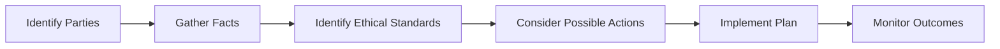

## Introduction
So, let’s say you’re in a situation where a colleague wants to bend the rules a bit, insisting that a particular client’s interests come before the firm’s policy. You start feeling uneasy because, well, you’ve got your obligations under the CFA Institute Code and Standards, and you also have your loyalty to your teammate. Do you confront your colleague? Do you escalate it to senior management? Or do you keep quiet but risk an eventual meltdown if the client or regulators find out?

This section dives into strategies for resolving ethical conflicts that often arise in the dynamic world of investment management. It’s challenging, right? I once had to sort through an internal conflict—different teams each insisted their approach adhered to compliance standards, but the email chain basically showed that neither side had the full picture. Anyway, we’ll look at a step-by-step conflict resolution framework, highlight negotiation tactics, explore decision-making models, offer suggestions on seeking advice, and discuss how to document these processes. By the end of this reading, you’ll understand how to navigate these complexities effectively and maintain the highest professional standards.

## The Conflict Resolution Framework
A systematic approach allows you to keep track of each stage, confirm stakeholders’ involvement, and document everything. Below is a concise workflow diagram to illustrate the general process:

Always keep in mind: you want to maintain a thorough record at each step for accountability.

### Identify the Parties
The first step is to list everyone concerned. That could include clients, internal departments (e.g., research or trading), or external parties such as auditors or stakeholders in a merger. Defining these parties sets the stage for understanding what is at stake and who might be impacted by the outcome.

### Gather the Facts
Next, collect all the relevant data about the situation. This could be minutes from a meeting, emails, or phone call transcripts (if permissible). The goal is to figure out exactly what triggered the conflict and avoid relying on rumors or partial knowledge. In Standard IV – Duties to Employers, for example, you’re expected to present accurate information when conflicts or disputes arise. Doing so helps ensure objectivity.

### Identify Ethical Standards
Then, determine which parts of the CFA Institute Code and Standards might apply. For instance, if the conflict involves front‑running or privileged information, you’ll likely reference Standard II – Integrity of Capital Markets. If it involves a potential conflict of interest in a recommendation, you might turn to Standard VI – Conflicts of Interest. By pinpointing the relevant standards, you keep your resolution process aligned with recognized ethical obligations rather than purely personal judgments.

### Consider Possible Actions
After clarifying the ethical obligations, brainstorm potential conflict resolutions. This might involve direct negotiation between teams, or perhaps there’s an option to reassign certain responsibilities to eliminate the conflict. For example, reassigning a research analyst who has a direct personal stake in a project to another team might reduce bias—or you might consider third‑party oversight to ensure transparency. In any event, map out the potential benefits and risks of each action, including how those actions reflect the Code and Standards.

### Implement a Plan
Decide which solution best aligns with your professional obligations. Then, put it into practice. You might have to confirm with senior management, your compliance department, or even legal counsel, but the plan should be clear and actionable. Throughout implementation, keep thorough documentation. The last thing you want is a half-documented solution that nobody can replicate or evaluate later.

### Monitor Outcomes
Finally, track how the resolution unfolds. Are you seeing new or recurring conflicts? Is client satisfaction affected? Are compliance metrics being met? Periodic reviews let you tweak the process if unforeseen issues pop up. And yes, friends, it’s essential to keep logs of these changes for accountability, especially if regulators ever come knocking.

## Communication and Negotiation
Effective communication often spells the difference between an amicable solution and a blowup. If you detect a conflict, approach the issue with calm clarity and empathy. A little humility can build bridges. For me, calling the other side by phone (rather than shooting a cold email) helped defuse tension more than once.

• Use active listening: Let the other side finish, parse their concerns, and confirm mutual understanding.  
• Articulate concerns: Be direct about how you see the conflict and which ethical or professional standards might be compromised.  
• Seek collaborative solutions: If feasible, propose a compromise that meets ethical requirements without disregarding business interests.  

If direct negotiation fails, you escalate. During escalation, maintain professionalism and confidentiality. For instance, if the conflict involves material nonpublic information, it may be essential to loop in the compliance officer ASAP without broadcasting details to the whole team.

## Decision-Making Models
When the stakes are high, you might need a structured approach to decide. Sometimes you’ll hear about the Trolley Problem as a classic example: do you pull the lever to save multiple people but actively put one person in harm’s way, or do you do nothing and let the trolley continue its path? Although extreme, it’s a useful framework for balancing outcomes versus principles.

In finance, you adapt the Trolley Problem logic by filtering it through the Code and Standards. You’re not just focusing on the end result (more revenue, more happy clients) but also on ethical conduct. Decision-making models can include:

• Cost‑Benefit Analysis: Does the benefit to clients, the firm, or society outweigh potential ethical violations? (Usually a red flag if ethics get compromised for gains.)  
• Rights‑Based Approach: Focus on upholding the rights of all stakeholders.  
• Virtue Ethics: Prioritize the character traits (honesty, fairness, respect) expected of a CFA® charterholder.  

Weave these frameworks together, especially in a fast-paced environment. In Section 2.9, we cover recommended procedures and best practices that reinforce this mindset, ensuring you always keep ethical standards front and center.

## Seeking Internal and External Advice
At times, I’ve found myself pretty stumped: the ethical quandary was so loaded that no easy resolution jumped out. In those moments, I’ve turned to our firm’s general counsel, compliance officer, or even a mentor. After all, the CFA Program emphasizes raising your hand if you’re uncertain. If that means going outside the firm—like seeking external legal counsel—so be it. Confidentiality is key, though; you don’t want to broadcast sensitive details.

This approach is especially crucial when your personal or departmental interests risk overshadowing broader professional obligations. Consulting dispassionate third parties can help ground the conversation. Plus, it shows a good‑faith effort to remain objective.

## Compliance Remedies
Sometimes conflicts erupt because existing policies were not robust enough. Common remedies could include:

• Policy changes or amendments: If a conflict repeats itself under the same conditions, it’s time to patch that gap.  
• Reallocation of responsibilities: Shifting roles can reduce or remove personal interests that conflict with professional duties.  
• Additional supervision or oversight: Assign a higher-level executive to oversee the area until the issue is resolved.  
• Third‑party audits: External reviews can reveal whether the solution is consistent with industry norms and best practices.  

These remedies also serve to deter future unethical behavior. If you implement a policy addition that specifically addresses your conflict scenario, you’re less likely to see it crop up again.

## Documentation for Accountability
Maintaining a written chain of decisions helps demonstrate that you acted with integrity and diligence. This documentation should reflect the nature of the issue, involved parties, and how you applied the Code and Standards. Keep records of who was responsible for what, deadlines, and results. Trust me, in a fast-moving environment, you tend to forget details quickly. Thorough documentation also builds institutional memory, so new employees benefit from the resolutions and knowledge from past incidents.

## Using the Trolley Problem as an Analogy
Let’s break down the Trolley Problem in a finance context. Imagine you’re unveiling a new trading algorithm that might generate higher returns but occasionally trades on borderline material nonpublic information. One path (don’t adopt the algorithm) might cost your clients potential returns, but you remain fully compliant. The alternative path (adopt and risk slipping into compliance breaches) could yield better short-term results but violates Standard II’s emphasis on safeguarding market integrity.

Now, from a purely numerical perspective, the improved performance might seem appealing, but from an ethical vantage point, you’d likely decide that preserving market integrity is nonnegotiable. The Trolley Problem can’t capture every subtlety, but it reminds us that ethical decision-making often weighs intangible casualties, like trust in the financial system, against short-term quantifiable gains.

## Best Practices and Common Pitfalls
• Best Practices:  
  – Foster an open culture: Encourage employees to speak up early if they spot potential conflicts.  
  – Provide training: Run scenario-based training sessions so that real-time ethical decisions can be improved by practice.  
  – Encourage mentorship: Pair junior analysts with senior professionals who have a strong ethical track record.

• Common Pitfalls:  
  – Delaying action: Procrastinating often aggravates the conflict.  
  – Blind acceptance of “business as usual”: Don’t assume existing policies always cover emerging ethical dilemmas.  
  – Narrow focus on short-term gains: Overemphasizing immediate results can hamper ethical judgment.

## How This May Appear on the Exam
Ethical conflict scenarios often surface in constructed‑response questions, where you’ll need to articulate both the ethical considerations and specific steps you’d take to resolve them. You might be presented with a short case describing a conflict in a portfolio management scenario or a potential conflict of interest in a trading desk. You’ll likely have to reference specific Standards or Code principles. In item set questions, you might see a multi-part scenario requiring analysis of different angles, from compliance reporting to client communications.

Time management is essential. Quickly identify which Standard or principle applies and then outline a recommended course of action. The key is to apply the conceptual framework: identify parties, gather facts, isolate the relevant standard, weigh actions, propose solutions, and describe monitoring procedures.

## Glossary
• Conflict of Interest: A situation where an individual or entity is in a position to derive personal benefit from actions taken in their official capacity.  
• Resolution Framework: A structured, step-by-step approach to address and resolve issues fairly and consistently.  
• Trolley Problem: A thought exercise in ethics exploring decision-making under extreme moral conflict.  
• Escalation: The process of raising an issue to higher authority for direction or resolution.  
• Mitigation: Actions taken to reduce the severity, seriousness, or painfulness of an unethical situation.  
• Policy Amendment: Revisions or additions to existing rules to fix identified weaknesses.  
• Accountability: An obligation or willingness to accept responsibility and account for one’s actions.  
• Mentorship: A relationship in which a more experienced person helps guide a less experienced individual.

## References and Additional Resources
• Badaracco, Joseph, “Defining Moments: When Managers Must Choose Between Right and Right.”  
• CFA Institute, “Handbook of Global Professional and Ethical Standards” for conflict resolution protocols.  
• For broader insights on conflict management techniques: Fisher, Roger, Ury, William, and Patton, Bruce, “Getting to Yes: Negotiating Agreement Without Giving In.”  

Below, you’ll find some sample exam questions to help you test your knowledge of ethical conflict resolution strategies.

## Test Your Knowledge: Strategies for Resolving Ethical Conflicts Quiz



### A portfolio manager spots a potential trading policy violation by a colleague. What is the manager’s best first step?

- [ ] Immediately enter offsetting trades to protect the client.
- [ ] Publish an internal memo shaming the colleague to deter future violations.
- [x] Gather all relevant facts and document the findings.
- [ ] Notify regulators without discussing it with anyone internally first.

> **Explanation:** Always gather facts and document what you learn before jumping to solutions or conclusions. You must have a clear picture of the conflict to choose the correct path.

### Which of the following actions is most in line with effective communication and negotiation in conflict resolution?

- [x] Arranging a confidential meeting with the involved colleague to openly discuss concerns.
- [ ] Forwarding all relevant emails to the entire firm to ensure full transparency.
- [ ] Immediately calling external legal counsel before talking to the colleague.
- [ ] Avoiding the conversation and hoping the issue resolves on its own.

> **Explanation:** Direct, respectful communication is key. A confidential meeting to discuss concerns helps foster mutual understanding and identify a path forward.

### When applying the Trolley Problem analogy to an ethical dilemma, CFA charterholders should prioritize:

- [x] Upholding the Code and Standards’ emphasis on honesty and market integrity, even if short-term gains might be lower.
- [ ] Generating maximum returns, given that results justify the means.
- [ ] Delegating major ethical decisions to a third party only.
- [ ] Publicly disclosing all firm data to show transparency.

> **Explanation:** Ethical imperatives, including market integrity and honesty, guide initial decision-making. Short-term returns cannot outweigh violations of fundamental ethical norms.

### One advantage of maintaining thorough documentation throughout a dispute is:

- [ ] It ensures no one ever challenges your actions again.
- [ ] It allows you to hide sensitive information from regulators.
- [x] It provides accountability and clarity should external reviews be required.
- [ ] It speeds up the resolution by skipping compliance checks.

> **Explanation:** Documentation creates a clear record demonstrating accountability. While it doesn’t guarantee zero challenges, it supports transparency if regulators investigate.

### Which remedy most effectively reduces future repeat conflicts?

- [x] Policy changes or amendments.
- [ ] Larger bonus payouts to placate parties involved.
- [x] Third-party audits on the process.
- [ ] Publishing confidential client data to shame potential violators.

> **Explanation:** Addressing systemic weaknesses via policy amendments and bringing in third-party reviews help avoid repeated lapses. Financial incentives alone rarely solve deep-rooted ethical issues.

### The best time to consult a compliance officer or mentor?

- [x] As soon as you suspect a significant ethical dilemma and need additional guidance.
- [ ] Only after you’ve attempted to resolve the conflict yourself through confrontation.
- [ ] Just when your manager instructs you to escalate the matter.
- [ ] Never, because they might complicate the matter.

> **Explanation:** Consulting trusted experts promptly can offer valuable perspective and ensure you remain aligned with professional and regulatory expectations.

### If you find yourself in an ethical conflict and you suspect personal bias, which action is most appropriate?

- [x] Seek advice from an independent or external party for an objective view.
- [ ] Rely on your initial gut feeling, as it is always objective.
- [x] Propose reassigning tasks to remove yourself from the conflict.
- [ ] Keep your concerns to yourself to avoid tension.

> **Explanation:** Personal bias can cloud judgment. Seeking external advice or proposing reassignments can help maintain objectivity and protect the integrity of the decision-making process.

### In which scenario does a direct negotiation approach typically work best?

- [x] When both parties are willing to collaborate and uphold ethical standards.
- [ ] When one party intentionally conceals vital information.
- [ ] When strict regulations forbid disclosing any details.
- [ ] When the conflict is so minor that it doesn’t warrant a real conversation.

> **Explanation:** Collaborative mindsets on both sides facilitate a constructive negotiation process. Secrecy and unwillingness to engage openly usually undermine direct negotiation.

### Which of the following best describes escalation?

- [x] Bringing the ethical conflict to higher-level management or a relevant committee when direct resolution is not feasible or effective.
- [ ] Documenting the conflict resolution process for future reference.
- [ ] Hiring external parties only for compliance audits.
- [ ] Changing the entire organizational structure to prevent conflicts of all kinds.

> **Explanation:** Escalation means raising unresolved conflicts to higher authority to seek direction. It ensures crucial issues get attention when direct negotiation fails.

### Ethical decision-making models in the context of the CFA Institute Code and Standards should primarily focus on:

- [x] Protecting the integrity of the capital markets and serving client interests in line with professional obligations.
- [ ] Achieving the highest financial return for the firm at all costs.
- [ ] Avoiding confrontation whenever possible.
- [ ] Protecting personal relationships above everything else.

> **Explanation:** The Code and Standards place a premium on capital market integrity and serving clients ethically. Personal relationships and short-term profit do not override these priorities.


