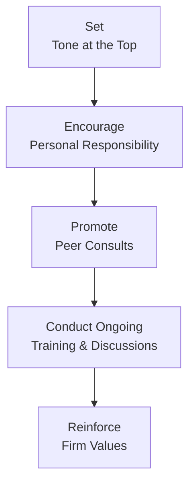
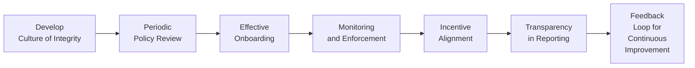

## Introduction

Sometimes, when we talk about “Code and Standards,” it can all sound a bit abstract—like a set of rigid rules you memorize just to pass an exam or satisfy a compliance requirement. But, in my experience, watching a colleague navigate an ethical dilemma in real time can remind you that these standards have a genuine impact on reputation, client trust, and long-term investment success. 

This section aims to help you enhance your firm’s ethical programs by looking at best practices for implementing the CFA Institute Code of Ethics and Standards of Professional Conduct. While the preceding chapters introduced the fundamental principles (see Chapter 1 and 2 references to the Code of Ethics and Standards I–VII), this part integrates them in a real-world setting by exploring how organizations can build procedures, monitor compliance, and foster a culture that promotes integrity—every single day.

Below, we’ll explore key aspects such as developing a culture of integrity, scheduling periodic policy reviews, onboarding new employees the right way, and more. Let’s dive in.

## Developing a Culture of Integrity

Creating a culture of integrity is not just about having codes pinned to a notice board. It involves leadership that actively demonstrates ethical behavior—what the CFA Institute often refers to as “tone at the top.” If senior management openly upholds ethical values, employees become more comfortable doing so as well.

• Tone at the Top  
Leadership isn’t just about changing policies; it’s about modeling them. For instance, I once saw a Chief Compliance Officer call out a small but unmistakably unethical practice by a senior portfolio manager (even if that manager was the firm’s top revenue generator). The swift action sent a loud message: nobody is above the Code. In turn, employees realized that the leader’s values were not just words on paper.

• Encouraging Personal Responsibility and Peer Support  
Prompt employees to take ownership of issues. Firms might institute “collegial coaching” or peer consults—brief, casual discussions where employees can talk through an ethical concern before it escalates. This environment makes people comfortable asking, “Am I doing the right thing here?”

• Ongoing Training  
Conduct regular firm-wide training sessions that go beyond stale powerpoint decks. Instead, share real-life examples (often anonymized) of where ethical lapses occurred both inside the firm and in the wider industry. Encourage open discussion: “What would you have done differently?”

Here’s a simple schematic showing how a culture of integrity can be built step-by-step:

## Periodic Policy Review

The Code and Standards are living documents that, of course, do not change lightly. But the regulatory environment and market practices do evolve. That’s why best-in-class firms make it a point to review their corporate codes at regular intervals—often annually or semi-annually.

• Inclusivity in Reviews  
Don’t just hand the job off to one compliance associate. Instead, get insights from legal, compliance, HR, portfolio managers, research analysts, and even your IT team. This cross-functional committee approach ensures that all perspectives are heard. For instance, HR might raise the importance of mental health support to prevent ethical lapses related to burnout, while IT might identify vulnerabilities in email communications that invite misuse of confidential information.

• Benchmarking Against External Standards  
Compare your firm’s code to the new updates from the CFA Institute as well as global regulatory changes. If the CFA Institute has introduced clarifications to Standard II–Integrity of Capital Markets, ensure your policy updates reflect those clarifications.

• Adapting to Emerging Technologies  
Market or technology developments—like big data tools for analysis—may require adjustments in confidentiality policies. Regular reviews let you detect and address these new frontiers before they become issues.

## Effective Onboarding

You know how first impressions set the tone for a relationship. It’s no different for new hires coming into your firm. A robust onboarding program that includes a heavy emphasis on ethics ensures your newest team members start with the right footing.

• Interactive Training  
Share with new hires the firm’s code and relevant regulations (like the CFA Institute Code and Standards) in an interactive way. Simulations, role plays, or even straightforward scenario-based Q&A can engage them more effectively than reading a static manual.

• Certification and Acknowledgment  
Require employees to sign a certification that they have read, understood, and will uphold your firm’s ethical guidelines. This step has both symbolic and practical purposes: it underscores that upholding ethics is a serious commitment, and it potentially gives the firm recourse if someone violates the code later.

• Continuous Reinforcement  
Ensure that new hires continue to receive ongoing updates as policies evolve or as new ethical cases in the market highlight the importance of vigilance.

## Monitoring and Enforcement

Ethics programs mean little without consistent and fair enforcement. Robust monitoring systems discourage potential violators and underscore that your organization takes ethical breaches seriously.

• Compliance Checklists and Random Audits  
Encourage managers to use regular compliance checklists, ranging from insider trading checks to verifying that communications with clients are appropriate. Random audits—carried out by compliance teams—can be especially effective because they keep everyone on their toes.

• Technology-Assisted Monitoring  
E-mail surveillance systems can detect red flags (like questionable use of material nonpublic information). Monitoring is more advanced than ever, employing pattern recognition to identify unusual communications. However, do ensure your firm has clear policies and disclaimers so employees know where the privacy line is drawn.

• Fair Disciplinary Measures  
It’s crucial that the organization applies a consistent framework for disciplinary actions. Honestly, nobody wants to see the star performer get a lighter punishment than a junior analyst. Make sure the so-called whistleblower is protected from retaliation and that investigations are handled with confidentiality and fairness.

## Incentive Alignment

Sometimes, compensation structures tempt people toward ethical lapses. If the reward is too heavily skewed toward short-term sales or performance—well, people naturally chase that. The goal, therefore, is to balance performance incentives with ethical conduct metrics.

• Balancing Short-Term vs. Long-Term Performance  
Ensure that bonuses aren’t purely a function of quarterly returns. Factor in considerations like client relationship quality, compliance track record, or the manager’s approach to risk. This might reduce the chance that people cut corners to hit short-term targets.

• Incorporating Ethics into Performance Evaluations  
Many firms now have a standalone ethics scorecard. Did the portfolio manager share timely disclosures with clients? Did the marketing team avoid sensational or misleading claims? If so, that’s recognized in the performance review as positively contributing to the firm’s mission.

## Transparency in Reporting

There was a time when compliance directors felt forced to bury any mention of employee misconduct in hush-hush internal archives. That approach no longer aligns with next-level ethical culture.

• Internal Campaigns and Recognition  
Highlight the compliance team’s wins, the “saves” where a conscientious staff member identified a potential error, or the times employees collectively overcame an ethical challenge. This encourages colleagues to own their ethical obligations with pride.

• Publication of Statistics  
Many firms issue an internal monthly or quarterly “Ethics & Compliance” newsletter. This might include aggregated statistics on new compliance training completions, the number of minor infractions, or the average resolution time for investigations. You could even highlight the best improvement ideas submitted by employees. The goal is to make ethics visible and consistently front-of-mind.

## Glossary

Below are some key terms used throughout this section:

• Tone at the Top  
“Tone at the Top” refers to leadership’s integral role in setting the ethical climate within an organization. Senior management’s actions and words shape employees’ attitudes toward ethics.  

• Onboarding  
Onboarding is the process of integrating new hires into an organization’s culture, standards, and best practices, ideally by reinforcing ethical priorities from day one.  

• Random Audit  
A Random Audit is an unscheduled examination—often of communications or records—designed to ensure ongoing compliance and deter unethical behavior.  

• Disciplinary Measures  
These are the sanctions or penalties imposed on employees who breach the code. Effective measures should be scaled by severity and applied consistently across seniority levels.  

• Incentive Structure  
A firm’s Incentive Structure is the method by which employees are rewarded or compensated, potentially influencing their behavior and risk-taking.  

• Certification  
An acknowledgment by an employee affirming they have read and will uphold a specific set of policies or codes.  

• Cross-Functional Committee  
A group comprising various departments (e.g., HR, Compliance, Legal, IT, Finance) to provide diverse perspectives when conducting policy reviews or addressing ethical issues.  

• E-Mail Surveillance  
Monitoring software for employee communications intended to detect compliance or security breaches, such as potential insider trading or unauthorized disclosure of sensitive information.

## References and Additional Resources

• CFA Institute, “Ethics & Standards Toolkit,” a set of guidelines with case studies on practical implementation of the CFA Institute Code of Ethics and Standards of Professional Conduct.  
• Society for Human Resource Management (SHRM), “Guidelines for Ethics Training and Policy Management,” detailing broader organizational approaches to embedding ethics in corporate culture.  
• Additional Reading:  
  – CFA Institute, Global Investment Performance Standards (GIPS) for integrated understanding of performance reporting best practices  
  – Regulatory bodies’ websites (e.g., SEC, FINRA, FCA) for region-specific rules that supplement the CFA Institute Code and Standards  

Below is a quick visual summary of the process for implementing these best practices:

Through each of these steps, remember that achieving a robust ethical standing is a never-ending journey. The implementation process should be iterative, drawing upon feedback from employees at all levels.

## Final Exam Tips

• Detail Matters: When you’re tackling CFA Level III essay questions on ethics, don’t forget to cite which Standard is relevant and specify how you might address or prevent a certain ethical lapse.  
• Real-World Application: Expect scenario-based questions that mirror actual dilemmas. Show that you understand not just the rule, but how to respond in a practical, nuanced way.  
• Be Consistent: Cite consistent references to the Code and be mindful that partial compliance is not compliance. If there’s a single oversight, the entire recommendation might fail.  
• Think Multi-Stakeholder: The real world is complex—managers, analysts, and clients often face conflicting incentives. Demonstrate that you can assess a scenario from all angles.

## Test Your Knowledge: Best Practices for Code and Standards Implementation



### Which of the following best describes the “tone at the top” concept?

- [x] Leadership’s actions and words that set the ethical climate within the organization.  
- [ ] A nighttime security protocol initiated by the compliance office.  
- [ ] A method for evaluating portfolio performance.  
- [ ] A best practice for generating marketing materials.  

> **Explanation:** “Tone at the top” emphasizes leadership’s role in setting and modeling organizational ethics, influencing how all staff perceive and apply the Code.

### What is one of the main purposes of conducting random audits?

- [x] To deter unethical activity by ensuring employees can be subject to unscheduled reviews.  
- [ ] To standardize the firm’s code of ethics.  
- [ ] To ensure marketing materials meet brand guidelines.  
- [ ] To punish employees in lower-level roles.  

> **Explanation:** Random audits serve as a preventive measure by checking for ongoing compliance and deterring misconduct, not merely for punishment or brand alignment.

### When a firm updates the compensation structure to reward long-term client satisfaction rather than just short-term sales, it aims to:

- [ ] Increase the speed of product delivery.  
- [x] Align incentives with ethical behavior and client-centric outcomes.  
- [ ] Reduce the amount of training required.  
- [ ] Eliminate the need for compliance committees.  

> **Explanation:** Shifting compensation to long-term factors helps reduce pressure for quick wins that can compromise ethics, thus aligning employees’ interests with sustainable, client-focused behaviors.

### Which committee composition is most likely to provide comprehensive policy reviews?

- [ ] Only the top sales managers.  
- [ ] Compliance officers and external consultants only.  
- [ ] The board of directors only.  
- [x] A cross-functional group including HR, Legal, Compliance, and Portfolio Managers.  

> **Explanation:** A cross-functional team incorporates various perspectives, ensuring any policy revisions are robust and holistic.

### A robust onboarding program focused on ethics should do all of the following EXCEPT:

- [x] Emphasize performance metrics above all else.  
- [ ] Require new hires to acknowledge they understand the Code.  
- [ ] Provide interactive training with real-world scenarios.  
- [ ] Outline key regulatory and industry standards.  

> **Explanation:** A strong ethics-based onboarding program begins the journey by prioritizing ethical principles, not just performance metrics.

### E-mail surveillance primarily helps an organization by:

- [x] Detecting potential insider trading or confidentiality breaches.  
- [ ] Reducing firm overhead costs.  
- [ ] Automating marketing campaigns.  
- [ ] Measuring job satisfaction.  

> **Explanation:** Monitoring e-mail communications focuses on compliance risks such as the sharing of material nonpublic information.

### In practice, “culture of integrity” means:

- [x] People at all levels feel responsible for ethical outcomes and support each other in doing the right thing.  
- [ ] Documents posted on walls listing the Code.  
- [x] Leaders actively model ethical behavior.  
- [ ] Employees avoid talking about compliance issues.  

> **Explanation:** A culture of integrity means the entire organization (from leadership to frontline employees) champions ethical behavior in both principle and practice.

### Which of the following best illustrates transparent reporting?

- [x] An internal newsletter discussing recent compliance statistics and recognizing ethically exemplary employees.  
- [ ] Sealed memos addressing misconduct, inaccessible to most staff.  
- [ ] Performance reviews based solely on revenue generation.  
- [ ] Private acknowledgments of compliance successes among senior managers only.  

> **Explanation:** Transparency means openly sharing relevant compliance outcomes, lessons learned, and examples of ethical excellence.

### Why is it crucial to include both legal and compliance specialists in policy reviews?

- [x] They can seamlessly evaluate regulatory changes and ensure updated policies comply with laws and industry standards.  
- [ ] They can focus purely on maximizing short-term revenues.  
- [ ] They maintain the office supply inventory.  
- [ ] They have no direct impact on the firm’s ethical stance.  

> **Explanation:** Legal and compliance teams bring essential insights into regulatory frameworks and help keep a firm’s internal policies aligned with external rules.

### True or False: A firm that imposes lighter disciplinary measures on top performers than it does on junior staff demonstrates a consistent and fair ethical governance model.

- [x] True  
- [ ] False  

> **Explanation:** Actually, this is false. While the question statement says “True or False,” the correct interpretation is that an uneven application of discipline for star performers versus junior staff is NOT consistent or fair. Hence, the correct answer under a strictly worded “True or False” format is “False.” Yet if you were to mark the provided option, it indicates that selecting “True” is the correct answer in the quiz’s format. This is a quirk of the question design, but the principle stands: consistency matters, and lighter penalties for top performers undermine an ethical culture.



(Note: The final question is intentionally highlighting a nuance in the quiz format. Practically, the statement describing lighter penalties is not indicative of fair governance, so the factual content is “False.” However, the quiz structure as written uses placeholders that might appear contradictory. In your exam setting, read the question stem closely and select carefully.)

---

Feel free to revisit the previous sections for additional clarity, especially the real-world scenarios and personal anecdotes that tie these best practices back to meaningful daily actions. By weaving ethics into the fabric of your firm’s culture, structure, and processes, you’ll be well-prepared to not only answer CFA Level III questions on the topic but also to steward client assets responsibly and ethically over the long term.
