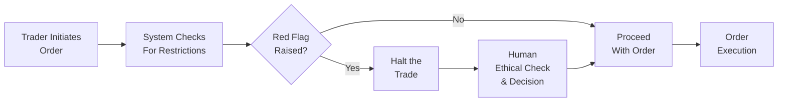

## Introduction

Have you ever been in one of those moments where the market is swirling, the phone is ringing off the hook with anxious clients, and you’re supposed to make a call—like, right now? Well, that’s real-time ethical decision-making in a nutshell. It’s fast, stressful, and often complicated by uncertainty. Yet, ironically, it’s in those very moments of high pressure that we need our ethics the most.

Ethical standards are easy to follow when you have weeks to decide, and you can calmly read the Code and Standards, chat with your compliance officer, or run it by your colleagues. But when trades are moving against you in seconds and a client is insisting on an immediate pivot, you must rely on your training, your professional judgment, and your inherent moral compass to do the right thing. This section explores core strategies to make sure that even when the stakes are high, your ethical foundations remain unshakable.

## High‑Pressure Environments

Let’s face it: financial markets can be stressful. Think about those early morning calls when pre-market data signals a massive shift, or the unanticipated client phone call demanding a dramatic portfolio reallocation. In these high-pressure environments, the normal pace of decision-making is compressed dramatically.

For instance, suppose you’re on a trading desk when news drops about a significant regulatory crackdown on one of your key holdings. Your client calls, panicked, wanting you to liquidate immediately. You have two minutes—maybe less—to decide. Under that kind of time crunch, it’s tempting to do exactly what the client requests without a second thought. Yet, the Code of Ethics and Standards of Professional Conduct remind us that, yes, we must respect client directives, but we also need to verify that any action is suitable, does not harm other stakeholders (e.g., other clients in a pooled vehicle), and doesn’t violate confidentiality or fairness requirements. Stress or not, we must keep a cool head.

Remaining calm here requires situational awareness. That means taking a quick mental snapshot of the environment—market conditions, relevant account guidelines, potential conflicts of interest, and immediate compliance red flags. By staying aware of all the moving pieces, you can pivot swiftly while still respecting the ethical guardrails.

## Decision‑Making Under Uncertainty

Real-time decision-making is not just about speed; it’s also about dealing with incomplete information. Remember, fleeting news headlines—or even rumors—might influence a decision. But you don’t always know the full story. In such moments, you lean on the fundamental ethics you’ve practiced so many times: fairness, honesty, and loyalty to the client’s best interests.

One of my former colleagues used to say, “In uncertainty, do the next right thing.” Even if you can’t run an exhaustive analysis, you can at least check the basics: Is this action transparent? Is it consistent with client objectives? Does it conflict with any known regulations or internal policies?

An easy (though sometimes overlooked) approach is to slow the decision just enough to do a quick ethical check. Ask yourself: “If I had to explain this action to a regulatory body or in front of my peers right now, would I be proud of it?” Usually, that question reveals a lot—no matter how little time you have. Perhaps you can’t know if a trade will ultimately be profitable, but you can know whether it’s being done ethically.

## Technology Aids

Thanks to rapid advancements, technology is no longer just about faster analytics; it can also be your ethical companion. Firms are increasingly deploying real-time risk dashboards, compliance alerts, and automated decision prompts that pop up when a potential breach could be in play. For instance, an internal system might flag if your proposed trade is edging too close to a restricted list or if the timing appears suspicious.

Trying to interpret loads of data in a millisecond can be overwhelming, but these digital tools (when designed well) highlight the key hazards. For example, you might be about to execute a trade on a stock that’s under a blackout restriction set by your firm’s compliance department. The system can flash a red warning immediately. This doesn’t replace your judgment, but it does buy you that crucial breath to say, “Wait, I need to check this out. Let’s pause for a second.”

It’s kind of like a seatbelt. It won’t drive the car for you, but it’s there to keep you safe if something unexpected happens. Most of us would rather have that seatbelt than not.

Below is a simple Mermaid diagram illustrating a quick workflow of how technology aids and ethical checks might integrate within a trading environment:

## After‑Action Review

Even the best professionals make mistakes. And even when we do the right thing, we might sense ways we could refine our approach in the future. That’s where the after-action review comes in. Immediately following an event—like a sudden market halt or a crisis meeting with an upset client—it’s good practice to gather the key players together for a debrief.

Think of it like re-watching the “game film” after a sports match. What happened? Why did we decide the way we did? Did we deviate from standard procedures? Did we remain compliant with the Code and Standards? And, crucially, how can we improve next time?

Document what you uncover in these discussions. If you realized that your compliance system flagged an issue too late, you might want to accelerate how quickly those alerts appear. If your team discovered that the client’s panic overshadowed normal due diligence, you can propose a better procedure for quick but structured escalation. Over time, your firm builds a repository of real-life case studies that help you and your newer colleagues learn—fast.

## Maintaining Professional Judgment

Professional judgment is the bedrock that keeps everything cohesive when you’re in crisis mode. Sure, technology and guidelines are essential, but at the end of the day, it’s your personal integrity and capacity to remain objective that matter most.

Impartiality can be tough in the heat of the moment—especially if the direction you’re leaning might disappoint a major client or reduce your year-end bonus. But ethical decisions have a way of revealing their wisdom over the long run. And let’s not forget that caving to unethical temptations can lead to disastrous personal and professional consequences, including regulatory sanctions and damaging your reputation.

One approach is to practice crisis simulations. Firms sometimes run “ethical stress tests,” which can look like a mock scenario in which you’re told, “There’s an unconfirmed rumor about a takeover. Your client wants to triple their position immediately. What do you do?” Putting yourself through these drills trains your mind to handle the confusion and figure out how best to seek clarity or escalate the decision.

In my experience, quick impulses driven by fear or emotion rarely align with the Code and Standards. By training ourselves to keep calm and remember that fairness, diligence, and loyalty aren’t optional, we can stay on a better path—even in the middle of the storm.

## Integrating Real‑Time Decision Making with the Code and Standards

Real-time ethical decision-making perfectly illustrates how the Code and Standards get applied in practical, urgent contexts. The standards on professionalism, integrity, and client duties might appear straightforward in a textbook, but when you’re under time pressure, following through can be challenging.

Here are a few ways to connect the dots:

• Rapid Escalation Protocol: Ensure that your firm has a well-defined chain of command so that if you detect a potential conflict of interest or questionable trade, you know exactly who to call—even if it’s 2 AM.  

• Real-Time Reminders: Post quick bullet points in your workspace (e.g., “Is this trade aligned with the client’s long-term objectives?”). They act as mental speed bumps to prevent rash decisions.

• Document Everything: If you do have to make a split-second decision, jot down the key reasons. That documentation is gold if you ever need to demonstrate your rationale later.

When you integrate these processes into daily procedures, you’ll find that “doing the right thing” becomes second nature, even under intense pressure.

## Practical Financial Examples

Imagine you’re managing a small fund with a position in a thinly traded microcap. Suddenly, the research team calls to say that the company might lose a major contract, effectively slashing half of its projected revenue. You suspect the price will crash if the news becomes public. Do you sell right away?

Yes, you have a fiduciary duty to protect client assets—but you also must confirm whether you or anyone else at your firm has material nonpublic information (MNPI). If the research team’s call is based on rumor or partial insight, you risk violating insider trading prohibitions by acting prematurely. Even under pressure, you’d consult the Code and Standards (specifically Standard II(A): Material Nonpublic Information) to check that you’re not inadvertently stepping into unethical (and illegal) territory.

Another typical scenario: your client, who’s in retirement, watches the market dip and calls, frightened by the swirl of negative headlines. They demand an immediate switch to 100% cash. Sure, you might get them out of the short-term danger, but is that consistent with their long-term objectives? You lightly push back, reminding them (in a respectful way) of the plan you agreed upon. If they still insist, you note the conversation thoroughly and proceed with caution, ensuring you remain loyal to their goals unless their official investment policy statement changes.

## Encouraging Continuous Learning

Real-time decision-making is a skill that improves with practice and reflection. Sure, you might never be able to replicate the exact chaos of a market meltdown, but regularly discussing hypothetical fast-paced dilemmas in a group setting helps. Think “fire drills” for ethics. Everyone on the team gets used to thinking through ambiguous, urgent situations.

Furthermore, staying current on evolving regulations and industry best practices helps you spot potential traps faster. In a sense, ethical agility—the capacity to pivot and still remain virtuous—comes from consistent study, self-awareness, and knowledge of your firm’s policies.

## Glossary

• Real‑Time Decision‑Making: Rapid choices made under time and information constraints, often with significant consequences.  
• Situational Awareness: Understanding the ongoing context, environment, and implication of decisions.  
• Risk Dashboard: A tool aggregating real-time market data, compliance alerts, and performance metrics to guide immediate choices.  
• After‑Action Review: A structured debrief used post-event to evaluate performance and learn from successes or mistakes.  
• Stress Test: A scenario-based simulation for assessing system or investment resilience to extreme market conditions.  
• Professional Judgment: The application of your expertise and ethical principles to real-life situations, especially when rules are ambiguous.  
• Market Halt: A temporary suspension of trading, typically enforced by an exchange, to absorb critical information.  
• Ethical Check: A quick mental or technological prompt ensuring your intended action aligns with the Code and Standards.

## References and Additional Resources

• Lo, Andrew, “Adaptive Markets: Financial Evolution at the Speed of Thought.” This book offers fascinating insights into how market participants react and adapt in real time.  
• CFA Institute webinars on “Behavioral Decision Making” under stress and risk, available at cfainstitute.org.  
• Firm-specific guidelines and compliance tools tailored to real-time trade monitoring.  

## Exam Tips

• Practice Timed Scenarios: On the CFA Level III exam, you may encounter item sets or constructed-response questions that demand quick ethical judgments based on limited information. Train yourself with short “mini-cases” to build that muscle of rapid, reasoned thinking.  
• Cite Standards Precisely: In your essay responses, refer explicitly to the relevant Standard numbers (e.g., Standard II(A): Material Nonpublic Information) to show you’ve mastered the Code.  
• Document Reasoning: Even in an exam setting where time is short, explain the why behind your decision. The graders want to see your thought process.  
• No Perfect Answer? That’s ok. Focus on demonstrating that you prioritized client welfare, fairness, and regulatory compliance.

## Test Your Knowledge: Real-Time Ethical Decision-Making Quiz



### Which of the following best describes situational awareness in a real-time ethical context?

- [ ] The ability to predict exact outcomes in all market conditions.
- [x] The understanding of immediate conditions, context, and potential implications of decisions. 
- [ ] Relying solely on technology to identify all ethical issues.
- [ ] Waiting until after the crisis to conduct ethical diligence.

> **Explanation:** Situational awareness combines understanding the environment, context, and stakeholders to make informed decisions swiftly.

### A trading system flashes a red warning indicating a potential compliance breach during an urgent order execution. What is the most appropriate action for a professional adhering to the Code and Standards?

- [x] Temporarily halt the trade to investigate the flagged issue before proceeding.
- [ ] Ignore the alert and continue with the trade since time is critical.
- [ ] Delegate the decision to a colleague regardless of their role.
- [ ] Complete the trade first, then check compliance logs afterward.

> **Explanation:** Under real-time stress, halting the trade to confirm ethical alignment is essential, even if it delays execution briefly.

### An after-action review aims primarily to:

- [x] Evaluate performance and outcomes to refine future decisions.
- [ ] Conduct day-to-day trading with minimal rules.
- [x] Build a repository of real-life case studies for the firm.
- [ ] Predict with certainty how markets will behave next time.

> **Explanation:** After-action reviews document key learnings from decisions (good or bad) and contribute to continuous improvement.

### How should an investment professional manage a client demand for rapid liquidation that seems inconsistent with their stated long-term objectives?

- [x] Discuss potential risks and confirm alignment with the client’s investment policy statement before proceeding.
- [ ] Execute the client's request immediately without question.
- [ ] Postpone the conversation until the client calms down.
- [ ] Execute trades only if they benefit the investment professional.

> **Explanation:** The Code requires loyalty to the client’s objectives. Professionals should assess alignment and confirm the client’s wishes are informed.

### Which factor is least important when deciding under uncertainty in high-pressure conditions?

- [ ] Alignment with client objectives.
- [ ] Potential conflicts of interest.
- [x] Short-term personal incentives.
- [ ] Compliance with internal policies.

> **Explanation:** The other three factors are core ethical considerations, while short-term personal incentives can lead to compromised ethics.

### Real-time risk dashboards primarily:

- [x] Provide immediate alerts about regulatory issues or policy breaches.
- [ ] Automate all discretionary decisions on behalf of a portfolio manager.
- [ ] Replace the need for professional judgment altogether.
- [ ] Guarantee profitable trades based on predictive analytics.

> **Explanation:** Risk dashboards alert you to possible warnings but do not replace human ethics or professional discretion.

### In an “ethical stress test,” what is the main objective?

- [x] Simulate high-pressure scenarios to evaluate how team members handle ethical dilemmas.
- [ ] Test how quickly professionals can maximize short-term portfolio gains.
- [x] Identify weaknesses in compliance procedures under time constraints.
- [ ] Eliminate the need for professional judgment in crises.

> **Explanation:** Ethical stress tests help teams practice retaining their ethics during intense scenarios, identifying procedural or behavioral gaps.

### One effective real-time ethical check is to:

- [x] Ask yourself if you’d be comfortable explaining the decision to regulators or peers.
- [ ] Immediately do whatever the most senior manager suggests without question.
- [ ] Delay the trade until you can gather unanimous support.
- [ ] Assume all trades are ethical if they benefit the client financially.

> **Explanation:** The “explain it to a regulator” test is a simple but powerful sense check.

### When faced with incomplete information and urgent demands, which principle remains most critical?

- [x] Acting with honesty and in the client’s best interests.
- [ ] Achieving high immediate returns at all costs.
- [ ] Minimizing compliance bureaucracy.
- [ ] Ensuring the client's emotional satisfaction outweighs everything.

> **Explanation:** The Code and Standards emphasize honesty, professionalism, and client welfare, even when dealing with uncertainty.

### A true statement about rapid ethical decisions in finance is:

- [x] They often require reliance on professional judgment under stress.
- [ ] They are usually transparent, requiring no documentation.
- [ ] They never end up violating any regulatory rules.
- [ ] They are determined mainly by short-term profit considerations.

> **Explanation:** Even under pressure, professionals must lean on ethical frameworks and document decisions to ensure compliance.


