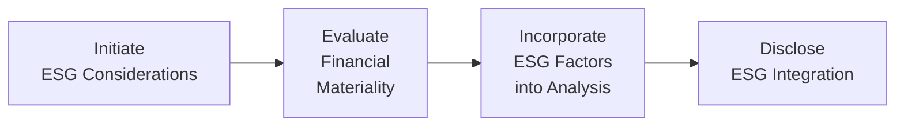

Before diving in, let me just say: ESG—a term you’ve probably heard floating around in countless investment meetings—applies so much more broadly than just “green” or “socially responsible” products. It’s about systematically thinking through the Environmental, Social, and Governance aspects that might affect an investment’s performance or overall impact on society. Years ago, a friend of mine (who manages a small investment advisory firm) told me how her team once overlooked local labor concerns at a portfolio company. The result? A strike, intense media scrutiny, and ultimately lost revenue for her clients. That experience made me realize that ESG issues aren’t fluffy side concerns—they can strike at the heart of returns and reputation.

Let’s explore how ESG-related factors fit neatly into the CFA Code and Standards, especially at Level III, where we’re applying ethics at the portfolio management level.

## Integrating Sustainability into the Code

Sustainability is increasingly recognized as an essential facet of fiduciary responsibility, particularly if clients explicitly mention sustainable objectives or if ESG issues could be materially relevant to investment outcomes. “Materially relevant” sometimes sounds like a vague phrase in finance, but it basically means stuff that could actually influence an asset’s risk/return profile—and thus, the client’s bottom line.

I once interacted with a client who explicitly stated they wanted “clean energy exposure” in their portfolio—no ifs, ands, or buts. Implementing that desire ran deeper than just avoiding certain high-carbon companies. It involved analyzing supply chain intricacies, verifying expense ratios for specialized ESG index products, and disclosing the potential tracking error from mainstream benchmarks. So, from an ethical standpoint, you’re not only addressing the client’s stated preferences but also anticipating how ignoring these preferences—or ignoring relevant ESG indicators in general—could pose future reputational or regulatory risks.

### Case in Point: Ignoring ESG?

Imagine an investment manager disregarding an oil producer’s large carbon footprint because the short-term profit margins look appealing. If carbon regulation tightens or climate advocacy groups put pressure on the producer’s license to operate, that “cheap” stock can quickly depreciate—and guess who bears the brunt? The client. That’s how ignoring ESG can not only damage a manager’s credibility but also potentially undermine the client’s best interests.

## Materiality of ESG Information

A central question is: Which ESG data points are financially material and which ones simply reflect an investor’s subjective values? And how about cases where a client’s policy guidelines require explicit ESG integration? At Level III, you should be ready to demonstrate your skill in discerning this materiality and explaining it to stakeholders.

Let’s break down an example:

• You’re assessing a mining company in a region prone to water shortages.  
• Water usage and pollution management might be extremely material to that local community and, consequently, to the business’s license to operate.  
• If the company mishandles these concerns, there’s a risk of losing permits, encountering lawsuits, or dealing with public backlash—any of which can sink share prices.  

Hence, from an ethical standpoint under the Code, you must ensure that you’re transparent about how you’ve gathered and considered water usage statistics. If you omit them entirely, you risk misrepresenting the security’s risk/return profile.

### Gathering and Evaluating ESG Data

In practice, ESG data can come from specialized research providers, corporate sustainability reports, NGO findings, or direct company engagement. For instance, the Sustainability Accounting Standards Board (SASB) provides industry-specific guidelines that help analysts identify which ESG metrics matter most for each sector. While it’s tempting to apply a one-size-fits-all approach, the ethical path is to refine the analysis to address each company’s or sector’s unique ESG risk profile.

If you find that local labor practices or greenhouse gas emissions are immaterial for a certain insurance-based portfolio, it’s okay to disclose that. The point is to be methodical, consistent, and transparent, so stakeholders (especially clients) understand why you either included or excluded certain metrics.

## Ethical Disclosure and Reporting

Disclosure is everything in ethical finance. The aim here is to:

1. Provide robust reports regarding ESG integration in your investment process.  
2. Guard against “greenwashing,” an oh-so-tempting practice of making something look more environmentally or socially friendly than it really is.

Green bonds, for instance, are marketed to investors wanting environment-focused projects. But if 90% of the bond’s proceeds go to a company’s generic capital expenditures, that’s misleading. Labeling something as “green” for marketing reasons, without evidence-based allocation, is unethical—and certainly violates the spirit of the CFA Code and Standards.

### Avoiding Greenwashing

• Carefully label products by referencing credible frameworks—like the ICMA (International Capital Market Association) Green Bond Principles—or trusted third-party verifiers.  
• Provide transparent breakdowns of how green bond proceeds are allocated and monitored.  
• Encourage independent auditing to confirm the actual environmental or social impact.

By doing so, you mitigate reputational risk, maintain professional integrity, and uphold the Code’s directive to act in the best interests of clients.

## Balancing Conflicts

Here’s where it gets tricky. Let’s say a client invests predominantly for profitable returns but also says, “I really want to avoid invests in arms manufacturers or heavy polluters.” Then the manager sees a high-return opportunity in a security that is borderline. Whose interest prevails: the financial return objective or the client’s moral stance? Under the Code, your primary duty is to the client’s well-stated objectives. If their Investment Policy Statement (IPS) clearly prohibits certain sectors, you must respect that constraint—even if you believe those stocks are undervalued.

### Real-World Example

I recall a scenario where an institutional client was laser-focused on returns. Yet, they also had a broad mission to improve local communities. A certain chemical company had a history of spills and was involved in a handful of lawsuits. The short-term financials were excellent, but the manager felt uneasy about the potential long-term repercussions. Balancing that conflict actively—through deeper research, direct engagement with the company, and clarifying the client’s tolerance for reputational risk—was the ethically correct move. In that instance, the manager discovered the client truly wanted to steer clear of companies with repeated environmental scandals. That meant ruling out the chemical company and looking for an alternative investment that captured similar exposure without the same baggage.

## Standards Alignment

So how does this tie back to the CFA Code and Standards? In truth, ESG integration isn’t an add-on. It intersects with:

• Standard I: Professionalism – Diligence and thoroughness in ESG data analysis.  
• Standard II: Integrity of Capital Markets – Avoid misrepresenting or manipulating sustainability info.  
• Standard III: Duties to Clients – Honor client objectives, including those relating to ESG.  
• Standard V: Investment Analysis – Incorporate all relevant data, including ESG metrics, into research.  
• Standard VI: Conflicts of Interest – Disclose any conflicts, such as ownership in certain ESG rating agencies.  
• Standard VII: Responsibilities as a CFA Member – Continue developing your ESG expertise to serve the public good.

Across the industry, frameworks like SASB or the Global Reporting Initiative (GRI) are there to help set consistent reporting standards. By adopting these frameworks, you maintain a consistent approach internally (across teams) and externally (with clients and regulators). 

### Team Collaboration for ESG

ESG integration often calls for cross-functional coordination. For instance, your compliance folks can help interpret new regulations around climate disclosures, while your portfolio managers need to incorporate changes in their investment models. In many organizations—particularly larger asset managers—there’s now an ESG committee bridging the gap between compliance, investment, and marketing. Collaboration ensures you have alignment across all these areas so that you’re not inadvertently telling clients contradictory stories about your ESG credentials.

Here’s a simple flowchart depicting a high-level ESG integration process:

It starts with identifying ESG concerns. Then you evaluate their relevance to financial performance or client preferences. Next, you blend those factors into your investment process. Finally, you must disclose your ESG approach and results. None of these steps should be done in isolation.

## Practical Examples and Case Studies

### Example 1: Mining in Sensitive Regions

• A large investment fund holds shares in a gold mining company operating in water-scarce regions.  
• The region’s recent drought intensifies local tensions, and activists are pushing regulators to tighten water permits.  
• Under the Code and Standards, the manager must evaluate and disclose potential regulatory or reputational risks.  
• The final recommendation might involve continued engagement with the company to see if they can adopt water-saving technologies—or partial divestment if the risk is too high.

### Example 2: Social Conflict over Labor Conditions

• A garment manufacturer invests in cheaper labor markets to cut costs.  
• Reports surface of questionable labor practices in some factories, raising the potential for boycotts or regulatory clampdowns.  
• The fiduciary duty includes factoring these social factors into the company valuation. If the company fails to rectify them, the manager is obligated to reassess if continuing to hold that investment is in alignment with client preferences and long-term performance expectations.

## Double Materiality

Double materiality says that ESG issues can be material to 1) financial performance, and 2) social or environmental outcomes. If your client explicitly states they want their portfolio to “do no harm” while still delivering stable returns, you should incorporate that double materiality lens. 

Of course, balancing these twin objectives can be challenging—one might say downright complicated at times—but it’s ethically mandatory if the client’s IPS states these concerns. This is not just about checking boxes on a form. It’s about making sure we do right by the client and by the broader stakeholder community, where relevant.

## Common ESG Pitfalls Under the Code

• Failure to Disclose: Whether that’s underrepresenting a portfolio’s exposure to high-carbon industries or neglecting to mention a new environmental regulation that threatens a key holding—lack of disclosure can breach Standards I and II.  
• Oversimplification: Classifying a stock as “good” or “bad” from an ESG standpoint without deeper research.  
• Inconsistent Methodology: Flipping between different ESG evaluation frameworks just because you want to present the best possible outcome. That can lead to accusations of data cherry-picking.  
• Ignoring Client Objectives: Overriding a client’s ESG preferences because you believe some “sin stock” yields higher returns is unethical if the client’s instructions specifically say to avoid it.

## ESG in Portfolio-Level Decisions

At Level III, it’s not just about individual securities but portfolio-level judgments. For instance, perhaps you’re building a multi-asset portfolio that includes green bonds, equities with strong governance scores, and some conventional holdings that still meet a minimum social threshold. A big part of your job is weighting these components in line with the client’s return-risk-ESG preferences. You might consider using quantitative analysis—like an ESG factor tilt—to see how moderately “greening” the portfolio might shift expected returns or volatility.

### Quick Illustrative Calculation

One approach for gauging a portfolio’s carbon intensity is to compute the Weighted Average Carbon Intensity (WACI). Let’s say each security i in the portfolio has a carbon intensity factor (CIᵢ). The portfolio’s WACI can be calculated as:


\text{WACI} = \sum_{i=1}^{n} \left( w_i \times CI_i \right)


where \\( w_i \\) is the portfolio weight of security i, and \\( CI_i \\) is the carbon intensity measure for security i (often measured in metric tons of CO₂ per million USD of revenue). You might then compare your portfolio’s WACI to that of a benchmark or an ESG-themed index. If you’re bragging about having a “low-carbon fund” but your WACI is actually higher than relevant benchmarks, well, you might need to reevaluate your marketing claims (and your compliance with the Code’s accuracy requirements).

## Summary Best Practices

• Define your ESG integration approach clearly.  
• Evaluate material ESG risks and opportunities.  
• Disclose how ESG factors affect investment decisions and performance.  
• Document your decisions thoroughly, so that clients, regulators, or colleagues can follow your reasoning.  
• Engage with companies when possible to improve their ESG performance.  
• Stay current on evolving standards and frameworks like SASB, GRI, and the CFA Institute’s own ESG Disclosure Standards for Investment Products.

By following these steps, you’re not only ticking an ethical box—you’re very possibly enhancing risk management and generating more sustainable, long-term returns for your clients.

## Glossary

• Greenwashing: Misrepresenting how environmentally or socially responsible an investment or product truly is.  
• SASB (Sustainability Accounting Standards Board): Standards-setting organization that provides industry-specific guidance on disclosing sustainability info to investors.  
• ESG Integration: Incorporating environmental, social, and governance factors into investment analysis.  
• Double Materiality: The notion that ESG influences can affect both financial performance and external stakeholders.  
• Stakeholder Impact: Broader influences a company’s actions have on employees, community members, or the environment.  
• Green Bond: A fixed-income instrument designed to fund environmental projects.  
• Sustainable Investing: Approaches seeking to generate returns and make a positive social/environmental impact.  
• Climate Risk: Threats to an investment’s competitiveness or viability arising from climate change (e.g., physical damage, regulatory changes).

## Exam Relevance and Final Tips

For the CFA Level III exam, ESG considerations can appear in item sets, mini-case studies, or full-blown essay questions. You might need to compare two portfolios with different ESG exposures, or spot an ethical violation in a scenario that hints at greenwashing. When answering, remember to:

• Identify the relevant standard(s) from the Code.  
• Connect client objectives with ESG integration.  
• Properly highlight disclosure requirements.  
• Suggest solutions that align with fiduciary duty and good governance.  

Time management is crucial. If you see an exam question that merges ethics with ESG, quickly outline your approach: interpret the scenario, identify any conflicts, propose solutions referencing the Code, and ensure you provide the reasoning that ties back to the client’s objectives.

## References and Additional Resources

• CFA Institute ESG Disclosure Standards for Investment Products  
• Eccles, Robert G., and Klimenko, Svetlana. “The Investor Revolution.” Harvard Business Review  
• SASB Website: https://www.sasb.org  
• Global Reporting Initiative (GRI): https://www.globalreporting.org  
• ICMA Green Bond Principles: https://www.icmagroup.org

------------------------------

## Test Your Knowledge of ESG Integration and Ethical Judgments



### Which of the following best describes the concept of double materiality?

- [ ] ESG factors only matter if they improve returns.
- [ ] ESG factors cannot be material from an ethical standpoint.
- [x] ESG factors may be financially material to returns and also socially/environmentally relevant.
- [ ] ESG is not part of fiduciary responsibilities.

> **Explanation:** Double materiality recognizes that ESG issues can influence financial outcomes and carry broader stakeholder implications.

### Which action by an asset manager could be considered greenwashing?

- [ ] Providing transparent disclosures on how green bond proceeds are allocated.
- [ ] Stating that an investment might carry certain environmental risks.
- [x] Labeling an investment as “green” without demonstrating its legitimate environmental benefits.
- [ ] Auditing a company’s sustainability reports with a neutral third party.

> **Explanation:** Greenwashing involves misrepresenting environmental or social benefits of a product or investment.

### Which statement aligns with Standard III (Duties to Clients) when a client specifically requests an SRI (Socially Responsible Investing) mandate?

- [x] The manager must respect the client’s objectives and avoid restricted sectors.
- [ ] The manager may invest in restricted sectors if they present higher returns.
- [ ] The manager is obligated to prioritize returns over ESG preferences.
- [ ] ESG preferences violate the CFA Code and Standards.

> **Explanation:** Clients’ clearly stated ESG requirements must be honored, even if that restricts potential investments.

### In evaluating the materiality of an ESG factor, an investment professional should typically:

- [ ] Use a pre-set template that applies to all sectors equally.
- [x] Consider sector-specific guidelines and the impact on long-term performance.
- [ ] Assume ESG factors have a negligible effect on financial returns.
- [ ] Only focus on environmental data.

> **Explanation:** ESG materiality varies by sector and the investment’s context. Sector-specific frameworks like SASB often guide this assessment.

### When a manager encounters an investment with potential high returns but questionable societal impacts, the Code generally instructs the manager to:

- [x] Evaluate client objectives and constraints (including ESG preferences) before investing.
- [ ] Focus solely on maximizing returns for the portfolio.
- [x] Disclose any material risks or conflicts of interest in writing.
- [ ] Invest immediately if the opportunity is profitable in the short term.

> **Explanation:** The CFA Code requires first meeting the client’s documented objectives and constraints, and disclosing conflicts or risks.

### Which of the following is a recommended best practice to avoid greenwashing?

- [x] Align investment disclosures with recognized frameworks (e.g., ICMA, SASB).
- [ ] Market the fund as zero-carbon without verifying carbon offset projects.
- [ ] Withhold green bond allocation details to protect proprietary information.
- [ ] Label the strategy as “ESG-based” if only one holding meets ESG criteria.

> **Explanation:** Using recognized frameworks and verifying allocations minimize misleading marketing claims.

### In the context of ESG integration, which step comes first?

- [x] Determine which ESG factors are relevant for the sector or company in question.
- [ ] Calculate the weighted average carbon intensity of the entire portfolio.
- [x] Engage stakeholders and confirm the client’s ESG preferences.
- [ ] Disclose your ESG approach in marketing materials immediately.

> **Explanation:** Start with identifying what ESG factors are genuinely material, and confirm client objectives. Then, incorporate analysis and disclosure.

### A conflict of interest arising from an ESG specialist team within your firm recommending proprietary ESG scoring tools can be minimized by:

- [x] Disclosing the potential conflict to clients and adopting an external verification process.
- [ ] Using the proprietary tools without discussion or transparency.
- [ ] Ignoring the team’s input entirely to avoid conflicts.
- [ ] Stating that ESG is immaterial to overall performance.

> **Explanation:** Disclosing conflicts and ensuring independence or external validation are key principles of ethical conduct.

### How should an investment professional handle a scenario where a client wants to invest in sectors the professional believes are socially harmful?

- [x] Discuss the ethical considerations but follow the documented client mandate unless it violates standards or regulations.
- [ ] Immediately decline managing the account.
- [ ] Modify the client’s portfolio without informing them.
- [ ] Only consider the highest-yield opportunities.

> **Explanation:** The client’s instructions are paramount if they comply with the law and do not create ethical breaches. Open discussion about potential concerns is prudent.

### A portfolio’s Weighted Average Carbon Intensity (WACI) can be calculated by summing over all securities in the portfolio:

- [x] wᵢ × CIᵢ
- [ ] (CIᵢ ÷ wᵢ)
- [ ] (ESG Scoreᵢ × wᵢ)
- [ ] ∑ (Carbon offsets ÷ wᵢ)

> **Explanation:** WACI = Σ (wᵢ × CIᵢ), measuring carbon intensity on a weighted basis across the portfolio.


