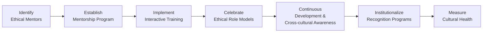

## Overview

Well, if there’s one thing I’ve learned in the world of finance—aside from triple-checking your spreadsheets—it’s that an organization’s ethical culture doesn’t just flourish on its own. You don’t walk into a firm one morning and magically find everyone doing the right thing without guidance or support. An ethical culture is intentional. It’s built. It’s nurtured. And two of the most powerful tools in this construction process are mentorship programs and ongoing ethics training. These initiatives guide not just new hires but also experienced professionals in applying the CFA Institute Code of Ethics and Standards of Professional Conduct (Code and Standards) to everyday tasks. 

In the following sections, we’ll explore how carefully structured mentorship programs and dynamic training methodologies can reinforce ethical behaviors throughout the entire organization. We’ll also see how role models, recognition mechanisms, and continuous learning take that foundation to the next level, embedding ethical norms deeply into your firm’s culture and day-to-day practices. And just so you know, I’ve personally seen these approaches in action—trust me, it’s way more effective than sending out a memo about “being good.”

## Mentorship Programs

### The Mentor-Mentee Relationship
When you begin your career in finance, or even if you join a new organization late in your career, the volume of compliance guidelines and best practices can be a bit overwhelming. This is where mentorship programs shine like a well-managed bond portfolio. Pairing less experienced individuals with seasoned professionals creates a trusted space for questions, discussions, and learning.

• Two-Way Feedback. Mentors provide advice on ethical decisions, drawing from years of experience. Meanwhile, mentees often bring fresh perspectives, especially regarding emerging ethical considerations such as environmental, social, and governance (ESG) factors or new data privacy requirements. This two-way exchange ensures all participants stay current and engaged.

• Structure and Consistency. A formal mentorship program—one where relationships are matched, goals are defined, and schedules are established—is critical. Simply telling someone, “Hey, watch Ms. Smith, she’s a great example,” might work in a pinch. But it’s the deliberate pairing, the continuous dialogue, and the supportive environment that make mentorship truly effective.

• Personal Anecdotes from Senior Staff. In my own experience, one of my most memorable lessons came from a mentor who recounted her involvement in a cross-border investment project that faced a major ethical dilemma around data sharing. Hearing the challenges and thought processes she navigated was infinitely more enlightening than reading a generic case study.

### Common Pitfalls in Mentorship
• Lack of Clear Objectives. Without defined expectations, mentor-mentee sessions can deteriorate into casual chatting, losing the focus on ethical standards or real-world problem solving.  
• Inadequate Commitment. Both mentor and mentee need time to plan, meet consistently, and provide thoughtful insights. Half-hearted participation weakens the program’s impact.  
• Overshadowing. Mentors can unintentionally overshadow mentees’ own judgments. A balance, where mentees learn to trust their own insights, fosters genuine ethical confidence.  

## Ethics Training Methodologies

### Dynamic Training Modules
Let’s face it: monotone lectures about compliance can make anyone’s eyes glaze over. Instead, organizations should offer interactive learning experiences that help professionals internalize ethical guidelines in a memorable way.

Possible training strategies include:
• Real-Life Case Studies. Use anonymized or historical examples where actual business decisions and their outcomes are dissected. Encourage participants to identify violations of the Code and Standards, propose corrective actions, and predict consequences.  
• Group Discussions and Debates. Break participants into teams to argue various sides of an ethical dilemma. This fosters critical thinking and keeps everyone engaged.  
• Interactive Digital Tools. Online simulations or role-playing platforms can replicate real-time scenarios, prompting candidates to make ethical decisions under pressure.  

### Refresher Courses
Because regulations and market dynamics evolve so rapidly, we all should keep our ethical decision-making skills in top shape. Think of it as going to the gym—if you stop going, you lose your conditioning.

• Regular Intervals. Quarterly or biannual refresher courses help solidify prior learning and introduce new content (e.g., recent regulatory changes).  
• On-the-Spot Reminders. Short, targeted e-learning sessions or quick quizzes can remind professionals of important code provisions during busy seasons.

## Building Ethical Role Models

### Identifying Exemplary Leaders
Organizations that want to promote a culture of integrity need visible role models—like champion runners in a track meet—who inspire others to follow in their footsteps. Preferably, these individuals hold influential (but not necessarily senior) positions.

• Peer Influence. Colleagues who see peers “walking the talk” are more likely to adopt the same behaviors.  
• Storytelling. Encourage leaders to share personal stories about times they struggled with an ethical conflict and how they resolved it. I vividly remember a portfolio manager describing how she turned down a lucrative but sketchy side arrangement. That story stuck with me more than any policy manual.

### Celebrating Ethical Behavior
Don’t just identify role models; celebrate them. Whether that’s a monthly recognition, a “gold star” system, or an award at a yearly banquet, public acknowledgment sends a strong cultural signal that ethics matter as much as performance and profitability.

## Continuous Learning and Development

### Ongoing Programs
Maintaining a robust, ethics-focused culture isn’t a one-and-done deal. Firms need to invest in continuous development programs that expand ethical literacy over time.

• Advanced Seminars. These could address specialized ethical challenges, like managing conflicts of interest in multi-asset portfolios or responding to complex cross-border regulatory obligations.  
• Cross-Functional Insights. Inviting compliance experts, legal counsel, or risk managers to share responsibilities and highlight new ethical red flags fosters interdisciplinary collaboration.

### Cross-Cultural Competence
In a globalized marketplace, ethical standards can differ across regions. You might be working in a U.S.-based firm that has joint ventures in Europe and Asia, each region carrying specific cultural nuances.

• Cultural Sensitivity. The Code and Standards provide a base level of conduct, but in certain jurisdictions, regulatory norms differ. Cross-cultural competence means understanding how local practices might influence client privacy laws or conflict-of-interest disclosures. Being respectful and even curious about these nuances encourages staff to seek clarity and avoid accidental violations.  
• Shared Core Values. Regardless of local differences, the organization’s ethical foundation remains the same. Continuous training should clarify how to reconcile local norms with the universal principles in the CFA Institute Code and Standards.

## Institutionalizing Recognition

### Tying Ethics to Career Advancement
Behavioral scientists say that what gets rewarded gets repeated. Imagine a performance review system that includes ethics as a key dimension, along with revenue generation or client satisfaction. That might sound obvious, but many firms overlook it.

• Ethical Leadership Awards. An annual recognition event allows you to highlight role models and reinforce positive behavior.  
• Positive Reinforcement. When employees see a direct link between ethical conduct and opportunities for promotion or differential bonuses, the culture of doing the right thing seeps into everyday decision-making.

### Public and Private Commendations
Some employees might prefer private praise, while others feel more motivated when recognized publicly. Tailor your approach to the individual's preference, but make sure the firm’s broader community sees ethical success stories prominently.

## Measuring Culture and Effectiveness

### Periodic Assessments
“So, how do we know if all this training and mentorship is actually working?” This is a question I’m often asked. One method is to perform regular “culture audits” that combine surveys, focus groups, and data analyses.

• Surveys and Focus Groups. Anonymous surveys can capture employees’ perceptions of the firm’s ethical climate. Focus groups allow for deeper dives, revealing how comfortable professionals feel about reporting potential misconduct.  
• Reduction in Violations. A downward trend in reported infractions or an increase in voluntary self-reporting can be strong indicators that employees feel supported and guided in maintaining ethical conduct.

### Feedback Loops
Create spaces (physical or virtual) where employees can voice concerns or recommend improvements to the ethics program. This might include a simple feedback form embedded into the intranet or periodic open forums where staff can safely and anonymously share suggestions.

## Putting It All Together: A Visual Overview

Below is a simplified flowchart illustrating how mentorship, training, role modeling, recognition, continuous development, and measurement interconnect to promote an enduring ethical culture:

## Practical Exam Tips

• Expect Scenario-Based Questions. In the CFA Level III exam, you might be presented with real-world ways mentorship and training can reduce ethical violations. Practice applying the Code and Standards to these scenarios.  
• Clarify the Importance of Feedback. Examiners often emphasize feedback loops in ethical scenarios. Show that you understand mentorship is reciprocal, not just a one-way street.  
• Connect Ethics to Firm Goals. Essays might ask you to discuss how robust mentorship and institutionalized recognition improve both ethical standards and business outcomes.  
• Be Specific on Training Formats. They might require you to differentiate between static lectures and interactive workshops, or to explain why one is more effective in certain contexts.

## Glossary

• Mentorship Program. A structured relationship pairing less experienced professionals with seasoned experts for personal and professional growth.  
• Interactive Learning. Training methods involving active participation, such as workshops, simulations, and debates.  
• Self-Reporting. Voluntary disclosure of breaches or mistakes by the individual committing them.  
• Ethical Leadership. Leadership style emphasizing fairness, integrity, and the prioritization of ethical principles in decision-making.  
• Cross-Cultural Competence. Awareness and respect for cultural differences relevant to ethical behavior amid varying regional norms.  
• Ethical Climate. The collective perception employees have regarding formal and informal ethical expectations.  
• Focus Group. A small group discussion aimed at gathering in-depth opinions and attitudes about a particular issue—here, ethics.  
• Culture Audit. A review of an organization’s values, beliefs, and practices to evaluate the overall ethical “health.”

## References and Additional Resources

• CFA Institute. “Building a Culture of Integrity.” This framework offers ways to embed ethical behavior into the workplace.  
• Kouzes, James M. and Posner, Barry Z. “The Leadership Challenge.” Classic text on modeling desirable behaviors in leadership.  
• Society for Human Resource Management (SHRM). Various guidelines on training methods, surveys, and measuring organizational culture.

---

## Test Your Knowledge: Mentorship and Ethical Culture Exam Practice



### What is a primary advantage of a structured mentorship program for fostering ethical behavior?

- [ ] It eliminates the need for formal compliance training.
- [x] It offers a two-way learning experience, benefiting both mentor and mentee.
- [ ] It guarantees reductions in legal expenses.
- [ ] It ensures complete cultural uniformity across international branches.

> **Explanation:** Structured mentorship connects experienced professionals with newer employees in a two-way dialogue, enhancing ethical learning for both parties.

### Which of the following is most likely to make ethics training sessions more engaging and effective?

- [ ] Reading the Code and Standards verbatim for two hours.
- [x] Incorporating interactive case studies and peer discussions.
- [ ] Replacing all trainers with AI-based voice-readers for compliance manuals.
- [ ] Limiting training to senior managers only.

> **Explanation:** Interactive content, such as case studies and debates, helps participants internalize ethical principles far more effectively than monotone lectures.

### Why might celebrating employees who exemplify ethical leadership be advantageous?

- [ ] It encourages competition among employees that can undermine team spirit.
- [x] It reinforces positive behaviors and visibly upholds the organization’s ethical values.
- [ ] It allows firms to quantify ethical behavior in monetary terms.
- [ ] It guarantees a complete absence of future ethics violations.

> **Explanation:** Publicly recognizing individuals who act ethically underscores the firm’s commitment to integrity and encourages positive imitation among peers.

### What is a key component of ongoing professional development in ethics?

- [ ] One-time orientation at the start of employment.
- [ ] Providing training materials only during peak business cycles.
- [x] Scheduling periodic refresher courses that evolve with market changes.
- [ ] Hydration reminders during compliance training.

> **Explanation:** Periodic refresher courses keep employees updated on changing regulations and evolving ethical scenarios, ensuring compliance remains top-of-mind.

### Which of the following best describes “cross-cultural competence”?

- [ ] Ability to speak multiple languages fluently.
- [x] Awareness of local norms and practices, combined with alignment to overarching universal ethical principles.
- [ ] Complete replacement of local codes with a single global standard.
- [ ] An advanced computer system that flags any unethical behavior in foreign operations.

> **Explanation:** Cross-cultural competence involves respecting local norms while abiding by the core values and principles set by the Code and Standards.

### Which measure can help a firm determine if its ethical training and mentorship programs are effective?

- [x] A downward trend in reported violations and an increase in self-reporting.
- [ ] A steady rise in financial performance, regardless of complaint data.
- [ ] A boost in marketing budget for branding as an “ethical firm.”
- [ ] Changing the firm’s name to include the word “Ethics.”

> **Explanation:** Decreases in violations and higher self-reporting indicate employees are more mindful of ethical obligations and feel safe disclosing concerns.

### How might an organization institutionalize recognition for ethical behavior?

- [ ] By awarding promotions solely based on sales figures. 
- [x] By linking ethical performance to career advancement or bonuses.
- [ ] By limiting recognition to managers in compliance roles. 
- [ ] By posting the Code in the office pantry.

> **Explanation:** Tying ethical conduct to professional rewards reinforces positive behaviors and demonstrates the firm’s genuine commitment to integrity.

### Why is two-way feedback crucial in a mentorship relationship?

- [ ] Mentees must remain silent while mentors talk.
- [x] Mentors learn from fresh perspectives while mentees gain from seasoned insights.
- [ ] It prevents mentors from disclosing proprietary firm strategies.
- [ ] It exempts mentors from abiding by the Code and Standards.

> **Explanation:** The mentor-mentee dynamic is most beneficial when it is reciprocal, allowing each party to gain new insights and sharpen ethical decision-making skills.

### What role do senior staff personal anecdotes play in fostering an ethical culture?

- [x] They offer real-world insights into handling ethical dilemmas.
- [ ] They reveal personal secrets that can be used for internal gossip.
- [ ] They reduce the need for compliance or legal reviews.
- [ ] They set an unchangeable precedent for all future decisions.

> **Explanation:** When leadership shares personal stories of navigating ethical issues, it resonates more meaningfully with employees than abstract policy statements.

### True or False: One-time ethics training is sufficient to maintain a robust ethical culture in ever-evolving financial markets.

- [x] True
- [ ] False

> **Explanation:** This is a trick question. Actually, the statement is false; a single training session will not keep pace with the dynamic nature of ethical challenges and regulations. Periodic training and continued mentorship are necessary.  


