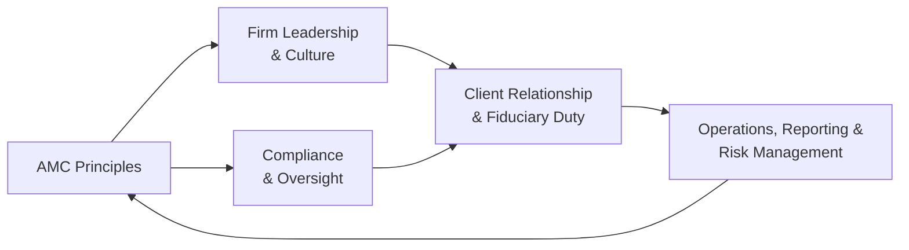

## Introduction

I still remember the day I first explored a smaller asset management firm. They had a tight-knit team working like a well-oiled machine, but they lacked a formalized ethical framework that covered every facet of their operations. It wasn’t that they were cutting corners—quite the opposite, actually. But after a long discussion, I realized many smaller firms simply “do the right thing” without referencing an industry gold standard that can embolden client trust. That’s precisely where the CFA Institute Asset Manager Code (AMC) comes into play.

This section will dig deeply into the purpose and scope of the AMC. The code is, fundamentally, a straightforward yet powerful set of ethical standards that helps asset management firms—small or large, local or global—streamline their internal policies, clarify their fiduciary responsibilities, and elevate client trust. We’ll walk through its importance, explore its global reach, and discuss how it aligns with the rest of the CFA Institute Code and Standards for ethical and professional conduct.

## The AMC at a Glance

The CFA Institute Asset Manager Code (AMC) is a specialized set of professional and ethical guidelines for firms that manage assets on behalf of clients. While the general CFA Institute Code of Ethics and Standards of Professional Conduct focuses on individual responsibilities, the AMC applies specifically to organizations—emphasizing the corporate, and often systemic, aspects of ethical behavior. In other words, this Code is a blueprint for how an organization as a whole, from portfolio managers to compliance officers to trading desks, should approach ethical standards.

What’s special about the AMC is that it doesn’t just tell you what not to do; it also offers affirmative guidance on best practices for compliance, transparency, reporting, stewardship, and so much more. By voluntarily adopting the AMC, a firm signals to clients, regulators, and the larger investment community that it is committed to putting investors’ interests first.

## Why the AMC Matters

Some of us might think, “Well, we already have laws and we already have broad ethical standards, so why do we need another code?” The short answer is that the AMC builds on top of existing legal requirements by focusing on the spirit of fiduciary obligations. It’s there to give managers a globally recognized ethical compass and to help them navigate complex decisions that purely legal guidance might not fully address.

• Enhances Credibility: Formally referencing or adopting the AMC is like telling clients, “We promise to do more than the bare minimum required by law.” This can serve as a powerful differentiator in a competitive marketplace.  
• Consistency Across Borders: Suppose you have asset management operations in multiple countries, each with its own regulations. The AMC is designed as a global standard; it provides cohesive guidance that can complement local rules, bridging the gap among different jurisdictions.  
• Visibility and Trust: Large institutions, pension funds, endowments, foundations, and high-net-worth clients often look favorably on asset managers that adhere to a recognized code of ethics. By following the AMC, you can communicate your ethical commitments in your brochures, marketing documents, or due diligence questionnaires.

## Key Purpose and Objectives

At its heart, the purpose of the Asset Manager Code is to promote high professional standards while ensuring that investor protection remains front and center. This positioning dovetails well with the broader Code of Ethics we discussed in Chapter 1, but now it is laser-focused on the responsibilities of firms as official “stewards” of client assets.

Below are the central objectives that animate the AMC:

• Promoting Ethical Culture: The AMC calls for a culture where fairness, transparency, and accountability are the norm. Instead of just reacting to regulatory mandates, it encourages a proactive stance, motivating firms to raise questions like, “Are we putting our clients first in every decision?”  
• Reinforcing Fiduciary Responsibility: A key aspect in the AMC is acknowledging a fiduciary duty to clients. This means acting with loyalty, prudence, and care, while adhering to local laws and global best practices. Yes, you might already have a compliance manual—yet the AMC ensures you go beyond “check-the-box” behavior.  
• Building Global Best Practices: Asset management is a worldwide business. The AMC’s emphasis on universal, principle-based guidelines helps create common denominators for ethical conduct that transcend borders. This is crucial in multi-asset, cross-border portfolios where relationships can be complicated by differing regulatory or cultural norms.

## The Scope of the AMC

The AMC’s scope is deliberate and, frankly, quite broad. Regardless of whether an asset management firm is old or new, big or small, or specialized in niche assets or a generalist approach, the AMC aims to ensure consistent ethical standards across diverse investment environments.

### Universal Applicability to Firms

One might think the AMC is purely for large institutional managers. In reality, the Code applies to any firm that supervises, hires, or invests client assets. This includes:

• Boutiques and multi-national behemoths alike.  
• Hedge funds, mutual fund managers, private equity outfits, venture capital shops, and wealth management firms.  
• Firms offering separate accounts, pooled funds, or any other client-centric vehicle.

### Coverage of All Functions and Investment Strategies

Because asset management is more than just picking stocks or bonds, the AMC underscores every functional dimension within a firm’s activity:

• Portfolio Management and Research: Are you using a consistent, evidence-based approach, or are conflicts of interest creeping into selection processes?  
• Trading and Execution: Are you handling trades in a way that obtains best execution for the client, always being mindful of costs and fairness in trade allocation?  
• Risk Management: How robust are your risk assessments? Are you transparent to clients about the inherent risks in the portfolio?  
• Reporting and Communication: How are you disclosing investment strategies, risks, and performance? Is it clear, accurate, and timely?  
• Compliance and Oversight: Are you implementing well-defined procedures to monitor compliance with the Code, internal policies, and all relevant laws?

### Asset Classes and Complexity Levels

Again, the Code does not discriminate between equities, fixed income, commodities, derivatives, or alternatives. The general principle stands: If you manage assets on behalf of someone else, the AMC’s ethical standards apply. This effectively future-proofs the guidelines, allowing them to remain relevant as new asset classes emerge.

## Implementation Drivers

Why do some firms adopt the AMC wholeheartedly while others might hesitate? Often, it comes down to corporate culture and leadership. The AMC can be integrated into a firm’s internal code of conduct relatively seamlessly, especially if the firm already has robust ethical guidelines. Indeed, many investment organizations realize that adopting the AMC is not just about compliance—it’s also a strong differentiator.

A few primary drivers:

• Alignment with Firm Culture: Organizations that pride themselves on client-centricity find it easier to bake the AMC’s principles into their DNA.  
• Marketing Materials and Client Communication: Publicly stating that a firm abides by the AMC can serve as a trust-building statement to potential and existing clients.  
• Regulatory and Stakeholder Pressure: As the industry matures, certain pension funds and other institutional investors may prefer or even require that external asset managers adhere to recognized ethical standards like the AMC.

## Real-World Case Studies

Let’s consider a couple of hypothetical—but very plausible—situations that highlight the AMC’s relevance.

### Case Study A: Small but Growing Advisory

Imagine a boutique asset management firm in Europe managing only a few hundred million euros in assets. They currently serve mainly individual clients but want to branch into institutional mandates. Incorporating the AMC:

• Signals that their operating style adheres to globally recognized ethical norms.  
• Grants them a more credible foundation when pitching for institutional accounts that often vector in on fiduciary track records.  
• Simplifies internal staff training by giving everyone a consistent moral and procedural roadmap.

### Case Study B: Global Multi-Strategy Firm

Now consider a large multi-strategy firm with offices in the U.S., Asia, and Europe. Its trading desks handle everything from vanilla equity to complex derivatives. For them, adopting the AMC:

• Creates a unifying theme so that each office, no matter the local rules, follows the same overarching ethical framework.  
• Provides a marketing edge when pursuing new mandates and external partnerships.  
• Reduces friction in compliance oversight by harmonizing procedures across all regions.

## Potential Pitfalls and Common Challenges

While the AMC is conceptually straightforward, actual implementation can sometimes expose certain pitfalls:

• Incomplete Integration: Some firms claim adoption but fail to fully weave the Code into day-to-day processes. For instance, they might adopt AMC guidelines but never revise their internal compliance manuals or training programs.  
• Cultural Resistance: Let’s be honest. Some employees or departments might see the AMC as “extra paperwork.” Without proper leadership buy-in and consistent reinforcement, the Code risks being a “one-and-done” initiative.  
• Regulatory Complexity: For multinational firms, local regulations could conflict with certain aspects of the AMC. In these instances, compliance teams should carefully map out both sets of rules to ensure alignment.

## Best Practices for Embracing the AMC

So, how do you effectively align with the AMC’s standards?

• Conduct a Gap Analysis: Compare your existing internal policies with AMC requirements. Check if there are any blind spots around client communication, risk disclosure, or performance calculation.  
• Staff Training & Workshops: Make sure employees at every level understand the “why” behind the AMC. If the Code feels intangible, people might treat it as a formality.  
• Board and Leadership Involvement: Encourage the tone at the top. Senior executives should champion the AMC as a reflection of the firm’s values.  
• Periodic Reviews: The AMC is not “set and forget.” Regularly analyze how well the firm is adhering to the Code, especially in response to business or regulatory changes.

## Visualizing the AMC Framework

Below is a simple mermaid diagram illustrating the key relationships in implementing the Asset Manager Code. The boxes represent major components, while the arrows capture the feedback loops among them. This helps visualize how the AMC underpins each aspect of an asset management firm’s operations.

In this feedback loop:

• “AMC Principles” frames the standards.  
• “Firm Leadership & Culture” fosters a top-down environment that supports ethical behavior.  
• “Compliance & Oversight” creates an enforcement mechanism.  
• “Client Relationship & Fiduciary Duty” ensures client-centricity.  
• “Operations, Reporting & Risk Management” executes day-to-day processes that should align with AMC guidelines.  

Finally, a feedback loop from “Operations, Reporting & Risk Management” back to “AMC Principles” underlines that real-world results can inform and refine how the Code is applied in practice.

## Exam Relevance and Strategies

For Level III exam candidates, it’s crucial to understand how the AMC might appear in real test scenarios. Typically, exam questions could present:

• A case scenario with a conflict of interest or questionable client communication.  
• A short-answer item requiring you to identify violations or recommend remedies based on AMC guidelines.  
• An essay question asking you to propose best practices for an asset management firm that is expanding across borders.

Exam-wise, you’ll want to:

• Memorize the fundamental ethos behind AMC—that client interest comes first, that transparency is key, and that there should be a synergy between compliance and ethical codes.  
• Practice scenario-based questions: If a portfolio manager invests personal funds in a company that the firm is actively evaluating for clients, how does AMC guide the manager’s duties to disclose or recuse themselves?  
• Understand how firm-level codes differ from individual-level standards and how these can intersect. This difference is especially important in the context of internal controls and overarching ethics compliance.

## Final Thoughts

Like I said earlier, the AMC is a blueprint for managers who want to ensure reliable service to their clients and robust accountability within their organizations. From elevating credibility and global consistency to setting forth best practices in everything from trade execution to risk management, the Code truly shapes a strong ethical foundation. If you’ve ever felt that your firm or your department leans on ad-hoc solutions or if you find yourself in a borderless environment with multiple regulators, it might be time to reevaluate whether AMC adoption is the missing piece.

Keep in mind that ethics in finance is not just about the law; it’s about doing what’s right and ensuring clients know you’re doing what’s right. The AMC offers an internationally accepted framework for guaranteeing that’s more than just talk.

## References and Further Exploration

• CFA Institute. (2019). “Asset Manager Code.” Retrieved from:  
  https://www.cfainstitute.org/ethics-standards/codes/asset-manager-code  

• CFA Institute. (2023). “Standards of Practice Handbook,” 12th Edition. Charlottesville, VA: CFA Institute.  

• McMillan, G. (Ed.). (2021). “Compliance and Ethics in Asset Management Firms.” Investment Professional Publishing.  

• For deeper dives, consider checking out relevant video lectures or online courses from CFA Institute’s official learning resources. They often include scenario-based exercises and additional reading material on best practices for implementing the AMC.

## Additional Exam Tips

• Familiarize yourself with the language the AMC uses—phrases like “fiduciary duty,” “loyalty, prudence, and care,” and “full and fair disclosure.”  
• Anticipate curveball questions that test your ability to discern between purely “complying with law” and upholding higher ethical standards in challenging circumstances.  
• Practice writing short structured responses under time pressure, focusing on how you would quickly identify and address potential AMC violations in a hypothetical scenario.

--------------------------------------------------------------------------------

## Test Your Knowledge: Purpose and Scope of the Asset Manager Code



### Which of the following best describes the primary objective of the CFA Institute Asset Manager Code?

- [ ] Providing detailed investment strategies for equity managers.
- [x] Establishing ethical and professional standards for firms that manage client assets.
- [ ] Replacing all existing local legal requirements.
- [ ] Limiting fiduciary duties only to large institutional clients.

> **Explanation:** The AMC is fundamentally about setting high ethical and professional conduct standards specifically for organizations that manage client assets, enhancing trust and protecting investors.

### According to the AMC, how broad is the coverage of its guidelines?

- [x] It applies to any firm acting as a steward for client assets, regardless of size, structure, or location.
- [ ] It only covers large multinational banks with cross-border operations.
- [ ] It excludes boutiques and specialty hedge funds working in one jurisdiction.
- [ ] It primarily covers consultant firms conducting manager research.

> **Explanation:** The AMC is designed to have universal applicability. Any entity responsible for client assets, large or small, can adopt its guidelines.

### Which of the following points does NOT represent a key driver for a firm to adopt the AMC?

- [ ] Alignment with existing internal ethical standards.
- [ ] Formal marketing advantages when courting clients.
- [x] Guaranteeing absolute investment returns.
- [ ] Harmonizing practices across international boundaries.

> **Explanation:** The AMC does not guarantee or even address investment performance. Its focus is on ethics, conduct, and transparent practices.

### A firm that adopts the AMC is MOST likely seeking to achieve which of the following?

- [x] A higher level of trust and credibility with existing and prospective clients.
- [ ] Generous government subsidies for adopting industry best practices.
- [ ] Special legal exemption from local portfolio disclosure requirements.
- [ ] Exclusive access to certain global markets without licensing.

> **Explanation:** By stating their adherence to the AMC, firms increase their reputational capital and underscore their commitment to professional and ethical responsibilities.

### When considering the fiduciary role emphasized by the AMC, managers have a duty to:

- [x] Place client interests above their own.
- [ ] Ensure all portfolios perform equally in absolute return terms.
- [x] Act with loyalty, prudence, and care.
- [ ] Focus on meeting benchmark returns at the expense of risk management.

> **Explanation:** Fiduciary duty entails putting client interests first and acting with the highest standards of care, loyalty, and prudence. AMC does not dictate specific return targets.

### Which scenario might illustrate a partial but insufficient attempt at AMC adoption?

- [x] The firm claims adherence yet fails to update its compliance manuals or staff training.
- [ ] The firm disseminates a clear compliance policy to all employees and discloses it to clients.
- [ ] Senior management champions the Code, and all new hires receive thorough training.
- [ ] The firm integrates AMC guidelines into annual sub-advisor evaluations.

> **Explanation:** Merely announcing AMC adoption without adjusting policies or training implies a disconnect between stated intentions and actionable compliance.

### In the context of AMC coverage, which area is LEAST likely to be included?

- [ ] Portfolio management processes.
- [ ] Best execution and trade allocation.
- [x] Intellectual property law in software development.
- [ ] Performance reporting and risk disclosures.

> **Explanation:** While AMC addresses broad areas of client-facing business practices, it does not provide guidelines on unrelated domains such as software development IP law.

### What is a common outcome for firms that implement the AMC effectively?

- [x] A culture that upholds consistent ethical standards across multiple offices.
- [ ] Complete elimination of all compliance costs.
- [ ] Guaranteed outperformance of benchmark indices.
- [ ] Zero regulatory oversight or audits.

> **Explanation:** The AMC fosters an environment of uniformly recognized ethical principles, especially crucial for larger firms with multiple offices, but it does not negate compliance costs or guarantee investment performance.

### Which statement about the AMC’s relationship to local laws is most accurate?

- [x] The AMC supplements local regulations but does not override them.
- [ ] The AMC replaces all local compliance rules upon adoption.
- [ ] Firms adopting the AMC are not required to consider jurisdictional differences.
- [ ] The AMC prohibits managers from following local disclosure requirements.

> **Explanation:** The AMC is meant to bolster and complement local laws, ensuring a higher ethical standard while still abiding by relevant regulations.

### True or False: The purpose of the AMC includes emphasizing a firm’s fiduciary responsibilities and client interests above all else.

- [x] True
- [ ] False

> **Explanation:** One of the most fundamental principles of the AMC is the reinforcement of fiduciary duties, ensuring that client needs and interests come first.


